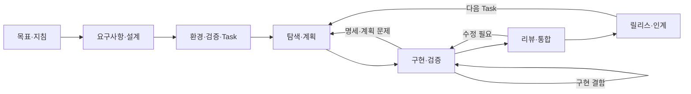

# AI로 개발하는 단계별 실행 가이드

이 가이드의 목표는 요청을 코드로 바꾸는 데서 끝나지 않고, **요구사항·구현·검증 증거가 연결된 변경을 실제 프로젝트에 남기는 것**입니다. 아래 순서로 진행하며 각 단계의 산출물을 다음 단계의 입력으로 사용합니다. 도구별 기능보다 개발 절차를 먼저 정합니다.

공식 근거는 [OpenAI·Anthropic 가이드 적용 기준](../reference/official-development-guides.md)에 정리합니다. 단계 번호·산출물 경로·완료 기준은 이 저장소의 운영 설계입니다. 공식 문서가 특정 디렉터리 구조를 강제한다는 뜻이 아닙니다.

## 시작 위치와 역할

- **새 프로젝트**: Step 0부터 진행합니다. 환경을 만들기 전에 사용자 시나리오와 구조를 정합니다.
- **기존 프로젝트**: Step 0에서 현재 구조·문서·검증을 조사합니다. 이미 충족한 단계는 기존 산출물에 연결하고, 누락된 부분만 보완합니다.
- **작은 버그·문구 수정**: 기존 요구사항과 Task에 목표·수정 범위·검증을 적고 Step 6~8을 수행합니다. 매번 PRD와 ADR을 새로 만들지 않습니다.
- **중단된 작업 재개**: Step 9의 핸드오프를 실제 변경 상태와 대조한 뒤 마지막 미완료 단계로 돌아갑니다.

사람은 목적·범위·도메인 결정·인수를 책임지고, 에이전트는 탐색·문서 초안·구현·검증·리뷰를 수행합니다. 이미 합의한 범위의 반복 수정과 검증은 이어서 진행합니다. 새 요구사항이나 데이터 처리 정책이 필요한 경우에만 해당 결정을 분리합니다.

## 전체 순서와 산출물

| 단계 | 입력 | 핵심 산출물 | 다음 단계로 넘어가는 기준 |
|---|---|---|---|
| 0. 현황·목표 | 요청, 기존 저장소 | 시작 메모 | 작업 대상과 현재 상태를 설명할 수 있습니다 |
| 1. 지침 연결 | 시작 메모 | `AGENTS.md`, `CLAUDE.md`, 공통 절차 | 두 도구가 같은 규칙을 참조합니다 |
| 2. 요구사항 | 사용자 문제 | PRD, 수용 기준 | 첫 기능의 정상·실패 동작이 명확합니다 |
| 3. 설계·계약 | PRD, 제약 | 아키텍처, 필요한 ADR, 계약 | 책임·데이터·오류·호환성이 정의됩니다 |
| 4. 환경·검증 | 설계, 기존 환경 | 실행 가능한 뼈대, 검증 전략 | 설치·실행·기준선 검사가 재현됩니다 |
| 5. 작업 분해 | PRD, 계약, 검증 전략 | Task 목록과 의존 순서 | 시작 가능한 Task와 완료 기준이 있습니다 |
| 6. 탐색·계획 | 준비된 Task | 실행 계획 | 변경 범위·검사·위험이 구체적입니다 |
| 7. 구현·검증 | Task와 계획 | 코드, 테스트, 검증 기록 | 수용 기준과 필수 검사가 충족됩니다 |
| 8. 리뷰·통합 | diff, 검증 기록 | 리뷰 조치, PR 또는 인수 기록 | 막는 지적이 없고 통합 상태도 검증됩니다 |
| 9. 릴리스·인계 | 인수된 변경 | 릴리스 기록, 핸드오프, 회고 | 배포 상태와 다음 작업이 명확합니다 |



## 권장 디렉터리 구조

아래는 **개발 대상 저장소**의 참조 구조입니다. 이 가이드 저장소 안에 애플리케이션을 생성하라는 지시가 아닙니다. 단일 서비스라면 `apps/` 대신 기존 `src/`, `tests/`를 유지해도 됩니다. 기존 계약 경로가 있으면 그것을 원본으로 삼습니다.

```text
my-project/
├── AGENTS.md                         # 공통 규칙과 읽을 문서 안내
├── CLAUDE.md                         # @AGENTS.md + Claude 전용 사항
├── README.md                         # 설치·실행·검증 진입점
├── docs/
│   ├── development-workflow.md        # 두 도구의 공통 개발 절차
│   ├── project-context.md             # Step 0 현황과 제약
│   ├── prd/product.md                 # FR·AC와 사용자 시나리오
│   ├── architecture/overview.md       # 책임·의존성·데이터 흐름
│   ├── adr/0001-<decision>.md         # 중요한 결정
│   ├── backlog/tasks/TASK-001-<slug>.md
│   ├── plans/TASK-001.md
│   ├── prompts/TASK-001.md            # 재사용할 실행 지시, 필요 시
│   ├── verification/strategy.md       # 명령·환경·필수 검사
│   ├── verification/TASK-001.md       # 실제 실행 결과
│   ├── review-checklist.md
│   ├── handoffs/TASK-001.md
│   └── releases/<release>.md          # 실제 배포 시
├── apps/                             # 필요할 때만 분리
│   ├── api/                          # 서버, 자체 src/와 tests/
│   └── web/                          # 사용자 UI, 자체 테스트
├── packages/
│   ├── contracts/                    # API·이벤트 계약의 단일 원본
│   └── db/                           # DB가 필요한 경우
└── tests/e2e/                        # 서비스 간 사용자 흐름
```

산출물의 소유자는 PRD는 제품 담당, 설계·계약은 개발 책임자, Task·계획·검증 기록은 작업 담당으로 정합니다. 한 사람이 모두 맡아도 책임 구분은 유지합니다. 생성 코드·캐시·비밀정보·원본 세션 전체는 위 문서 디렉터리에 섞지 않습니다.

## 두 도구에서 사용하는 방법

각 Step의 프롬프트는 대상 저장소에서 연 Claude Code 또는 Codex 세션에 입력합니다. `<...>`는 실제 값으로 치환합니다. 설치·로그인은 [Module 01](../../modules/01-environment-setup/README.md), 모드·권한·명령은 [도구 레퍼런스](../reference/tool-reference.md)를 참고합니다. 아래 자연어 프롬프트 자체가 쓰기 권한이나 샌드박스를 설정하지는 않습니다.

**Claude Code 레시피**: 루트 `CLAUDE.md`가 공통 `AGENTS.md`를 가져오게 한 뒤 단계 프롬프트를 입력합니다. 탐색만 하는 경우 Plan 모드를 이용할 수 있습니다. 읽기 전용이면 문서 초안은 응답으로 받고, 저장은 편집 가능한 세션에서 수행합니다.

**Codex 레시피**: 루트 `AGENTS.md`와 해당 단계의 입력 파일을 읽도록 단계 프롬프트를 입력합니다. 루트에서 작업할 때 다른 하위 경로의 지침까지 모두 자동 적용된다고 가정하지 말고 대상 경로의 지침을 명시적으로 확인합니다. 계획과 구현은 현재 모드·권한에 맞게 나눕니다.

처음 적용할 때는 아래 프롬프트의 경로와 목표를 채웁니다. 가이드 저장소는 읽기 참고 자료로 두고 개발 대상만 수정합니다. 도구가 가이드 경로를 읽을 수 없으면 필요한 문서와 템플릿을 먼저 대상 저장소에 복사하고 입력 경로를 바꿉니다.

```text
가이드 위치: <가이드 저장소의 절대 경로>
개발 대상: <대상 저장소의 절대 경로>
만들 기능: <첫 사용자 시나리오>

가이드의 docs/workflow/README.md와 templates/README.md를 읽고 적용합니다.
가이드 저장소는 수정하지 않습니다. 대상 저장소의 기존 지침과 변경을 보존합니다.
현재 산출물을 조사해 충족한 단계와 빠진 단계를 판별합니다.
Step 0~5의 필요한 문서·지침·환경을 대상에 적용하고,
선행 조건이 갖춰진 첫 Task 하나를 Step 6~8에 따라 구현·검증합니다.
문서에서 확인할 수 없는 제품 결정만 질문하고 가능한 작업은 이어서 수행합니다.
마지막에는 Step 9의 핸드오프와 실제 검증 결과를 남깁니다.
```

## Step 0. 작업 대상과 현재 상태를 확정합니다

**입력**: 만들고 싶은 것 한 문장, 실제 대상 경로, 기존 코드 유무.

1. 신규·기존 프로젝트를 구분하고 첫 사용자 시나리오 하나를 고릅니다.
2. 기존 저장소는 변경 상태, 진입점, 테스트, 의존성 파일, 배포 환경을 조사합니다.
3. 확인한 사실과 가정을 분리해 `docs/project-context.md`에 적습니다. 신규 프로젝트에 없는 코드 경로를 지어내지 않습니다.

**두 도구 공통 프롬프트**:

```text
목표는 <사용자가 해결할 문제>입니다. 대상은 <저장소 경로>입니다.
현재 구조·실행 방법·테스트·관련 지침과 진행 중인 변경을 조사합니다.
확인한 사실에는 파일 근거를 붙이고, 가정과 결정할 질문을 분리합니다.
지금은 애플리케이션 코드를 수정하지 않습니다.
결과는 docs/project-context.md에 남길 수 있는 초안으로 작성합니다.
```

**완료 조건**: 대상 저장소, 신규/기존 여부, 첫 범위, 미확정 사항이 기록됩니다. 필요한 접근이 없으면 해당 제약을 기록하고 접근 가능한 자료로 조사를 진행합니다.

## Step 1. 사람과 에이전트의 지침을 연결합니다

**입력**: 현황 메모와 [템플릿 목록](../../templates/README.md).

1. `AGENTS.md.template` → `AGENTS.md`, `CLAUDE.md.template` → `CLAUDE.md`, `development-workflow.md` → `docs/development-workflow.md`로 복사합니다. 기존 지침은 비교해서 합칩니다.
2. 목적과 실제 경로를 채웁니다. 아직 없는 명령은 `TODO(verify)`로 남기고 Step 4에서 확정합니다.
3. 공통 절차를 읽으라는 규칙을 `AGENTS.md`에 둡니다. 가이드 전체를 매번 import하지 않습니다.
4. 두 도구의 새 세션에서 아래 확인을 수행합니다. 한 도구만 사용할 수 있으면 그 도구의 확인 결과와 다른 도구의 미확인 상태를 구분합니다.

```text
적용한 프로젝트 지침의 경로와 핵심 규칙을 설명합니다.
docs/development-workflow.md를 읽고 현재 단계의 입력·산출물을 말합니다.
검증 명령은 정의된 파일을 확인해서 답합니다. 아직 없으면 없다고 말합니다.
파일은 수정하지 않습니다.
```

**완료 조건**: 공통 규칙이 중복되지 않고, 읽기 요청에 두 도구가 실제 파일을 근거로 답합니다. 지침 작성은 권한 통제의 대체가 아니므로 실제 권한 설정은 별도로 적용합니다. 자세한 기능 근거는 [공식 지침 자료](../reference/official-development-guides.md)를 참고합니다.

## Step 2. PRD와 수용 기준을 작성합니다

**입력**: 첫 사용자 시나리오, 현황 메모, [PRD 템플릿](../../templates/prd.md).

```text
<사용자 시나리오>를 docs/prd/product.md로 정리합니다.
목표·비목표·FR ID·수용 기준 AC ID·미결 사항을 포함합니다.
수용 기준은 조건/행동/관찰 결과로 씁니다. 정상·오류·권한·경계 사례를 다룹니다.
기술 스택이나 기능을 임의로 추가하지 않습니다. 결정을 바꾸는 질문을 우선 제시합니다.
```

사람은 누가 어떤 행동을 할 수 있는지, 데이터에 어떤 변화가 생기는지를 확정합니다. 예를 들어 “필터가 잘 됩니다”를 “`status=todo` 요청은 해당 프로젝트의 todo 작업만 반환합니다”로 바꿉니다.

**완료 조건**: 첫 기능의 수용 기준을 테스트로 옮길 수 있습니다. 구현에 영향을 주는 미결 사항은 해결하고, 이후 단계에서 결정할 질문은 담당자와 시점을 적습니다. [02-1](../../modules/02-spec-driven-development/02-1-prd-with-agents.md)에서 인터뷰 과정을 연습합니다.

## Step 3. 구조·설계·계약을 정합니다

**입력**: PRD, 기존 기술 제약, [아키텍처](../../templates/architecture.md)·[ADR](../../templates/adr.md) 템플릿.

```text
PRD의 첫 기능을 구현할 최소 구조를 설계합니다.
기존 프로젝트의 경로와 패턴을 우선 사용합니다.
docs/architecture/overview.md에 책임·의존성·데이터 흐름을 작성합니다.
중요한 선택만 ADR로 남기고, 공개 입력·응답·오류·권한·호환성은 계약 파일로 작성합니다.
계약과 수용 기준이 모순되면 구현 전에 차이를 보고합니다.
```

**산출물**: 구조 설명, 필요한 ADR, 실제 형식의 계약. 구조가 단순하면 서비스 하나로 시작합니다. 모노레포·워커·MCP·서브에이전트는 필요가 확인될 때 도입합니다.

**완료 조건**: FR마다 구현 책임과 계약이 정해지고, 정상 응답뿐 아니라 오류·권한 경로도 정의됩니다. [02-2](../../modules/02-spec-driven-development/02-2-architecture-and-adr.md)·[02-4](../../modules/02-spec-driven-development/02-4-interface-first.md)에서 상세 실습을 진행합니다.

## Step 4. 실행 환경과 검증 기준선을 만듭니다

**입력**: 확정한 구조, [검증 전략 템플릿](../../templates/verification-plan.md).

```text
선택한 스택과 현재 저장소에 맞춰 설치·개발 실행·검증 경로를 구성합니다.
기존 스크립트를 조사하고, 없는 검사는 실제로 구현합니다.
최소 동작 하나를 실행하고 테스트해서 비어 있지 않은 기준선을 만듭니다.
docs/verification/strategy.md에 실행 위치·명령·필요 서비스·성공 기준을 기록합니다.
AGENTS.md의 명령을 실제 실행한 값으로 갱신합니다.
실패·skip·미실행은 통과로 처리하지 않습니다.
```

`make verify`를 선택하면 프로젝트의 실제 정적 검사·테스트 등을 호출하도록 작성합니다. 이 가이드 저장소에는 애플리케이션용 `make verify`가 제공되지 않습니다. 아직 구현하지 않은 기능의 테스트 실패와 실행 환경 자체의 실패도 구별합니다.

**완료 조건**: 다른 세션에서도 설치·실행·기준선 검사를 재현합니다. 기존 실패는 원인·담당·처리 방침을 적으며 완료 기준을 몰래 낮추지 않습니다. [04-1](../../modules/04-quality-and-verification/04-1-verification-layers.md)을 참고합니다.

## Step 5. 한 번에 끝낼 작업으로 분해합니다

**입력**: PRD, 계약, 실제 검증 명령, [Task 템플릿](../../templates/task-spec.md).

```text
첫 사용자 기능을 Task로 분해합니다. 문서 수나 코드 줄 수를 목표로 삼지 않습니다.
docs/backlog/tasks/에 FR·AC·선행 Task·변경 경로·범위 밖·검증을 기록합니다.
선행 작업이 끝나지 않은 Task를 준비 상태로 표시하지 않습니다.
API·UI가 별도 Task라면 사용자 흐름의 통합 검증도 작업에 포함합니다.
시작 가능한 첫 Task와 이후 순서를 제시합니다.
```

**산출물**: 의존성 순서가 있는 Task 파일. 규모의 기준은 코드 줄 수보다 한 번에 검토 가능한 변경과 실행 가능한 검사입니다. 같은 파일·공유 계약을 바꾸는 작업은 독립 작업으로 취급하지 않습니다.

**완료 조건**: `FR → Task → AC → 확인 방법`이 연결됩니다. 기존 레슨의 `docs/tasks/`를 사용 중이면 그 경로를 유지하되 중복 백로그를 만들지 않습니다. [02-3](../../modules/02-spec-driven-development/02-3-task-breakdown.md)을 참고합니다.

## Step 6. 관련 코드 탐색 후 구현 계획을 만듭니다

**입력**: 준비 상태의 Task, [실행 계획](../../templates/execution-plan.md)·[프롬프트](../../templates/task-prompt.md) 템플릿.

```text
<Task 경로>와 연결된 명세·계약을 읽습니다. 구현은 아직 시작하지 않습니다.
기존 처리 흐름과 테스트를 파일 근거로 설명하고 관련 기준선 검사를 확인합니다.
변경 파일·순서·검증·범위 밖·위험·되돌리기를 포함한 계획을 작성합니다.
저장은 docs/plans/<Task ID>.md를 사용합니다. 읽기 전용이면 초안을 응답합니다.
미확정 결정이 없고 범위가 이미 합의됐으면 추가 승인 절차를 만들지 않습니다.
```

**Claude Code 레시피**: 탐색·계획을 Plan 모드에서 진행했다면, 계획 검토 후 구현 가능한 모드에서 Step 7을 시작합니다.

**Codex 레시피**: 계획을 요청한 세션의 모드·권한을 확인하고, Step 7에서는 확정한 계획과 편집 범위를 명시합니다. 두 도구의 모드가 같은 방식으로 동작한다고 가정하지 않습니다.

**완료 조건**: 관련 코드와 실제 검증 명령에 근거한 계획이 있습니다. 프롬프트 작성은 [02-5](../../modules/02-spec-driven-development/02-5-prompt-engineering.md), 반복 루프는 [03-1](../../modules/03-agentic-workflow/03-1-explore-plan-implement-verify.md)을 참고합니다.

## Step 7. 작은 변경으로 구현하고 검증합니다

**입력**: Task, 실행 계획, 검증 전략.

```text
<Task 경로>와 <계획 경로>의 범위로 구현·검증합니다.
필요한 테스트를 작성하고 정상·오류·권한·경계 사례를 확인합니다.
실패하면 원인을 조사해 수정합니다. 테스트 삭제나 skip으로 통과시키지 않습니다.
명세 또는 변경 범위를 바꿔야 하면 영향과 필요한 결정을 기록합니다.
실제 명령·환경·검사 대상·결과를 docs/verification/<Task ID>.md에 남깁니다.
필수 검사를 실행하지 못했다면 완료로 표시하지 않습니다.
```

버그 수정은 실패 재현 → 최소 수정 → 재현 해소와 회귀 확인 순서로 수행합니다. 같은 실패가 반복되면 새로운 근거 없이 수정을 누적하지 말고 Step 6으로 돌아가 가설과 계획을 갱신합니다.

**완료 조건**: [검증 기록](../../templates/verification-report.md)에 실제 증거가 있습니다. 테스트 출력만으로 사용자 시나리오를 확인할 수 없다면 통합·UI·수동 확인을 추가합니다. 예상 결과나 작성 예제를 실행 로그로 옮기지 않습니다.

## Step 8. 리뷰하고 통합 상태를 확인합니다

**입력**: 구현 diff, Task, 검증 기록, [리뷰 기준](../../templates/review-checklist.md).

```text
구현 설명을 정답으로 가정하지 말고 <Task 경로>와 실제 diff를 대조합니다.
계약·권한·데이터 처리·회귀·테스트의 누락을 리뷰합니다. 지금은 수정하지 않습니다.
지적마다 심각도·파일 위치·재현 조건·영향·수정 제안을 적습니다.
지적이 없으면 확인 범위와 미검증 영역을 보고합니다.
```

**Claude Code 레시피**: Codex가 구현한 변경을 새 세션에서 위 프롬프트로 검토합니다.

**Codex 레시피**: Claude Code가 구현한 변경을 새 세션에서 위 프롬프트로 검토합니다. 한 도구만 있으면 같은 도구의 새 세션을 사용하고 사람 리뷰로 보완합니다.

지적을 재현해 수정하고 영향받는 검사를 재실행합니다. PR에는 문제·변경·검증·남은 제한을 기록합니다. 병합 직전 또는 통합 브랜치에서 필수 검사를 확인하고 충돌 해결 뒤에도 검사합니다.

**완료 조건**: 막는 지적이 없고 실제 통합 대상의 검사 증거가 있습니다. Task의 완료와 병합 여부는 구별해 기록합니다. [04-2](../../modules/04-quality-and-verification/04-2-cross-review.md)를 참고합니다.

## Step 9. 릴리스와 다음 세션을 준비합니다

**입력**: 인수된 변경, [릴리스](../../templates/release-checklist.md)·[핸드오프](../../templates/handoff-note.md) 템플릿.

```text
현재 작업을 변경 / 검증 / 미해결 / 다음 행동으로 정리합니다.
Task·계획·검증 경로와 현재 브랜치·revision·미커밋 변경을 핸드오프에 남깁니다.
실제 배포가 범위에 있으면 배포·관측·실패 시 복구 절차를 릴리스 문서에 준비합니다.
배포 전후 상태를 구분하고 실행하지 않은 배포는 미배포로 표시합니다.
반복해서 발생한 실수만 재사용 가능한 지침 개선 후보로 제시합니다.
```

운영 배포가 없는 실습은 배포하지 않았다고 기록하고 다음 Task로 넘어갑니다. 배포하는 프로젝트는 팀의 권한 정책에 따라 실행하고 사용자 흐름·로그·지표를 확인합니다. DB 변경은 코드 롤백만으로 복구된다고 가정하지 않습니다.

**완료 조건**: 다음 사람이 새 세션에서 이어갈 수 있습니다. 재개할 때는 아래 지시를 사용합니다.

```text
<핸드오프 경로>와 연결된 Task·계획·검증 기록을 읽습니다.
실제 Git 상태와 대조하고 오래된 가정은 갱신합니다.
마지막 미완료 단계부터 진행합니다. 이미 완료한 작업을 중복 구현하지 않습니다.
```

## 첫 적용과 확장

[TaskFlow 예제](./taskflow-example.md)로 하나의 기능을 끝까지 연결해 봅니다. 한 사이클이 재현된 뒤 [Module 05](../../modules/05-scaling-up/README.md)의 병렬 작업·CI 자동화를 추가합니다. 반복 검토에서 유용함을 확인한 절차만 Skills나 Hooks로 확장합니다. 새 도구를 추가하는 것보다 검증 가능한 작은 작업을 반복하는 것이 먼저입니다.
