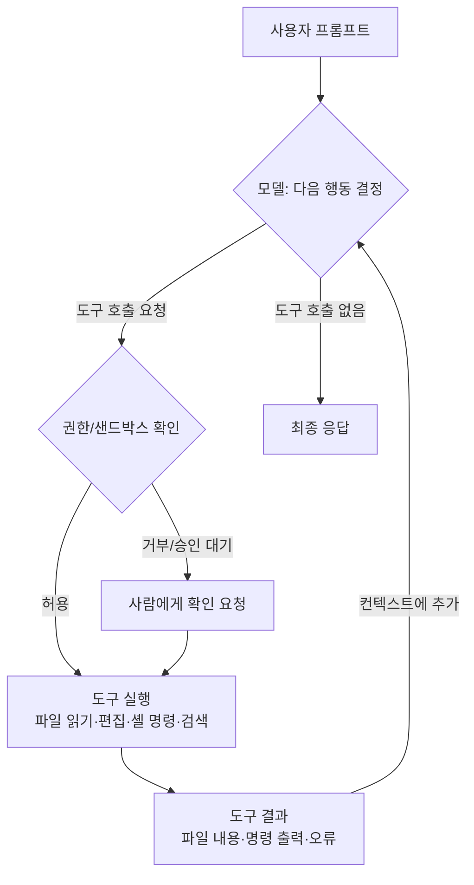

# 00-1. 코딩 에이전트는 어떻게 동작합니까

## 🎯 학습 목표
- 채팅형 AI와 코딩 에이전트의 차이를 "누가 도구를 실행합니까"라는 기준으로 설명할 수 있습니다.
- 에이전트 루프(생각 → 도구 호출 → 결과 관찰 → 다음 행동)를 실제 세션 로그에서 찾아 단계별로 짚을 수 있습니다.
- 컨텍스트 윈도우에 무엇이 쌓이는지(시스템 지시, 메모리 파일, 대화, 도구 결과) 나열하고, Claude Code와 Codex에서 사용량을 확인할 수 있습니다.
- 같은 작업을 채팅 방식과 에이전트 방식으로 수행하고 사람의 개입 횟수 차이를 기록할 수 있습니다.

## 📋 사전 준비
- 선행 레슨: 없음 (이 모듈의 첫 레슨입니다)
- 필요 도구/계정:
  - Claude Code 2.1.292 이상 (`claude --version`), 로그인 완료 (`claude auth status`)
  - Codex 0.160.1 이상 (`codex --version`), 로그인 완료 (`codex login status`)
  - Node.js 22 이상, Git, `jq`
  - 웹 채팅 UI 하나 (claude.ai 또는 ChatGPT). Step 2의 "채팅 방식" 비교에 씁니다.
- 실습 저장소 상태: 이 레슨의 Step 1에서 작은 샘플 저장소 `agent-lab`을 새로 만듭니다. Module 00의 나머지 레슨도 이 저장소를 계속 씁니다.

설치와 로그인이 아직이면 아래 명령을 참고합니다 (출처: [tool-reference §1](../../docs/reference/tool-reference.md#1-설치--인증--버전)).

```bash
# Claude Code
curl -fsSL https://claude.ai/install.sh | bash
claude auth login

# Codex
npm install -g @openai/codex
codex login
```

## 💡 개념

### 채팅과 에이전트의 차이는 "손"이 있는지에 달려 있습니다

채팅형 AI는 텍스트를 받아 텍스트를 돌려줍니다. 코드를 붙여 넣으면 고친 코드를 보여주지만, 파일을 열고 저장하고 테스트를 돌리는 일은 **사람이** 합니다. 결과가 틀렸는지 확인하는 일도 사람이 하고, 틀렸으면 에러 메시지를 다시 붙여 넣습니다.

코딩 에이전트는 같은 언어 모델에 **도구(tool)** 를 쥐여 준 프로그램입니다. 모델이 "이 파일을 읽고 싶습니다", "이 명령을 실행하고 싶습니다"라고 요청하면 에이전트 프로그램(Claude Code, Codex)이 실제로 실행하고, 그 결과를 다시 모델에게 돌려줍니다. 모델은 결과를 보고 다음 행동을 정합니다. 이 반복을 **에이전트 루프**라고 합니다.



핵심은 세 가지입니다.

1. **루프는 모델이 "더 할 일이 없습니다"라고 판단할 때 끝납니다.** 사람이 매 단계를 지시하지 않습니다. 그래서 목표와 완료 조건을 처음에 분명히 줘야 합니다.
2. **도구 결과가 다음 판단의 근거가 됩니다.** 테스트 출력, 컴파일 오류, `grep` 결과가 곧 모델의 "눈"입니다. 검증 명령을 실행할 수 있게 해 주면 스스로 오류를 고칩니다.
3. **모든 것이 컨텍스트 윈도우에 쌓입니다.** 읽은 파일, 명령 출력, 대화가 전부 한 창에 누적됩니다. 창이 차면 요약(compact)하거나 새 세션을 열어야 합니다.

### 두 도구의 도구 상자

| 범주 | Claude Code | Codex |
|---|---|---|
| 파일 읽기/검색 | `Read`, `Grep`, `Glob` 같은 이름 붙은 도구 | 주로 셸 명령(`cat`, `rg`, `ls` 등)으로 읽습니다 |
| 파일 편집 | `Edit`, `Write` 도구 | 패치를 적용하는 편집 도구 (로그에서는 파일 변경 이벤트로 보입니다) |
| 명령 실행 | `Bash` 도구 | 셸 명령 실행 (OS 수준 샌드박스 안에서) |
| 실행 통제 | 권한 모드 + allow/ask/deny 규칙 | 샌드박스 모드 × 승인 정책 |

> 도구 이름은 버전에 따라 바뀔 수 있습니다. 이 레슨에서는 이름보다 "읽기 → 실행 → 편집 → 재실행"이라는 **패턴**을 보는 데 집중합니다. 권한과 샌드박스는 [01-2](../01-environment-setup/01-2-permissions-and-sandbox.md)에서 자세히 다룹니다.

### 컨텍스트 윈도우에 쌓이는 것

```
┌──────────────────── 컨텍스트 윈도우 (유한) ────────────────────┐
│ 시스템 지시 · 도구 정의                                        │  ← 도구가 넣습니다
│ 메모리 파일 (CLAUDE.md / AGENTS.md)                            │  ← 세션 시작 시 로드
│ 사용자 프롬프트                                                │
│ 모델 응답 + 도구 호출 요청                                     │
│ 도구 결과 (파일 내용, 테스트 출력 …)   ← 대부분 여기서 커집니다  │
│ … 반복 …                                                       │
└────────────────────────────────────────────────────────────────┘
```

큰 파일 하나를 통째로 읽거나 수천 줄짜리 로그를 출력시키면 창이 빠르게 찹니다. 창이 차면 앞부분 정보가 요약되면서 세부 지시를 "잊는" 현상이 생깁니다.

### 왜 대규모 개발에서 중요한가

- **장난감 규모에서는 루프가 몇 번 돌고 끝납니다.** 수만 라인 저장소에서는 탐색(어디를 고쳐야 하나)에만 수십 번의 도구 호출이 듭니다. 루프 구조를 이해해야 "왜 이렇게 오래 걸립니까", "왜 엉뚱한 파일을 고쳤습니까"를 진단할 수 있습니다.
- **컨텍스트는 예산입니다** (설계 원칙 2 *Context is a Budget*). 어떤 도구 결과가 창을 차지하는지 알아야 작업을 나누고, 메모리 파일에 무엇을 넣을지 판단할 수 있습니다.
- **검증 도구를 쥐여 주는 것이 품질을 결정합니다** (설계 원칙 3 *Verify, Don't Trust*). 테스트를 실행할 수 없는 에이전트는 채팅과 다를 바 없습니다.
- 이후 모듈에서 배우는 서브에이전트, 헤드리스 실행, CI 자동화는 모두 이 루프를 **어디서, 몇 개, 어떤 권한으로** 돌릴지의 문제입니다.

## 👣 따라하기

### Step 1. 실습 저장소 `agent-lab` 만들기
Module 00 전체에서 쓸 작은 Node.js 저장소를 만들고, 테스트 2개가 실패하는 상태를 확인합니다.

이 단계는 도구와 무관합니다. 아래 셸 스크립트를 그대로 실행합니다.

```bash
mkdir agent-lab && cd agent-lab
git init -b main
mkdir -p src test

cat > package.json <<'EOF'
{
  "name": "agent-lab",
  "version": "0.1.0",
  "type": "module",
  "scripts": { "test": "node --test" }
}
EOF

cat > src/slugify.js <<'EOF'
// 블로그 제목을 URL slug로 바꿉니다.
export function slugify(title) {
  return title.toLowerCase().replace(/ /g, '-');
}
EOF

cat > test/slugify.test.js <<'EOF'
import { test } from 'node:test';
import assert from 'node:assert/strict';
import { slugify } from '../src/slugify.js';

test('공백을 하이픈으로 바꿉니다', () => {
  assert.equal(slugify('Hello World'), 'hello-world');
});
test('연속 공백은 하이픈 하나로 합칩니다', () => {
  assert.equal(slugify('Hello   World'), 'hello-world');
});
test('앞뒤 공백과 특수문자를 제거합니다', () => {
  assert.equal(slugify('  Hello, World!  '), 'hello-world');
});
EOF

git add . && git commit -m "chore: agent-lab 초기 상태"
npm test
```

저장소가 준비되면 각 도구가 이 디렉터리에서 시작되는지만 확인하고 바로 종료합니다.

**Claude Code 레시피**
```bash
cd agent-lab
claude
> 이 저장소의 파일 목록과 테스트 실행 방법을 한 줄로 알려 주십시오. 파일은 수정하지 마십시오.
```

**Codex 레시피**
```bash
cd agent-lab
codex
> 이 저장소의 파일 목록과 테스트 실행 방법을 한 줄로 알려 주십시오. 파일은 수정하지 마십시오.
```

**기대 결과**: `npm test` 출력 마지막에 `# pass 1`, `# fail 2`가 보입니다. 두 도구 모두 `package.json`을 읽고 "`npm test`(`node --test`)로 실행합니다"라는 답을 합니다. 처음 실행하는 디렉터리라면 작업 공간을 신뢰할지 묻는 화면이 나올 수 있습니다. 실습 저장소이므로 신뢰합니다.

### Step 2. 채팅 방식으로 버그 고치기
도구 없는 채팅에서 같은 버그를 고치며 사람이 하는 일을 기록합니다.

이 단계는 Claude Code나 Codex를 쓰지 않습니다. 웹 채팅 UI(claude.ai 또는 ChatGPT)를 엽니다. 비교를 위해 아래 기록표를 메모장에 만들어 둡니다.

```text
| 방식 | 사람이 한 행동(복사/붙여넣기/실행/저장) | 횟수 | 걸린 시간 | 테스트 통과 |
|---|---|---|---|---|
| 채팅 | | | | |
| Claude Code | | | | |
| Codex | | | | |
```

채팅창에 다음 프롬프트를 넣습니다. `src/slugify.js`와 `test/slugify.test.js`의 내용은 직접 복사해 붙입니다.

```text
아래 함수가 테스트를 통과하도록 고쳐 주십시오.

[src/slugify.js 내용 붙여넣기]

[test/slugify.test.js 내용 붙여넣기]
```

답으로 받은 코드를 `src/slugify.js`에 직접 저장하고 `npm test`를 실행합니다. 실패하면 오류 출력을 다시 채팅창에 붙여 넣습니다. 통과할 때까지 반복하고, 끝나면 원래 상태로 되돌립니다.

```bash
npm test
git diff            # 바뀐 내용 확인
git checkout -- .   # 다음 Step을 위해 원상 복구
```

**기대 결과**: 기록표의 "채팅" 행에 최소 4번(코드 복사 2회, 저장 1회, 테스트 실행 1회) 이상의 사람 행동이 기록됩니다. 모델이 테스트 결과를 직접 보지 못하므로, 특수문자 처리 같은 세부 사항을 한 번에 맞히지 못하면 왕복이 늘어납니다.

### Step 3. 에이전트 방식으로 같은 버그 고치기
같은 작업을 에이전트에게 맡기고, 에이전트가 어떤 도구를 어떤 순서로 호출하는지 화면에서 관찰합니다.

프롬프트는 두 도구에 똑같이 줍니다. 완료 조건("`npm test` 통과")을 명시하는 것이 핵심입니다.

```text
npm test가 실패하고 있습니다. 원인을 찾아 src/slugify.js만 고쳐서 모든 테스트를 통과시켜 주십시오.
테스트 파일은 수정하지 마십시오. 끝나면 실행한 명령과 최종 테스트 결과를 보여 주십시오.
```

**Claude Code 레시피**
```bash
cd agent-lab
claude
> npm test가 실패하고 있습니다. 원인을 찾아 src/slugify.js만 고쳐서 모든 테스트를 통과시켜 주십시오.
> 테스트 파일은 수정하지 마십시오. 끝나면 실행한 명령과 최종 테스트 결과를 보여 주십시오.
```

화면에 `Bash(npm test)`, `Read(src/slugify.js)`, `Edit(src/slugify.js)` 같은 도구 호출 줄이 순서대로 나타납니다. 대화형 세션의 기본 권한 모드는 `auto`이므로 대부분의 호출이 묻지 않고 진행됩니다. 매번 승인 창을 보면서 단계를 하나씩 확인하고 싶으면 수동 모드로 시작합니다.

```bash
claude --permission-mode default
```

**Codex 레시피**
```bash
cd agent-lab
codex
> npm test가 실패하고 있습니다. 원인을 찾아 src/slugify.js만 고쳐서 모든 테스트를 통과시켜 주십시오.
> 테스트 파일은 수정하지 마십시오. 끝나면 실행한 명령과 최종 테스트 결과를 보여 주십시오.
```

플래그 없이 실행한 `codex`는 `workspace-write` 샌드박스와 `on-request` 승인 정책으로 시작합니다. 저장소 안의 파일 편집과 명령 실행은 샌드박스 안에서 바로 진행되고, 샌드박스 밖이 필요한 동작만 승인을 묻습니다. 화면에서 실행한 셸 명령과 파일 변경 내용을 확인합니다.

두 도구 모두 끝나면 결과를 확인하고 되돌립니다. 한 도구로 고친 상태에서 다른 도구를 돌리면 비교가 되지 않습니다.

```bash
npm test
git diff --stat
git checkout -- .
```

**기대 결과**: 두 도구 모두 대체로 "테스트 실행 → 실패 확인 → 소스 읽기 → 편집 → 테스트 재실행 → 통과 보고" 순서를 따릅니다. 기록표의 사람 행동은 프롬프트 입력 1회(+ 승인 몇 번)로 줄어듭니다. `git diff --stat`에서 `src/slugify.js` 한 파일만 바뀌었는지 확인합니다. 테스트 파일이 바뀌었다면 지시를 어긴 것입니다 ([00-4](./00-4-failure-patterns.md)에서 다룹니다).

### Step 4. 세션 로그에서 에이전트 루프 읽기
화면에 스쳐 지나간 루프를 기계가 읽을 수 있는 로그로 남기고, 도구 호출 순서를 추출합니다.

비대화형 실행(헤드리스)은 [00-3](./00-3-execution-modes.md)에서 자세히 다룹니다. 여기서는 로그를 얻는 용도로만 씁니다.

**Claude Code 레시피**

`claude -p`에 `--output-format stream-json --verbose`를 주면 메시지가 한 줄에 하나씩 JSON으로 출력됩니다. 파일 편집과 테스트 실행을 묻지 않고 허용하도록 `--allowedTools`로 도구를 지정합니다.

```bash
cd agent-lab
claude -p "npm test가 통과하도록 src/slugify.js만 고쳐 주십시오. 테스트 파일은 수정하지 마십시오." \
  --allowedTools "Read" "Edit" "Bash(npm test *)" "Bash(npm test)" \
  --output-format stream-json --verbose > claude-session.jsonl

# 도구 호출(tool_use)만 순서대로 뽑기
jq -r 'select(.type=="assistant") | .message.content[]? | select(.type=="tool_use")
       | "\(.name)  \(.input | tostring | .[0:80])"' claude-session.jsonl

# 마지막 result 줄에서 턴 수와 오류 여부 확인
jq 'select(.type=="result") | {num_turns, is_error, permission_denials}' claude-session.jsonl
```

**Codex 레시피**

`codex exec --json`은 stdout에 JSONL 이벤트(`thread.started`, `turn.started`, `item.*`, `turn.completed` 등)를 출력합니다. `codex exec`의 기본 샌드박스는 **read-only**라서 그대로는 파일을 고치지 못합니다. `--sandbox workspace-write`를 명시합니다.

```bash
cd agent-lab
git checkout -- .   # 앞의 Claude 결과 되돌리기
codex exec --sandbox workspace-write --json \
  "npm test가 통과하도록 src/slugify.js만 고쳐 주십시오. 테스트 파일은 수정하지 마십시오." > codex-session.jsonl

# 이벤트 종류별 개수
jq -r '.type' codex-session.jsonl | sort | uniq -c

# item 이벤트의 세부 종류 보기 (명령 실행, 파일 변경, 메시지 등)
jq -c 'select(.type | startswith("item.")) | {type, item: .item.type}' codex-session.jsonl
```

> `item` 안의 세부 필드 이름(`.item.type` 값 등)은 버전마다 달라질 수 있습니다. 위 jq가 빈 값을 내면 `head -5 codex-session.jsonl`로 원본 구조부터 확인합니다. TODO(verify): 0.160.1의 `item.*` 이벤트 필드 구조

**기대 결과**: Claude 로그에서 `Bash` → `Read` → `Edit` → `Bash` 같은 도구 호출 순서가 한 줄씩 나옵니다. `num_turns`는 1보다 큽니다(도구 결과가 돌아올 때마다 턴이 늘어납니다). Codex 로그에서는 `item.started`/`item.completed` 쌍이 여러 번 나오고, 마지막에 `turn.completed`가 있습니다. 두 로그를 나란히 놓고 "실패 확인 → 수정 → 재확인" 구간을 표시해 봅니다.

로그 파일은 `.gitignore`에 넣어 커밋하지 않습니다. Codex가 고친 `src/slugify.js`는 테스트가 통과하면 그대로 커밋합니다. 다음 레슨들은 `npm test`가 모두 통과하는 `main`에서 시작합니다.

```bash
printf 'claude-session.jsonl\ncodex-session.jsonl\n' >> .gitignore
npm test 2>&1 | grep -E '^# (pass|fail)'   # fail 0 확인
git diff --stat                             # src/slugify.js만 바뀌었는지 확인
git add .gitignore src/slugify.js && git commit -m "fix: slugify 연속 공백·특수문자 처리"
```

테스트가 통과하지 않았다면 Step 3처럼 대화형 세션으로 마저 고친 뒤 커밋합니다.

### Step 5. 컨텍스트 윈도우 사용량 관찰하기
같은 세션에서 큰 출력을 만들었을 때 컨텍스트가 어떻게 늘어나는지 확인합니다.

**Claude Code 레시피**
```bash
claude
> /context
> git log --stat -20 과 src, test 아래 모든 파일 내용을 전부 출력해 주십시오.
> /context
```

`/context`는 컨텍스트 사용량을 색 격자로 보여주고 **Memory files** 목록도 함께 표시합니다. 두 번의 `/context` 결과에서 메시지(대화·도구 결과) 영역이 얼마나 늘었는지 비교합니다. 비우고 싶으면 `/clear`, 요약해서 줄이고 싶으면 `/compact`를 씁니다.

**Codex 레시피**
```bash
codex
> /status
> git log --stat -20 과 src, test 아래 모든 파일 내용을 전부 출력해 주십시오.
> /status
```

Codex에는 Claude의 `/context` 같은 전용 시각화 명령이 확인되지 않았습니다. `/status`가 보여주는 세션 토큰 사용량으로 증가량을 비교합니다. 대화를 새로 시작하려면 `/new`를 씁니다.

**기대 결과**: 출력이 클수록 사용량이 눈에 띄게 늘어납니다. 이 저장소는 작아서 창이 차지 않지만, 실제 프로젝트에서 큰 로그 파일이나 lock 파일을 통째로 읽으면 한 번에 상당한 비율을 차지한다는 점을 체감합니다. 이 관찰은 [03-4 컨텍스트 관리](../03-agentic-workflow/03-4-context-management.md)의 출발점이 됩니다.

## ✅ 체크포인트
- [ ] `agent-lab` 저장소에서 `npm test`가 초기 상태에서 2개 실패하는 것을 확인했습니다.
- [ ] 채팅 방식과 에이전트 방식(Claude Code, Codex)의 사람 행동 횟수를 기록표에 채웠습니다.
- [ ] 에이전트가 고친 뒤 `git diff --stat`에 `src/slugify.js`만 바뀐 것을 확인했습니다.
- [ ] `claude-session.jsonl`에서 `tool_use` 순서를 jq로 추출했습니다.
- [ ] `codex-session.jsonl`에서 이벤트 종류별 개수를 jq로 집계했습니다.
- [ ] `npm test`가 모두 통과하는 slugify 수정을 `main`에 커밋했습니다.
- [ ] Claude `/context`, Codex `/status`로 큰 출력 전후의 사용량 변화를 관찰했습니다.
- [ ] 에이전트 루프의 네 단계(결정 → 도구 호출 → 결과 → 다시 결정)를 내 말로 설명할 수 있습니다.

## 🏠 숙제
| # | 유형 | 난이도 | 과제 | 완료 조건 |
|---|---|---|---|---|
| HW1 | 🔁 Reproduce | ★ | Step 2~3을 본인 환경에서 재현하고 채팅 vs 에이전트 차이를 기록합니다 | 기록표 3행(채팅, Claude Code, Codex)이 모두 채워져 있습니다. 각 행에 사람 행동 횟수와 걸린 시간이 있습니다. 에이전트 결과의 `npm test` 통과 출력이 첨부돼 있습니다 |
| HW2 | 🛠 Apply | ★★ | 에이전트 세션 로그를 읽고 도구 호출 흐름도를 그립니다 | Claude와 Codex 세션 로그(JSONL) 각 1개를 근거로 mermaid `flowchart` 2개를 작성했습니다. 각 노드에 실제 도구 이름이나 명령이 적혀 있습니다. "실패 확인 → 수정 → 재확인" 구간이 표시돼 있습니다. 두 흐름의 차이 3가지를 문장으로 정리했습니다 |
| HW3 | 🚀 Challenge | ★★★ | 로그를 흐름도로 바꾸는 변환 스크립트를 만듭니다 | `scripts/log2mermaid.sh`(또는 `.js`)가 Claude `stream-json` 로그와 Codex `--json` 로그를 모두 입력으로 받아 mermaid 텍스트를 출력합니다. 본인의 실제 로그 2개 이상으로 실행한 결과가 제출물에 있습니다. 스크립트 작성 자체도 에이전트로 했다면 그 세션 기록을 남겼습니다 |

제출: `hw/00-1` 브랜치, `submissions/00-1.md` (템플릿: docs/design/homework-template.md)

## ⚠️ 흔한 실수
- **에이전트가 테스트 파일까지 고쳐서 통과시켰습니다** → 원인: "테스트를 통과시켜 주십시오"만 말하면 테스트를 바꾸는 것도 해결책이 됩니다 → 대응: 수정 범위("`src/slugify.js`만")와 금지 사항("테스트 파일은 수정하지 마십시오")을 프롬프트에 함께 쓰고, 끝난 뒤 `git diff --stat`으로 확인합니다.
- **`codex exec`로 고치라고 했는데 아무 파일도 바뀌지 않았습니다** → 원인: `codex exec`의 기본 샌드박스가 read-only입니다 → 대응: `codex exec --sandbox workspace-write "..."`처럼 샌드박스를 명시합니다. 예전 자료의 `--full-auto`는 0.160.1에서 `unexpected argument` 오류를 냅니다.
- **Claude Code에서 승인 창이 한 번도 뜨지 않아 루프를 관찰하지 못했습니다** → 원인: v2.1.283부터 대화형 세션의 기본 권한 모드가 `auto`입니다 → 대응: 관찰이 목적이면 `claude --permission-mode default`로 시작하거나 세션 안에서 `Shift+Tab`으로 모드를 바꿉니다.
- **jq가 아무것도 출력하지 않습니다** → 원인: `--output-format stream-json`에 `--verbose`를 빠뜨렸거나, Codex 이벤트 필드 구조가 예시와 다릅니다 → 대응: `head -3 로그파일 | jq .`로 원본 구조를 먼저 보고 필터를 맞춥니다.
- **이전 도구의 수정 결과 위에서 다음 도구를 돌렸습니다** → 원인: 비교 사이에 작업 트리를 되돌리지 않았습니다 → 대응: 실행 전마다 `git status`가 깨끗한지 확인하고 `git checkout -- .`로 되돌립니다.

## 🔗 참고 자료
- 이 저장소의 [도구 레퍼런스](../../docs/reference/tool-reference.md) — §2 비대화형 실행, §5 권한, §8 컨텍스트 관리
- Claude Code: [Overview](https://code.claude.com/docs/en/overview), [CLI reference](https://code.claude.com/docs/en/cli-reference), [Headless](https://code.claude.com/docs/en/headless), [Permission modes](https://code.claude.com/docs/en/permission-modes), [Context window](https://code.claude.com/docs/en/context-window)
- Codex: [README](https://github.com/openai/codex/blob/main/README.md), [Non-interactive mode](https://learn.chatgpt.com/docs/non-interactive-mode), [Approvals & security](https://learn.chatgpt.com/docs/agent-approvals-security), [Slash commands](https://learn.chatgpt.com/docs/developer-commands?surface=cli)
- 다음 레슨: [00-2 Claude Code vs Codex](./00-2-claude-vs-codex.md)
- 관련 레슨: [00-3 실행 모드](./00-3-execution-modes.md), [00-4 실패 패턴](./00-4-failure-patterns.md), [01-2 권한·샌드박스](../01-environment-setup/01-2-permissions-and-sandbox.md), [03-4 컨텍스트 관리](../03-agentic-workflow/03-4-context-management.md)
