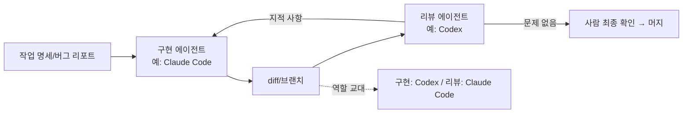

# 00-2. Claude Code vs Codex: 특성과 역할 분담

## 🎯 학습 목표
- Claude Code와 Codex의 구조적 차이(메모리 파일, 설정 형식, 실행 통제 방식, 비대화형 실행, 리뷰 명령)를 표로 설명할 수 있습니다.
- 같은 버그 리포트를 두 도구로 각각 고치고, 숨겨 둔 인수 테스트로 정확도를 객관적으로 측정할 수 있습니다.
- 속도·정확도·사용량·개입 횟수를 기준으로 두 도구의 결과를 비교표에 기록할 수 있습니다.
- 한 도구가 구현하고 다른 도구가 리뷰하는 교차 검증 흐름을 한 번 실행해 볼 수 있습니다.

## 📋 사전 준비
- 선행 레슨: [00-1 코딩 에이전트는 어떻게 동작합니까](./00-1-how-agents-work.md)
- 필요 도구/계정: Claude Code 2.1.292+, Codex 0.160.1+ (둘 다 로그인 완료), Node.js 22+, Git
- 실습 저장소 상태: 00-1에서 만든 `agent-lab` 저장소. `main` 브랜치에 slugify 수정이 커밋돼 있어 `npm test`가 모두 통과하고, `git status`가 깨끗해야 합니다.

```bash
cd agent-lab
git switch main
git status   # nothing to commit, working tree clean
npm test 2>&1 | grep -E '^# (pass|fail)'   # fail 0
```

## 💡 개념

### 두 도구는 "같은 일을 하는 다른 설계"입니다

Claude Code(Anthropic)와 Codex(OpenAI)는 둘 다 터미널에서 도는 코딩 에이전트입니다. 00-1에서 본 에이전트 루프는 같습니다. 차이는 **루프를 어떻게 설정하고 통제합니까**에 있습니다. 아래 표는 이 가이드의 [도구 레퍼런스](../../docs/reference/tool-reference.md)에서 검증한 사실만 정리한 것입니다.

| 관점 | Claude Code | Codex |
|---|---|---|
| 프로젝트 메모리 | `CLAUDE.md` (`@path` import 지원, `CLAUDE.md`가 없을 때만 `AGENTS.md`를 읽습니다) | `AGENTS.md` (루트부터 cwd까지 연결, 기본 32 KiB 한도) |
| 설정 파일 | JSON: `~/.claude/settings.json`, `.claude/settings.json`, `.claude/settings.local.json` | TOML: `~/.codex/config.toml`, `.codex/config.toml`(신뢰한 프로젝트만), 프로필은 `~/.codex/<name>.config.toml` |
| 실행 통제 | **권한 모드**(`plan`, `default`, `acceptEdits`, `auto`, `dontAsk`, `bypassPermissions`) + allow/ask/deny 규칙 | **샌드박스 모드**(`read-only`, `workspace-write`, `danger-full-access`) × **승인 정책**(`on-request`, `never`) |
| 대화형 기본값 | `auto` 모드 (분류기가 위험한 동작을 검사) | `workspace-write` + `on-request` |
| 비대화형 | `claude -p` | `codex exec` (기본 샌드박스 read-only) |
| 확장 | Skills `.claude/skills/`, Subagents `.claude/agents/*.md`, Hooks는 `settings.json` | Skills `.agents/skills/`, Subagents `.codex/agents/*.toml`, Hooks는 `hooks.json` (신뢰 절차 필요) |
| 로컬 리뷰 | `/code-review` (`/review`는 그 별칭) | TUI `/review`, CLI `codex review --uncommitted \| --base <BRANCH>` |
| 클라우드 | `claude --cloud "..."`, `--teleport` | `codex cloud exec --env <ENV_ID> "..."` (EXPERIMENTAL) |
| 모델 선택 | 별칭(`opus`, `sonnet` 등) 또는 전체 ID | 모델 ID (계정마다 목록이 다릅니다) |

> 같은 개념이라도 1:1 대응이 아닙니다. 예를 들어 Claude의 `plan` 모드와 Codex의 `/plan` + `read-only`는 목적이 비슷하지만 동작 방식이 다릅니다. 비교표를 볼 때 이름보다 **무엇을 막고 무엇을 허용합니까**를 봅니다.

### 실행 통제 방식의 차이가 가장 큽니다

```
Claude Code                              Codex
───────────                              ─────
모델이 도구 호출 요청                    모델이 명령 실행 요청
      │                                        │
      ▼                                        ▼
권한 모드 + 규칙 평가                    OS 샌드박스 안에서 실행
(deny → ask → allow)                     (쓰기 범위·네트워크를 OS가 제한)
      │                                        │
  허용/거부/사람에게 묻기                  샌드박스 밖이 필요할 때만
                                           승인 정책에 따라 묻기
```

Claude Code는 "이 도구 호출을 해도 됩니까"를 **규칙과 모드로 판단**합니다. Codex는 "어디까지 쓸 수 있습니까"를 **OS 수준 샌드박스로 강제**하고, 경계를 넘을 때 승인을 받습니다. 그래서 Claude에서는 allow/deny 규칙 설계가, Codex에서는 샌드박스 모드 선택이 핵심 설정이 됩니다. 자세한 설정은 [01-2](../01-environment-setup/01-2-permissions-and-sandbox.md)에서 다룹니다.

### 품질 차이는 직접 측정합니다

"어느 쪽이 더 똑똑한가"는 모델 버전과 작업 종류에 따라 계속 바뀝니다. 이 가이드는 특정 도구가 더 낫다고 단정하지 않습니다. 대신 **같은 입력 → 숨긴 기준으로 채점**하는 실험 방법을 익힙니다. 이 방법은 새 모델이 나올 때마다 다시 쓸 수 있습니다.

### 역할 분담: 경쟁이 아니라 교차 검증



설계 원칙 5(*Two Models, Cross-Check*)에 따라 두 도구를 서로 다른 역할에 둡니다. 같은 모델이 쓴 코드를 같은 모델이 리뷰하면 같은 맹점을 공유하기 쉽습니다. 다른 회사의 모델은 다른 데이터와 다른 방식으로 학습됐으므로 놓치는 지점도 다를 가능성이 높습니다.

### 왜 대규모 개발에서 중요한가

- **팀은 두 도구를 섞어 쓰게 됩니다.** 사람마다 선호가 다르고, 계정·요금제 사정도 다릅니다. 저장소가 두 도구 모두에서 같은 규칙으로 동작하게 하려면(이 저장소의 `CLAUDE.md` → `@AGENTS.md` 방식) 차이를 정확히 알아야 합니다.
- **도구 선택을 감이 아닌 데이터로 합니다.** 수백 개의 작업을 맡기는 프로젝트에서는 "이런 유형은 이 도구가 개입이 적습니다" 같은 측정치가 생산성을 좌우합니다. 이 레슨의 비교표가 [06-2 지표](../06-team-and-operations/06-2-metrics.md)의 출발점입니다.
- **교차 리뷰는 사람 리뷰어의 부담을 줄입니다.** 에이전트가 만든 PR이 많아질수록 사람이 다 읽을 수 없습니다. 다른 모델의 1차 리뷰가 걸러 주면 사람은 설계 판단에 집중할 수 있습니다 ([04-2](../04-quality-and-verification/04-2-cross-review.md)).

## 👣 따라하기

### Step 1. 버그 리포트와 숨긴 인수 테스트 준비하기
두 도구에게 똑같이 줄 버그 리포트를 만들고, 채점용 테스트는 저장소 **밖**에 숨겨 둡니다.

이 단계는 도구와 무관합니다. 에이전트가 채점 기준을 미리 보면 공정한 비교가 되지 않으므로 인수 테스트는 저장소 밖(`../acceptance/`)에 둡니다.

```bash
cd agent-lab

cat > src/duration.js <<'EOF'
// "1h30m", "45m", "2h" 같은 문자열을 분 단위 숫자로 바꿉니다.
export function parseDuration(text) {
  const match = text.match(/(\d+)h(\d+)m/);
  if (!match) return 0;
  return Number(match[1]) * 60 + Number(match[2]);
}
EOF

cat > BUG-001.md <<'EOF'
# BUG-001: parseDuration이 일부 형식을 처리하지 못합니다

## 재현
- parseDuration('45m') → 0 (기대: 45)
- parseDuration('2h') → 0 (기대: 120)
- parseDuration('abc') → 0 (기대: 잘못된 입력임을 알 수 있어야 함)

## 요구사항
- "XhYm", "Xh", "Ym" 세 형식을 지원합니다. 앞뒤 공백은 허용합니다.
- 해석할 수 없는 입력(빈 문자열 포함)은 TypeError를 던집니다.
- 회귀 테스트를 test/duration.test.js에 추가합니다.
EOF

git add . && git commit -m "chore: BUG-001 재현 상태 추가"

# 채점용 인수 테스트 (저장소 밖)
mkdir -p ../acceptance
cat > ../acceptance/duration.accept.test.js <<'EOF'
import { test } from 'node:test';
import assert from 'node:assert/strict';
import { parseDuration } from '../src/duration.js';

test('시와 분', () => assert.equal(parseDuration('1h30m'), 90));
test('분만', () => assert.equal(parseDuration('45m'), 45));
test('시만', () => assert.equal(parseDuration('2h'), 120));
test('앞뒤 공백 허용', () => assert.equal(parseDuration(' 1h5m '), 65));
test('잘못된 입력은 오류', () => assert.throws(() => parseDuration('abc'), TypeError));
test('빈 문자열은 오류', () => assert.throws(() => parseDuration(''), TypeError));
EOF
```

비교 기록표도 미리 만듭니다.

```text
| 지표 | Claude Code | Codex |
|---|---|---|
| 걸린 시간(프롬프트 입력 ~ 완료 보고) | | |
| 사람 개입 횟수(승인·추가 지시·수정 요청) | | |
| 인수 테스트 통과 (n/6) | | |
| 변경 파일 수 / 줄 수 | | |
| 사용량(토큰 또는 /usage 수치) | | |
| 리뷰에서 받은 지적 수 | | |
```

**기대 결과**: `git log --oneline -1`에 "BUG-001 재현 상태 추가" 커밋이 있습니다. `ls ../acceptance`에 인수 테스트 파일이 있고, 저장소 안(`git status`)에는 보이지 않습니다.

### Step 2. Claude Code로 버그 고치기
`fix/claude` 브랜치에서 Claude Code에게 버그 리포트만 주고 고치게 합니다.

**Claude Code 레시피**
```bash
cd agent-lab
git switch -c fix/claude main
date +%T   # 시작 시각 기록
claude
> BUG-001.md를 읽고 버그를 고쳐 주십시오. 요구사항을 모두 만족해야 하고,
> 회귀 테스트를 추가한 뒤 npm test로 통과를 확인해 주십시오. 끝나면 변경 요약을 보여 주십시오.
```

작업이 끝나면 같은 세션에서 사용량을 확인하고 종료합니다.

```text
> /usage
```

```bash
date +%T   # 종료 시각 기록
npm test
git add . && git commit -m "fix: BUG-001 (Claude Code)"
git diff main --stat
```

**Codex 레시피**

이 Step은 Claude Code 차례입니다. Codex는 Step 3에서 같은 프롬프트로 실행합니다. 도구 순서에 따른 편향을 줄이려면 HW2에서 순서를 바꿔 한 번 더 해 봅니다.

**기대 결과**: `src/duration.js`와 `test/duration.test.js`가 바뀌거나 생깁니다. `npm test`가 모두 통과합니다. 기록표의 Claude Code 열에 시간, 개입 횟수, 변경 줄 수, `/usage` 수치를 적습니다. 도중에 질문을 받거나 방향을 바로잡아 준 횟수를 빠짐없이 셉니다.

### Step 3. Codex로 같은 버그 고치기
`main`에서 새 브랜치 `fix/codex`를 만들고 Codex에게 똑같은 프롬프트를 줍니다.

**Claude Code 레시피**

이 Step은 Codex 차례입니다. Claude Code는 실행하지 않습니다.

**Codex 레시피**
```bash
cd agent-lab
git switch -c fix/codex main
date +%T
codex
> BUG-001.md를 읽고 버그를 고쳐 주십시오. 요구사항을 모두 만족해야 하고,
> 회귀 테스트를 추가한 뒤 npm test로 통과를 확인해 주십시오. 끝나면 변경 요약을 보여 주십시오.
```

끝나면 세션 토큰 사용량을 확인합니다.

```text
> /status
```

```bash
date +%T
npm test
git add . && git commit -m "fix: BUG-001 (Codex)"
git diff main --stat
```

**기대 결과**: Step 2와 같은 종류의 파일이 바뀝니다. 기록표의 Codex 열을 채웁니다. Codex는 `workspace-write` 샌드박스 안에서 바로 편집하므로 승인 요청이 거의 없을 수 있습니다. 승인 요청이 있었다면 어떤 동작에서 나왔는지 적습니다.

### Step 4. 숨긴 인수 테스트로 정확도 채점하기
각 브랜치에 인수 테스트를 잠깐 복사해 넣고 통과 개수를 셉니다.

이 단계는 도구와 무관합니다. 에이전트를 쓰지 않고 사람이 채점합니다.

```bash
cd agent-lab
for b in fix/claude fix/codex; do
  git switch -q "$b"
  cp ../acceptance/duration.accept.test.js test/
  echo "== $b"
  node --test test/duration.accept.test.js 2>&1 | grep -E '^# (pass|fail)'
  rm test/duration.accept.test.js
done
git switch -q main

# 두 구현을 나란히 비교
git diff fix/claude fix/codex -- src/duration.js
```

**기대 결과**: 브랜치별로 `# pass n`, `# fail m`이 출력됩니다. 6개 모두 통과하지 못했다면 어떤 케이스가 빠졌는지 확인합니다. 흔히 빠지는 것은 "앞뒤 공백 허용"과 "빈 문자열은 오류"입니다. 이것은 버그 리포트에 적혀 있었는데도 놓친 것이므로 **요구사항 누락**으로 기록합니다. 두 구현의 diff를 보고 정규식, 오류 메시지, 테스트 범위가 어떻게 다른지 메모합니다.

### Step 5. 교차 리뷰: 서로의 결과를 리뷰시키기
Claude Code가 고친 브랜치는 Codex가, Codex가 고친 브랜치는 Claude Code가 리뷰합니다.

**Claude Code 레시피** (Codex의 수정을 리뷰)
```bash
cd agent-lab
git switch fix/codex
claude
> /code-review fix/codex
```

`/code-review`는 effort 단계(`low`~`max`), `--fix`, `--comment` 인수를 받습니다. 이 Step에서는 결과만 보고 `--fix`는 쓰지 않습니다. 브랜치 대상을 줬을 때 어떤 기준 브랜치와 비교하는지는 출력의 첫 부분에서 확인합니다. TODO(verify): 브랜치 인수의 기준 브랜치 결정 방식

**Codex 레시피** (Claude Code의 수정을 리뷰)
```bash
cd agent-lab
git switch fix/claude
codex review --base main
```

`codex review`는 비대화형으로 리뷰 결과를 출력합니다. TUI 안에서 하고 싶으면 `codex`를 실행한 뒤 `/review`를 입력합니다.

**기대 결과**: 각 리뷰가 지적 사항 목록을 냅니다. Step 4에서 인수 테스트가 실패한 케이스를 리뷰가 잡아냈는지 확인합니다. 잡아냈다면 교차 리뷰가 효과를 낸 것이고, 놓쳤다면 리뷰만으로는 부족하고 테스트가 필요하다는 증거입니다. 지적 수를 기록표의 마지막 행에 적습니다.

### Step 6. 비교표 완성과 역할 분담안 작성
측정 결과를 바탕으로 본인의 1차 역할 분담안을 적습니다.

이 단계는 도구와 무관합니다. `notes/00-2-comparison.md`에 기록표와 함께 아래 질문에 답합니다. 정리 자체를 에이전트에게 맡겨도 됩니다.

**Claude Code 레시피**
```bash
claude
> 제가 아래에 붙인 기록표와 두 브랜치의 git diff를 근거로 notes/00-2-comparison.md를 써 주십시오.
> 측정값에 없는 주장은 하지 말고, 각 결론 옆에 근거가 된 수치를 괄호로 달아 주십시오.
```

**Codex 레시피**
```bash
codex
> 제가 아래에 붙인 기록표와 두 브랜치의 git diff를 근거로 notes/00-2-comparison.md를 써 주십시오.
> 측정값에 없는 주장은 하지 말고, 각 결론 옆에 근거가 된 수치를 괄호로 달아 주십시오.
```

답할 질문:
1. 이 작업에서 개입이 더 적었던 도구는? 그 이유로 보이는 장면은?
2. 요구사항 누락이 있었다면 어느 도구, 어떤 항목입니까?
3. 교차 리뷰는 인수 테스트 실패를 잡아냈습니까?
4. 다음 작업에서 "구현 담당"과 "리뷰 담당"을 어떻게 나눌 것입니까? (한 번의 실험이므로 잠정안으로 적습니다)

**기대 결과**: 비교표의 모든 칸이 채워진 문서 1개가 생깁니다. 결론마다 근거 수치가 붙어 있습니다. "느낌상 더 좋았습니다" 같은 근거 없는 문장이 없습니다.

## ✅ 체크포인트
- [ ] `fix/claude`, `fix/codex` 두 브랜치가 `main`에서 갈라져 각각 커밋 1개 이상을 갖고 있습니다.
- [ ] 인수 테스트를 저장소 밖에 두고, 두 브랜치 모두에서 채점했습니다.
- [ ] 비교표의 시간·개입 횟수·통과 개수·변경량·사용량을 두 도구 모두 기록했습니다.
- [ ] Claude Code `/code-review`와 `codex review --base main`을 각각 한 번 실행했습니다.
- [ ] Claude의 권한 모드와 Codex의 샌드박스 × 승인 정책의 차이를 한 문장으로 설명할 수 있습니다.
- [ ] 측정값을 근거로 한 역할 분담 잠정안을 적었습니다.

## 🏠 숙제
| # | 유형 | 난이도 | 과제 | 완료 조건 |
|---|---|---|---|---|
| HW1 | 🔁 Reproduce | ★ | Step 1~4를 본인 환경에서 재현합니다 | 두 브랜치의 `git log --oneline main..` 출력과 인수 테스트 채점 결과(`# pass`/`# fail`)가 첨부돼 있습니다. 기록표에 빈칸이 없습니다 |
| HW2 | 🔬 Compare | ★★ | 버그 3개(직접 만든 버그 2개 + BUG-001을 도구 순서를 바꿔 재실행)로 비교표를 작성합니다 | 각 버그마다 버그 리포트와 저장소 밖 인수 테스트가 있습니다. 속도, 정확도(인수 테스트 통과율), 사용량, 개입 횟수 4개 지표가 버그 × 도구 6칸 모두 채워져 있습니다. 사용량은 Claude `/usage`, Codex `/status`(또는 헤드리스 JSON의 사용량 필드)에서 가져온 수치입니다. 금액 대신 토큰·도구가 표시한 수치를 씁니다 |
| HW3 | 🚀 Challenge | ★★★ | 교차 리뷰를 양방향으로 돌리고 팀용 역할 분담 가이드를 작성합니다 | HW2의 6개 결과 브랜치 모두에 상대 도구의 리뷰를 실행했습니다. 리뷰 지적을 "실제 결함/스타일/오탐"으로 분류한 표가 있습니다. 이를 근거로 "어떤 작업에 어떤 도구를 구현/리뷰에 쓸지" 1페이지 가이드를 썼고, 각 규칙에 근거 데이터가 연결돼 있습니다 |

제출: `hw/00-2` 브랜치, `submissions/00-2.md` (템플릿: docs/design/homework-template.md)

## ⚠️ 흔한 실수
- **두 번째 도구가 첫 번째 도구의 수정 위에서 작업했습니다** → 원인: `fix/codex`를 `main`이 아니라 `fix/claude`에서 만들었습니다 → 대응: 브랜치는 항상 `git switch -c <이름> main`으로 만들고, 시작 전에 `git log --oneline -3`으로 출발점을 확인합니다.
- **인수 테스트가 커밋에 섞여 들어갔습니다** → 원인: 채점용 파일을 `test/`에 복사한 채로 `git add .`을 했습니다 → 대응: 채점은 커밋 뒤에 하고, 끝나면 바로 지웁니다. 실수했다면 `git rm --cached test/duration.accept.test.js` 후 다시 커밋합니다.
- **"Claude가 더 좋습니다/Codex가 더 좋습니다"라는 결론을 버그 하나로 냈습니다** → 원인: 표본 1개, 도구 순서 고정 → 대응: 작업 종류를 바꿔 최소 3번, 순서를 바꿔 반복합니다(HW2). 결론은 항상 "이 조건에서는"으로 한정합니다.
- **Claude `/review`와 Codex `/review`를 같은 기능으로 생각했습니다** → 원인: 이름이 같습니다 → 대응: Claude Code의 `/review`는 `/code-review`의 별칭(effort, `--fix`, `--comment` 지원)이고, Codex의 `/review`는 작업 트리 리뷰입니다. 리뷰 대상과 옵션을 각각 확인합니다.
- **개입 횟수를 세지 않고 기억에 의존했습니다** → 원인: 작업 중에는 사소한 승인이나 추가 지시를 잊습니다 → 대응: 작업하면서 종이나 메모장에 바로 표시하고, 세션이 끝난 뒤 세션 기록(Claude `claude -r`로 다시 열기, Codex `codex resume`)으로 대조합니다.

## 🔗 참고 자료
- 이 저장소의 [도구 레퍼런스](../../docs/reference/tool-reference.md) — §3 메모리, §4 설정, §5 권한·샌드박스, §10 코드 리뷰
- Claude Code: [Overview](https://code.claude.com/docs/en/overview), [Memory](https://code.claude.com/docs/en/memory), [Settings](https://code.claude.com/docs/en/settings), [Permission modes](https://code.claude.com/docs/en/permission-modes), [Commands](https://code.claude.com/docs/en/commands), [Code review](https://code.claude.com/docs/en/code-review)
- Codex: [README](https://github.com/openai/codex/blob/main/README.md), [AGENTS.md](https://learn.chatgpt.com/docs/agent-configuration/agents-md), [Config basics](https://learn.chatgpt.com/docs/config-file/config-basic), [Approvals & security](https://learn.chatgpt.com/docs/agent-approvals-security), [Code review](https://learn.chatgpt.com/docs/code-review)
- 이전 레슨: [00-1 코딩 에이전트는 어떻게 동작합니까](./00-1-how-agents-work.md) / 다음 레슨: [00-3 실행 모드](./00-3-execution-modes.md)
- 관련 레슨: [01-1 프로젝트 메모리](../01-environment-setup/01-1-project-memory.md), [01-2 권한·샌드박스](../01-environment-setup/01-2-permissions-and-sandbox.md), [04-2 교차 리뷰](../04-quality-and-verification/04-2-cross-review.md), [06-2 지표](../06-team-and-operations/06-2-metrics.md)
