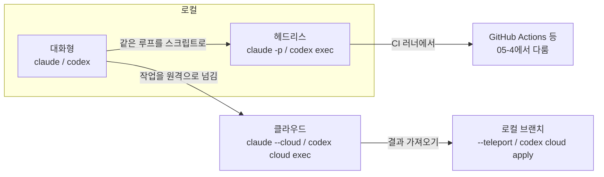

# 00-3. 대화형 / 헤드리스 / 클라우드 실행 모드

## 🎯 학습 목표
- 대화형·헤드리스·클라우드 세 가지 실행 모드의 차이를 "누가 지켜보는가, 어디서 도는가" 기준으로 설명하고 작업에 맞는 모드를 고를 수 있다.
- `claude -p`와 `codex exec`로 에이전트를 비대화형으로 실행하고, 표준 입력·JSON 출력·구조화 출력을 다룰 수 있다.
- 헤드리스 실행에서 파일 수정 권한을 안전하게 여는 방법(Claude `--allowedTools`/`--permission-mode`, Codex `--sandbox`)을 적용할 수 있다.
- 셸 스크립트 하나를 헤드리스 에이전트로 자동화하고, 클라우드 작업을 시작해 결과를 로컬로 가져오는 흐름을 설명할 수 있다.

## 📋 사전 준비
- 선행 레슨: [00-1](./00-1-how-agents-work.md), [00-2](./00-2-claude-vs-codex.md)
- 필요 도구/계정: Claude Code 2.1.292+, Codex 0.160.1+ (둘 다 로그인 완료), Node.js 22+, Git, `jq`
- 실습 저장소 상태: `agent-lab` 저장소의 `main` 브랜치, 작업 트리가 깨끗한 상태. 00-2를 건너뛰었다면 `src/duration.js`가 없어도 된다.
- (Step 6 선택) 클라우드 실습을 하려면 `agent-lab`을 본인 GitHub 비공개 저장소로 push해 둔다. Claude는 [claude.ai/code](https://claude.ai/code), Codex는 ChatGPT의 Codex Cloud 환경 설정이 필요하다.

```bash
cd agent-lab
git switch main && git status
```

## 💡 개념

### 세 가지 실행 모드

| 모드 | 누가 지켜보는가 | 어디서 도는가 | Claude Code | Codex | 어울리는 작업 |
|---|---|---|---|---|---|
| 대화형 | 사람이 실시간으로 | 내 터미널 | `claude` | `codex` | 탐색, 설계 논의, 방향이 자주 바뀌는 작업 |
| 헤드리스 | 스크립트가 (사람은 결과만) | 내 터미널·CI 러너 | `claude -p "..."` | `codex exec "..."` | 반복 작업, 파이프라인, CI, 일괄 처리 |
| 클라우드 | 아무도 (끝나면 확인) | 원격 격리 환경 | `claude --cloud "..."` | `codex cloud exec --env <ENV_ID> "..."` | 오래 걸리는 작업, 병렬 작업, 노트북을 덮어도 계속할 작업 |



세 모드 모두 00-1의 **같은 에이전트 루프**를 돈다. 달라지는 것은 다음 세 가지다.

1. **승인할 사람이 없다.** 헤드리스와 클라우드에서는 실행 중에 "이 명령 실행해도 돼?"에 답할 사람이 없다. 그래서 **무엇을 허용할지 실행 전에** 정해야 한다. 허용하지 않은 동작은 막히거나(Claude) 샌드박스 안으로 제한된다(Codex).
2. **출력이 프로그램의 입력이 된다.** 사람이 읽는 문장 대신 JSON, 파일, 종료 코드로 결과를 받아 다음 단계로 넘긴다.
3. **실행 위치가 바뀌면 보이는 설정이 바뀐다.** 클라우드 세션은 저장소에 **커밋된** 설정만 쓴다. 내 홈 디렉터리의 개인 skill이나 플러그인은 따라가지 않는다.

### 헤드리스의 기본기: 입력·출력·권한

| 항목 | Claude Code (`claude -p`) | Codex (`codex exec`) |
|---|---|---|
| 표준 입력 | `cat log.txt \| claude -p "explain"` | 프롬프트와 stdin을 함께 주면 stdin이 `<stdin>` 블록으로 붙는다. 프롬프트를 생략하거나 `-`를 주면 stdin 전체가 프롬프트다 |
| 사람이 읽을 출력 | 기본 `text` | 진행 상황은 stderr, 최종 메시지만 stdout |
| 기계가 읽을 출력 | `--output-format json` (`.result`, `total_cost_usd` 등) 또는 `stream-json` | `--json` (JSONL 이벤트), `-o <FILE>`(최종 메시지 파일) |
| 구조화 출력 | `--json-schema '<스키마>'` → `.structured_output` | `--output-schema <FILE>` |
| 수정 권한 | `--allowedTools`로 도구 단위 허용, `--permission-mode acceptEdits` | 기본 **read-only**. `--sandbox workspace-write`로 연다 |
| 이어서 실행 | `claude -c -p "..."` | `codex exec resume --last "..."` |
| 세션 저장 안 함 | `--no-session-persistence` | `--ephemeral` |
| 최소 모드 | `--bare` (hooks·MCP·CLAUDE.md 자동 탐색 등을 건너뛴다. **인증은 `ANTHROPIC_API_KEY`만** 쓴다) | `--ignore-user-config`, `--ignore-rules` |

> **`-p`의 뜻이 다르다.** Claude의 `-p`는 `--print`(비대화형)다. Codex의 `-p`는 `--profile`이다. `codex exec -p "프롬프트"`는 "프롬프트"라는 이름의 프로필 파일을 찾으려 한다.

### 왜 대규모 개발에서 중요한가

- **대규모 개발의 상당 부분은 반복이다.** 100개 파일에 같은 변경, 매일 밤 테스트 실패 분석, PR마다 리뷰. 사람이 매번 대화형으로 하면 사람이 병목이 된다. 헤드리스로 바꾸는 순간 [05-4 CI/CD 통합](../05-scaling-up/05-4-ci-cd-integration.md)과 [05-5 대규모 변경](../05-scaling-up/05-5-large-scale-changes.md)의 문이 열린다.
- **병렬성은 클라우드에서 나온다.** 내 터미널은 하나지만 클라우드 작업은 여러 개를 동시에 띄울 수 있다(설계 원칙 4 *Small Batches, Many Agents*). [05-1 병렬 에이전트](../05-scaling-up/05-1-parallel-agents.md)의 기초다.
- **사람이 없는 실행일수록 권한 설계가 중요하다.** 헤드리스에서 "일단 다 허용"은 사고로 이어진다. 최소 권한으로 시작해 필요한 만큼만 여는 습관을 이 레슨에서 들인다.

## 👣 따라하기

### Step 1. 대화형 기준선 잡기
같은 질문을 대화형으로 먼저 해 보고, 헤드리스와 비교할 기준으로 삼는다.

**Claude Code 레시피**
```bash
cd agent-lab
claude
> src 디렉터리의 각 파일이 무슨 일을 하는지 파일당 한 줄로 요약해줘. 파일은 수정하지 마.
```

**Codex 레시피**
```bash
cd agent-lab
codex
> src 디렉터리의 각 파일이 무슨 일을 하는지 파일당 한 줄로 요약해줘. 파일은 수정하지 마.
```

**기대 결과**: 파일별 요약이 화면에 나온다. 결과를 다른 프로그램에 넘기려면 복사해야 하고, 같은 질문을 내일 또 하려면 다시 입력해야 한다는 점을 확인한다. 이것이 헤드리스가 필요한 이유다.

### Step 2. 첫 헤드리스 실행: 읽기 전용 질문
같은 질문을 한 줄 명령으로 실행하고, 결과를 파일과 JSON으로 받는다.

**Claude Code 레시피**
```bash
cd agent-lab

# 1) 텍스트 출력 → 파일
claude -p "src 디렉터리의 각 파일이 무슨 일을 하는지 파일당 한 줄로 요약해줘." > summary.txt
cat summary.txt

# 2) JSON 출력 → 필요한 필드만 추출
claude -p "src 디렉터리의 각 파일이 무슨 일을 하는지 파일당 한 줄로 요약해줘." \
  --output-format json | jq '{result, num_turns, is_error}'

# 3) 표준 입력으로 데이터 넘기기
npm test 2>&1 | claude -p "이 테스트 출력에서 실패한 테스트 이름만 목록으로 뽑아줘."
```

**Codex 레시피**
```bash
cd agent-lab

# 1) 최종 메시지만 stdout으로 → 파일 (진행 로그는 stderr로 화면에 보인다)
codex exec "src 디렉터리의 각 파일이 무슨 일을 하는지 파일당 한 줄로 요약해줘." > summary.txt
cat summary.txt

# 2) 최종 메시지를 파일로 직접 저장
codex exec -o summary.txt "src 디렉터리의 각 파일이 무슨 일을 하는지 파일당 한 줄로 요약해줘."

# 3) 표준 입력으로 데이터 넘기기 (stdin이 <stdin> 블록으로 붙는다)
npm test 2>&1 | codex exec "이 테스트 출력에서 실패한 테스트 이름만 목록으로 뽑아줘."
```

**기대 결과**: 두 도구 모두 대화 화면 없이 결과만 출력하고 종료한다. Claude JSON 출력에는 `result`, `num_turns`, `is_error` 필드가 있다. Codex는 실행 중 진행 상황을 stderr로 보여주지만 `summary.txt`에는 최종 메시지만 들어간다. 지금은 테스트가 모두 통과하는 상태이므로 3)에서는 "실패한 테스트 없음"이라고 답하는 것이 정상이다. 없는 실패를 지어내면 그것도 기록해 둔다([00-4](./00-4-failure-patterns.md)의 환각 사례다).

```bash
echo summary.txt >> .gitignore
```

### Step 3. 헤드리스로 파일 고치기: 권한을 명시적으로 열기
헤드리스에서 수정 작업을 시키고, 권한을 열지 않았을 때와 열었을 때의 차이를 관찰한다.

먼저 고칠 거리를 만든다.

```bash
cd agent-lab
cat > src/greet.js <<'EOF'
export function greet(name) {
  return 'Hello, ' + name;
}
EOF
git add src/greet.js && git commit -m "chore: greet 추가"
```

**Claude Code 레시피**
```bash
# 1) 권한 없이: 편집이 막히는지 확인
claude -p "src/greet.js의 greet가 이름이 비어 있으면 'Hello, stranger'를 반환하도록 고쳐줘." \
  --output-format json | jq '{result, permission_denials}'
git diff --stat

# 2) 필요한 도구만 허용
claude -p "src/greet.js의 greet가 이름이 비어 있으면 'Hello, stranger'를 반환하도록 고쳐줘. \
test/greet.test.js에 테스트를 추가하고 npm test로 확인해줘." \
  --allowedTools "Read" "Edit" "Write" "Bash(npm test)" "Bash(npm test *)" \
  --output-format json | jq '{result, num_turns, permission_denials}'
git diff --stat
```

`claude -p`는 상황에 따라 `default` 또는 `auto` 모드로 시작한다. 허용 규칙에 없는 동작은 사람에게 물을 수 없으므로 거부되고, 그 기록이 `permission_denials`에 남는다. 1)에서 편집이 이미 성공했다면 그 세션은 `auto` 모드로 시작한 것이다. 어느 쪽이든 2)처럼 **필요한 도구를 명시**하는 습관을 들인다. 편집 전반을 허용하려면 `--permission-mode acceptEdits`를 쓸 수 있다.

**Codex 레시피**
```bash
git checkout -- . && git clean -fd test   # Claude 결과 되돌리기

# 1) 기본값(read-only 샌드박스): 편집이 막히는지 확인
codex exec "src/greet.js의 greet가 이름이 비어 있으면 'Hello, stranger'를 반환하도록 고쳐줘."
git diff --stat

# 2) 작업 공간 쓰기 허용
codex exec --sandbox workspace-write \
  "src/greet.js의 greet가 이름이 비어 있으면 'Hello, stranger'를 반환하도록 고쳐줘. \
test/greet.test.js에 테스트를 추가하고 npm test로 확인해줘."
git diff --stat
```

`workspace-write`에서도 `.git`, `.agents`, `.codex`는 읽기 전용으로 보호된다. 예전 자료에 나오는 `--full-auto`는 0.160.1에서 `unexpected argument` 오류를 내므로 쓰지 않는다.

**기대 결과**: 1)에서 Codex는 파일을 바꾸지 못하고 "쓸 수 없다"는 취지로 보고한다(`git diff --stat`이 비어 있다). Claude는 `permission_denials`에 거부된 도구가 기록되거나, `auto`로 시작했다면 편집이 진행된다. 2)에서는 두 도구 모두 `src/greet.js`와 `test/greet.test.js`를 바꾸고 `npm test`가 통과한다. 확인 후 원하는 쪽 결과를 커밋한다.

> ⚠️ `--dangerously-skip-permissions`(Claude), `--dangerously-bypass-approvals-and-sandbox`/`--yolo`(Codex)는 이 실습에서 쓰지 않는다. 컨테이너·VM처럼 외부에서 격리된 환경이 아니면 저장소 밖 파일과 네트워크까지 무제한으로 열린다.

### Step 4. 구조화 출력과 세션 이어가기
스크립트가 분기할 수 있도록 결과를 JSON 스키마로 받고, 앞 실행의 맥락을 이어서 후속 지시를 준다.

스키마 파일을 만든다.

```bash
mkdir -p scripts
cat > scripts/triage.schema.json <<'EOF'
{
  "type": "object",
  "properties": {
    "failing_tests": { "type": "array", "items": { "type": "string" } },
    "suspected_file": { "type": "string" },
    "cause": { "type": "string" },
    "confidence": { "type": "string", "enum": ["low", "medium", "high"] }
  },
  "required": ["failing_tests", "suspected_file", "cause", "confidence"],
  "additionalProperties": false
}
EOF
```

일부러 테스트를 하나 깨뜨린다.

```bash
sed -i.bak "s/'Hello, '/'Hi, '/" src/greet.js && rm -f src/greet.js.bak
npm test 2>&1 | tail -5
```

**Claude Code 레시피**
```bash
npm test 2>&1 | claude -p "이 테스트 실패의 원인을 분석해줘. 파일은 수정하지 마." \
  --allowedTools "Read" "Grep" "Glob" \
  --output-format json --json-schema "$(cat scripts/triage.schema.json)" \
  | jq '.structured_output'

# 같은 맥락을 이어서 후속 지시 (가장 최근 세션)
claude -c -p "방금 분석한 원인대로 고쳐줘. 테스트 파일은 건드리지 마." \
  --allowedTools "Read" "Edit" "Bash(npm test)" "Bash(npm test *)"
```

**Codex 레시피**
```bash
git checkout -- src/greet.js && sed -i.bak "s/'Hello, '/'Hi, '/" src/greet.js && rm -f src/greet.js.bak

npm test 2>&1 | codex exec --output-schema scripts/triage.schema.json \
  -o triage.json "이 테스트 실패의 원인을 분석해줘. 파일은 수정하지 마."
jq . triage.json

# 같은 맥락을 이어서 후속 지시
codex exec resume --last -c sandbox_mode='"workspace-write"' "방금 분석한 원인대로 고쳐줘. 테스트 파일은 건드리지 마."
```

> 0.160.1의 `codex exec resume`에는 `--sandbox` 플래그가 없다(`codex exec resume --help`로 확인). 그래서 설정 덮어쓰기 `-c sandbox_mode=...`로 샌드박스를 지정한다. 이어서 실행한 세션에 이 값이 실제로 적용됐는지는 실행 후 `git diff --stat`으로 확인한다. TODO(verify): resume 세션에서 `-c sandbox_mode` 적용 여부

**기대 결과**: 분석 결과가 스키마 모양의 JSON으로 나온다(`suspected_file`이 `src/greet.js`, `failing_tests`에 실패한 테스트 이름). 후속 실행은 분석 내용을 다시 설명하지 않아도 이어서 고치고, `npm test`가 다시 통과한다. 스크립트는 `confidence` 값으로 "자동 수정 시도" 또는 "사람에게 알림"을 분기할 수 있다.

```bash
echo triage.json >> .gitignore
npm test
```

### Step 5. 스크립트 하나를 헤드리스 에이전트로 자동화하기
테스트를 돌려 실패하면 원인 분석 보고서를 남기는 `scripts/triage.sh`를 만든다. 도구는 인수로 고른다.

이 스크립트는 사람이 매번 하던 "테스트 실패 → 로그 읽기 → 원인 추측"을 대신한다. 파일은 고치지 않는다(읽기 전용). 자동 수정까지 붙이는 것은 HW3에서 한다.

```bash
cat > scripts/triage.sh <<'EOF'
#!/usr/bin/env bash
# 사용법: scripts/triage.sh [claude|codex]
set -euo pipefail
TOOL="${1:-claude}"
SCHEMA="scripts/triage.schema.json"
mkdir -p reports

if npm test > reports/test-output.txt 2>&1; then
  echo "✅ tests passed"
  exit 0
fi

PROMPT="첨부한 npm test 출력을 분석해 실패 원인을 찾아라. 필요하면 소스를 읽되 파일은 수정하지 마라."

case "$TOOL" in
  claude)
    claude -p "$PROMPT" \
      --allowedTools "Read" "Grep" "Glob" \
      --output-format json --json-schema "$(cat "$SCHEMA")" \
      < reports/test-output.txt \
      | jq '.structured_output' > reports/triage.json
    ;;
  codex)
    codex exec --sandbox read-only --output-schema "$SCHEMA" \
      -o reports/triage.json "$PROMPT" < reports/test-output.txt
    ;;
  *)
    echo "unknown tool: $TOOL" >&2; exit 2 ;;
esac

echo "❌ tests failed — reports/triage.json"
jq . reports/triage.json
exit 1
EOF
chmod +x scripts/triage.sh
echo "reports/" >> .gitignore
```

실패 상황을 만들어 두 도구로 각각 실행한다.

**Claude Code 레시피**
```bash
sed -i.bak "s/'Hello, '/'Hi, '/" src/greet.js && rm -f src/greet.js.bak
scripts/triage.sh claude; echo "exit=$?"
```

**Codex 레시피**
```bash
scripts/triage.sh codex; echo "exit=$?"
git checkout -- src/greet.js
scripts/triage.sh codex; echo "exit=$?"   # 통과 경로도 확인
```

CI처럼 개인 설정의 영향을 받지 않게 돌리고 싶다면 Claude는 `--bare`, Codex는 `--ignore-user-config`를 추가한다. 단 `--bare`는 OAuth 로그인을 읽지 않고 `ANTHROPIC_API_KEY`(또는 `--settings`의 `apiKeyHelper`)로만 인증하므로, 구독 로그인만 해 둔 환경에서는 인증 오류가 난다.

**기대 결과**: 테스트가 실패하면 `reports/triage.json`이 생기고 스크립트가 종료 코드 1로 끝난다. 통과하면 "tests passed"와 종료 코드 0이다. 두 도구의 `triage.json`이 같은 스키마를 따르므로, 뒤에 붙는 단계(슬랙 알림, 이슈 생성 등)는 도구와 상관없이 같은 코드로 처리할 수 있다.

```bash
git add scripts .gitignore && git commit -m "feat: 헤드리스 테스트 실패 분석 스크립트"
```

### Step 6. (선택) 클라우드에서 실행하고 결과 가져오기
작업을 원격 환경에 넘기고, 끝난 결과를 로컬 브랜치로 가져오는 흐름을 한 번 경험한다.

클라우드는 저장소가 GitHub에 있어야 하고 각 서비스의 환경 설정이 필요하다. 클라우드 기능은 자주 바뀌는 영역이므로 화면 경로 대신 명령 흐름 위주로 본다. 클라우드 세션은 **커밋·push된** 설정만 쓴다는 점을 기억한다.

```bash
cd agent-lab
git push origin main   # 사전 준비에서 만든 GitHub 원격 저장소
```

**Claude Code 레시피**
```bash
# 클라우드 세션 시작 (터미널을 닫아도 계속 돈다)
claude --cloud "src/slugify.js에 JSDoc 주석을 추가하고 npm test로 확인해줘"

# 진행 상황은 claude.ai/code 웹 세션 목록에서 본다
# 실행 중인 세션에 후속 지시 보내기
claude -p "README.md에 slugify 사용 예시도 추가해줘" --cloud <session-id>

# 끝난 세션을 로컬 터미널로 가져오기
claude --teleport
```

**Codex 레시피**
```bash
# 클라우드 환경 ID 확인 (codex cloud는 작업·환경을 둘러보는 TUI를 연다)
codex cloud

# 작업 제출 (--attempts로 여러 시도를 동시에 받을 수 있다)
codex cloud exec --env <ENV_ID> "src/slugify.js에 JSDoc 주석을 추가하고 npm test로 확인해줘"

# 목록과 상태
codex cloud list
codex cloud status <TASK_ID>

# 결과 diff 확인 후 로컬에 적용
codex cloud diff <TASK_ID>
codex cloud apply <TASK_ID>
```

`codex cloud`는 `--help`에 `[EXPERIMENTAL]`로 표시된다. 동작이 바뀔 수 있으니 실행 전에 `codex cloud --help`로 다시 확인한다.

**기대 결과**: 명령을 낸 직후 터미널이 바로 돌아오고, 작업은 원격에서 계속된다. 완료 후 Claude는 `--teleport`로 세션과 변경을 로컬로 가져오고, Codex는 `codex cloud diff`로 변경을 확인한 뒤 `apply`로 작업 트리에 적용한다. 가져온 결과도 반드시 로컬에서 `npm test`로 다시 검증한다.

## ✅ 체크포인트
- [ ] `claude -p`와 `codex exec`로 읽기 전용 질문을 실행하고 결과를 파일로 받았다.
- [ ] Claude JSON 출력에서 `jq`로 `result`를 추출했고, Codex `-o`로 최종 메시지를 파일에 저장했다.
- [ ] 권한을 열지 않은 헤드리스 수정이 막히는 것(또는 Claude가 `auto`로 진행하는 것)을 확인하고, `--allowedTools` / `--sandbox workspace-write`로 필요한 권한만 열었다.
- [ ] `--json-schema` / `--output-schema`로 같은 스키마의 JSON 결과를 받았다.
- [ ] `claude -c -p`, `codex exec resume --last`로 앞 세션을 이어서 실행했다.
- [ ] `scripts/triage.sh`가 실패 시 종료 코드 1과 보고서, 통과 시 종료 코드 0을 낸다.
- [ ] Claude의 `-p`와 Codex의 `-p`가 서로 다른 뜻이라는 것을 설명할 수 있다.

## 🏠 숙제
| # | 유형 | 난이도 | 과제 | 완료 조건 |
|---|---|---|---|---|
| HW1 | 🔁 Reproduce | ★ | Step 2~5를 본인 환경에서 재현한다 | 두 도구의 헤드리스 실행 명령과 출력(텍스트 1개, JSON 1개씩)이 제출물에 있다. `scripts/triage.sh claude`와 `scripts/triage.sh codex`의 실패·통과 두 경로 실행 로그와 종료 코드가 있다 |
| HW2 | 🛠 Apply | ★★ | 본인이 반복하는 스크립트 1개를 헤드리스 에이전트로 자동화한다 (예: 커밋 로그로 릴리스 노트 초안, lint 결과 요약, 의존성 업데이트 영향 분석) | 스크립트가 Claude Code와 Codex 중 최소 하나, 가능하면 둘 다로 동작한다. 구조화 출력(JSON 스키마)을 쓰고 종료 코드로 성공/실패를 구분한다. 허용한 도구·샌드박스가 최소 권한인 이유를 README나 주석에 적었다. 실제 실행 결과 2회 이상이 첨부돼 있다 |
| HW3 | 🚀 Challenge | ★★★ | `triage.sh`를 "분석 → 신뢰도 high면 자동 수정 → 재검증" 파이프라인으로 확장하고 클라우드 실행과 비교한다 | `confidence`가 `high`일 때만 세션을 이어서(`claude -c -p` / `codex exec resume --last`) 수정하고 `npm test`로 재검증한다. 수정 후에도 실패하면 변경을 되돌리고 종료 코드 1로 끝난다. 같은 작업을 클라우드(`claude --cloud` 또는 `codex cloud exec`)로도 한 번 실행해 걸린 시간·결과·사람 개입을 로컬 헤드리스와 비교한 표가 있다 |

제출: `hw/00-3` 브랜치, `submissions/00-3.md` (템플릿: docs/design/homework-template.md)

## ⚠️ 흔한 실수
- **`codex exec`로 고치라고 했는데 아무것도 바뀌지 않았다** → 원인: `codex exec` 기본 샌드박스는 read-only다 → 대응: `--sandbox workspace-write`를 명시한다. `--full-auto`는 0.160.1에서 거부된다.
- **`codex exec -p "..."`가 프로필을 찾을 수 없다는 오류를 낸다** → 원인: Codex의 `-p`는 `--profile`이다 → 대응: Codex는 프롬프트를 위치 인수로 준다(`codex exec "..."`). `-p`는 Claude에서만 비대화형 플래그다.
- **`claude -p` 결과에 "권한이 없어 수정하지 못했다"는 말이 나온다** → 원인: 헤드리스에서는 승인할 사람이 없어 허용되지 않은 도구 호출이 거부된다 → 대응: `--output-format json`의 `permission_denials`를 보고 필요한 도구만 `--allowedTools`에 추가한다. 무조건 `--dangerously-skip-permissions`로 해결하지 않는다.
- **`--bare`를 붙였더니 인증 오류가 난다** → 원인: `--bare`는 OAuth·키체인을 읽지 않고 `ANTHROPIC_API_KEY`(또는 `apiKeyHelper`)만 쓴다 → 대응: 구독 로그인 환경에서는 `--bare`를 빼거나 API 키를 설정한다.
- **클라우드 세션이 내 skill이나 설정을 모른다** → 원인: 클라우드 세션은 저장소에 커밋된 설정만 쓰고 `~/.claude/skills` 같은 개인 설정은 읽지 않는다 → 대응: 팀이 쓸 설정과 skill은 저장소(`.claude/`, `.agents/skills/`, `AGENTS.md`)에 커밋하고 push한다.

## 🔗 참고 자료
- 이 저장소의 [도구 레퍼런스](../../docs/reference/tool-reference.md) — §2 대화형·비대화형·세션 이어가기, §5 권한, §9 병렬 실행·클라우드
- Claude Code: [Headless](https://code.claude.com/docs/en/headless), [CLI reference](https://code.claude.com/docs/en/cli-reference), [Permission modes](https://code.claude.com/docs/en/permission-modes), [Claude Code on the web](https://code.claude.com/docs/en/claude-code-on-the-web)
- Codex: [Non-interactive mode](https://learn.chatgpt.com/docs/non-interactive-mode), [Approvals & security](https://learn.chatgpt.com/docs/agent-approvals-security), [Codex Cloud](https://learn.chatgpt.com/docs/cloud), [Auth](https://learn.chatgpt.com/docs/auth)
- 이전 레슨: [00-2 Claude Code vs Codex](./00-2-claude-vs-codex.md) / 다음 레슨: [00-4 실패 패턴 카탈로그](./00-4-failure-patterns.md)
- 관련 레슨: [01-2 권한·샌드박스](../01-environment-setup/01-2-permissions-and-sandbox.md), [01-5 재현 가능한 개발 환경](../01-environment-setup/01-5-reproducible-environment.md), [05-1 병렬 에이전트](../05-scaling-up/05-1-parallel-agents.md), [05-4 CI/CD 통합](../05-scaling-up/05-4-ci-cd-integration.md), [05-5 대규모 변경](../05-scaling-up/05-5-large-scale-changes.md)
