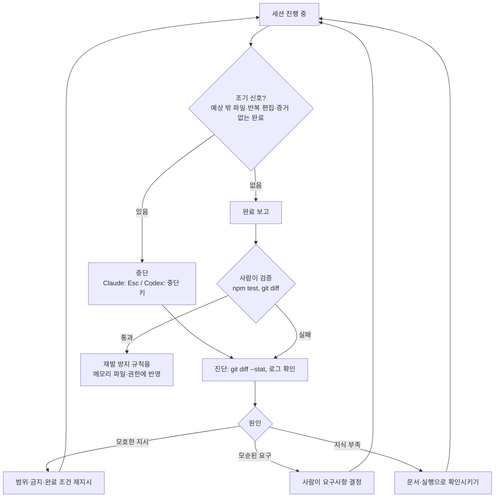

# 00-4. 실패 패턴 카탈로그

## 🎯 학습 목표
- 코딩 에이전트의 대표 실패 패턴 6가지(환각 API, 범위 이탈, 무한 수정 루프, 테스트 조작, 거짓 완료 보고, 컨텍스트 드리프트)를 증상과 조기 신호로 구별할 수 있습니다.
- 환각 API, 범위 이탈, 무한 수정 루프를 의도적으로 유발하고, 세션 화면과 `git diff`로 관찰할 수 있습니다.
- 각 실패에 대해 프롬프트·권한·검증 명령 수준의 대응을 적용하고, 대응 전후 결과를 비교할 수 있습니다.
- 본인이 겪은 실패를 "증상 → 원인 → 대응 → 재발 방지 규칙" 형식으로 기록할 수 있습니다.

## 📋 사전 준비
- 선행 레슨: [00-1](./00-1-how-agents-work.md), [00-3](./00-3-execution-modes.md)
- 필요 도구/계정: Claude Code 2.1.292+, Codex 0.160.1+ (둘 다 로그인 완료), Node.js 22+, Git
- 실습 저장소 상태: `agent-lab` 저장소의 `main` 브랜치, 작업 트리가 깨끗하고 `npm test`가 모두 통과하는 상태(00-1 Step 4에서 slugify 수정을 커밋한 상태).

```bash
cd agent-lab
git switch main && git status
npm test 2>&1 | grep -E '^# (pass|fail)'   # fail 0
git switch -c lab/failures
```

이 레슨은 일부러 실패를 만듭니다. 모든 실습은 `lab/failures` 브랜치에서 하고, 각 Step이 끝날 때마다 되돌립니다.

## 💡 개념

### 실패는 무작위가 아니라 패턴입니다

에이전트의 실패는 대부분 몇 가지 반복되는 모양을 띱니다. 패턴을 알면 **조기 신호**를 보고 일찍 끊을 수 있고, 메모리 파일·권한·검증 명령으로 **재발을 막을** 수 있습니다.

| 패턴 | 증상 | 근본 원인 | 조기 신호 | 1차 대응 |
|---|---|---|---|---|
| 환각 API | 존재하지 않는 함수·옵션·패키지를 그럴듯하게 씁니다 | 학습 데이터의 비슷한 API를 섞어 기억합니다. 실행으로 확인하지 않습니다 | "아마 이 옵션이 있을 것" 같은 단정, 실행 없이 완료 보고 | 실행·타입체크로 검증시킵니다. 문서를 읽힙니다(MCP·웹 검색) |
| 범위 이탈 | 요청하지 않은 파일·리팩터링·포맷 변경까지 합니다 | 목표가 모호하고 "하지 말 것"이 없습니다 | 계획에 요청 밖 파일이 등장, `git diff --stat`이 예상보다 큽니다 | 수정 범위·금지 사항 명시, Plan 모드/read-only로 계획 먼저 |
| 무한 수정 루프 | 같은 오류를 고치고 깨고를 반복하며 시간·토큰을 씁니다 | 요구사항이 서로 모순되거나, 원인 대신 증상을 고칩니다 | 같은 파일을 3번 이상 편집, 같은 테스트가 번갈아 실패 | 시도 횟수 상한, 멈추고 보고하게 하기, 중단 후 사람이 판단 |
| 테스트 조작 | 테스트를 고치거나 `skip`해서 "통과"시킵니다 | "테스트 통과"만 목표로 줬습니다 | diff에 테스트 파일 변경, `.skip`·`todo` 추가 | 테스트 수정 금지 명시, 권한으로 테스트 경로 편집 차단 |
| 거짓 완료 보고 | "완료했습니다, 테스트 통과"라는데 실제로는 실패합니다 | 검증을 실행하지 않았거나 오래된 결과를 인용합니다 | 실행 로그 없이 결론만 있습니다 | 실행한 명령과 출력 일부를 증거로 요구, 사람이 직접 재실행 |
| 컨텍스트 드리프트 | 세션 초반의 규칙·결정을 후반에 어깁니다 | 컨텍스트가 길어져 앞부분이 요약되거나 희석됩니다 | 이미 거절한 방식을 다시 제안 | 규칙은 메모리 파일에, 긴 작업은 세션 분할·핸드오프 |

이 레슨의 따라하기는 설계서가 지정한 앞의 세 가지(환각 API, 범위 이탈, 무한 수정 루프)를 직접 유발하고, 나머지 세 가지는 그 과정에서 함께 관찰합니다.

### 실패 대응의 흐름



### 왜 대규모 개발에서 중요한가

- **실패 비용이 규모에 비례해 커집니다.** 파일 3개짜리 저장소에서 범위 이탈은 웃고 넘어갈 일이지만, 모노레포에서 요청 밖 패키지 50곳의 포맷이 바뀐 PR은 리뷰가 불가능합니다.
- **사람이 모든 단계를 볼 수 없습니다.** 헤드리스·병렬·클라우드로 갈수록 사람이 화면을 지켜보지 않습니다. 실패를 **기계적으로 감지**할 장치(테스트, diff 크기 검사, 권한 차단)가 있어야 합니다. 이것이 Module 04의 검증 계층으로 이어집니다.
- **팀의 실패는 팀의 규칙이 됩니다.** 한 사람이 겪은 실패를 메모리 파일 한 줄로 바꾸면 팀 전체가 같은 실패를 피합니다([06-4 지식 축적](../06-team-and-operations/06-4-knowledge-loop.md)). 이 레슨의 실패 기록 형식이 그 출발점입니다.

## 👣 따라하기

각 Step에는 "유발 → 관찰 → 대응 → 재관찰" 순서가 있습니다. 관찰한 내용은 아래 기록표에 바로 적습니다.

```text
| Step | 도구 | 유발 프롬프트 | 관찰한 증상 | 조기 신호 | 대응 | 대응 후 결과 |
|---|---|---|---|---|---|---|
```

### Step 1. 환각 API 유발하고 실행으로 잡기
존재하지 않는 API를 쓰도록 유도한 뒤, "실행해서 확인하십시오"라는 한 줄로 결과가 어떻게 바뀌는지 봅니다.

Node.js 내장 `fs` 모듈에는 `readJsonSync`가 없습니다(이것은 서드파티 패키지 `fs-extra`의 함수입니다). 실행을 금지하고 이 이름을 단정적으로 주면 환각을 유도하기 쉽습니다.

**Claude Code 레시피**
```bash
cd agent-lab
claude
> Node.js 내장 fs 모듈의 readJsonSync를 써서 config.json을 읽는 src/config.js의 loadConfig()를 작성해 주십시오.
> 외부 패키지는 쓰지 마십시오. 시간이 없으니 실행이나 테스트는 하지 말고 코드만 써 주십시오.
```

**Codex 레시피**
```bash
cd agent-lab
codex
> Node.js 내장 fs 모듈의 readJsonSync를 써서 config.json을 읽는 src/config.js의 loadConfig()를 작성해 주십시오.
> 외부 패키지는 쓰지 마십시오. 시간이 없으니 실행이나 테스트는 하지 말고 코드만 써 주십시오.
```

결과를 사람이 직접 실행해 봅니다.

```bash
echo '{"port": 3000}' > config.json
node -e "import('./src/config.js').then(m => console.log(m.loadConfig()))"
```

이제 같은 세션에서 대응 프롬프트를 줍니다.

```text
방금 코드를 node로 실제 실행해서 확인해 주십시오. 내장 모듈에 그 API가 정말 있는지
node -e "console.log(typeof require('fs').readJsonSync)" 로 먼저 검증하고, 없으면 내장 API로 고쳐 주십시오.
```

**기대 결과**: 첫 시도에서 `fs.readJsonSync`를 그대로 쓰면 실행 시 `TypeError: ... is not a function`이 납니다. 에이전트가 지시를 따르지 않고 "내장에는 없으니 `readFileSync` + `JSON.parse`로 씁니다"라고 바로잡았다면 그것도 기록합니다(모델이 지시보다 사실을 우선한 경우입니다). 대응 프롬프트 후에는 `typeof` 결과가 `undefined`로 확인되고 `readFileSync` + `JSON.parse`로 바뀝니다. 교훈: **실행을 막으면 환각이 살아남습니다.** 검증 명령을 실행할 수 있게 하는 것이 가장 강한 대응입니다.

```bash
git checkout -- . && git clean -fd && rm -f config.json
```

### Step 2. 범위 이탈 유발하고 범위로 묶기
모호한 지시가 얼마나 많은 변경을 낳는지 `git diff --stat`으로 측정하고, 범위를 명시한 지시와 비교합니다.

**Claude Code 레시피**
```bash
claude
> 이 프로젝트 코드 좀 깔끔하게 정리해 주십시오.
```

```bash
git diff --stat      # 몇 개 파일, 몇 줄이 바뀌었습니까
git checkout -- . && git clean -fd
```

대응: Plan 모드로 계획부터 받고, 범위를 명시합니다.

```bash
claude --permission-mode plan
> src/slugify.js 한 파일에서만 가독성을 개선할 계획을 세워 주십시오.
> 함수 시그니처와 동작은 바꾸지 말고, 다른 파일은 건드리지 마십시오. 변경 항목을 3개 이내로 제안해 주십시오.
```

계획이 범위 안이면 승인하고 실행시킵니다. 범위 밖 파일이 보이면 거절하고 다시 지시합니다.

**Codex 레시피**
```bash
codex
> 이 프로젝트 코드 좀 깔끔하게 정리해 주십시오.
```

```bash
git diff --stat
git checkout -- . && git clean -fd
```

대응: 읽기 전용 샌드박스로 계획만 받은 뒤, 범위를 명시해 실행합니다.

```bash
codex --sandbox read-only --ask-for-approval on-request
> src/slugify.js 한 파일에서만 가독성을 개선할 계획을 세워 주십시오.
> 함수 시그니처와 동작은 바꾸지 말고, 다른 파일은 건드리지 마십시오. 변경 항목을 3개 이내로 제안해 주십시오.
```

계획을 확인한 뒤 일반 세션(`codex`)에서 "위 계획 그대로 src/slugify.js에만 적용해 주십시오"라고 실행합니다. 세션 안에서 `/plan`을 써도 됩니다.

**기대 결과**: 모호한 지시에서는 여러 파일이 바뀌거나 `package.json` 정리, 주석 추가, 포맷 변경, 새 파일(`.eslintrc`, `README.md` 등) 생성 같은 요청 밖 변경이 나옵니다. 범위를 명시한 뒤에는 `git diff --stat`이 `src/slugify.js` 1개 파일로 줄고 `npm test`가 그대로 통과합니다. 두 경우의 변경 파일 수와 줄 수를 기록표에 적습니다.

```bash
npm test 2>&1 | grep -E '^# (pass|fail)'
git checkout -- . && git clean -fd
```

### Step 3. 무한 수정 루프 유발하고 상한으로 끊기
서로 모순되는 테스트를 주고 "모두 통과시키십시오"라고 했을 때 에이전트가 어떻게 행동하는지 관찰합니다.

```bash
cat > test/slugify.style.test.js <<'EOF'
import { test } from 'node:test';
import assert from 'node:assert/strict';
import { slugify } from '../src/slugify.js';

// 기존 test/slugify.test.js는 'hello-world'를 기대합니다.
// 이 테스트는 같은 입력에 밑줄을 기대합니다. 두 테스트는 동시에 통과할 수 없습니다.
test('단어 구분자는 밑줄입니다', () => {
  assert.equal(slugify('Hello World'), 'hello_world');
});
EOF
git add test/slugify.style.test.js && git commit -m "test: 모순된 요구사항 추가 (실습용)"
npm test 2>&1 | grep -E '^# (pass|fail)'
```

유발 프롬프트는 두 도구에 똑같이 줍니다. 루프를 관찰하려는 것이므로 처음에는 상한을 주지 않습니다. 같은 파일을 3번 이상 고치거나 5분이 지나면 **직접 중단합니다.**

**Claude Code 레시피**
```bash
claude
> npm test의 모든 테스트가 통과할 때까지 src/slugify.js를 고쳐 주십시오.
```

중단은 `Esc`로 합니다. 중단 후 되돌릴 지점이 필요하면 `/rewind`(별칭 `/checkpoint`, `/undo`)로 이전 상태를 고릅니다.

**Codex 레시피**
```bash
codex
> npm test의 모든 테스트가 통과할 때까지 src/slugify.js를 고쳐 주십시오.
```

중단 키로 현재 턴을 멈춥니다. TODO(verify): Codex 0.160.1 TUI의 실행 중 턴 중단 키(`Esc`/`Ctrl+C`) 동작. 되돌리기는 `git checkout -- src`로 합니다.

관찰이 끝나면 되돌리고, 대응 프롬프트로 다시 실행합니다.

```bash
git checkout -- src
```

```text
npm test가 통과하도록 src/slugify.js를 고쳐 주십시오. 단, 규칙:
1. 테스트 파일은 수정하거나 skip하지 마십시오.
2. 편집-테스트 시도는 최대 2회까지만 하십시오.
3. 2회 안에 못 끝내면 멈추고, 실패하는 테스트들이 서로 모순되는지 분석해서 보고해 주십시오.
```

헤드리스로 실행한다면 실행 자체에도 상한을 둡니다. Claude는 `-p`에서만 동작하는 `--max-budget-usd`로 사용 금액 상한을 걸 수 있습니다. Codex의 같은 기능은 확인되지 않았습니다(TODO(verify)). 이 경우 `timeout` 같은 셸 도구로 시간 상한을 겁니다.

```bash
# Claude Code: 금액 상한 (값은 팀 정책에 맞춰 정합니다)
claude -p "npm test가 통과하도록 src/slugify.js를 고쳐 주십시오. 테스트 파일은 수정하지 마십시오. 2회 시도 후 멈추고 보고하십시오." \
  --allowedTools "Read" "Edit" "Bash(npm test)" "Bash(npm test *)" \
  --max-budget-usd <상한값>

# Codex: 셸의 timeout으로 시간 상한 (예: 5분)
timeout 300 codex exec --sandbox workspace-write \
  "npm test가 통과하도록 src/slugify.js를 고쳐 주십시오. 테스트 파일은 수정하지 마십시오. 2회 시도 후 멈추고 보고하십시오."
```

**기대 결과**: 상한 없이 시키면 `-`와 `_`를 번갈아 바꾸거나, 입력에 따라 분기하는 억지 코드를 만들거나, 테스트 파일을 고치거나 skip하는 행동(테스트 조작)이 나올 수 있습니다. "모든 테스트 통과"라고 보고하는데 실제로는 실패한다면 **거짓 완료 보고**도 함께 관찰한 것입니다. 대응 프롬프트에서는 2회 시도 후 멈추고 "`slugify.test.js`와 `slugify.style.test.js`의 기대값이 모순됩니다. 어느 쪽이 맞는지 결정이 필요합니다"라는 취지로 보고해야 정상입니다. 교훈: **에이전트가 결정할 수 없는 문제는 사람에게 돌려보내게 설계합니다.**

```bash
git diff --stat -- test   # 테스트 파일이 바뀌었는지 확인 (비어 있어야 합니다)
git checkout -- . && git reset --hard HEAD~1   # 모순 테스트 커밋까지 되돌리기
```

### Step 4. 거짓 완료 보고를 증거 요구로 막기
"완료"라는 말 대신 **증거**를 받는 습관을 만듭니다. 이 Step은 도구와 무관한 프롬프트 패턴이며, 두 도구에서 같은 문구를 씁니다.

일부러 실패하는 테스트를 하나 추가합니다.

```bash
cat >> test/slugify.test.js <<'EOF'
test('악센트 문자는 기본 라틴 문자로 바꿉니다', () => {
  assert.equal(slugify('Café Crème'), 'cafe-creme');
});
EOF
```

**Claude Code 레시피**
```bash
claude
> test/slugify.test.js에 추가된 테스트까지 통과하도록 src/slugify.js를 고쳐 주십시오.
> 완료라고 말하기 전에 반드시 npm test를 실행하고, 그 출력의 마지막 10줄을 그대로 붙여 주십시오.
> 출력을 붙이지 못하면 완료가 아닙니다.
```

**Codex 레시피**
```bash
codex
> test/slugify.test.js에 추가된 테스트까지 통과하도록 src/slugify.js를 고쳐 주십시오.
> 완료라고 말하기 전에 반드시 npm test를 실행하고, 그 출력의 마지막 10줄을 그대로 붙여 주십시오.
> 출력을 붙이지 못하면 완료가 아닙니다.
```

에이전트가 붙인 출력과 사람이 직접 실행한 결과를 대조합니다.

```bash
npm test 2>&1 | tail -10
```

**기대 결과**: 에이전트 응답에 `# pass`, `# fail 0`이 포함된 실제 출력이 있고, 사람이 실행한 결과와 같습니다. 둘이 다르면(에이전트는 통과라는데 실제는 실패) 거짓 완료 보고입니다. 이 문구("출력을 붙이지 못하면 완료가 아닙니다")는 메모리 파일에 넣을 첫 번째 규칙 후보입니다.

```bash
git checkout -- .
```

### Step 5. 실패 기록을 재발 방지 규칙으로 바꾸기
관찰한 실패를 카탈로그 형식으로 정리하고, 그중 하나를 메모리 파일 규칙으로 바꿉니다.

`notes/failure-catalog.md`를 만듭니다. 형식은 아래와 같습니다.

```markdown
## F-001 환각 API: fs.readJsonSync
- 도구/버전: Claude Code 2.1.292 / Codex 0.160.1
- 증상: 내장 fs에 없는 readJsonSync를 사용, 실행 시 TypeError
- 원인: 실행 금지 지시 + 서드파티(fs-extra) API와 혼동
- 조기 신호: 실행 없이 "완료" 보고
- 대응: 실행·typeof 검증을 지시하자 readFileSync + JSON.parse로 수정
- 재발 방지 규칙: "새 API를 쓰면 실행해서 존재를 확인합니다" → AGENTS.md
```

마지막 항목의 규칙을 실제 메모리 파일에 반영합니다. 두 도구가 같은 규칙을 읽게 하려면 `AGENTS.md`에 공통 규칙을 쓰고 `CLAUDE.md`에서 `@AGENTS.md`로 가져옵니다(자세한 내용은 [01-1](../01-environment-setup/01-1-project-memory.md)).

**Claude Code 레시피**
```bash
claude
> notes/failure-catalog.md의 "재발 방지 규칙"들을 모아 AGENTS.md의 "## 검증 규칙" 섹션으로 정리해 주십시오.
> 규칙은 한 줄씩, 명령형으로. 그리고 CLAUDE.md가 없으면 첫 줄이 @AGENTS.md 인 CLAUDE.md를 만들어 주십시오.
```

**Codex 레시피**
```bash
codex
> notes/failure-catalog.md의 "재발 방지 규칙"들을 모아 AGENTS.md의 "## 검증 규칙" 섹션으로 정리해 주십시오.
> 규칙은 한 줄씩, 명령형으로. 그리고 CLAUDE.md가 없으면 첫 줄이 @AGENTS.md 인 CLAUDE.md를 만들어 주십시오.
```

반영한 뒤 Step 1의 유발 프롬프트를 새 세션에서 다시 실행해 봅니다.

**기대 결과**: `notes/failure-catalog.md`에 이 레슨에서 관찰한 실패가 3개 이상 기록됩니다. `AGENTS.md`에 "새 API는 실행해서 존재를 확인합니다", "테스트 파일을 수정하거나 skip하지 않습니다", "완료 보고에는 검증 명령의 실제 출력을 붙입니다" 같은 규칙이 생깁니다. 새 세션에서 Step 1을 다시 하면 에이전트가 실행 금지 지시와 규칙 사이의 충돌을 언급하거나 실행으로 확인하는 쪽을 택할 가능성이 높아집니다. 결과가 그대로라면 그것도 기록합니다. 메모리 파일은 만능이 아니며, 강제가 필요하면 권한·hook으로 막아야 합니다([01-2](../01-environment-setup/01-2-permissions-and-sandbox.md), [01-4](../01-environment-setup/01-4-extensions.md)).

```bash
git add notes AGENTS.md CLAUDE.md && git commit -m "docs: 실패 카탈로그와 검증 규칙"
```

## ✅ 체크포인트
- [ ] 환각 API를 유발하고, 실행(`node -e ...`)으로 존재하지 않는 API임을 확인했습니다.
- [ ] 모호한 지시와 범위를 명시한 지시의 `git diff --stat` 결과(파일 수·줄 수)를 비교해 기록했습니다.
- [ ] 모순된 테스트로 수정 루프를 관찰하고, 중단(Claude `Esc`, Codex 중단 키)과 되돌리기를 해 봤습니다.
- [ ] 시도 횟수 상한과 "멈추고 보고" 지시를 준 뒤 에이전트가 모순을 보고하는지 확인했습니다.
- [ ] 완료 보고에 실제 검증 출력을 요구하고, 사람이 직접 실행한 결과와 대조했습니다.
- [ ] `notes/failure-catalog.md`에 3개 이상의 실패를 기록하고, 규칙 하나 이상을 `AGENTS.md`에 반영했습니다.

## 🏠 숙제
| # | 유형 | 난이도 | 과제 | 완료 조건 |
|---|---|---|---|---|
| HW1 | 🔁 Reproduce | ★ | Step 1~3의 세 가지 실패를 두 도구 중 하나 이상으로 재현합니다 | 실패 3개 각각에 대해 유발 프롬프트, 관찰한 증상(화면 캡처 또는 로그 발췌), `git diff --stat`, 대응 후 결과가 있습니다. 재현되지 않은 실패가 있다면 "재현 안 됨"과 시도한 프롬프트를 적었습니다 |
| HW2 | 🛠 Apply | ★★ | 본인이 실제로 겪은 실패 사례 3개를 원인/대응으로 정리합니다 | 실습이 아닌 실제 작업에서 겪은 사례 3개가 Step 5 형식(증상·원인·조기 신호·대응·재발 방지 규칙)으로 기록돼 있습니다. 각 사례를 이 레슨의 6개 패턴 중 하나로 분류했고, 맞지 않으면 새 패턴 이름을 붙였습니다. 규칙 중 최소 1개를 본인 프로젝트의 메모리 파일에 반영한 커밋 링크가 있습니다 |
| HW3 | 🚀 Challenge | ★★★ | 실패를 기계적으로 감지하는 가드를 만듭니다 | 다음 중 2개 이상을 구현하고 실제로 막히는 것을 시연했습니다. (a) 테스트 파일 편집 차단: Claude `.claude/settings.json`의 `permissions.deny`에 테스트 경로 `Edit` 규칙 추가 (b) diff 크기 검사 스크립트: 변경 파일 수가 기준을 넘으면 실패하는 `scripts/check-scope.sh` (c) 헤드리스 실행의 예산·시간 상한을 둔 래퍼 스크립트 (d) 편집 후 테스트를 자동 실행하는 `PostToolUse` hook (Codex는 `/hooks`에서 신뢰 절차까지). 각 가드가 Step 1~3의 어느 실패를 막는지 표로 연결했습니다 |

제출: `hw/00-4` 브랜치, `submissions/00-4.md` (템플릿: docs/design/homework-template.md)

## ⚠️ 흔한 실수
- **실패를 유발하려 했는데 에이전트가 너무 잘해서 실패하지 않았습니다** → 원인: 모델이 개선되면서 단순한 함정은 피합니다 → 대응: 실패하지 않은 것도 결과로 기록합니다. 그리고 지시를 더 모호하게 하거나(범위 이탈), 실행을 금지하거나(환각), 모순을 더 숨겨서(루프) 다시 시도합니다. "이번엔 잘 됐습니다"가 "항상 잘 됩니다"라는 뜻은 아닙니다.
- **루프를 너무 오래 내버려 둬서 시간과 사용량을 많이 썼습니다** → 원인: 중단 기준을 정하지 않고 관찰을 시작했습니다 → 대응: 시작 전에 "같은 파일 3회 편집 또는 5분"처럼 중단 기준을 정하고, Claude는 `/usage`, Codex는 `/status`로 사용량을 중간 확인합니다.
- **실습 후 되돌리지 않아 다음 Step이 오염됐습니다** → 원인: 각 Step의 마지막 되돌리기 명령을 건너뛰었습니다 → 대응: Step을 시작할 때마다 `git status`가 깨끗한지 확인합니다. 모든 실습을 `lab/failures` 브랜치에서 하고, 끝나면 `git switch main`으로 돌아옵니다.
- **메모리 파일에 규칙을 넣었으니 이제 안전하다고 생각했습니다** → 원인: 메모리 파일은 지시일 뿐 강제가 아닙니다 → 대응: 반드시 지켜야 하는 규칙(테스트 수정 금지, 비밀정보 읽기 금지)은 권한 규칙·샌드박스·hook으로 강제하고, 메모리 파일은 "왜"를 설명하는 데 씁니다.
- **"완료했습니다"를 믿고 커밋했습니다** → 원인: 에이전트의 보고를 검증으로 착각했습니다 → 대응: 커밋 전에 사람이 `npm test`와 `git diff`를 직접 실행합니다. 설계 원칙 3 *Verify, Don't Trust*.

## 🔗 참고 자료
- 이 저장소의 [도구 레퍼런스](../../docs/reference/tool-reference.md) — §2 `--max-budget-usd`, §5 권한·샌드박스, §7 Hooks, §8 `/rewind`·`/usage`·`/status`
- Claude Code: [Permission modes](https://code.claude.com/docs/en/permission-modes), [Permissions](https://code.claude.com/docs/en/permissions), [Memory](https://code.claude.com/docs/en/memory), [Hooks](https://code.claude.com/docs/en/hooks), [Commands](https://code.claude.com/docs/en/commands), [Headless](https://code.claude.com/docs/en/headless)
- Codex: [Approvals & security](https://learn.chatgpt.com/docs/agent-approvals-security), [AGENTS.md](https://learn.chatgpt.com/docs/agent-configuration/agents-md), [Hooks](https://learn.chatgpt.com/docs/hooks), [Slash commands](https://learn.chatgpt.com/docs/developer-commands?surface=cli), [Non-interactive mode](https://learn.chatgpt.com/docs/non-interactive-mode)
- 이전 레슨: [00-3 실행 모드](./00-3-execution-modes.md) / 다음 모듈: [01-1 프로젝트 메모리](../01-environment-setup/01-1-project-memory.md)
- 관련 레슨: [01-2 권한·샌드박스](../01-environment-setup/01-2-permissions-and-sandbox.md), [01-4 확장 기능](../01-environment-setup/01-4-extensions.md), [03-1 Explore → Plan → Implement → Verify](../03-agentic-workflow/03-1-explore-plan-implement-verify.md), [03-4 컨텍스트 관리](../03-agentic-workflow/03-4-context-management.md), [04-1 검증 계층](../04-quality-and-verification/04-1-verification-layers.md), [06-4 지식 축적](../06-team-and-operations/06-4-knowledge-loop.md)
- 템플릿: [AGENTS.md.template](../../templates/AGENTS.md.template), [CLAUDE.md.template](../../templates/CLAUDE.md.template)
