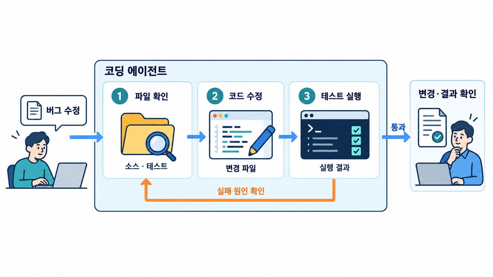

# Module 00 — Foundations (기초)

코딩 에이전트의 동작 원리와 Claude Code / Codex의 특성을 이해합니다.

## 그림으로 시작합니다

먼저 그림에서 사람·문서·도구의 역할과 화살표 방향을 확인합니다. 각 레슨의 “그림 읽는 순서”를 읽은 다음 개념과 따라하기를 진행합니다.

- [에이전트가 파일과 테스트를 다루는 순서](./00-1-how-agents-work.md)에서 그림과 설명을 함께 확인합니다.
- [옆에서 대화하기, 자동 실행하기, 원격에 맡기기](./00-3-execution-modes.md)에서 그림과 설명을 함께 확인합니다.
- [실패 신호를 보고 대응 방법을 고릅니다](./00-4-failure-patterns.md)에서 그림과 설명을 함께 확인합니다.

제안서에 사용할 원본 PNG는 [전체 그림 목록](../../docs/design/illustrations.md)에서 찾습니다.

## 레슨
| # | 제목 | 상태 |
|---|---|---|
| 00-1 | [코딩 에이전트는 어떻게 동작합니까](./00-1-how-agents-work.md) | ✅ 초안 |
| 00-2 | [Claude Code vs Codex: 특성과 역할 분담](./00-2-claude-vs-codex.md) | ✅ 초안 |
| 00-3 | [대화형 / 헤드리스 / 클라우드 실행 모드](./00-3-execution-modes.md) | ✅ 초안 |
| 00-4 | [실패 패턴 카탈로그](./00-4-failure-patterns.md) | ✅ 초안 |

- 레슨별 따라하기·숙제 상세는 [커리큘럼 설계서 §4](../../docs/design/curriculum-design.md#4-모듈-상세-설계)를 참고합니다.
- 레슨 작성 형식: [lesson-template.md](../../docs/design/lesson-template.md)
