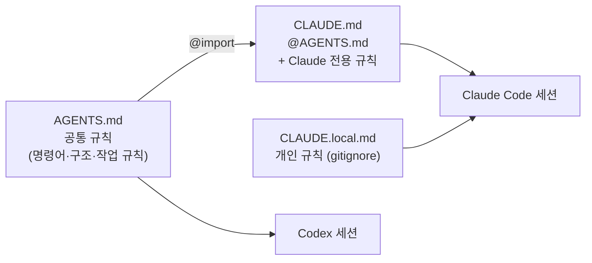

# 01-1. 프로젝트 메모리: CLAUDE.md와 AGENTS.md 작성법

## 🎯 학습 목표
- `CLAUDE.md`와 `AGENTS.md`가 각각 어떤 위치에서, 어떤 순서로 로드되는지 설명할 수 있습니다.
- 두 도구가 함께 쓰는 공통 규칙은 `AGENTS.md`에, Claude Code 전용 규칙은 `CLAUDE.md`에 나누어 작성할 수 있습니다.
- `/memory`, `/context`, 지시 출처 질문으로 메모리 파일이 실제로 로드됐는지 확인할 수 있습니다.
- 메모리 파일 적용 전후로 같은 질문을 던져 에이전트 응답의 차이를 기록할 수 있습니다.

## 📋 사전 준비
- 선행 레슨: [00-1 코딩 에이전트는 어떻게 동작합니까](../00-foundations/00-1-how-agents-work.md), [00-2 Claude Code vs Codex](../00-foundations/00-2-claude-vs-codex.md)
- 필요 도구/계정: Claude Code 2.1.292 이상(`claude --version`), Codex 0.160.1 이상(`codex --version`), 각 도구에 로그인된 계정
- 실습 저장소 상태: Project B(TaskFlow) **B0 시작 시점**. 커밋이 하나 이상 있는 빈 모노레포 뼈대면 충분합니다.

```text
taskflow/
├── apps/
│   ├── api/            # Fastify API
│   └── web/            # Next.js 웹
├── packages/
│   ├── db/             # 스키마, 마이그레이션 (PostgreSQL)
│   └── shared/         # 공용 타입·유틸
├── package.json        # pnpm workspace 루트
├── pnpm-workspace.yaml
├── turbo.json
└── Makefile            # make verify = lint + typecheck + test
```

> 뼈대가 아직 없다면 `pnpm init`, `pnpm-workspace.yaml`, `turbo.json`만 만들고 커밋한 상태로 시작해도 됩니다. 이 레슨의 목적은 코드가 아니라 **메모리 파일**입니다.

## 💡 개념

### 메모리 파일은 "매 세션 처음에 읽는 온보딩 문서"입니다

에이전트는 세션이 끝나면 모든 것을 잊습니다. 어제 설명한 "테스트는 `pnpm test`가 아니라 `make verify`로 돌립니다"라는 규칙도 오늘 새 세션에서는 모릅니다. 메모리 파일은 이 문제를 해결하는 가장 단순한 장치로, 세션이 시작될 때 자동으로 컨텍스트에 들어갑니다.

| 구분 | Claude Code | Codex |
|---|---|---|
| 파일 이름 | `CLAUDE.md` | `AGENTS.md` |
| 전역(사용자) | `~/.claude/CLAUDE.md` | `~/.codex/AGENTS.md` (`AGENTS.override.md`가 있으면 그것을 대신 읽습니다) |
| 프로젝트 | `./CLAUDE.md` 또는 `./.claude/CLAUDE.md` | 프로젝트 루트부터 cwd까지 디렉터리마다 `AGENTS.override.md` → `AGENTS.md` 중 하나 |
| 개인(커밋 안 함) | `./CLAUDE.local.md` | 해당 없음 (전역 override 사용) |
| 하위 디렉터리 | 그 안의 파일을 Read/Write/Edit할 때 로드 | 루트 → cwd 경로에 있는 파일을 시작 시 연결 |
| 다른 파일 가져오기 | `@path/to/file` import (최대 4단계) | 공식 import 문법 없음 |
| 크기 제한 | (auto memory만 200줄/25KB 로드) | 합계 `project_doc_max_bytes`(기본 32 KiB)에서 멈춤 |
| 뼈대 생성 | `/init` | `/init` |

두 도구 모두 파일을 **덮어쓰지 않고 연결(concatenate)** 합니다. 전역 → 프로젝트 → 하위 디렉터리 순으로 쌓이므로, 아래쪽 파일은 위쪽 규칙을 "보충"하는 내용으로 씁니다.

### 두 도구를 같이 쓰는 저장소의 표준 패턴

Claude Code는 v2.1.277부터 `AGENTS.md`를 읽을 수 있지만, cwd와 그 상위에 `CLAUDE.md`, `.claude/CLAUDE.md`, `CLAUDE.local.md`가 **하나도 없을 때만** 읽습니다. 반대로 Codex는 `CLAUDE.md`를 기본으로 읽지 않습니다. 그래서 공식 문서가 권장하는 호환 방식은 다음과 같습니다.



- 공통 규칙의 **원본은 `AGENTS.md` 하나**입니다. 두 도구가 같은 사실을 보게 됩니다.
- `CLAUDE.md`는 첫 줄에 `@AGENTS.md`를 두고, 그 아래에 Plan 모드·서브에이전트 사용법처럼 Claude에게만 의미 있는 지시를 적습니다.
- 이 방식은 Claude Code의 어떤 설정값에서도 `AGENTS.md`를 두 번 읽지 않습니다.

이 가이드 저장소의 루트 `CLAUDE.md`도 정확히 이 구조입니다. 복사해서 시작하려면 [templates/AGENTS.md.template](../../templates/AGENTS.md.template)과 [templates/CLAUDE.md.template](../../templates/CLAUDE.md.template)을 씁니다.

### 왜 대규모 개발에서 중요한가

1. **Context is a Budget.** 메모리 파일은 매 세션 컨텍스트를 고정으로 차지합니다. 32 KiB짜리 `AGENTS.md`는 모든 세션의 시작 예산을 깎습니다. 짧고 정확한 파일이 긴 파일보다 낫습니다.
2. **반복 지시 제거.** 팀원 10명이 하루 5세션씩 "pnpm 쓰십시오, npm 쓰지 마십시오"를 타이핑하면 하루 50번입니다. 메모리 파일에 한 줄로 끝냅니다.
3. **도구 간 일관성.** Claude가 구현하고 Codex가 리뷰하는 교차 검증(설계 원칙 5)은 두 도구가 **같은 규칙**을 알고 있을 때만 의미가 있습니다.
4. **규모에 따른 계층화.** 패키지가 5개를 넘으면 루트 파일 하나에 모든 규칙을 담을 수 없습니다. 하위 디렉터리 파일로 나누는 습관을 B0에서부터 들입니다. 심화는 [05-3 대규모 코드베이스](../05-scaling-up/05-3-large-codebases.md)에서 다룹니다.

### 무엇을 쓰고 무엇을 쓰지 않습니까

| 씁니다 | 쓰지 않습니다 |
|---|---|
| 설치·빌드·테스트 **정확한 명령어** | 린터·포매터가 이미 강제하는 스타일 규칙 |
| 디렉터리 구조와 각 패키지의 책임 | 코드를 읽으면 바로 알 수 있는 내용 |
| 린터로 강제할 수 없는 설계 규칙 (예: "도메인 로직은 `packages/shared`에 두지 않습니다") | "깔끔하게 작성하십시오" 같은 모호한 지시 |
| 작업 절차 규칙 (브랜치, 검증, 멈춰야 할 때) | 비밀번호, 토큰, 내부 URL |
| 하지 말 것 (마이그레이션 수정 금지 등) | 자주 바뀌는 작업 현황 (핸드오프 노트로 분리) |

## 👣 따라하기

### Step 1. 메모리 파일 없이 기준선(baseline)을 기록합니다
메모리 파일의 효과를 나중에 비교할 수 있도록, 아무 파일도 없는 상태에서 같은 질문 세 개를 던지고 답을 기록합니다.

먼저 질문 파일을 만듭니다. 두 도구에 똑같이 씁니다.

```bash
mkdir -p notes
cat > notes/baseline-questions.md <<'EOF'
1. 이 저장소에서 전체 검증(린트·타입체크·테스트)을 한 번에 돌리는 명령은?
2. API 패키지 하나만 테스트하려면 어떤 명령을 씁니까?
3. DB 마이그레이션 파일을 수정해도 됩니까? 근거는?
EOF
```

**Claude Code 레시피**
```bash
cd taskflow
claude -p "notes/baseline-questions.md의 질문 세 개에 각각 한두 줄로 답하십시오. 추측이면 추측이라고 밝히십시오." \
  > notes/baseline-claude.md
```

**Codex 레시피**
```bash
cd taskflow
codex exec "notes/baseline-questions.md의 질문 세 개에 각각 한두 줄로 답하십시오. 추측이면 추측이라고 밝히십시오." \
  > notes/baseline-codex.md
```

> `codex exec`의 기본 샌드박스는 read-only입니다. 이 단계는 읽기만 하므로 그대로 둡니다.

**기대 결과**: `notes/baseline-claude.md`, `notes/baseline-codex.md`가 생깁니다. 대부분 `pnpm test`나 `npm test`처럼 **그럴듯한 추측**을 하고, 3번 질문에는 "규칙을 찾을 수 없습니다"라고 답합니다. 이 추측이 메모리 파일로 없애야 할 대상입니다.

### Step 2. `/init`으로 초안을 만들고 비교합니다
두 도구의 `/init`은 저장소를 훑어보고 메모리 파일 뼈대를 만듭니다. 초안을 그대로 쓰지 않고, 두 초안을 비교해 공통 사실을 뽑아내는 재료로 씁니다.

**Claude Code 레시피**
```bash
claude
> /init
```
Claude가 만든 `CLAUDE.md`를 확인한 뒤, 비교를 위해 이름을 바꿔 둡니다.
```bash
mv CLAUDE.md notes/init-claude.md
```

**Codex 레시피**
```bash
codex
> /init
```
```bash
mv AGENTS.md notes/init-codex.md
```

> Claude의 `/init`은 기존 `CLAUDE.md`가 있으면 덮어쓰지 않고 개선안을 냅니다. 처음부터 다시 만들고 싶으면 파일을 먼저 옮겨 둡니다.

**기대 결과**: 두 초안이 `notes/` 아래에 있습니다. 비교하면 보통 다음 차이가 보입니다.
- 둘 다 `package.json` 스크립트에서 명령어를 뽑지만, 아직 없는 스크립트(`make verify`)는 모릅니다.
- 한쪽은 디렉터리 설명이 길고, 다른 쪽은 명령어 위주입니다.
- 어느 쪽도 "마이그레이션 수정 금지" 같은 **팀의 결정**은 알 수 없습니다. 이것은 사람이 채워야 합니다.

### Step 3. 공통부를 `AGENTS.md`로, 도구별 부분을 `CLAUDE.md`로 나눕니다
두 초안에서 사실만 골라 공통 `AGENTS.md`를 쓰고, `CLAUDE.md`는 import + 전용 규칙만 남깁니다.

**Claude Code 레시피** (Claude에게 정리를 맡기는 경우)
```bash
claude
> notes/init-claude.md와 notes/init-codex.md를 비교해서 루트에 AGENTS.md를 작성하십시오.
> templates 형식: 프로젝트 개요 / 명령어 / 코딩 규칙 / 작업 규칙 / 하지 말 것.
> 규칙:
> - 저장소에 실제로 있는 명령어만 씁니다. 없는 스크립트는 "TODO: B0에서 추가"로 표시합니다.
> - 린터가 강제하는 스타일 규칙은 쓰지 않습니다.
> - 60줄을 넘기지 않습니다.
> 그다음 CLAUDE.md를 만들어 첫 줄에 @AGENTS.md를 두고, "Claude Code 전용" 섹션에
> Plan 모드 사용, 조사 작업의 서브에이전트 위임, 종료 전 make verify 보고 규칙만 적으십시오.
```

**Codex 레시피** (Codex에게 정리를 맡기는 경우)
```bash
codex --sandbox workspace-write
> notes/init-claude.md와 notes/init-codex.md를 비교해서 루트에 AGENTS.md를 작성하십시오.
> 형식: 프로젝트 개요 / 명령어 / 코딩 규칙 / 작업 규칙 / 하지 말 것.
> 저장소에 실제로 있는 명령어만 쓰고, 없는 것은 "TODO: B0에서 추가"로 표시하십시오. 60줄 이내.
> CLAUDE.md는 만들지 마십시오. (Claude 전용 파일은 따로 관리합니다)
```

어느 도구로 만들었든 결과는 아래와 비슷해야 합니다. 사람이 최종 검토하고 고칩니다.

```markdown
<!-- AGENTS.md -->
# AGENTS.md

## 프로젝트 개요
- TaskFlow: 팀 업무 관리 서비스. pnpm + Turborepo 모노레포.
- `apps/api` — Fastify REST API. 도메인 로직과 라우트.
- `apps/web` — Next.js 웹 클라이언트. API는 `packages/shared`의 타입으로만 호출합니다.
- `packages/db` — PostgreSQL 스키마와 마이그레이션.
- `packages/shared` — 공용 타입·유틸. 도메인 로직을 두지 않습니다.

## 명령어
- 설치: `pnpm install` (npm, yarn 사용 금지)
- 전체 검증: `make verify` (lint + typecheck + test). TODO: B0에서 추가
- 패키지 하나만 테스트: `pnpm --filter @taskflow/api test`
- 개발 서버: `pnpm turbo run dev`

## 작업 규칙
- 하나의 작업 = 하나의 브랜치 = 하나의 PR.
- 변경 전 관련 테스트를 먼저 작성하거나 확인합니다.
- `make verify`가 통과하지 않으면 완료로 보고하지 않습니다.
- 명세(`docs/specs/`)와 다르게 구현해야 하면 멈추고 질문합니다.

## 하지 말 것
- 이미 커밋된 `packages/db/migrations/*` 수정 (새 마이그레이션을 추가합니다)
- `.env*` 파일 읽기·커밋, 비밀정보 하드코딩
- 공개 API 응답 형식 무단 변경
```

```markdown
<!-- CLAUDE.md -->
@AGENTS.md

## Claude Code 전용
- 파일 3개 이상을 바꾸는 작업은 Plan 모드로 계획을 먼저 승인받습니다.
- 코드베이스 조사는 서브에이전트에 위임하고 결론만 받습니다.
- 작업 종료 전 `make verify`를 실행하고 결과를 그대로 보고합니다.
```

**기대 결과**: 루트에 `AGENTS.md`(공통)와 `CLAUDE.md`(import + 전용 3줄)가 있습니다. `CLAUDE.md`에 공통 규칙이 **중복으로 적혀 있지 않아야** 합니다. 같은 내용이 두 곳에 있으면 한쪽만 고쳐지는 순간 두 도구가 다른 규칙을 따르게 됩니다.

### Step 4. 하위 디렉터리 규칙과 개인 규칙을 추가합니다
API 패키지에만 해당하는 규칙을 루트에서 분리하고, 커밋하지 않을 개인 규칙을 따로 둡니다.

API 전용 규칙은 두 도구가 모두 읽도록 같은 패턴을 반복합니다.

```bash
mkdir -p apps/api
cat > apps/api/AGENTS.md <<'EOF'
# apps/api 규칙
- 라우트는 `src/routes/<resource>.ts`, 비즈니스 로직은 `src/services/`에 둡니다.
- 입력 검증은 Fastify 스키마로 합니다. 핸들러 안에서 수동 검증하지 않습니다.
- 새 엔드포인트는 통합 테스트(`test/routes/*.test.ts`)를 함께 추가합니다.
EOF
printf '@AGENTS.md\n' > apps/api/CLAUDE.md
```

> Claude Code는 하위 디렉터리의 `CLAUDE.md`를 **그 디렉터리의 파일을 읽거나 고칠 때** 로드합니다. 루트에 `CLAUDE.md`가 있으면 Claude는 `CLAUDE.md` 계열만 읽으므로, 하위 디렉터리에도 `@AGENTS.md` 한 줄짜리 `CLAUDE.md`를 둡니다.

**Claude Code 레시피** (경로별 규칙과 개인 규칙)

경로 glob으로 적용 범위를 정하는 규칙은 `.claude/rules/`에 둘 수도 있습니다. 테스트 파일 규칙처럼 여러 디렉터리에 흩어진 파일에 적합합니다.

```bash
mkdir -p .claude/rules
cat > .claude/rules/tests.md <<'EOF'
---
paths:
  - "**/*.test.ts"
---
- 테스트 이름은 "무엇을 하면 무엇이 됩니다" 형식의 한국어 문장으로 씁니다.
- 실제 DB가 필요한 테스트는 `describe.skipIf(!process.env.DATABASE_URL)`로 감쌉니다.
EOF

cat > CLAUDE.local.md <<'EOF'
- 답변은 짧게. 변경 요약은 bullet 3개 이내.
- 로컬 DB 포트는 5433을 씁니다.
EOF
echo "CLAUDE.local.md" >> .gitignore
```

**Codex 레시피** (경로별 규칙과 개인 규칙)

Codex에는 glob 기반 규칙 파일이 없습니다. 테스트 규칙처럼 여러 곳에 해당하는 내용은 루트 `AGENTS.md`의 짧은 섹션으로 두거나, 테스트가 모인 디렉터리에 `AGENTS.md`를 둡니다. 개인 규칙은 전역 파일에 씁니다.

```bash
cat >> ~/.codex/AGENTS.md <<'EOF'
- 답변은 짧게. 변경 요약은 bullet 3개 이내.
EOF
```

> `~/.codex/AGENTS.md`는 **모든 저장소**에 적용됩니다. 특정 프로젝트에만 해당하는 개인 설정(로컬 DB 포트 등)은 여기에 쓰지 말고 저장소의 `.env.local` 같은 곳에 둡니다.

**기대 결과**: `apps/api/AGENTS.md`, `apps/api/CLAUDE.md`, `.claude/rules/tests.md`, `CLAUDE.local.md`가 생기고, `git status`에서 `CLAUDE.local.md`는 보이지 않습니다.

### Step 5. 로드 여부를 확인하고 기준선과 비교합니다
메모리 파일을 "썼습니다"와 "에이전트가 읽었습니다"는 다릅니다. 실제 로드 여부를 확인한 뒤 Step 1의 질문을 다시 던집니다.

**Claude Code 레시피**
```bash
claude
> /memory
```
`/memory`는 로드된 메모리 파일 목록을 보여줍니다. 루트 `CLAUDE.md`, 그 안에서 import한 `AGENTS.md`, `CLAUDE.local.md`가 보여야 합니다. 컨텍스트에서 차지하는 비중은 `/context`의 **Memory files** 항목에서 확인합니다.

```bash
> /context
```

하위 디렉터리 규칙이 지연 로드되는지도 확인합니다.
```bash
> apps/api/src/routes 아래 파일 구조를 읽고, 새 엔드포인트를 추가할 때 지켜야 할 규칙을 말해 주십시오.
> /memory
```

**Codex 레시피**

Codex는 시작할 때 한 번 지시 체인을 구성합니다. 문서가 제시하는 방법대로 출처를 직접 물어봅니다.

```bash
codex "List the instruction sources you loaded."
```
하위 디렉터리 규칙은 그 디렉터리에서 시작해야 체인에 들어갑니다.
```bash
codex --cd apps/api "List the instruction sources you loaded."
```

이제 기준선 질문을 다시 던집니다.

```bash
claude -p "notes/baseline-questions.md의 질문 세 개에 각각 한두 줄로 답하십시오. 근거 파일을 밝히십시오." > notes/after-claude.md
codex exec "notes/baseline-questions.md의 질문 세 개에 각각 한두 줄로 답하십시오. 근거 파일을 밝히십시오." > notes/after-codex.md
diff notes/baseline-claude.md notes/after-claude.md
diff notes/baseline-codex.md notes/after-codex.md
```

**기대 결과**
- Claude `/memory`에 `CLAUDE.md`, `AGENTS.md`(import), `CLAUDE.local.md`가 보입니다. API 파일을 읽은 뒤에는 `apps/api/CLAUDE.md`도 나타납니다.
- Codex는 루트에서 시작하면 `~/.codex/AGENTS.md`와 루트 `AGENTS.md`를, `--cd apps/api`로 시작하면 `apps/api/AGENTS.md`까지 나열합니다.
- 비교 결과: 1번은 `make verify`, 2번은 `pnpm --filter @taskflow/api test`, 3번은 "수정 금지, 새 마이그레이션 추가"로 답하고 근거로 `AGENTS.md`를 듭니다.

마지막으로 커밋합니다.
```bash
git add AGENTS.md CLAUDE.md apps/api/AGENTS.md apps/api/CLAUDE.md .claude/rules .gitignore
git commit -m "chore: add project memory files (AGENTS.md + CLAUDE.md)"
```

## ✅ 체크포인트
- [ ] 루트 `AGENTS.md`에 실제로 동작하는 설치·검증·단일 테스트 명령이 있습니다.
- [ ] 루트 `CLAUDE.md`가 `@AGENTS.md`로 시작하고, 공통 규칙을 중복해서 적지 않았습니다.
- [ ] `apps/api/`에 `AGENTS.md`와 `@AGENTS.md` 한 줄짜리 `CLAUDE.md`가 있습니다.
- [ ] `CLAUDE.local.md`가 `.gitignore`에 있고 커밋되지 않았습니다.
- [ ] Claude `/memory`와 Codex 지시 출처 질문으로 로드를 확인했습니다.
- [ ] 기준선(`notes/baseline-*.md`)과 적용 후(`notes/after-*.md`) 답변 차이를 기록했습니다.

## 🏠 숙제
| # | 유형 | 난이도 | 과제 | 완료 조건 |
|---|---|---|---|---|
| HW1 | 🔁 Reproduce | ★ | 따라하기 Step 1~5를 본인 TaskFlow 저장소에서 재현합니다 | `AGENTS.md`, `CLAUDE.md`, `apps/api/` 하위 파일이 커밋되어 있고, `/memory` 출력과 Codex 지시 출처 응답을 캡처해 제출 문서에 첨부했습니다 |
| HW2 | 🛠 Apply | ★★ | 본인이 실제로 일하는 기존 프로젝트(또는 오픈소스 저장소)에 메모리 파일을 작성하고 전/후 결과를 비교합니다 | 같은 질문 5개 이상을 전/후로 두 도구에 던진 결과표(질문, 전 답변, 후 답변, 정답 여부)가 있고, 정답률 변화와 `/context`의 Memory files 크기를 기록했습니다 |
| HW3 | 🚀 Challenge | ★★★ | 메모리 파일 "다이어트": 규칙을 하나씩 지워 가며 응답이 나빠지는 규칙만 남깁니다 | 처음 버전과 최종 버전의 줄 수, 각 규칙을 지웠을 때의 응답 변화 기록, 남긴 규칙과 지운 규칙의 근거가 표로 정리되어 있습니다 |

제출: `hw/01-1` 브랜치, `submissions/01-1.md` (템플릿: [docs/design/homework-template.md](../../docs/design/homework-template.md))

## ⚠️ 흔한 실수
- **Claude가 `AGENTS.md` 규칙을 모릅니다** → 루트에 `CLAUDE.md`(또는 `CLAUDE.local.md`)가 있으면 Claude는 `AGENTS.md`를 직접 읽지 않습니다 → `CLAUDE.md` 첫 줄에 `@AGENTS.md`를 넣습니다. `/memory`에서 `AGENTS.md`가 보이는지 확인합니다.
- **두 도구가 서로 다른 명령을 씁니다** → 같은 규칙을 `CLAUDE.md`와 `AGENTS.md`에 따로 적었고 한쪽만 고쳤습니다 → 공통 규칙의 원본을 `AGENTS.md` 하나로 줄이고 `CLAUDE.md`에는 전용 규칙만 남깁니다.
- **`/init` 초안을 그대로 커밋했습니다** → 초안에 존재하지 않는 스크립트나 일반론("코드를 깔끔하게")이 섞여 있습니다 → 명령어는 직접 실행해 확인하고, 동작하지 않거나 모호한 문장은 지웁니다. 아직 없는 명령은 `TODO`로 표시합니다.
- **메모리 파일이 점점 비대해집니다** → 작업 현황, 회의록, 긴 설계 설명까지 넣었습니다 → 메모리 파일에는 "매 세션 필요한 규칙"만 둡니다. 작업 현황은 핸드오프 노트([templates/handoff-note.md](../../templates/handoff-note.md)), 설계는 `docs/`로 옮기고 필요할 때 경로만 알려줍니다.
- **Codex가 하위 디렉터리 규칙을 무시합니다** → Codex는 시작 시점의 cwd 기준으로 루트부터 cwd까지만 체인을 만듭니다 → 패키지 작업은 `codex --cd apps/api`처럼 그 디렉터리에서 시작하거나, 꼭 필요한 규칙은 루트 `AGENTS.md`에 짧게 둡니다.

## 🔗 참고 자료
- 공식 문서
  - [Claude Code memory (CLAUDE.md, @import, AGENTS.md 읽기 조건)](https://code.claude.com/docs/en/memory)
  - [Claude Code commands (`/init`, `/memory`, `/context`)](https://code.claude.com/docs/en/commands)
  - [Codex AGENTS.md](https://learn.chatgpt.com/docs/agent-configuration/agents-md)
  - [Codex config-advanced (`project_doc_max_bytes`, `project_doc_fallback_filenames`)](https://learn.chatgpt.com/docs/config-file/config-advanced)
  - [Codex slash commands (`/init`)](https://learn.chatgpt.com/docs/developer-commands?surface=cli)
- 이 저장소
  - [도구 레퍼런스 §3 프로젝트 메모리](../../docs/reference/tool-reference.md)
  - [templates/AGENTS.md.template](../../templates/AGENTS.md.template), [templates/CLAUDE.md.template](../../templates/CLAUDE.md.template)
  - 다음 레슨: [01-2 권한·샌드박스·승인 모드](./01-2-permissions-and-sandbox.md)
  - 관련 레슨: [03-4 컨텍스트 관리](../03-agentic-workflow/03-4-context-management.md), [05-3 대규모 코드베이스](../05-scaling-up/05-3-large-codebases.md), [06-4 지식 축적](../06-team-and-operations/06-4-knowledge-loop.md)
