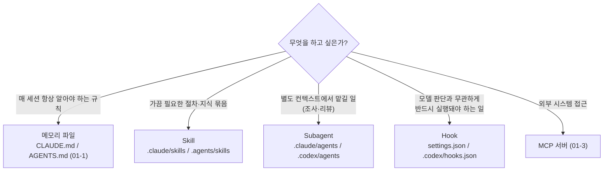

# 01-4. 확장 기능: Skills(구 슬래시 커맨드), Subagents, Hooks

## 🎯 학습 목표
- 메모리 파일·Skill·Subagent·Hook·MCP 중 어떤 상황에 무엇을 써야 하는지 판단 기준을 설명할 수 있습니다.
- 반복 작업을 `SKILL.md`로 패키징해 Claude Code(`/이름`)와 Codex(`$이름`)에서 호출할 수 있습니다.
- 파일 편집 직후 포매터를 실행하는 `PostToolUse` hook을 두 도구에 구성하고, Codex의 hook 신뢰 절차를 마칠 수 있습니다.
- 읽기 전용 리뷰 subagent를 정의하고 명시적으로 호출할 수 있습니다.

## 📋 사전 준비
- 선행 레슨: [01-1 프로젝트 메모리](./01-1-project-memory.md), [01-2 권한·샌드박스·승인 모드](./01-2-permissions-and-sandbox.md)
- 필요 도구/계정: Claude Code 2.1.292 이상, Codex 0.160.1 이상, `jq`
- 실습 저장소 상태: TaskFlow 저장소에 01-2의 `.claude/settings.json`, `.codex/config.toml`이 있습니다. 포매터로 Prettier를 씁니다.

```bash
cd taskflow
pnpm add -Dw prettier
echo '{ "singleQuote": true, "semi": true }' > .prettierrc
```

## 💡 개념

### "커스텀 슬래시 커맨드"는 이제 Skill입니다

두 도구 모두 자주 쓰는 프롬프트를 재사용하는 방식이 `SKILL.md` 기반 Skill로 통합됐습니다.

| 예전 방식 | 현재 상태 | 새로 만들 때 |
|---|---|---|
| Claude `.claude/commands/<name>.md` → `/name` | 계속 동작하지만 skills로 통합됨. 같은 이름의 skill이 있으면 skill이 우선 | `.claude/skills/<name>/SKILL.md` |
| Codex `~/.codex/prompts/<name>.md` → `/prompts:<name>` | **deprecated**, 저장소로 공유 불가 | `.agents/skills/<name>/SKILL.md` |

Skill은 단순 프롬프트보다 낫습니다. 폴더 안에 참고 문서·스크립트를 함께 둘 수 있고, `description`이 작업과 맞으면 에이전트가 **스스로** 불러 씁니다(자동 호출). 명시적으로 부를 때는 Claude는 `/skill-name`, Codex는 `$skill-name`을 씁니다.

### 다섯 가지 확장 수단의 역할 분담



| 수단 | 실행 주체 | 컨텍스트 비용 | 대표 용도 (TaskFlow) |
|---|---|---|---|
| 메모리 파일 | 항상 로드 | 매 세션 고정 비용 | 명령어, 금지 사항 |
| Skill | 필요할 때 로드 (모델 판단 또는 사용자 호출) | 호출 시에만 | `verify`: 검증 실행·실패 요약 절차 |
| Subagent | 별도 컨텍스트의 에이전트 | 메인 컨텍스트에는 결과만 | `api-reviewer`: 읽기 전용 리뷰 |
| Hook | 하네스가 **결정적으로** 실행 (모델이 아님) | 출력만 | 편집 후 Prettier, 세션 시작 시 의존성 확인(01-5) |
| MCP | 외부 서버 | 도구 설명 + 결과 | GitHub, DB |

핵심 구분은 **"모델에게 부탁합니까, 하네스가 강제합니까"**입니다. 메모리 파일에 "편집 후 Prettier를 실행하십시오"라고 써도 모델은 가끔 잊습니다. Hook은 잊지 않습니다.

### 두 도구의 파일 위치 비교

| 항목 | Claude Code | Codex |
|---|---|---|
| Skill (프로젝트) | `.claude/skills/<name>/SKILL.md` | `.agents/skills/<name>/SKILL.md` (cwd부터 저장소 루트까지 탐색) |
| Skill (개인) | `~/.claude/skills/<name>/SKILL.md` | `$HOME/.agents/skills/<name>/SKILL.md` |
| Skill 목록 | `/skills` | `/skills` |
| Subagent | `.claude/agents/<name>.md` (Markdown + front matter) | `.codex/agents/<name>.toml` |
| Hook 설정 | `.claude/settings.json`의 `hooks` | `<repo>/.codex/hooks.json` |
| Hook 확인 | `/hooks` (읽기 전용 보기) | `/hooks` (검토·**신뢰**·비활성화) |

### 왜 대규모 개발에서 중요한가

1. **팀의 암묵지를 실행 가능한 형태로 만듭니다.** "PR 올리기 전에 이렇게 확인합니다"라는 위키 문서는 읽히지 않습니다. Skill로 만들면 에이전트가 그 절차를 그대로 따릅니다([06-4 지식 축적](../06-team-and-operations/06-4-knowledge-loop.md)).
2. **메인 컨텍스트를 지킵니다.** 저장소 전체를 훑는 조사나 리뷰를 subagent에 맡기면 메인 세션에는 결론만 남습니다(Context is a Budget).
3. **품질 하한선을 자동화합니다.** 포맷·린트·보호 경로 검사를 hook으로 강제하면, 에이전트 10개가 병렬로 일해도 같은 기준이 적용됩니다.
4. **두 도구 간 이식성.** `SKILL.md`는 `name`·`description` front matter를 공통으로 쓰므로, 같은 skill을 두 도구에 거의 그대로 둘 수 있습니다.

## 👣 따라하기

### Step 1. 반복 작업을 Skill로 만듭니다 (`verify`)
매번 타이핑하던 "검증을 돌리고, 실패하면 원인별로 요약하십시오"라는 프롬프트를 skill로 만듭니다. 예전에는 커스텀 슬래시 커맨드로 만들던 것입니다.

**Claude Code 레시피**
```bash
mkdir -p .claude/skills/verify
cat > .claude/skills/verify/SKILL.md <<'EOF'
---
name: verify
description: Run TaskFlow's full verification (lint, typecheck, test) and summarize failures by root cause. Use before reporting a task as done or when the user asks to verify.
allowed-tools: Bash(make verify) Bash(pnpm --filter *)
---
TaskFlow 전체 검증을 실행하고 결과를 보고합니다. 대상 패키지(선택): $ARGUMENTS

1. 인수가 없으면 `make verify`, 패키지 이름이 있으면 `pnpm --filter @taskflow/$ARGUMENTS test`를 실행합니다.
2. 실패가 있으면 다음 표로 요약합니다: | 단계(lint/typecheck/test) | 파일:줄 | 원인 한 줄 | 제안 |
3. 같은 원인에서 나온 실패는 한 줄로 묶습니다.
4. 고치지 말고 보고만 합니다. 수정은 사용자가 요청할 때 합니다.
5. 마지막 줄에 `VERIFY: PASS` 또는 `VERIFY: FAIL (<n>건)`을 씁니다.
EOF
```
- `allowed-tools`는 Claude 전용 키로, 이 skill이 실행되는 동안 해당 명령을 묻지 않고 허용합니다.
- 사용자만 호출하게 하려면 `disable-model-invocation: true`를 추가합니다. 여기서는 Claude가 "완료 보고 전"에 스스로 부르도록 자동 호출을 열어 둡니다.

호출:
```bash
claude
> /verify
> /verify api
```

**Codex 레시피**

같은 내용을 Codex 위치에 둡니다. Claude 전용 키(`allowed-tools`)는 뺍니다.
```bash
mkdir -p .agents/skills/verify
sed '/^allowed-tools:/d' .claude/skills/verify/SKILL.md > .agents/skills/verify/SKILL.md
```
호출:
```bash
codex
> /skills
> $verify
> $verify api 패키지만
```
> Codex에는 `$ARGUMENTS` 치환이 문서화되어 있지 않습니다. 멘션 뒤에 자연어로 대상을 적으면 skill 본문의 지시와 함께 해석합니다. TODO(verify): Codex skill의 인수 치환 지원 여부.

> 직접 쓰기 번거로우면 Codex의 생성 도우미 `$skill-creator`에게 "verify skill을 만들어 주십시오"라고 요청해 초안을 받을 수 있습니다.

**기대 결과**: Claude는 `/skills` 목록과 `/` 자동 완성에 `verify`가 보이고, Codex는 `/skills` 목록에 보입니다. 두 도구 모두 검증을 실행하고 마지막 줄에 `VERIFY: PASS/FAIL`을 출력합니다. 아직 `make verify`가 없다면 "명령 없음"으로 FAIL이 나는 것이 정상이며, B0에서 검증 명령을 만든 뒤 다시 돌립니다.

> 두 위치의 skill은 내용이 같아야 합니다. 한쪽만 고치는 실수를 막는 방법은 HW3에서 다룹니다.

### Step 2. 편집 직후 포매터를 실행하는 Hook을 만듭니다
"포맷을 맞추십시오"라는 지시를 모델에게 맡기지 않고 하네스가 강제하게 합니다. 두 도구가 같은 스크립트를 쓰도록 `scripts/agent-hooks/`에 둡니다.

공용 스크립트(도구 독립):
```bash
mkdir -p scripts/agent-hooks
cat > scripts/agent-hooks/format.sh <<'EOF'
#!/usr/bin/env bash
# 편집된 파일을 Prettier로 정리합니다.
# Claude Code: stdin JSON의 tool_input.file_path를 씁니다.
# 그 밖의 경우(Codex 등): git 기준으로 변경·추가된 파일 전체를 정리합니다.
set -euo pipefail
cd "$(git rev-parse --show-toplevel)"

input="$(cat || true)"
file="$(printf '%s' "$input" | jq -r '.tool_input.file_path // empty' 2>/dev/null || true)"

if [ -n "$file" ]; then
  files="$file"
else
  files="$( { git diff --name-only --diff-filter=ACMR HEAD; git ls-files --others --exclude-standard; } | sort -u )"
fi

targets="$(printf '%s\n' "$files" | grep -E '\.(ts|tsx|js|json|md|css)$' || true)"
[ -z "$targets" ] && exit 0
printf '%s\n' "$targets" | xargs pnpm exec prettier --write --log-level warn
EOF
chmod +x scripts/agent-hooks/format.sh
```

**Claude Code 레시피**

`.claude/settings.json`에 `hooks` 키를 병합합니다(01-2의 `permissions`는 그대로 둡니다).
```json
{
  "hooks": {
    "PostToolUse": [
      {
        "matcher": "Write|Edit",
        "hooks": [
          { "type": "command", "command": "${CLAUDE_PROJECT_DIR}/scripts/agent-hooks/format.sh" }
        ]
      }
    ]
  }
}
```
- `PostToolUse`는 도구가 **성공한 뒤** 실행됩니다. 입력 JSON의 `tool_input`에 Edit/Write 대상 `file_path`가 들어 있습니다.
- `PostToolUse`에서 exit code 2를 반환해도 이미 실행된 편집은 되돌려지지 않습니다. stderr가 Claude에게 피드백으로 전달될 뿐입니다. 막아야 하는 검사는 `PreToolUse`에 둡니다.

확인:
```bash
claude
> /hooks
```

**Codex 레시피**

`.codex/hooks.json`을 만듭니다. Codex에서 파일 편집 도구는 `apply_patch`이고, matcher에서 `apply_patch`, `Edit`, `Write` 모두 같은 도구를 가리킵니다. 문서 원문처럼 `git rev-parse`로 저장소 루트를 찾아 경로를 고정합니다.
```bash
cat > .codex/hooks.json <<'EOF'
{
  "hooks": {
    "PostToolUse": [
      {
        "matcher": "apply_patch|Edit|Write",
        "hooks": [
          {
            "type": "command",
            "command": "/bin/bash \"$(git rev-parse --show-toplevel)/scripts/agent-hooks/format.sh\"",
            "statusMessage": "Formatting changed files"
          }
        ]
      }
    ]
  }
}
EOF
```
**반드시 신뢰 절차를 거칩니다.** 관리형이 아닌 hook은 `/hooks`에서 검토·신뢰해야 실행됩니다(파일 해시 기준이므로 hook을 고치면 다시 신뢰해야 합니다).
```bash
codex
> /hooks
```
목록에서 새 hook을 검토하고 신뢰(trust)합니다.

> 이 파일은 사람이 직접 만듭니다. Codex `workspace-write` 샌드박스는 `.codex`, `.agents`, `.git`을 읽기 전용으로 보호하므로, Codex에게 "hooks.json을 만들어 주십시오"라고 하면 승인 요청이 뜨거나 실패합니다. `.agents/skills/`를 Codex에게 만들게 할 때도 같습니다.

**기대 결과**: 두 도구에서 따옴표 스타일이 틀린 코드를 쓰게 해 봅니다.
```bash
claude -p 'apps/api/src/hello.ts 파일을 만들고 내용은 정확히 다음 한 줄로 작성하십시오: export const hello = "world"'
cat apps/api/src/hello.ts     # export const hello = 'world'; 로 바뀌어 있어야 합니다
```
```bash
codex exec --sandbox workspace-write 'Create apps/api/src/hello2.ts with exactly: export const hello2 = "world"'
cat apps/api/src/hello2.ts    # 신뢰를 마쳤다면 작은따옴표로 바뀌어 있습니다
```
Codex 쪽이 바뀌지 않았다면 대부분 신뢰 절차를 빠뜨린 것입니다. 확인 후 실험 파일은 지웁니다.

### Step 3. 읽기 전용 리뷰 Subagent를 정의합니다
API 변경을 리뷰하는 일을 별도 컨텍스트에 맡깁니다. 리뷰어는 코드를 고치지 못해야 합니다.

**Claude Code 레시피**
```bash
mkdir -p .claude/agents
cat > .claude/agents/api-reviewer.md <<'EOF'
---
name: api-reviewer
description: Reviews changes under apps/api for TaskFlow rules (route/service split, Fastify schema validation, integration tests). Use after API code is modified.
tools: Read, Grep, Glob
model: sonnet
---
에이전트는 TaskFlow API 리뷰어입니다. 코드를 수정하지 않습니다.

검토 기준 (apps/api/AGENTS.md):
1. 라우트(`src/routes/`)에 비즈니스 로직이 들어가 있지 않은가
2. 입력 검증을 Fastify 스키마로 했습니까
3. 새 엔드포인트에 `test/routes/*.test.ts` 통합 테스트가 있습니까

출력: | 심각도(높음/중간/낮음) | 파일:줄 | 문제 | 제안 | 표와, 마지막 줄에 `REVIEW: APPROVE` 또는 `REVIEW: CHANGES_REQUESTED`.
EOF
```
- `tools`에 `Read, Grep, Glob`만 주면 편집·셸 실행을 할 수 없습니다.
- `.claude/agents/`를 **처음 만든** 경우에는 세션을 재시작해야 로드됩니다. 이후 파일 추가·수정은 재시작 없이 반영됩니다.
- `/agents`는 v2.1.198부터 마법사를 열지 않고 안내 문구만 출력합니다. 파일을 직접 쓰거나 Claude에게 만들어 달라고 합니다.

호출(자연어, @-멘션, 세션 전체):
```bash
claude
> api-reviewer subagent로 apps/api의 현재 변경을 리뷰해 주십시오.
> @agent-api-reviewer apps/api/src/hello.ts 리뷰해 주십시오
```

**Codex 레시피**
```bash
mkdir -p .codex/agents
cat > .codex/agents/api-reviewer.toml <<'EOF'
name = "api_reviewer"
description = "Reviews changes under apps/api for TaskFlow rules. Read-only."
sandbox_mode = "read-only"
developer_instructions = """
에이전트는 TaskFlow API 리뷰어입니다. 코드를 수정하지 않습니다.
검토 기준은 apps/api/AGENTS.md를 따릅니다:
1. 라우트에 비즈니스 로직이 없습니까 2. Fastify 스키마로 입력을 검증했습니까 3. 통합 테스트가 있습니까
출력: | 심각도 | 파일:줄 | 문제 | 제안 | 표와, 마지막 줄에 REVIEW: APPROVE 또는 REVIEW: CHANGES_REQUESTED.
"""
EOF
```
Codex는 custom agent를 **명시적으로 요청할 때** 띄웁니다. 이름을 부릅니다.
```bash
codex
> Have api_reviewer review the current changes under apps/api.
```

**기대 결과**: 두 도구 모두 리뷰어가 별도 컨텍스트에서 실행되고, 메인 세션에는 리뷰 표와 `REVIEW: ...` 줄만 돌아옵니다. 리뷰어에게 "이 문제를 직접 고치십시오"라고 시켜 보면 Claude 쪽은 편집 도구가 없어서, Codex 쪽은 `read-only` 샌드박스 때문에 수정하지 못해야 합니다.

### Step 4. 확장 구성을 점검하고 커밋합니다
만든 확장이 팀원·클라우드 세션에서도 똑같이 동작하도록 저장소에 커밋하고, 무엇이 로드됐는지 확인합니다.

**Claude Code 레시피**
```bash
claude
> /skills
> /hooks
> 지금 이 세션에서 사용 가능한 프로젝트 subagent와 skill을 나열해 주십시오.
```
skill을 세션 중에 추가했는데 안 보이면 `/reload-skills`로 다시 읽습니다. 클라우드 세션과 routine은 `~/.claude/skills/`를 읽지 않으므로, 팀이 쓸 skill은 반드시 `.claude/skills/`에 커밋합니다.

**Codex 레시피**
```bash
codex
> /skills
> /hooks
> List the project skills and custom agents available in this session.
```

커밋:
```bash
git add .claude/skills .agents/skills .claude/agents .codex/agents .codex/hooks.json \
        .claude/settings.json scripts/agent-hooks .prettierrc package.json pnpm-lock.yaml
git commit -m "chore: add verify skill, format hook, api-reviewer subagent"
```

**기대 결과**: 저장소 구조가 다음과 같습니다.
```text
.agents/skills/verify/SKILL.md      # Codex skill
.claude/skills/verify/SKILL.md      # Claude skill
.claude/agents/api-reviewer.md      # Claude subagent
.codex/agents/api-reviewer.toml     # Codex subagent
.claude/settings.json               # permissions + hooks
.codex/hooks.json                   # Codex hooks (팀원마다 /hooks 신뢰 필요)
scripts/agent-hooks/format.sh       # 공용 hook 스크립트
```
팀원이 클론한 뒤 Codex에서 `/hooks` 신뢰를 한 번 해야 한다는 점을 `AGENTS.md`나 온보딩 문서([01-5](./01-5-reproducible-environment.md))에 적습니다.

## ✅ 체크포인트
- [ ] `verify` skill이 Claude `/verify`, Codex `$verify`로 호출되고 마지막 줄에 `VERIFY: ...`를 출력합니다.
- [ ] Claude와 Codex 모두에서 편집 직후 Prettier가 실행되는 것을 확인했습니다.
- [ ] Codex `/hooks`에서 hook을 신뢰했고, hook을 수정하면 다시 신뢰해야 한다는 것을 압니다.
- [ ] `api-reviewer`가 두 도구에서 읽기 전용으로 동작합니다(수정 요청이 실패합니다).
- [ ] 모든 확장 파일이 저장소에 커밋되어 있고 개인 경로(`~/.claude/skills` 등)에 의존하지 않습니다.

## 🏠 숙제
| # | 유형 | 난이도 | 과제 | 완료 조건 |
|---|---|---|---|---|
| HW1 | 🔁 Reproduce | ★ | `verify` skill(구 커스텀 커맨드)과 포맷팅 hook을 두 도구에 만듭니다 | 두 도구에서 skill 호출 결과(`VERIFY:` 줄 포함)와, 큰따옴표 코드가 hook으로 자동 정리된 전/후 `cat` 출력이 제출 문서에 있습니다. Codex `/hooks` 신뢰 화면 캡처 포함 |
| HW2 | 🛠 Apply | ★★ | 본인 반복 작업 1개(예: 마이그레이션 추가, 릴리스 노트, API 엔드포인트 스캐폴딩)를 Skill로 패키징합니다 | `SKILL.md` + 보조 파일(템플릿 또는 스크립트) 1개 이상이 있고, 두 도구에서 명시 호출과 자동 호출(설명만으로 불려 오는 경우)을 각각 1회 이상 시험한 기록과 `description` 수정 이력이 있습니다 |
| HW3 | 🚀 Challenge | ★★★ | 보호 hook + skill 동기화 자동화 | ① `PreToolUse` hook으로 `packages/db/migrations/` 기존 파일 수정을 exit code 2로 차단하고(Claude는 `tool_input.file_path` 사용, Codex `apply_patch` 입력 형식은 직접 확인해 기록) ② `.claude/skills`와 `.agents/skills`의 내용 불일치를 검출하는 스크립트를 CI 또는 hook에 연결했습니다. 차단 로그와 불일치 검출 로그를 첨부합니다 |

제출: `hw/01-4` 브랜치, `submissions/01-4.md` (템플릿: [docs/design/homework-template.md](../../docs/design/homework-template.md))

## ⚠️ 흔한 실수
- **Codex hook이 전혀 실행되지 않습니다** → `/hooks`에서 신뢰하지 않았거나, hook 파일을 수정해 해시가 바뀌었습니다 → `/hooks`에서 다시 검토·신뢰합니다. 자동화 환경에서만 `--dangerously-bypass-hook-trust`를 검토 후 씁니다.
- **예전 강좌대로 `~/.codex/prompts/`에 명령을 만들었는데 팀원에게 없습니다** → custom prompts는 deprecated이고 개인 경로라 저장소로 공유되지 않습니다 → `.agents/skills/<name>/SKILL.md`로 옮겨 커밋합니다. Claude의 `.claude/commands/`도 새 작업은 `.claude/skills/`로 만듭니다.
- **Codex에게 `.codex/hooks.json`이나 `.agents/skills/`를 만들라고 했더니 실패합니다** → `workspace-write`에서도 `.codex`, `.agents`, `.git`은 읽기 전용으로 보호됩니다 → 이 파일들은 사람이 만들거나, 승인 요청을 검토한 뒤 허용합니다.
- **새 subagent가 Claude에 안 보입니다** → `.claude/agents/` 디렉터리를 세션 도중 처음 만들었습니다 → 세션을 재시작합니다. skill 디렉터리를 처음 만든 경우는 `/reload-skills`로 다시 읽습니다.
- **포맷 hook 때문에 편집이 느려집니다** → 매 편집마다 저장소 전체를 포맷합니다 → Claude는 `tool_input.file_path`로 해당 파일만 처리하고, 변경 파일 목록 방식은 확장자 필터로 범위를 좁힙니다.

## 🔗 참고 자료
- 공식 문서
  - [Claude Code skills (커스텀 커맨드 통합, front matter)](https://code.claude.com/docs/en/skills)
  - [Claude Code sub-agents](https://code.claude.com/docs/en/sub-agents)
  - [Claude Code hooks (이벤트, 입력 JSON, exit code)](https://code.claude.com/docs/en/hooks)
  - [Claude Code commands (`/skills`, `/hooks`, `/agents`, `/reload-skills`)](https://code.claude.com/docs/en/commands)
  - [Codex skills](https://learn.chatgpt.com/docs/build-skills), [Codex custom prompts (deprecated)](https://learn.chatgpt.com/docs/custom-prompts)
  - [Codex subagents](https://learn.chatgpt.com/docs/agent-configuration/subagents)
  - [Codex hooks (신뢰 절차)](https://learn.chatgpt.com/docs/hooks)
- 이 저장소
  - [도구 레퍼런스 §7 확장 기능](../../docs/reference/tool-reference.md)
  - 이전 레슨: [01-3 MCP 서버 연결](./01-3-mcp-servers.md) · 다음 레슨: [01-5 재현 가능한 개발 환경](./01-5-reproducible-environment.md)
  - 관련 레슨: [04-1 검증 계층](../04-quality-and-verification/04-1-verification-layers.md), [05-2 오케스트레이션](../05-scaling-up/05-2-orchestration.md), [06-4 지식 축적](../06-team-and-operations/06-4-knowledge-loop.md)
