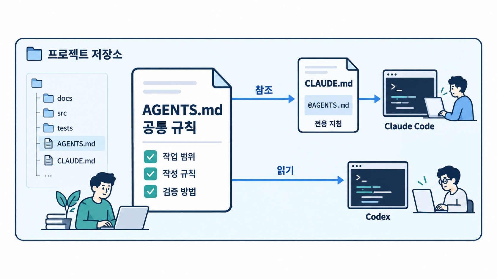

# Module 01 — Environment Setup (환경 구성)

에이전트가 프로젝트를 이해하고 안전하게 일할 수 있는 환경을 만듭니다.

## 그림으로 시작합니다

먼저 그림에서 사람·문서·도구의 역할과 화살표 방향을 확인합니다. 각 레슨의 “그림 읽는 순서”를 읽은 다음 개념과 따라하기를 진행합니다.

- [공통 규칙을 한곳에 두고 두 도구에 연결합니다](./01-1-project-memory.md)에서 그림과 설명을 함께 확인합니다.
- [작업 공간과 실행 권한을 따로 확인합니다](./01-2-permissions-and-sandbox.md)에서 그림과 설명을 함께 확인합니다.
- [MCP는 외부 도구를 연결하는 통로입니다](./01-3-mcp-servers.md)에서 그림과 설명을 함께 확인합니다.

제안서에 사용할 원본 PNG는 [전체 그림 목록](../../docs/design/illustrations.md)에서 찾습니다.

## 레슨
| # | 제목 | 상태 |
|---|---|---|
| 01-1 | [프로젝트 메모리: CLAUDE.md와 AGENTS.md](./01-1-project-memory.md) | ✅ 초안 |
| 01-2 | [권한·샌드박스·승인 모드](./01-2-permissions-and-sandbox.md) | ✅ 초안 |
| 01-3 | [MCP 서버 연결](./01-3-mcp-servers.md) | ✅ 초안 |
| 01-4 | [확장 기능: Skills(구 슬래시 커맨드), Subagents, Hooks](./01-4-extensions.md) | ✅ 초안 |
| 01-5 | [재현 가능한 개발 환경](./01-5-reproducible-environment.md) | ✅ 초안 |

- 레슨별 따라하기·숙제 상세는 [커리큘럼 설계서 §4](../../docs/design/curriculum-design.md#4-모듈-상세-설계)를 참고합니다.
- 레슨 작성 형식: [lesson-template.md](../../docs/design/lesson-template.md)
