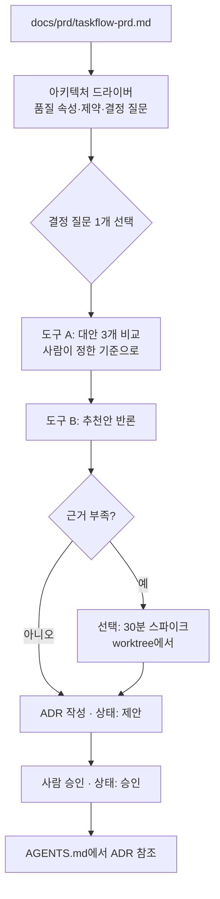

# 02-2. 아키텍처 설계와 ADR

## 🎯 학습 목표
- PRD의 요구사항에서 **아키텍처 드라이버**(품질 속성, 제약, 결정이 필요한 질문)를 뽑아낼 수 있습니다.
- 하나의 결정 질문에 대해 에이전트에게 대안 3개를 **같은 기준으로** 비교시키고, 다른 도구로 반론을 받을 수 있습니다.
- `templates/adr.md` 형식으로 ADR을 작성하고 상태(제안 → 승인)를 사람이 관리할 수 있습니다.
- ADR을 `AGENTS.md`에 연결해, 이후 세션의 에이전트가 이미 내린 결정을 뒤집지 않게 만들 수 있습니다.

## 📋 사전 준비
- 선행 레슨: [02-1 에이전트와 함께 PRD 쓰기](./02-1-prd-with-agents.md)
- 필요 도구/계정: Claude Code 2.1.292 이상, Codex 0.160.1 이상
- 실습 저장소 상태: TaskFlow 저장소에 `docs/prd/taskflow-prd.md`(v1)가 커밋되어 있습니다.
- 템플릿: [templates/adr.md](../../templates/adr.md)

```bash
cd taskflow
mkdir -p docs/adr docs/architecture
cp <가이드 저장소>/templates/adr.md docs/adr/0000-template.md
```

## 💡 개념

### ADR(Architecture Decision Record)이란
ADR은 "무엇을 왜 그렇게 결정했습니까"를 결정 하나당 한 파일로 남기는 짧은 문서입니다. 이 가이드의 템플릿은 **맥락 → 검토한 대안 → 결정 → 결과와 트레이드오프** 네 부분과 상태(제안 | 승인 | 대체됨)로 이루어집니다.

### 왜 에이전트 시대에 ADR이 더 중요한가
사람 팀에서 ADR은 "6개월 뒤의 우리"를 위한 문서였습니다. 에이전트와 일하면 **매 세션이 6개월 뒤의 우리**입니다. 새 세션은 지난 세션에서 왜 Redis 큐를 골랐는지 기억하지 못합니다. 그래서 다음과 같은 일이 실제로 일어납니다.

- 알림 기능을 맡은 세션이 "간단하게" PostgreSQL 폴링으로 구현합니다. 다른 세션은 이미 Redis 큐에 맞춰 워커를 만들었습니다.
- 리팩터링을 맡은 세션이 "더 나은 방법"이라며 인증 방식을 세션 쿠키에서 JWT로 바꿉니다. 보안 검토를 마친 결정이었습니다.
- 리뷰 에이전트가 의도된 트레이드오프(예: 일관성보다 단순성)를 "버그"로 지적합니다.

ADR을 저장소에 두고 메모리 파일에서 가리키면, 에이전트는 결정을 **다시 토론하지 않고 따릅니다**. 결정을 바꿔야 할 때도 코드를 먼저 바꾸지 않고 "새 ADR을 제안"하는 절차를 밟게 됩니다. 이것이 수십 개 세션이 같은 아키텍처를 유지하는 방법입니다(설계서 원칙 2: Context is a Budget — 결정의 배경을 매번 설명하는 대신 ADR 링크 한 줄로 대신합니다).

### 에이전트에게 대안 비교를 맡길 때의 함정
에이전트는 첫 번째로 떠오른 안을 그럴듯하게 정당화하는 경향이 있습니다. 그래서 이 레슨은 세 가지 장치를 씁니다.

1. **평가 기준을 사람이 먼저 정합니다**. 기준은 PRD의 NFR에서 나옵니다.
2. **대안 수를 강제합니다**(3개). 그중 하나는 "가장 단순한 안"이어야 합니다.
3. **다른 도구가 반론을 씁니다**. 추천안의 약점을 찾는 역할을 따로 맡깁니다.



### 어떤 결정이 ADR 대상입니까
모든 결정을 ADR로 쓰면 아무도 읽지 않습니다. 다음 중 하나에 해당하면 ADR로 남깁니다.
- 되돌리는 비용이 큽니다(데이터 저장소, 큐, 인증 방식, 패키지 경계).
- 여러 패키지·여러 세션에 영향을 줍니다.
- 에이전트가 "더 나은 방법"이라며 바꾸고 싶어 할 만한 결정입니다.

## 👣 따라하기

이 레슨의 예시 결정 질문은 **"TaskFlow 알림 워커의 작업 큐를 무엇으로 할 것입니까"**입니다. PRD에 "작업 변경 후 60초 이내 웹 알림 생성(NFR)", "이메일·웹 알림(FR)"이 있다고 가정합니다.

### Step 1. PRD에서 아키텍처 드라이버 추출
목적: 결정 기준이 될 품질 속성과 제약, 그리고 결정해야 할 질문 목록을 PRD에서 뽑습니다.

**Claude Code 레시피**

```bash
claude --permission-mode plan
```

```text
> docs/prd/taskflow-prd.md 를 읽고 아키텍처 드라이버를 정리해 주십시오.
  1. 품질 속성: NFR-xxx를 근거로 성능·가용성·보안·운영성 항목을 뽑고, 각 항목에 수치와 출처 ID를 붙입니다.
  2. 제약: 팀 규모, 일정, 참조 스택(TypeScript 모노레포, Fastify, Next.js, PostgreSQL, Redis)처럼 이미 정해진 것.
  3. 결정 질문: 되돌리기 비싸거나 여러 패키지에 영향을 주는 결정만 5~8개. 각 질문에 관련 FR/NFR ID를 붙입니다.
  결과는 docs/architecture/drivers.md 에 쓸 내용으로 보여주되, 아직 파일은 만들지 마십시오.
```

내용을 확인한 뒤 `Shift+Tab`으로 Plan 모드를 빠져나와 "좋습니다. 파일로 저장해 주십시오"라고 지시합니다.

**Codex 레시피**

```bash
codex --sandbox read-only
```

```text
> /plan
> (위와 같은 지시)
```

확인 후 `/permissions`로 workspace-write 프리셋으로 바꾸고 저장을 지시합니다.

**기대 결과**: `docs/architecture/drivers.md`에 다음과 같은 결정 질문 목록이 생깁니다.

```markdown
## 결정 질문
| # | 질문 | 관련 요구사항 |
|---|---|---|
| D1 | API 프레임워크: Fastify vs NestJS | NFR-001, 제약(팀 경험) |
| D2 | 알림 워커의 작업 큐 | FR-010, FR-011, NFR-002 |
| D3 | 인증 방식: 세션 쿠키 vs 토큰 | FR-020, NFR-005 |
| D4 | 멀티테넌시: 조직별 스키마 vs 행 단위 구분 | FR-030, NFR-006 |
| D5 | 모노레포 패키지 경계 | 제약(병렬 개발) |
```

### Step 2. 평가 기준 확정 후 대안 3개 비교
목적: 결정 질문 D2에 대해, 사람이 정한 기준으로 에이전트가 대안 3개를 비교하게 합니다.

먼저 **사람이** 평가 기준과 가중치를 정합니다. 에이전트에게 기준까지 맡기면 추천안에 유리한 기준이 만들어집니다.

```text
평가 기준(가중치):
- 60초 이내 전달 신뢰성 (NFR-002) — 3
- 재시도·지연 실행 지원 — 2
- 운영 부담(추가 인프라, 모니터링) — 2
- 로컬 개발·테스트 용이성(에이전트가 docker compose로 띄울 수 있습니까) — 2
- 팀의 학습 비용 — 1
```

**Claude Code 레시피** (Plan 모드 유지)

```text
> docs/architecture/drivers.md 의 D2(알림 워커 작업 큐)에 대해 대안 3개를 비교해 주십시오.
  - 대안 A: Redis 기반 큐 라이브러리
  - 대안 B: PostgreSQL 테이블 기반 큐(별도 인프라 없음)
  - 대안 C: 가장 단순한 안 — API 프로세스 안에서 비동기 처리 + 주기적 재시도
  평가 기준과 가중치는 아래를 그대로 씁니다. 기준을 추가하거나 바꾸지 마십시오.
  (위 평가 기준 붙여 넣기)
  출력 형식:
  1) 대안별 기준 점수표(1~5)와 가중 합계
  2) 각 점수의 근거 한 줄. 근거가 추측이면 "(추측)"이라고 표시
  3) 추천안과, 추천안이 틀렸다고 판명될 수 있는 조건 2개
  특정 라이브러리 API나 버전을 단정하지 말고, 확인이 필요한 사실은 "확인 필요"로 표시하십시오.
```

**Codex 레시피** (독립 비교)

같은 질문을 Codex에게도 **독립적으로** 던집니다. Claude의 결과를 보여주지 않아야 서로 다른 시각을 얻습니다. 파일을 바꿀 필요가 없으므로 `codex exec`(기본 read-only)로 실행합니다.

```bash
codex exec -o docs/architecture/d2-compare-codex.md \
  "docs/architecture/drivers.md 의 D2에 대해 대안 3개를 비교해 주십시오.
   (Claude 레시피와 같은 대안, 기준, 출력 형식을 붙여 넣습니다)"
```

**기대 결과**: 두 도구의 비교표가 생깁니다. 추천안이 같으면 신뢰도가 올라가고, 다르면 **어느 기준의 점수가 갈렸는지**가 바로 사람이 판단할 지점입니다. 예를 들어 "로컬 개발 용이성"에서 B를 5점, A를 3점으로 매긴 쪽과 둘 다 4점으로 매긴 쪽이 있다면, 그 근거를 비교합니다.

### Step 3. 다른 도구로 추천안 반론 받기
목적: 추천안의 약점을 일부러 찾게 해서, ADR의 "결과와 트레이드오프"를 채울 재료를 얻습니다.

Step 2에서 Claude가 대안 A를 추천했다고 가정하고, 반론은 Codex에게 맡깁니다(반대 경우에는 역할을 바꿉니다).

**Codex 레시피 (반론 담당)**

```bash
codex exec -o docs/architecture/d2-rebuttal.md \
  "TaskFlow 알림 작업 큐로 'Redis 기반 큐'가 추천되었습니다. 에이전트는 반대 측 검토자입니다.
   docs/prd/taskflow-prd.md 와 docs/architecture/drivers.md 를 근거로
   1) 이 선택이 실패할 수 있는 시나리오 3개(장애, 데이터 유실, 운영)
   2) 각 시나리오의 완화책
   3) 그래도 대안 B가 더 나은 조건
   을 쓰십시오. 일반론 말고 TaskFlow 요구사항 ID를 인용하십시오."
```

**Claude Code 레시피 (반론 담당일 때)**

```bash
claude -p "TaskFlow 알림 작업 큐로 'PostgreSQL 테이블 기반 큐'가 추천되었습니다. 에이전트는 반대 측 검토자입니다.
  (위와 같은 1~3 지시)" --permission-mode plan > docs/architecture/d2-rebuttal.md
```

**선택: 근거가 부족하면 30분 스파이크**

"Redis 장애 시 작업 유실 여부"처럼 문서만으로 판단이 안 되면, 메인 브랜치를 더럽히지 않도록 별도 worktree에서 짧은 실험을 합니다.

```bash
# Claude Code
claude --worktree spike-queue
# Codex
codex --worktree "spike: 작업 큐에 작업 100개를 넣고 워커를 강제 종료한 뒤 재시작했을 때 유실 여부를 확인하는 최소 스크립트를 만드십시오. 결과를 SPIKE.md에 기록하십시오."
```

스파이크 코드는 머지하지 않습니다. `SPIKE.md`의 결론만 ADR 근거로 옮깁니다.

**기대 결과**: `d2-rebuttal.md`에 TaskFlow 요구사항 ID를 인용한 실패 시나리오와 완화책이 있습니다. 완화책 중 채택할 것은 ADR의 "결과와 트레이드오프"에 들어갑니다.

### Step 4. ADR 작성 (상태: 제안)
목적: 비교·반론 결과를 템플릿에 맞춰 ADR 한 건으로 정리합니다.

먼저 ADR-0001은 "ADR로 아키텍처 결정을 기록합니다"로 둡니다. 관례상 첫 ADR은 이 기록 방식 자체에 대한 결정입니다. 그 다음이 D2입니다.

**Claude Code 레시피** (쓰기 가능한 모드로 전환 후)

```text
> docs/adr/0000-template.md 형식으로 두 파일을 만들어 주십시오.
  1) docs/adr/0001-record-architecture-decisions.md — ADR을 docs/adr/에 번호순으로 기록하고, 승인된 ADR을 바꿀 때는 새 ADR로 대체한다는 결정. 짧게.
  2) docs/adr/0002-notification-job-queue.md — D2 결정.
     - 맥락: drivers.md 의 D2와 관련 FR/NFR ID를 인용
     - 검토한 대안: Step 2 비교표를 템플릿의 3열 표(대안/장점/단점)로 요약. 가중 합계는 본문에 한 줄로
     - 결정: 한 문장으로 시작합니다. "우리는 ~를 사용합니다."
     - 결과와 트레이드오프: d2-rebuttal.md 에서 채택한 완화책을 "후속 작업"으로, 감수하는 단점을 "감수하는 것"으로 나눠 씁니다
     - 상태는 "제안", 날짜는 오늘
  확인 필요로 표시된 사실은 ADR에도 "확인 필요"로 남기십시오.
```

**Codex 레시피**

```text
> /permissions
  (workspace-write 프리셋)
> (위와 같은 지시)
```

**기대 결과**: `docs/adr/0002-notification-job-queue.md`가 다음과 같은 모양이 됩니다.

```markdown
# ADR-0002: 알림 워커 작업 큐로 Redis 기반 큐를 사용합니다

- 상태: 제안
- 날짜: 2026-10-07

## 맥락
FR-010(작업 변경 알림), NFR-002(60초 이내 생성)를 만족하려면 API 요청과 분리된
비동기 처리와 재시도가 필요합니다. 참조 스택에 Redis가 이미 포함되어 있습니다(drivers.md 제약).

## 검토한 대안
| 대안 | 장점 | 단점 |
|---|---|---|
| A. Redis 기반 큐 | 지연 실행·재시도 기본 제공, 워커 수평 확장 | Redis 운영 필요, 영속성 설정에 따라 유실 가능 |
| B. PostgreSQL 테이블 큐 | 추가 인프라 없음, 트랜잭션과 함께 커밋 | 폴링 부하, 처리량 한계(확인 필요) |
| C. 프로세스 내 비동기 | 가장 단순 | API 재시작 시 유실, NFR-002 보장 불가 |

가중 합계: A 41 / B 37 / C 22 (기준은 drivers.md D2 참고)

## 결정
우리는 알림 작업 큐로 Redis 기반 큐를 사용하고, 워커는 `apps/worker` 패키지로 분리합니다.

## 결과와 트레이드오프
- 후속 작업: Redis 영속성 설정 확인(확인 필요), 실패 작업 보관 큐와 재처리 CLI
- 감수하는 것: 로컬·CI에 Redis 컨테이너가 필요합니다
```

### Step 5. 사람 승인과 메모리 파일 연결
목적: ADR을 사람이 승인하고, 이후 모든 세션이 ADR을 따르도록 `AGENTS.md`에 규칙을 추가합니다.

1) 사람이 ADR을 읽고 상태를 `승인`으로 바꿉니다. 이 상태 변경은 **사람이 직접** 합니다. 에이전트가 스스로 승인하게 두지 않습니다.

2) `AGENTS.md`에 아키텍처 결정 섹션을 추가합니다. `CLAUDE.md`는 `@AGENTS.md`를 import하므로 두 도구 모두 같은 규칙을 읽습니다.

**Claude Code 레시피**

```text
> AGENTS.md 에 "## 아키텍처 결정" 섹션을 추가해 주십시오. 내용은 아래 세 줄만. 다른 섹션은 건드리지 마십시오.
  - 아키텍처 결정은 docs/adr/ 의 "승인" 상태 ADR을 따릅니다. 작업 전에 관련 ADR을 확인합니다.
  - 승인된 ADR과 충돌하는 변경이 필요하면 코드를 바꾸지 말고 멈춘 뒤, 새 ADR 초안(상태: 제안)을 제안합니다.
  - ADR 상태를 "승인"으로 바꾸는 것은 사람만 합니다.
```

**Codex 레시피**

```text
> (같은 지시를 Codex 대화형 세션에 입력합니다)
```

3) 규칙이 실제로 작동하는지 **일부러 충돌하는 지시**로 확인합니다. 새 세션에서 실행해야 메모리 파일을 새로 읽습니다.

```bash
# Claude Code
claude -p "알림 기능을 PostgreSQL 폴링으로 간단하게 구현하는 계획을 세워 주십시오." --permission-mode plan
# Codex
codex exec "알림 기능을 PostgreSQL 폴링으로 간단하게 구현하는 계획을 세워 주십시오."
```

**기대 결과**: 두 도구 모두 ADR-0002와 충돌한다는 점을 지적하고, 구현 계획 대신 "새 ADR을 제안하거나 ADR-0002를 따르는 계획"을 내놓습니다. 충돌을 알아채지 못하면 `AGENTS.md` 규칙 문장을 더 구체적으로 고치고(예: "작업 큐 관련 변경 전에는 docs/adr/0002-*.md를 읽습니다") 다시 시험합니다.

마지막으로 커밋합니다.

```bash
git add docs/adr docs/architecture AGENTS.md
git commit -m "docs(adr): ADR-0001, ADR-0002 notification job queue"
```

## ✅ 체크포인트
- [ ] `docs/architecture/drivers.md`에 품질 속성(수치·출처 ID), 제약, 결정 질문 5개 이상이 있습니다.
- [ ] 평가 기준과 가중치를 사람이 먼저 정했고, 두 도구가 같은 기준으로 독립 비교했습니다.
- [ ] 추천안에 대한 반론 문서가 있고, 그중 일부가 ADR의 "결과와 트레이드오프"에 반영됐습니다.
- [ ] `docs/adr/0001-*.md`, `docs/adr/0002-*.md`가 템플릿 구조를 따르고, 0002의 상태를 사람이 `승인`으로 바꿨습니다.
- [ ] `AGENTS.md`에 ADR 준수 규칙이 있고, 충돌 지시 시험에서 두 도구 모두 ADR을 근거로 멈췄습니다.

## 🏠 숙제
| # | 유형 | 난이도 | 과제 | 완료 조건 |
|---|---|---|---|---|
| HW1 | 🔁 Reproduce | ★ | 따라하기 Step 2~4를 재현해 D2(작업 큐) ADR을 작성합니다 | 두 도구의 비교표(가중 합계 포함)와 반론 문서, `docs/adr/0002-*.md`를 제출합니다. 두 도구의 점수가 갈린 기준과 그 이유를 3줄 이상 적습니다 |
| HW2 | 🛠 Apply | ★★ | TaskFlow의 핵심 결정 ADR 3건을 작성합니다(D2 외에 D1·D3·D4·D5 중 2건 이상 포함 가능, 총 3건) | ADR 3건 모두 대안 3개 이상, 관련 FR/NFR ID 인용, "후속 작업"과 "감수하는 것"이 구분된 트레이드오프를 갖추고 상태가 `승인`입니다. 각 ADR마다 어느 도구가 비교했고 어느 도구가 반론했는지 표로 기록합니다 |
| HW3 | 🚀 Challenge | ★★★ | ADR 대체 흐름을 실습합니다. 상황 변화(예: "알림 처리량이 10배 증가")를 가정해 ADR-0002를 대체하는 새 ADR을 쓰고, 에이전트가 기존 결정을 무시하지 않는지 검증합니다 | 새 ADR의 상태가 `승인`, ADR-0002 상태가 `대체됨(ADR-XXXX)`입니다. 대체 전·후로 같은 충돌 지시를 두 도구에 주고, 대체 전에는 멈추고 대체 후에는 새 결정을 따르는 로그를 제출합니다 |

제출: `hw/02-2` 브랜치, `submissions/02-2.md` (템플릿: docs/design/homework-template.md)

## ⚠️ 흔한 실수
- **대안 3개 중 2개가 들러리입니다** → 원인: 에이전트가 추천안을 먼저 정하고 나머지를 약하게 썼습니다 → 대응: "가장 단순한 안"을 반드시 포함시키고, 평가 기준과 가중치를 사람이 먼저 고정합니다. 다른 도구에게 독립 비교를 시켜 점수 차이를 확인합니다.
- **ADR에 존재하지 않는 라이브러리 기능이 근거로 적혀 있습니다** → 원인: 에이전트가 기억에 의존해 API·버전을 단정했습니다(환각 API, [00-4](../00-foundations/00-4-failure-patterns.md) 참고) → 대응: "확인 필요" 표시를 요구하고, 결정에 중요한 사실은 공식 문서나 Step 3의 스파이크로 확인한 뒤 ADR을 승인합니다.
- **다음 세션의 에이전트가 ADR을 무시합니다** → 원인: ADR이 저장소에만 있고 메모리 파일에서 가리키지 않거나, 기존 세션에서 시험했습니다 → 대응: `AGENTS.md`에 ADR 준수 규칙을 넣고 **새 세션**에서 충돌 지시로 시험합니다. Claude는 `CLAUDE.md`에 `@AGENTS.md`가 있는지, `/memory`에 해당 파일이 나오는지 확인합니다.
- **ADR이 길어져 아무도 읽지 않습니다** → 원인: 비교 과정 전체를 ADR에 붙여 넣었습니다 → 대응: ADR은 1페이지로 유지하고, 비교표 원본과 반론 문서는 `docs/architecture/`에 따로 둔 뒤 링크만 겁니다.
- **에이전트가 ADR 상태를 스스로 "승인"으로 바꿨습니다** → 원인: "ADR 완성해 주십시오"처럼 범위를 열어 두었습니다 → 대응: 승인은 사람만 한다는 규칙을 `AGENTS.md`에 넣고, 지시할 때도 "상태는 제안"을 명시합니다.

## 🔗 참고 자료
- [Claude Code memory (`CLAUDE.md`, `@` import)](https://code.claude.com/docs/en/memory)
- [Claude Code worktrees (`--worktree`)](https://code.claude.com/docs/en/worktrees)
- [Claude Code permission modes](https://code.claude.com/docs/en/permission-modes)
- [Codex AGENTS.md](https://learn.chatgpt.com/docs/agent-configuration/agents-md)
- [Codex non-interactive mode](https://learn.chatgpt.com/docs/non-interactive-mode)
- [Codex worktrees](https://learn.chatgpt.com/docs/environments/git-worktrees)
- 템플릿: [templates/adr.md](../../templates/adr.md)
- 이 가이드의 관련 레슨: 이전 레슨 [02-1 PRD](./02-1-prd-with-agents.md), 다음 레슨 [02-3 작업 분해](./02-3-task-breakdown.md), [01-1 프로젝트 메모리](../01-environment-setup/01-1-project-memory.md), [04-2 교차 리뷰](../04-quality-and-verification/04-2-cross-review.md)
- 프로젝트: [Project B — TaskFlow](../../projects/B-development-project/README.md) (B1 마일스톤)
