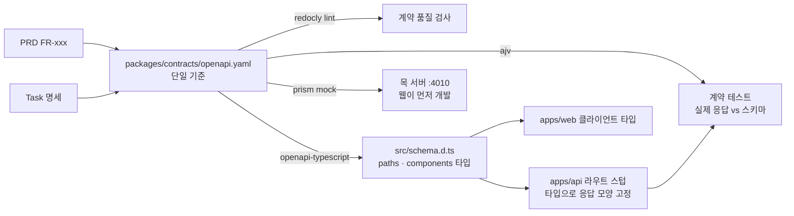

# 02-4. 인터페이스 우선 설계 (OpenAPI, 스키마, 타입 계약)

## 🎯 학습 목표
- 구현보다 먼저 OpenAPI 3.1 API 계약(`packages/contracts/openapi.yaml`)을 에이전트와 함께 작성하고 린트로 검증할 수 있습니다.
- 계약에서 TypeScript 타입과 서버 스텁, 목(mock) 서버를 생성해 API·웹 작업을 **동시에** 시작할 수 있게 만들 수 있습니다.
- 응답이 계약을 따르는지 확인하는 계약 테스트를 작성하고, 계약과 구현이 어긋나면 테스트가 실패하는 것을 확인할 수 있습니다.
- "계약 먼저 바꾸고, 그다음 구현"이라는 변경 절차를 메모리 파일 규칙으로 강제할 수 있습니다.

## 📋 사전 준비
- 선행 레슨: [02-1 PRD](./02-1-prd-with-agents.md), [02-2 ADR](./02-2-architecture-and-adr.md), [02-3 작업 분해](./02-3-task-breakdown.md)
- 필요 도구/계정: Claude Code 2.1.292 이상, Codex 0.160.1 이상, Node.js 22+, pnpm, `curl`, `jq`
- 실습 저장소 상태: TaskFlow B0 완료(모노레포 뼈대, `apps/api`는 Fastify 앱, `apps/web`은 Next.js 앱, Vitest 설정) + 02-1~02-3 산출물(`docs/prd`, `docs/adr`, `docs/backlog`)
- 이 레슨에서 쓰는 외부 도구(2026-10-07 기준 npm 최신 버전으로 확인):

| 도구 | 용도 | 확인한 버전 |
|---|---|---|
| `@redocly/cli` | OpenAPI 린트 (`redocly lint`) | 2.59.0 |
| `openapi-typescript` | 계약 → TypeScript 타입 (`-o`, `--check`) | 7.13.0 |
| `@stoplight/prism-cli` | 계약 기반 목 서버(`prism mock`), 검증 프록시(`prism proxy`) | 5.16.0 |
| `ajv`, `ajv-formats`, `yaml` | 계약 테스트에서 응답을 JSON Schema로 검증 | 8.20.0, 3.0.1, 2.9.1 |

## 💡 개념

### 왜 인터페이스부터입니까
02-3에서 만든 백로그에는 "API: 작업 담당자 변경"과 "웹: 담당자 선택 드롭다운"이 서로 다른 Task로 있습니다. 두 Task를 서로 다른 세션(혹은 다른 사람, 다른 도구)이 동시에 진행하면, 계약이 없을 때 각자 필드 이름을 추측합니다. API 세션은 `assignee_id`, 웹 세션은 `assigneeId`를 쓰고, 상태 값은 한쪽이 `IN_PROGRESS`, 다른 쪽이 `in-progress`가 됩니다. 이 불일치는 통합할 때 터지고, 누가 맞는지 판단할 근거도 없습니다.

인터페이스 우선 설계는 이 추측을 없앱니다.

- **병렬화의 전제 조건**: 계약이 확정되면 API·웹·CLI·워커가 서로를 기다리지 않습니다. 웹은 목 서버로 개발하고, API는 계약 테스트로 개발합니다([05-1 병렬 에이전트](../05-scaling-up/05-1-parallel-agents.md)).
- **에이전트에게 가장 좋은 컨텍스트**: `openapi.yaml` 한 파일이 필드 이름, 타입, 필수 여부, 오류 코드를 모두 담습니다. 긴 설명보다 짧고 모호하지 않습니다(원칙 2: Context is a Budget).
- **기계가 검증하는 명세**: PRD는 사람이 읽고 판단하지만, 계약은 린트·타입체크·계약 테스트가 자동으로 확인합니다(원칙 3: Verify, Don't Trust).

### 계약 하나에서 나오는 것들



### 타입 검사와 계약 테스트는 서로 다른 층입니다
| 층 | 잡는 것 | 놓치는 것 |
|---|---|---|
| 생성된 타입 + `typecheck` | 필드 누락, 잘못된 타입, 오타(컴파일 시점) | 런타임 값: UUID 형식, enum 밖의 문자열, 추가 필드, `as` 캐스팅으로 숨긴 오류 |
| 계약 테스트(Ajv) | 실제 HTTP 응답의 형식·enum·required·추가 필드 | 비즈니스 로직의 옳고 그름 |
| `prism proxy --errors` | 실행 중인 서버의 요청·응답 위반 | 테스트하지 않은 경로 |

에이전트는 타입 오류를 `as unknown as Task`로 "해결"하는 경우가 있습니다. 그래서 타입 검사만으로는 부족하고, 실제 응답을 검사하는 계약 테스트가 필요합니다.

## 👣 따라하기

이 레슨은 TaskFlow의 **작업(Task) 리소스**만 다룹니다: `GET /projects/{projectId}/tasks`, `POST /projects/{projectId}/tasks`, `GET /projects/{projectId}/tasks/{taskId}`, `PATCH /projects/{projectId}/tasks/{taskId}`.

### Step 1. 계약 작성과 린트
목적: PRD와 Task 명세에서 API 계약을 뽑아 `packages/contracts/openapi.yaml`로 쓰고, 린트를 통과시킵니다.

먼저 계약 패키지를 만듭니다(도구 무관).

```bash
mkdir -p packages/contracts/src
cat > packages/contracts/package.json <<'EOF'
{
  "name": "@taskflow/contracts",
  "private": true,
  "version": "0.0.0",
  "types": "./src/index.ts",
  "scripts": {
    "lint": "redocly lint openapi.yaml",
    "generate": "openapi-typescript openapi.yaml -o src/schema.d.ts",
    "check": "openapi-typescript openapi.yaml -o src/schema.d.ts --check"
  }
}
EOF
pnpm --filter @taskflow/contracts add -D @redocly/cli openapi-typescript
```

**Claude Code 레시피**

```bash
claude
```

```text
> docs/prd/taskflow-prd.md 의 FR-001~FR-009와 docs/backlog/tasks/ 중 작업 API 관련 Task를 읽고
  packages/contracts/openapi.yaml 을 OpenAPI 3.1.0으로 작성해 주십시오.
  범위: GET/POST /projects/{projectId}/tasks, GET/PATCH /projects/{projectId}/tasks/{taskId}
  규칙:
  - 모든 오퍼레이션에 operationId, summary, 4XX 응답을 둡니다. 오류 응답은 공통 Error 스키마($ref)를 씁니다.
  - 요청·응답 본문 스키마는 반드시 components/schemas 에 정의하고 $ref로만 참조합니다(인라인 스키마 금지).
  - 필드 이름은 camelCase, ID는 format: uuid, 시각은 format: date-time.
  - 응답 스키마에는 additionalProperties: false 를 둡니다.
  - status enum은 PRD 용어를 그대로 씁니다. PRD에 없는 필드를 추가하지 말고, 필요해 보이면 마지막에 제안만 하십시오.
  - 각 스키마에 example을 하나씩 둡니다(목 서버가 사용합니다).
  - 각 오퍼레이션 description 첫 줄에 관련 FR ID를 적습니다.
  작성 후 `pnpm --filter @taskflow/contracts lint` 를 실행해서 오류가 0개가 될 때까지 고쳐 주십시오.
```

**Codex 레시피**

대화형 `codex`(기본 Auto 프리셋: `workspace-write` + `on-request`)에서 같은 지시를 입력하거나, 비대화형으로 실행합니다.

```bash
codex exec --sandbox workspace-write "$(cat <<'EOF'
(위 Claude Code 레시피와 같은 지시를 붙여 넣습니다)
EOF
)"
```

> 패키지 설치나 레지스트리 접근이 필요한 명령은 샌드박스의 네트워크 설정에 따라 막힐 수 있습니다. 의존성 설치는 위처럼 사람이 먼저 해 두는 편이 실습이 매끄럽습니다.

**기대 결과**: `redocly lint`가 기본 권장(recommended) 규칙으로 통과합니다. 처음에는 보통 다음 오류가 나오고, 에이전트가 이를 고치는 과정이 보여야 합니다.

```text
error    no-empty-servers        Servers must be present.
error    operation-summary       Operation object should contain `summary` field.
error    security-defined        Every operation should have security defined on it or on the root level.
warning  operation-4xx-response  Operation must have at least one `4XX` response.
```

`security-defined` 오류는 인증 방식 ADR(02-2의 D3)과 연결됩니다. ADR이 아직 없으면 에이전트에게 임의로 정하게 하지 말고, ADR에 맞는 `securitySchemes`를 사람이 지정합니다. 계약의 핵심 부분은 대략 다음과 같습니다.

```yaml
components:
  schemas:
    TaskStatus:
      type: string
      enum: [todo, in_progress, done]
    Task:
      type: object
      additionalProperties: false
      required: [id, projectId, title, status, createdAt]
      properties:
        id:         { type: string, format: uuid }
        projectId:  { type: string, format: uuid }
        title:      { type: string, minLength: 1, maxLength: 200 }
        status:     { $ref: '#/components/schemas/TaskStatus' }
        assigneeId: { type: [string, 'null'], format: uuid }
        dueDate:    { type: [string, 'null'], format: date }
        createdAt:  { type: string, format: date-time }
```

### Step 2. 계약에서 타입 생성
목적: `openapi-typescript`로 계약을 TypeScript 타입으로 바꾸고, 계약과 생성물이 어긋나면 실패하는 검사를 만듭니다.

이 단계는 도구와 무관한 명령입니다. 에이전트에게 맡길 때는 아래처럼 지시하고, 사람이 직접 실행해도 됩니다.

```bash
pnpm --filter @taskflow/contracts generate
cat > packages/contracts/src/index.ts <<'EOF'
export type { paths, components, operations } from './schema';
EOF
```

**Claude Code 레시피**

```text
> @taskflow/contracts 의 generate 스크립트로 타입을 생성하고, apps/api 와 apps/web 의 package.json 에
  "@taskflow/contracts": "workspace:*" 의존을 추가해 주십시오. 루트 turbo 파이프라인에서 api/web 의 typecheck가
  contracts 의 generate 뒤에 실행되도록 설정을 확인하고 필요하면 고쳐 주십시오.
  마지막에 `pnpm --filter @taskflow/contracts check` 가 통과하는지 보여 주십시오.
```

**Codex 레시피**

```text
> (Codex 대화형 세션에서 같은 지시)
```

**기대 결과**: `packages/contracts/src/schema.d.ts`에 `paths`, `components`, `operations` 인터페이스가 생깁니다. `check`는 생성물이 최신이면 종료 코드 0, 계약만 바뀌고 재생성하지 않았으면 `Generated types are not up-to-date!`를 출력하고 실패합니다. 직접 확인해 봅니다.

```bash
pnpm --filter @taskflow/contracts check; echo "exit=$?"     # exit=0
echo "// manual edit" >> packages/contracts/src/schema.d.ts
pnpm --filter @taskflow/contracts check; echo "exit=$?"     # 실패
pnpm --filter @taskflow/contracts generate                 # 복구
```

### Step 3. 스텁 생성: 서버 스텁과 목 서버
목적: API는 계약 타입에 묶인 라우트 스텁으로, 웹은 목 서버로, 서로를 기다리지 않고 시작할 수 있게 합니다.

**3-a. 목 서버 (도구 무관)**

```bash
pnpm dlx @stoplight/prism-cli mock packages/contracts/openapi.yaml -p 4010
# 다른 터미널에서
curl -s http://127.0.0.1:4010/projects/3f1c0d4e-0000-4000-8000-000000000001/tasks | jq
```

계약에 `security`를 정의했다면 목 서버도 인증 헤더를 요구할 수 있습니다. 그때는 계약에 정의한 방식대로 헤더를 붙여 요청합니다. 웹 Task(예: 담당자 드롭다운)는 이 목 서버를 바라보고 진행합니다.

**3-b. Fastify 라우트 스텁**

**Claude Code 레시피**

```text
> packages/contracts/openapi.yaml 의 4개 오퍼레이션에 대한 Fastify 라우트 스텁을 apps/api/src/modules/tasks/routes.ts 에 만들어 주십시오.
  - 타입은 @taskflow/contracts 의 paths/components 에서만 가져옵니다. 같은 모양의 타입을 손으로 다시 선언하지 마십시오.
  - GET 단건, 목록은 계약의 example과 같은 고정 데이터를 components['schemas']['Task'] 타입 변수로 반환합니다(타입체크가 모양을 보장하게).
  - POST, PATCH는 아직 501과 Error 스키마 본문을 반환합니다.
  - as 캐스팅, any 사용 금지.
  - `pnpm --filter api typecheck` 통과까지 확인해 주십시오.
```

**Codex 레시피**

```bash
codex exec --sandbox workspace-write "(위와 같은 지시)"
```

**기대 결과**: 다음과 비슷한 스텁이 생기고 `typecheck`가 통과합니다.

```ts
import type { FastifyInstance } from 'fastify';
import type { components } from '@taskflow/contracts';

type Task = components['schemas']['Task'];
type ApiError = components['schemas']['Error'];

const sampleTask: Task = {
  id: '3f1c0d4e-0000-4000-8000-000000000002',
  projectId: '3f1c0d4e-0000-4000-8000-000000000001',
  title: '로그인 화면 시안 검토',
  status: 'todo',
  assigneeId: null,
  dueDate: null,
  createdAt: '2026-10-07T09:00:00Z',
};

export async function taskRoutes(app: FastifyInstance) {
  app.get('/projects/:projectId/tasks/:taskId', async () => sampleTask);
  app.post('/projects/:projectId/tasks', async (_req, reply) => {
    const body: ApiError = { code: 'NOT_IMPLEMENTED', message: 'createTask is not implemented yet' };
    return reply.code(501).send(body);
  });
  // ...
}
```

`sampleTask`에서 `status: 'TODO'`처럼 계약 밖의 값을 넣으면 `typecheck`가 실패해야 합니다. 한 번 일부러 바꿔서 확인합니다.

### Step 4. 계약 테스트 작성
목적: 실제 HTTP 응답을 계약의 JSON Schema로 검증하는 테스트를 만듭니다. 계약과 구현이 어긋나면 이 테스트가 실패합니다.

```bash
pnpm --filter api add -D ajv ajv-formats yaml
```

**Claude Code 레시피**

```text
> apps/api/test/contract/ 에 계약 테스트를 만들어 주십시오.
  1) helper: apps/api/test/contract/contract.ts
     - packages/contracts/openapi.yaml 을 yaml 패키지의 parse로 읽습니다.
     - ajv/dist/2020 (OpenAPI 3.1 = JSON Schema 2020-12) 인스턴스를 strict: false, allErrors: true 로 만들고 ajv-formats를 적용합니다.
     - 문서 전체를 addSchema(doc, 'openapi')로 등록합니다.
     - expectMatchesContract(path, method, status, body): 해당 응답의 schema.$ref를 찾아
       ajv.getSchema('openapi' + $ref)로 검증하고, 실패하면 ajv 오류 목록을 메시지에 담아 실패시킵니다.
       응답 스키마가 $ref가 아니면 테스트를 실패시킵니다(인라인 스키마 금지 규칙 검사).
  2) tasks.contract.test.ts: Fastify app.inject()로 4개 오퍼레이션을 호출하고,
     응답 상태 코드가 계약에 정의된 코드인지 + 본문이 스키마와 맞는지 확인합니다.
  `pnpm --filter api test -- contract` 를 실행해 결과를 보여 주십시오.
```

**Codex 레시피**

```bash
codex exec --sandbox workspace-write "(위와 같은 지시)"
```

**기대 결과**: helper의 핵심은 다음과 같습니다.

```ts
import { readFileSync } from 'node:fs';
import { parse } from 'yaml';
import Ajv2020 from 'ajv/dist/2020';
import addFormats from 'ajv-formats';

const doc = parse(readFileSync(new URL('../../../../packages/contracts/openapi.yaml', import.meta.url), 'utf8'));
const ajv = new Ajv2020({ strict: false, allErrors: true });
addFormats(ajv);
ajv.addSchema(doc, 'openapi');

export function expectMatchesContract(path: string, method: string, status: number, body: unknown) {
  const res = doc.paths[path]?.[method]?.responses?.[String(status)];
  if (!res) throw new Error(`${method.toUpperCase()} ${path} has no ${status} response in the contract`);
  const ref = res.content?.['application/json']?.schema?.$ref;
  if (!ref) throw new Error(`${method.toUpperCase()} ${path} ${status}: response schema must be a $ref`);
  const validate = ajv.getSchema('openapi' + ref)!;
  if (!validate(body)) throw new Error(JSON.stringify(validate.errors, null, 2));
}
```

테스트 결과를 해석합니다.

- GET 두 개는 통과합니다(스텁이 계약 모양의 데이터를 반환합니다).
- POST, PATCH는 **501이 계약에 없으므로 실패**합니다. 이것이 의도된 빨간불입니다. 이 테스트가 02-3의 Task(예: TASK-014)의 완료 조건 "계약 테스트에서 PATCH 응답이 스키마와 일치"가 됩니다.

계약 테스트가 정말 어긋남을 잡는지 확인합니다. 스텁의 `sampleTask.id`를 `'task-1'`로 바꾸고 `as Task`로 타입 오류를 숨긴 뒤 테스트를 돌리면, `typecheck`는 통과해도 계약 테스트는 `must match format "uuid"`로 실패해야 합니다. 확인 후 되돌립니다.

**선택: 실행 중인 서버 검증**

```bash
pnpm --filter api dev                         # 예: http://localhost:3000 (B0 설정에 따름)
pnpm dlx @stoplight/prism-cli proxy packages/contracts/openapi.yaml http://localhost:3000 -p 4011 --errors
curl -i http://127.0.0.1:4011/projects/<id>/tasks/<id>
```

`--errors`를 주면 계약 위반 요청·응답이 오류 응답으로 바뀝니다. E2E 테스트([04-4](../04-quality-and-verification/04-4-browser-e2e.md))를 이 프록시 뒤에서 돌리면 테스트하지 않은 경로의 위반도 드러납니다.

### Step 5. 계약 변경 절차를 규칙으로 만들기
목적: 앞으로 모든 세션이 "계약 → 생성 → 테스트 → 구현" 순서를 지키게 하고, 실제로 지키는지 시험합니다.

**Claude Code 레시피**

```text
> AGENTS.md 에 "## API 계약" 섹션을 추가해 주십시오. 다른 섹션은 건드리지 마십시오.
  - API의 단일 기준은 packages/contracts/openapi.yaml 입니다. 요청·응답 모양을 바꾸려면 계약을 먼저 고칩니다.
  - 계약을 고친 뒤 `pnpm --filter @taskflow/contracts lint`, `generate` 를 실행하고, 계약 테스트를 먼저 추가·수정한 다음 구현합니다.
  - packages/contracts/src/schema.d.ts 는 생성물입니다. 직접 수정하지 않습니다.
  - 계약 타입을 손으로 다시 선언하거나 as 캐스팅으로 타입 오류를 숨기지 않습니다.
  - 기존 필드 삭제·이름 변경·enum 값 제거는 호환성을 깨는 변경이므로, 진행하지 말고 사람에게 확인을 요청합니다.
```

**Codex 레시피**

```text
> (Codex 대화형 세션에서 같은 지시)
```

이제 **새 세션**에서 규칙을 시험합니다. 계약이 필요한 기능 추가를 일부러 "구현해 주십시오"라고만 지시합니다.

```bash
# Claude Code
claude -p "작업에 priority(low, medium, high) 필드를 추가해 주십시오. 기본값은 medium." --permission-mode acceptEdits
# Codex
codex exec --sandbox workspace-write "작업에 priority(low, medium, high) 필드를 추가해 주십시오. 기본값은 medium."
```

변경 순서를 확인합니다.

```bash
git diff --stat
pnpm --filter @taskflow/contracts check
pnpm --filter api typecheck
pnpm --filter api test -- contract
```

**기대 결과**: diff에 `packages/contracts/openapi.yaml`과 재생성된 `schema.d.ts`, 계약 테스트, 구현이 함께 있고, 세 검증 명령이 모두 통과합니다. 계약은 그대로 두고 `apps/api`만 고쳤다면 규칙이 작동하지 않은 것입니다. 그때는 `check`나 계약 테스트가 실패할 것이므로, 그 결과를 근거로 규칙 문장을 고칩니다. `priority`가 PRD에 없는 필드라면 에이전트가 PRD 보완 여부를 묻는 것이 가장 좋은 반응입니다.

마지막으로 이 세 검증 명령을 루트의 검증 스크립트(B0에서 만든 `verify` 등)에 추가합니다. CI 연결은 [05-4](../05-scaling-up/05-4-ci-cd-integration.md)에서 다룹니다.

```bash
git add packages/contracts apps/api AGENTS.md
git commit -m "feat(contracts): OpenAPI-first tasks API with stubs and contract tests"
```

## ✅ 체크포인트
- [ ] `packages/contracts/openapi.yaml`이 `redocly lint`를 오류 0개로 통과하고, 모든 응답 스키마가 `$ref`로 참조됩니다.
- [ ] `pnpm --filter @taskflow/contracts check`가 생성물이 최신일 때 통과하고, 어긋나면 실패하는 것을 확인했습니다.
- [ ] Prism 목 서버에서 작업 목록 응답을 받았습니다.
- [ ] API 스텁이 계약 타입만 사용하고(`as`, `any` 없음) `typecheck`를 통과합니다.
- [ ] 계약 테스트가 GET은 통과, 미구현 POST/PATCH는 실패하며, 형식 위반(UUID 아님)을 잡아냈습니다.
- [ ] `AGENTS.md`의 API 계약 규칙을 새 세션에서 시험했고, 계약 → 생성 → 테스트 → 구현 순서가 diff에 나타났습니다.

## 🏠 숙제
| # | 유형 | 난이도 | 과제 | 완료 조건 |
|---|---|---|---|---|
| HW1 | 🔁 Reproduce | ★ | 따라하기 Step 1~3을 재현해 작업 API 계약을 쓰고 타입·스텁·목 서버를 만듭니다 | `redocly lint` 통과 로그, `check` 성공·실패 두 경우의 로그, 목 서버 `curl` 응답, `pnpm --filter api typecheck` 통과 로그를 제출합니다 |
| HW2 | 🛠 Apply | ★★ | 계약 테스트까지 포함한 인터페이스 정의를 완성합니다. 작업 API에 더해 프로젝트·멤버십 API(E2)의 계약을 쓰고, 모든 오퍼레이션에 계약 테스트를 붙입니다 | 오퍼레이션 8개 이상, 각 오퍼레이션에 정상 응답 1개 이상 + 4XX 응답 1개 이상의 계약 테스트가 있습니다. 일부러 계약을 어긴 구현(형식 위반, 추가 필드, 누락 필드) 3가지를 만들어 각각 테스트가 실패하는 로그를 제출합니다. 각 오퍼레이션 description에 FR ID가 있습니다 |
| HW3 | 🚀 Challenge | ★★★ | 계약을 기준으로 한 병렬 개발을 실습합니다. API Task 하나는 Claude Code(`claude --worktree`)로, 같은 기능의 웹 Task는 Codex(`codex --worktree`)로 동시에 진행합니다 | 웹은 Prism 목 서버만 보고 개발했고, API는 계약 테스트로 개발했다는 세션 기록을 제출합니다. 두 브랜치를 합친 뒤 목 서버 대신 실제 API로 웹을 실행해 추가 수정 없이 동작하거나, 수정이 필요했다면 그 원인이 계약의 어느 부분이 모호했기 때문인지 분석하고 계약을 보완한 PR을 제출합니다 |

제출: `hw/02-4` 브랜치, `submissions/02-4.md` (템플릿: docs/design/homework-template.md)

## ⚠️ 흔한 실수
- **에이전트가 `schema.d.ts`를 직접 고칩니다** → 원인: 타입 오류를 가장 빨리 없애는 길이 생성물 수정이었습니다 → 대응: `AGENTS.md`에 "생성물 직접 수정 금지"를 쓰고, `openapi-typescript ... --check`를 검증 스크립트에 넣어 기계적으로 막습니다.
- **타입체크는 통과하는데 계약 테스트가 실패합니다** → 원인: `as Task` 캐스팅이나 `any`로 타입 오류를 숨겼거나, UUID·enum처럼 TypeScript 타입이 표현하지 못하는 제약을 어겼습니다 → 대응: 정상적인 현상입니다. 계약 테스트가 잡아야 할 것을 잡은 것입니다. 구현을 고치고, 캐스팅 금지 규칙을 프롬프트와 `AGENTS.md`에 넣습니다.
- **Ajv가 OpenAPI 문서를 읽다가 `unknown keyword`나 `unknown format` 오류를 냅니다** → 원인: OpenAPI 전용 키워드(`openapi`, `paths`, `example` 등)를 Ajv strict 모드가 거부하거나, `ajv-formats`를 적용하지 않았습니다 → 대응: Step 4처럼 `ajv/dist/2020`을 `strict: false`로 만들고 `addFormats(ajv)`를 호출합니다. OpenAPI 3.0 문서라면 3.1과 스키마 방언이 다르므로 3.1로 작성하는 것을 권장합니다.
- **목 서버와 실제 API의 응답이 주십시오 통합 때 웹이 깨집니다** → 원인: 계약의 `example`이 스키마와 맞지 않거나, 계약에 없는 동작(정렬 순서, 페이지네이션 규칙)을 웹이 가정했습니다 → 대응: 정렬·페이지네이션·오류 코드처럼 행동에 관한 약속도 계약의 description과 파라미터로 명시합니다. `prism proxy --errors`로 실제 서버를 계약 기준으로 검증합니다.
- **계약 변경이 PRD를 앞서 나갑니다** → 원인: 에이전트가 구현 편의를 위해 계약에 필드를 추가했습니다 → 대응: Step 1처럼 "PRD에 없는 필드는 제안만"을 지시하고, 계약 변경 PR에는 관련 FR ID를 반드시 적게 합니다.

## 🔗 참고 자료
- [OpenAPI Specification 3.1](https://spec.openapis.org/oas/v3.1.0)
- [openapi-typescript](https://openapi-ts.dev/) — `-o`, `--check` 옵션은 로컬 `openapi-typescript --help`(7.13.0)로 확인했습니다
- [Redocly CLI `lint`](https://redocly.com/docs/cli/commands/lint)
- [Prism (Stoplight)](https://github.com/stoplightio/prism) — `mock`, `proxy`, `--errors`는 로컬 `prism --help`(5.16.0)로 확인했습니다
- [Ajv JSON Schema validator](https://ajv.js.org/), [ajv-formats](https://github.com/ajv-validator/ajv-formats)
- [Claude Code headless (`-p`, `--permission-mode`)](https://code.claude.com/docs/en/headless), [Claude Code worktrees](https://code.claude.com/docs/en/worktrees)
- [Codex non-interactive mode (`codex exec --sandbox`)](https://learn.chatgpt.com/docs/non-interactive-mode), [Codex worktrees](https://learn.chatgpt.com/docs/environments/git-worktrees)
- 템플릿: [templates/task-spec.md](../../templates/task-spec.md) (참고 섹션에 API 계약 오퍼레이션을 적습니다)
- 이 가이드의 관련 레슨: 이전 레슨 [02-3 작업 분해](./02-3-task-breakdown.md), [03-2 에이전트와 TDD](../03-agentic-workflow/03-2-tdd-with-agents.md), [04-1 검증 계층](../04-quality-and-verification/04-1-verification-layers.md), [05-1 병렬 에이전트](../05-scaling-up/05-1-parallel-agents.md)
- 프로젝트: [Project B — TaskFlow](../../projects/B-development-project/README.md) (B1 마일스톤: API 계약)
