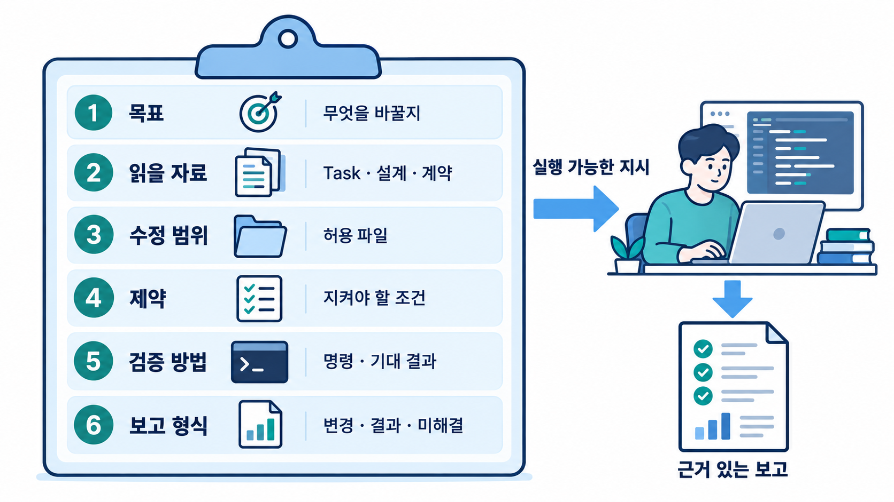

# 02-5. 개발용 프롬프트 엔지니어링

## 🎯 학습 목표

- 모호한 개발 요청을 목표·입력·범위·수용 기준·산출물이 있는 지시로 바꿀 수 있습니다.
- 지속 지침, Task 명세, 현재 단계의 프롬프트를 구분할 수 있습니다.
- 같은 작업을 두 도구에 전달하고 검증 증거로 프롬프트를 개선할 수 있습니다.

## 📋 사전 준비

- 선행 레슨: [02-1 PRD](./02-1-prd-with-agents.md), [02-3 작업 분해](./02-3-task-breakdown.md).
- 필요 도구/계정: 대상 저장소에서 사용할 수 있는 Claude Code와 Codex 세션. 한 도구만 있으면 실행하고 다른 도구의 비교는 미실행으로 남깁니다.
- 실습 상태: PRD·Task·실제 검증 명령이 있습니다. 없으면 [실행 가이드 Step 0~5](../../docs/workflow/README.md)를 먼저 진행합니다.
- 템플릿: [task-prompt.md](../../templates/task-prompt.md).
- 검증 범위: 공식 문서에 근거한 자연어 지시 실습입니다. 특정 CLI 버전의 실행 검증을 의미하지 않습니다.

## 💡 개념

### 그림으로 먼저 이해합니다: 프롬프트를 작업 의뢰서처럼 구성합니다



**그림 읽는 순서**

1. 여섯 칸을 위에서 아래로 확인합니다. 목표만 적지 않고 읽을 파일과 수정 가능한 범위, 지켜야 할 제약을 함께 전달합니다.
2. 마지막 두 칸에서 검증 명령·기대 결과와 보고 형식을 정합니다. 비밀값이나 관계없는 저장소 전체 내용을 붙여 넣지 않습니다.

개발용 프롬프트의 핵심은 긴 역할 설명보다 **실행할 작업의 계약**입니다. 대규모 저장소에서는 읽을 범위·수정할 범위·끝났다고 판단할 방법이 없으면 다른 기능까지 변경하거나 기존 구현을 중복 작성하기 쉽습니다.

| 위치 | 담을 것 | 담지 않을 것 |
|---|---|---|
| `AGENTS.md` / `CLAUDE.md` | 계속 적용할 규칙, 실행 명령, 관련 문서 안내 | 세션 전체 기록, 모든 Task의 상세 |
| PRD·Task·계약 | 기능 요구사항, 수용 기준, 의존성, 인터페이스 | 특정 세션의 긴 대화 |
| 현재 프롬프트 | 이번 단계, 읽을 파일, 변경 범위, 결과 형식 | 이미 있는 규칙의 장문 복제 |
| 핸드오프 | 현재 상태, 증거, 다음 행동 | 프로젝트 공통 규칙의 재정의 |

OpenAI는 목표·맥락·제약·완료 기준을 제시하는 방식을 안내합니다. Anthropic은 구체적인 소스·사례·검증 수단을 제공하는 방식을 안내합니다. 이 레슨은 이를 개발 Task에 적용합니다. 출처는 아래 참고 자료에 연결합니다.

## 👣 따라하기

### Step 1. 모호한 요청을 점검합니다

출발 요청을 “작업 필터를 추가합니다”로 정합니다. 바로 구현하기 전에 모호한 부분을 찾습니다.

**Claude Code 레시피**

```text
현재 Task와 PRD를 읽습니다. "작업 필터를 추가합니다"라는 요청에서
구현을 바꾸는 누락 정보만 찾습니다. 코드·문서로 확인할 수 있는 것은 먼저 조사합니다.
확인한 사실 / 필요한 결정 / 예상 검증을 분리해서 답합니다. 아직 수정하지 않습니다.
```

**Codex 레시피**

```text
현재 Task와 PRD를 근거로 필터 요청의 빠진 조건을 확인합니다.
입력 값·권한·기존 동작·API 또는 UI 범위를 구분합니다.
근거 파일과 결정을 바꾸는 질문을 제시합니다. 아직 수정하지 않습니다.
```

**기대 결과**: 질문은 문서에 없는 결정에 집중합니다. 이미 확정된 상태 값이나 인증 방식은 다시 묻지 않습니다.

### Step 2. 실행 가능한 프롬프트로 바꿉니다

[TaskFlow 예제](../../docs/workflow/taskflow-example.md)의 Task를 사용하거나 실제 프로젝트의 Task로 바꿉니다. 아래 경로는 예제 기준입니다.

**Claude Code 레시피**

```text
AGENTS.md의 공통 절차를 따라 TASK-001의 상태 필터를 구현합니다.
입력: docs/backlog/tasks/TASK-001-status-filter.md, docs/plans/TASK-001.md,
packages/contracts/openapi.yaml, docs/verification/strategy.md.
범위: 기존 API 라우트·서비스·테스트·계약과 작업 기록.
제외: 웹 UI, DB 스키마, 새 라이브러리, 다른 기능의 리팩터링.
AC-001~AC-006을 검증하며 기존 projectId·권한·pagination 조건을 유지합니다.
검증 전략의 실제 명령을 실행하고 실패 원인을 조사해 수정합니다.
결과는 변경 / 검증 / 미해결 / 다음 행동으로 보고하고 검증 기록을 갱신합니다.
```

**Codex 레시피**: 같은 입력·범위·기준을 가진 위 프롬프트를 사용합니다. 대상 경로의 지침도 실제로 읽었는지 확인합니다. 비교 실험이라면 같은 시작 revision의 별도 작업 사본에서 실행합니다.

**기대 결과**: 구현 위치·수용 기준·검증 경로가 정해집니다. 프롬프트가 정확해도 실제 테스트를 대신하지는 않습니다.

### Step 3. 실패 유형별로 피드백을 좁힙니다

| 증상 | 확인할 것 | 후속 지시 |
|---|---|---|
| 없는 파일·API를 사용합니다 | 실제 경로·버전·기존 사용 예 | 실제 정의 위치를 찾고 근거를 바탕으로 계획을 수정합니다 |
| 인접 기능까지 바꿉니다 | diff와 Task 범위의 차이 | 범위 밖 변경을 식별하고 해당 변경만 원상복구합니다. 사용자 변경은 보존합니다 |
| 테스트를 못 돌렸습니다 | 환경 문제인지 코드 문제인지 | 실패 명령·오류·필요 환경을 기록하고 해결 가능한 부분부터 진행합니다 |
| 같은 오류를 반복합니다 | 직전 가설을 지지하는 증거 | 수정 누적을 멈추고 재현·가설·확인 방법을 다시 정리합니다 |
| 구현과 테스트가 함께 틀렸습니다 | PRD·계약의 독립적인 기대 결과 | 수용 기준에서 반례를 도출해 테스트와 구현을 함께 수정합니다 |

**Claude Code 레시피**

```text
현재 diff가 Task 범위와 어긋난 지점을 파일별로 찾습니다.
그중 이번 에이전트 작업에서 생긴 변경만 조정하고 필요한 검사를 재실행합니다.
원래 사용자가 수정한 부분은 보존합니다.
```

**Codex 레시피**

```text
실패한 검사 하나를 선택해 재현 조건·가설·근거·최소 수정안을 정리합니다.
근거가 있는 수정만 수행하고 같은 재현과 관련 회귀 검사를 실행합니다.
검증 환경이 없으면 성공으로 보고하지 않습니다.
```

**기대 결과**: “더 잘하십시오” 대신 재현 가능한 피드백과 실행 증거가 남습니다.

### Step 4. 효과를 기록하고 필요한 부분만 재사용합니다

**Claude Code 레시피**

```text
이번 작업에서 사용한 핵심 프롬프트, 추가 개입, 범위 이탈,
수용 기준 충족, 검증 결과를 기록합니다. 실제로 관찰한 값만 사용합니다.
반복 적용할 규칙과 이번 Task에만 필요한 조건을 분리합니다.
```

**Codex 레시피**: 같은 기록 지시를 사용합니다. 비교 시 시작 revision·Task·환경을 맞추고, 실행하지 않은 도구의 결과를 추정해서 채우지 않습니다.

**기대 결과**: 한 번의 결과로 도구 전체의 성능을 단정하지 않고, 어떤 입력이 누락되어 재작업했는지 설명할 수 있습니다.

## ✅ 체크포인트

- [ ] 경로·요구사항 ID·단계·범위·검증이 연결됩니다.
- [ ] 모델이 스스로 확인할 사실과 사람이 결정할 사항을 구분합니다.
- [ ] 공통 지침을 중복 작성하지 않습니다.
- [ ] 기대 결과와 실제 실행 결과를 구별합니다.

## 🏠 숙제

| # | 유형 | 난이도 | 과제 | 완료 조건 |
|---|---|---|---|---|
| HW1 | 🔁 Reproduce | ★ | 모호한 요청을 작업 프롬프트로 바꿉니다 | 목표·입력·범위·수용 기준·산출물을 채웁니다 |
| HW2 | 🛠 Apply | ★★ | 실제 Task 하나를 구현·검증합니다 | 프롬프트·diff·실행 증거·수정 이유를 연결합니다 |
| HW3 | 🔬 Compare | ★★★ | 같은 시작 상태에서 두 도구를 비교합니다 | 개입·범위 이탈·AC 충족·검증 결과와 한계를 기록합니다 |

제출: `hw/02-5` 브랜치, `submissions/02-5.md` ([숙제 템플릿](../../docs/design/homework-template.md)). 회고에는 “다음 작업에서도 유지할 지시”와 “이번 작업에서만 필요했던 지시”를 각각 적습니다.

## ⚠️ 흔한 실수

- 프롬프트가 길지만 완료 조건이 없습니다 → 검사 가능한 출력과 상태를 적습니다.
- 한 번에 전체 서비스를 요청합니다 → 사용자 시나리오와 Task를 분리합니다.
- 예제 경로를 그대로 사용합니다 → 실제 저장소를 조사하고 경로를 치환합니다.
- 자연어로 읽기 전용을 요청하면 권한도 제한된다고 생각합니다 → 도구의 실제 권한 설정을 별도로 확인합니다.

## 🔗 참고 자료

- [OpenAI Best practices](https://learn.chatgpt.com/guides/best-practices)
- [Anthropic Best practices for Claude Code](https://code.claude.com/docs/en/best-practices)
- [공식 가이드와 이 저장소 운영 규칙의 구분](../../docs/reference/official-development-guides.md)
- [단계별 실행 가이드](../../docs/workflow/README.md)
