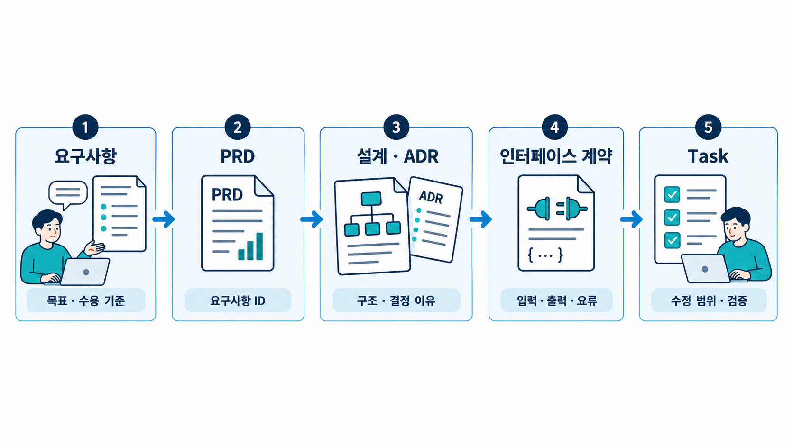

# Module 02 — Spec-Driven Development (명세 주도 개발)

코드 이전에 PRD·설계·작업 명세를 에이전트와 함께 만듭니다.

## 그림으로 시작합니다

먼저 그림에서 사람·문서·도구의 역할과 화살표 방향을 확인합니다. 각 레슨의 “그림 읽는 순서”를 읽은 다음 개념과 따라하기를 진행합니다.

- [요청을 개발에 사용할 파일로 바꿉니다](./02-1-prd-with-agents.md)에서 그림과 설명을 함께 확인합니다.
- [큰 기능을 한 번에 검증할 작업으로 나눕니다](./02-3-task-breakdown.md)에서 그림과 설명을 함께 확인합니다.
- [프롬프트를 작업 의뢰서처럼 구성합니다](./02-5-prompt-engineering.md)에서 그림과 설명을 함께 확인합니다.

제안서에 사용할 원본 PNG는 [전체 그림 목록](../../docs/design/illustrations.md)에서 찾습니다.

## 레슨
| # | 제목 | 상태 |
|---|---|---|
| 02-1 | [에이전트와 함께 PRD 쓰기](./02-1-prd-with-agents.md) | ✅ 초안 |
| 02-2 | [아키텍처 설계와 ADR](./02-2-architecture-and-adr.md) | ✅ 초안 |
| 02-3 | [작업 분해: Epic → Story → Task](./02-3-task-breakdown.md) | ✅ 초안 |
| 02-4 | [인터페이스 우선 설계](./02-4-interface-first.md) | ✅ 초안 |
| 02-5 | [개발용 프롬프트 엔지니어링](./02-5-prompt-engineering.md) | ✅ 초안 |

실제 프로젝트에서는 [단계별 실행 가이드](../../docs/workflow/README.md)에 따라 산출물을 연결합니다. [TaskFlow 적용 예제](../../docs/workflow/taskflow-example.md)에서 PRD → 계약 → Task → 프롬프트 → 검증 기록을 확인합니다.

- 레슨별 따라하기·숙제 상세는 [커리큘럼 설계서 §4](../../docs/design/curriculum-design.md#4-모듈-상세-설계)를 참고합니다.
- 레슨 작성 형식: [lesson-template.md](../../docs/design/lesson-template.md)
