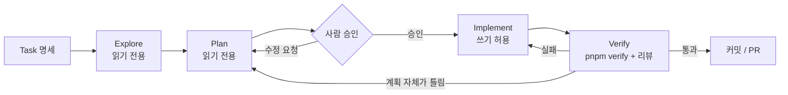

# 03-1. Explore → Plan → Implement → Verify 루프

## 🎯 학습 목표
- 하나의 Task 명세를 Explore → Plan → Implement → Verify 네 단계로 나눠 에이전트에게 지시할 수 있다.
- Claude Code의 `plan` 모드와 Codex의 `/plan`(+ `read-only` 샌드박스)으로 "코드를 건드리지 않는 탐색·계획 단계"를 만들 수 있다.
- 에이전트가 낸 계획을 검토 기준(범위, 파일 목록, 검증 방법, 위험)으로 평가하고 수정 요청을 할 수 있다.
- "에이전트가 됐다고 함"이 아니라 검증 커맨드 출력과 리뷰 결과로 완료를 판정할 수 있다.

## 📋 사전 준비
- 선행 레슨: [02-3 작업 분해](../02-spec-driven-development/02-3-task-breakdown.md), [01-2 권한·샌드박스](../01-environment-setup/01-2-permissions-and-sandbox.md)
- 필요 도구/계정: Claude Code 2.1.292 이상, Codex 0.160.1 이상, Node.js 22+, pnpm
- 실습 저장소 상태: Project B(TaskFlow)의 B1 완료 상태
  - `apps/api`(Fastify), `apps/web`(Next.js), `packages/db`(PostgreSQL 스키마·마이그레이션), `packages/shared`(공용 타입)가 있다.
  - 루트에 `CLAUDE.md`(`@AGENTS.md` import)와 `AGENTS.md`가 있다.
  - B0에서 만든 검증 커맨드 `pnpm verify`(lint + typecheck + test)가 동작한다.
  - `docs/tasks/`에 [templates/task-spec.md](../../templates/task-spec.md) 형식의 Task 명세가 있다. 이 레슨은 그중 `TASK-032`를 쓴다.

```markdown
# TASK-032: 작업 목록 필터 (status, assignee) API

- 관련 요구사항: FR-021
- 의존 작업: TASK-030 (Task 엔티티와 CRUD)
- 예상 변경 범위: apps/api/src/modules/tasks/, packages/shared/src/task.ts

## 목표
GET /projects/:projectId/tasks 에 status, assigneeId 쿼리 필터를 추가한다.

## 완료 조건
- [ ] `pnpm --filter @taskflow/api test -- tasks` 통과
- [ ] 잘못된 status 값은 400과 오류 코드 `INVALID_FILTER`를 반환한다
- [ ] `pnpm verify` 통과
## 범위 밖
- 웹 UI 필터 컴포넌트 (TASK-033)
```

> 패키지 이름(`@taskflow/api`)과 디렉터리 구조는 이 가이드의 참조 구성이다. 본인 저장소의 이름에 맞춰 바꾼다.

## 💡 개념

### 왜 "바로 구현"이 대규모에서 무너지는가
작은 저장소에서는 "필터 추가해줘" 한 줄로도 에이전트가 그럴듯한 결과를 낸다. 그러나 수만 라인 규모에서는 다음이 반복된다.

- **잘못된 위치에 구현한다.** 이미 있는 쿼리 빌더를 모르고 새 유틸리티를 만든다.
- **범위를 넘는다.** API만 고치라고 했는데 웹 컴포넌트까지 바꾼다.
- **검증 없이 끝낸다.** 테스트를 돌리지 않거나, 돌렸는데 실패한 것을 "대부분 통과"라고 보고한다.

원인은 하나다. 에이전트가 **코드베이스를 이해하는 일과 코드를 바꾸는 일을 한 번에** 한다. 이해가 틀리면 바꾼 코드 전체가 틀린다. 그래서 단계를 쪼개고, 각 단계 사이에 사람이 개입할 지점을 만든다.

### 네 단계와 각 단계의 산출물

| 단계 | 에이전트가 하는 일 | 쓰기 권한 | 산출물 | 사람의 역할 |
|---|---|---|---|---|
| Explore | 관련 코드·테스트·명세를 읽는다 | 없음 | 탐색 메모 (관련 파일, 기존 패턴) | 빠진 맥락을 알려준다 |
| Plan | 변경 파일, 순서, 검증 방법을 제안한다 | 없음 (계획 파일만 선택적으로) | 계획서 | **승인 또는 수정 요청** |
| Implement | 계획대로 작은 단위로 바꾼다 | 작업 디렉터리 | 커밋 가능한 diff | 계획 이탈 시 중단시킨다 |
| Verify | 검증 커맨드를 돌리고 스스로 리뷰한다 | 테스트 실행 | 검증 로그, 리뷰 결과 | 증거를 보고 완료를 판정한다 |



핵심은 **되돌아가는 화살표가 두 종류**라는 점이다. 테스트 실패는 Implement로 돌아가면 되지만, "계획 자체가 틀렸다"는 신호(예상하지 못한 파일을 계속 고쳐야 함, 같은 실패가 세 번 반복됨)가 보이면 Plan으로 돌아가야 한다. 이것을 구분하지 못하면 [00-4](../00-foundations/00-4-failure-patterns.md)에서 본 "무한 수정 루프"에 빠진다.

### 도구별 "읽기 전용 단계" 만들기

| 의도 | Claude Code | Codex |
|---|---|---|
| 탐색·계획만 하고 편집하지 않기 | `plan` 모드 (`Shift+Tab`으로 전환, `/plan`, 시작 시 `--permission-mode plan`) | TUI의 `/plan`(Plan 모드 전환), 또는 `--sandbox read-only --ask-for-approval on-request`로 시작 |
| 계획 승인 후 구현 | plan 모드에서 계획을 승인하고 다른 모드로 전환한다 | Plan 모드를 빠져나오거나 `workspace-write` 세션에서 구현을 지시한다 |
| 비대화형 검증 | `claude -p "..."` | `codex exec "..."` (기본 샌드박스가 read-only) |

두 도구의 계획 기능은 이름이 같아도 동작이 1:1로 대응하지 않는다. Claude Code의 `plan`은 권한 모드이고, Codex의 `/plan`은 TUI의 협업 모드다. 공통 원칙은 "계획 단계에서는 쓰기 권한을 주지 않는다" 하나다.

## 👣 따라하기

### Step 1. Explore — 읽기 전용으로 코드베이스를 탐색시킨다
목적: 에이전트가 기존 패턴(라우트 구조, 검증 스키마, 테스트 방식)을 먼저 파악하게 한다.

**Claude Code 레시피**
```bash
cd taskflow
claude --permission-mode plan
```
```text
> docs/tasks/TASK-032.md 를 읽어라. 아직 아무것도 수정하지 마라.
  다음을 조사해서 보고해라.
  1. GET /projects/:projectId/tasks 라우트가 정의된 파일과 핸들러 흐름
  2. 쿼리 파라미터 검증에 쓰는 기존 방식(스키마 라이브러리, 공용 헬퍼)
  3. 같은 모듈의 기존 테스트 파일과 테스트 DB 준비 방식
  4. 오류 코드(INVALID_*)를 정의하는 위치
  각 항목마다 파일 경로와 근거가 되는 코드 위치를 적어라.
```

**Codex 레시피**
```bash
cd taskflow
codex --sandbox read-only --ask-for-approval on-request
```
```text
> (Claude Code와 같은 프롬프트)
```

**기대 결과**
- 파일이 하나도 바뀌지 않는다. `git status`가 깨끗하다.
- 보고에 실제 존재하는 경로가 나온다. 의심스러운 경로는 직접 열어 확인한다.
- "기존에 `parseQuery()` 같은 헬퍼가 있다"처럼 **재사용할 패턴**이 언급된다. 언급이 없으면 다음 프롬프트로 보강한다.

```text
> apps/api/src/modules/projects/ 에서 이미 쿼리 필터를 구현한 사례가 있는지 찾아라.
  있으면 그 방식을 따르는 것을 전제로 해라.
```

> 💡 탐색 결과가 길면 그대로 다음 단계로 넘기지 말고 핵심 5줄로 요약하게 한다. 탐색 출력은 컨텍스트를 많이 먹는다([03-4](./03-4-context-management.md)).

### Step 2. Plan — 검토 가능한 계획서를 받는다
목적: 사람이 승인 여부를 판단할 수 있는 형식의 계획을 받는다.

계획서에 반드시 들어가야 할 항목을 프롬프트에 명시한다. 형식을 정하지 않으면 에이전트는 "1. 코드를 수정한다 2. 테스트한다" 수준의 계획을 낸다.

**Claude Code 레시피** (Step 1 세션 계속, 여전히 `plan` 모드)
```text
> 탐색 결과를 바탕으로 TASK-032 구현 계획을 세워라. 형식:
  ## 변경 파일 (신규/수정 구분, 파일마다 변경 이유 한 줄)
  ## 구현 순서 (각 단계 끝에 실행할 검증 커맨드)
  ## 테스트 케이스 목록 (정상 2개 이상, 오류 2개 이상)
  ## 범위 밖으로 둔 것
  ## 위험과 가정 (확인하지 못한 것은 "가정"으로 표시)
  변경 파일이 5개를 넘으면 Task를 나누자고 제안해라.
```

**Codex 레시피** (Step 1 세션 계속)
```text
> /plan
```
```text
> (Claude Code와 같은 계획 프롬프트)
```

**기대 결과**
- 계획서가 다섯 섹션을 모두 갖췄다.
- 변경 파일이 Task 명세의 "예상 변경 범위" 안에 있다. 웹(`apps/web`) 파일이 들어 있으면 범위 이탈이다.
- 각 구현 단계에 `pnpm --filter @taskflow/api test -- tasks` 같은 **실행 가능한 검증 커맨드**가 붙어 있다.

계획을 저장해 두면 Verify 단계와 세션이 끊겼을 때 다시 쓸 수 있다.

```text
> 이 계획을 docs/plans/TASK-032.md 로 저장할 수 있게 마크다운 원문만 출력해라.
```

plan 모드와 read-only 샌드박스에서는 파일을 쓸 수 없으므로, 출력된 원문을 사람이 저장하거나 Step 4에서 쓰기 권한이 생긴 뒤 에이전트에게 저장시킨다.

### Step 3. 계획 검토 — 승인 또는 수정 요청
목적: 사람이 개입하는 가장 값싼 지점에서 오류를 잡는다. 이 단계는 도구와 무관하다.

다음 체크리스트로 계획을 본다.

| 검토 항목 | 확인 질문 | 문제일 때 보낼 수정 요청 예 |
|---|---|---|
| 범위 | 명세의 "범위 밖"을 건드리는가? | "웹 컴포넌트 변경은 TASK-033이다. 계획에서 빼라." |
| 재사용 | 기존 헬퍼·패턴을 쓰는가? | "새 검증 유틸을 만들지 말고 `packages/shared`의 스키마를 확장해라." |
| 검증 | 단계마다 실행 가능한 커맨드가 있는가? | "3단계 끝에 실행할 테스트 커맨드를 구체적으로 적어라." |
| 테스트 | 오류 케이스가 명세의 완료 조건과 맞는가? | "`INVALID_FILTER` 400 케이스를 추가해라." |
| 가정 | 확인하지 않은 가정이 있는가? | "assigneeId가 UUID인지 스키마에서 확인하고 계획을 고쳐라." |

**Claude Code 레시피**
```text
> 계획 수정 요청: (위 표의 수정 요청을 붙여넣는다). 수정된 계획 전체를 다시 보여줘라.
```
수정이 끝나면 Claude Code가 계획 승인을 물을 때 승인하고, 구현 단계에서 쓸 모드를 고른다. 이 실습에서는 편집을 자동 승인하는 `acceptEdits`나 기본 `auto`를 쓴다. 승인 대화상자의 선택지 문구는 버전마다 다를 수 있다.

**Codex 레시피**
```text
> 계획 수정 요청: (같은 내용). 수정된 계획 전체를 다시 보여줘라.
```
승인한 계획을 구현하려면 쓰기 권한이 있는 세션이 필요하다. read-only로 시작했다면 `/permissions`에서 권한을 바꾸거나, 세션을 끝내고 Step 4처럼 새로 시작한다.

**기대 결과**
- 수정 요청이 반영된 최종 계획이 있다.
- 수정 요청 횟수와 내용을 기록해 둔다(숙제 HW2의 비교 자료가 된다).

### Step 4. Implement — 계획을 단계별로 실행시킨다
목적: 승인된 계획을 벗어나지 않고, 단계마다 검증하며 구현하게 한다.

**Claude Code 레시피**
```text
> 승인한 계획을 docs/plans/TASK-032.md 로 저장하고, 구현 순서 1단계만 수행해라.
  단계가 끝나면 그 단계의 검증 커맨드를 실행하고 결과를 보여준 뒤 멈춰라.
  계획에 없는 파일을 수정해야 하면 수정하기 전에 이유를 말하고 멈춰라.
```

**Codex 레시피**
```bash
codex --sandbox workspace-write --ask-for-approval on-request
```
```text
> docs/plans/TASK-032.md 에 승인된 계획이 있다(없으면 내가 붙여넣는 계획을 그 경로에 저장해라).
  구현 순서 1단계만 수행해라. 단계가 끝나면 그 단계의 검증 커맨드를 실행하고 결과를 보여준 뒤 멈춰라.
  계획에 없는 파일을 수정해야 하면 수정하기 전에 이유를 말하고 멈춰라.
```

1단계 결과를 확인하면 "다음 단계 진행"으로 이어간다. 익숙해지면 "2~3단계를 연속으로 하되 실패하면 멈춰라"처럼 단위를 키운다.

**기대 결과**
- 단계마다 테스트 출력이 대화에 남는다.
- `git diff --stat`의 파일 목록이 계획서의 "변경 파일"과 일치한다.
- 계획에 없는 파일이 등장하면 에이전트가 먼저 멈추고 이유를 설명한다. 설명 없이 바뀌었다면 프롬프트의 중단 조건을 더 강하게 쓴다.

> ⚠️ 같은 테스트가 수정 후에도 세 번 연속 실패하면 Implement를 멈추고 Plan으로 돌아간다. "계획의 어떤 가정이 틀렸는지 설명하고 계획을 고쳐라"라고 지시한다.

### Step 5. Verify — 증거로 완료를 판정한다
목적: 검증 커맨드 출력과 리뷰 결과를 근거로 완료를 판정한다.

**Claude Code 레시피**
```text
> pnpm verify 를 실행하고 마지막 30줄을 그대로 보여줘라. 요약하지 마라.
> docs/tasks/TASK-032.md 의 완료 조건을 하나씩 확인하고, 각 조건을 증명하는 출력이나 테스트 이름을 표로 적어라.
```
그다음 같은 세션에서 자기 리뷰를 실행한다.
```text
> /code-review medium
```

**Codex 레시피**
```text
> pnpm verify 를 실행하고 마지막 30줄을 그대로 보여줘라. 요약하지 마라.
> docs/tasks/TASK-032.md 의 완료 조건을 하나씩 확인하고, 각 조건을 증명하는 출력이나 테스트 이름을 표로 적어라.
```
리뷰는 TUI의 `/review`를 쓰거나, 세션 밖에서 비대화형으로 실행한다.
```bash
codex review --uncommitted
```

**기대 결과**
- `pnpm verify`가 종료 코드 0으로 끝난다. 사람이 직접 한 번 더 실행해 확인한다.
- 완료 조건 표의 모든 행에 증거가 있다. 증거 칸이 "구현함"처럼 말로만 채워져 있으면 미완료로 본다.
- 리뷰 지적 중 타당한 것은 Implement로 돌아가 고치고, 타당하지 않은 것은 이유를 기록한다.

> 💡 구현한 도구와 다른 도구로 리뷰하면 더 많은 문제를 찾는 경우가 많다. 교차 리뷰는 [04-2](../04-quality-and-verification/04-2-cross-review.md)에서 본격적으로 다룬다.

### Step 6. 루프 기록 남기기
목적: 어느 단계에서 사람이 개입했는지 기록해 다음 Task의 프롬프트를 개선한다. 도구와 무관한 단계다.

`docs/plans/TASK-032.md` 끝에 다음 섹션을 추가하게 한다.

**Claude Code 레시피 / Codex 레시피** (두 도구에 같은 프롬프트)
```text
> docs/plans/TASK-032.md 끝에 "## 실행 기록" 섹션을 추가해라.
  - 계획 수정 요청 횟수와 내용
  - 구현 중 계획에서 벗어난 지점과 이유
  - 검증 실패 횟수와 원인
  - 다음 Task 프롬프트에 반영할 규칙 1~2개
```

**기대 결과**: 반복되는 수정 요청(예: "기존 헬퍼를 재사용해라")이 보이면 `AGENTS.md`의 규칙으로 옮길 후보가 된다([06-4](../06-team-and-operations/06-4-knowledge-loop.md)).

## ✅ 체크포인트
- [ ] Explore·Plan 단계에서 `git status`가 깨끗했다 (읽기 전용이 지켜졌다).
- [ ] 계획서에 변경 파일, 구현 순서(+검증 커맨드), 테스트 케이스, 범위 밖, 위험·가정이 모두 있다.
- [ ] 계획에 최소 한 번 수정 요청을 보내고 반영을 확인했다.
- [ ] `git diff --stat`의 파일 목록이 승인된 계획과 일치한다.
- [ ] `pnpm verify`를 사람이 직접 실행해 통과를 확인했다.
- [ ] 완료 조건 표의 모든 행에 증거(출력, 테스트 이름)가 있다.
- [ ] Claude Code와 Codex 중 최소 하나로 리뷰를 실행하고 지적을 처리했다.

## 🏠 숙제
| # | 유형 | 난이도 | 과제 | 완료 조건 |
|---|---|---|---|---|
| HW1 | 🔁 Reproduce | ★ | 따라하기 Step 1~5를 본인 TaskFlow 저장소의 Task 1개로 재현한다 | `docs/plans/TASK-xxx.md`(계획 + 실행 기록)가 있고, `pnpm verify` 통과 로그와 리뷰 결과가 제출 파일에 첨부됨 |
| HW2 | 🔬 Compare | ★★ | 비슷한 크기의 Task 2개를 하나는 "바로 구현", 하나는 "계획 후 구현"으로 수행하고 비교한다 (같은 도구 사용) | 두 방식 각각의 소요 시간, 사람 개입 횟수, 계획 밖 변경 파일 수, 검증 실패 횟수, 리뷰 지적 수를 표로 정리하고 결론 3줄 이상 작성 |
| HW3 | 🚀 Challenge | ★★★ | 같은 Task를 Claude Code와 Codex로 각각 "계획 후 구현"하고 계획서 품질과 결과물을 비교한다. 반복된 수정 요청을 `AGENTS.md` 규칙으로 옮긴다 | 두 계획서 원문, 계획 품질 비교표(범위·재사용·검증·가정 4항목 점수), `AGENTS.md` 변경 diff, 규칙 반영 후 다른 Task 1개에서 수정 요청 횟수가 줄었는지 기록 |

제출: `hw/03-1` 브랜치, `submissions/03-1.md` (템플릿: [docs/design/homework-template.md](../../docs/design/homework-template.md))

## ⚠️ 흔한 실수
- **계획 단계에서 파일이 바뀌었다** → 기본 모드(`auto`) 또는 `workspace-write` 세션에서 "계획만 세워라"라고 말로만 지시했다 → Claude Code는 `--permission-mode plan`으로 시작하거나 `Shift+Tab`으로 plan 모드를 켜고, Codex는 `/plan` 또는 `--sandbox read-only`로 시작한다. 말이 아니라 권한으로 막는다.
- **계획이 너무 추상적이다** ("모듈을 수정한다, 테스트를 추가한다") → 계획서 형식을 지정하지 않았다 → Step 2의 다섯 섹션 형식을 프롬프트에 넣고, 각 단계에 실행 가능한 검증 커맨드를 요구한다.
- **구현이 계획을 조용히 벗어난다** → 중단 조건을 주지 않았다 → "계획에 없는 파일을 수정해야 하면 먼저 이유를 말하고 멈춰라"를 매 Implement 프롬프트에 넣고, 단계마다 `git diff --stat`을 계획과 대조한다.
- **"모든 테스트 통과"라는 보고만 믿었다** → 에이전트의 요약은 증거가 아니다 → 출력 원문(마지막 N줄)을 요구하고, 사람이 `pnpm verify`를 한 번 더 실행한다.
- **같은 실패를 계속 고친다** → Implement 실패와 계획 오류를 구분하지 않았다 → 같은 실패가 세 번 반복되면 Plan으로 돌아가 "어떤 가정이 틀렸는지"부터 묻는다.

## 🔗 참고 자료
- Claude Code: [Permission modes](https://code.claude.com/docs/en/permission-modes), [Common workflows](https://code.claude.com/docs/en/common-workflows), [Commands](https://code.claude.com/docs/en/commands), [Code review](https://code.claude.com/docs/en/code-review)
- Codex: [Approvals & security](https://learn.chatgpt.com/docs/agent-approvals-security), [Slash commands](https://learn.chatgpt.com/docs/developer-commands?surface=cli), [Code review](https://learn.chatgpt.com/docs/code-review), [Non-interactive mode](https://learn.chatgpt.com/docs/non-interactive-mode)
- 이 저장소: [도구 레퍼런스](../../docs/reference/tool-reference.md), [Task 명세 템플릿](../../templates/task-spec.md)
- 관련 레슨: [02-3 작업 분해](../02-spec-driven-development/02-3-task-breakdown.md), [03-2 에이전트와 TDD](./03-2-tdd-with-agents.md), [03-4 컨텍스트 관리](./03-4-context-management.md), [00-4 실패 패턴](../00-foundations/00-4-failure-patterns.md), [04-1 검증 계층](../04-quality-and-verification/04-1-verification-layers.md)
- 프로젝트: [Project B — TaskFlow](../../projects/B-development-project/README.md) (B3에서 이 루프를 기본 작업 방식으로 쓴다)
