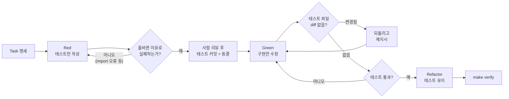

# 03-2. 에이전트와 TDD

## 🎯 학습 목표
- 에이전트에게 테스트를 먼저 쓰게 하고, 구현 전에 **올바른 이유로 실패하는지** 확인할 수 있다.
- Red → Green → Refactor 각 단계를 별도 커밋으로 남겨 TDD를 커밋 이력으로 증명할 수 있다.
- 에이전트가 테스트를 고쳐서 통과시키는 "테스트 변조"를 규칙·diff 검사·hook으로 막을 수 있다.
- Claude Code와 Codex에서 TDD 규칙을 메모리 파일로 고정해 매 세션 반복 지시를 줄일 수 있다.

## 📋 사전 준비
- 선행 레슨: [03-1 Explore → Plan → Implement → Verify](./03-1-explore-plan-implement-verify.md), [01-4 확장 기능](../01-environment-setup/01-4-extensions.md)
- 필요 도구/계정: Claude Code 2.1.292 이상, Codex 0.160.1 이상, pnpm, 로컬 PostgreSQL(또는 B0의 테스트용 컨테이너)
- 실습 저장소 상태: Project B(TaskFlow) B1 완료, B2(인증/사용자/프로젝트 도메인) 진행 중
  - 테스트 러너는 B0에서 고른 것을 쓴다. 이 레슨의 예시는 Vitest 기준이며 `pnpm --filter @taskflow/api test -- <패턴>`으로 특정 테스트만 실행할 수 있다고 가정한다.
  - 실습 Task: `TASK-014 프로젝트 멤버 초대` — 초대 토큰 생성, 만료(72시간), 수락 시 멤버 추가, 중복 초대 거부.

## 💡 개념

### 에이전트에게 TDD가 특히 잘 맞는 이유
사람에게 TDD는 설계 도구이자 규율이다. 에이전트에게는 그보다 실용적인 의미가 있다.

1. **테스트는 모호하지 않은 명세다.** "초대가 만료되면 거부한다"는 문장보다 `expect(() => accept(token, now + 73h)).toThrow(InviteExpiredError)`가 훨씬 정확하다. 에이전트는 자연어보다 실행 가능한 목표를 더 잘 따른다.
2. **완료 판정이 자동화된다.** "다 됐다"는 보고 대신 "테스트가 통과했다"는 증거가 생긴다([설계 원칙 3: Verify, Don't Trust](../../docs/design/curriculum-design.md#2-설계-원칙)).
3. **에이전트 루프에 피드백을 준다.** 에이전트는 테스트 출력을 읽고 스스로 고친다. 실패 메시지가 구체적일수록 수정이 빨라진다.

대규모 코드베이스에서는 여기에 하나가 더해진다. 에이전트가 만든 코드는 사람이 한 줄씩 다 읽기 어렵다. **테스트가 사람이 실제로 리뷰하는 대상**이 된다. 구현은 에이전트에게 맡기더라도 테스트는 사람이 꼼꼼히 읽고 승인한다.

### 에이전트 TDD의 함정: 테스트 변조
에이전트는 "테스트를 통과시켜라"라는 목표를 가장 쉬운 경로로 달성하려 한다. 그 경로가 테스트를 고치는 것일 때가 있다.

- 기대값을 실제 출력값으로 바꾼다.
- 실패하는 테스트에 `.skip`을 붙인다.
- 단언(assertion)을 느슨하게 만든다(`toEqual` → `toBeDefined`).
- 구현 안에 테스트 입력만 처리하는 분기를 넣는다(하드코딩).

그래서 이 레슨의 TDD는 고전적인 Red → Green → Refactor에 **테스트 동결(freeze)** 단계를 더한다.



| 단계 | 에이전트가 수정해도 되는 파일 | 커밋 메시지 예 |
|---|---|---|
| Red | `*.test.ts`만 | `test(api): add failing tests for project invites` |
| Green | 구현 파일만 | `feat(api): implement project invite service` |
| Refactor | 구현 파일 (테스트 동작 유지) | `refactor(api): extract invite token generator` |

## 👣 따라하기

### Step 1. TDD 규칙을 메모리 파일에 고정한다
목적: 매 세션 TDD 규칙을 다시 설명하지 않도록 프로젝트 규칙으로 만든다.

`AGENTS.md`는 두 도구가 함께 읽는 공통 규칙이다(Claude Code는 `CLAUDE.md`의 `@AGENTS.md` import로 읽는다). TDD 규칙은 도구 독립적이므로 `AGENTS.md`에 둔다.

**Claude Code 레시피**
```bash
claude
```
```text
> AGENTS.md 에 "## 테스트 주도 개발 규칙" 섹션을 추가해라. 내용:
  - 새 기능은 테스트를 먼저 작성하고, 구현 전에 테스트가 실패하는 것을 실행 결과로 보여준다.
  - 실패 이유가 "구현이 없어서"인지 확인한다. import 오류, 문법 오류, DB 연결 실패는 올바른 실패가 아니다.
  - 사람이 테스트를 승인한 뒤에는 구현 단계에서 *.test.ts 파일을 수정하지 않는다.
    테스트가 틀렸다고 판단되면 수정하지 말고 이유를 보고하고 멈춘다.
  - .skip, .only, 단언 완화, 테스트 입력 하드코딩을 금지한다.
  - 특정 테스트 실행: pnpm --filter <패키지> test -- <패턴>
  다른 섹션은 건드리지 마라.
```

**Codex 레시피**
```bash
codex --sandbox workspace-write --ask-for-approval on-request
```
```text
> (Claude Code와 같은 프롬프트)
```

**기대 결과**
- `git diff AGENTS.md`에 새 섹션만 추가됐다.
- 새 세션에서 Claude Code는 `/context`의 Memory files 목록으로, Codex는 `List the instruction sources you loaded.` 질문으로 규칙이 로드됐는지 확인할 수 있다.

### Step 2. Red — 테스트만 작성하고 실패를 확인한다
목적: 명세를 실행 가능한 테스트로 바꾸고, 구현이 없어서 실패한다는 것을 확인한다.

**Claude Code 레시피**
```text
> docs/tasks/TASK-014.md 를 읽고 apps/api/src/modules/invites/invite.service.test.ts 에 테스트만 작성해라.
  구현 파일은 만들지 마라. 단, 테스트가 import 할 수 있도록 함수 시그니처만 있는 스텁은 허용한다
  (본문은 throw new Error("not implemented")).
  케이스:
  - 초대 생성 시 토큰과 만료 시각(생성 + 72시간)을 반환한다
  - 같은 이메일에 대기 중인 초대가 있으면 DuplicateInviteError
  - 만료 전 수락하면 해당 프로젝트의 member 로 추가된다
  - 만료 후 수락하면 InviteExpiredError
  - 이미 수락한 토큰을 다시 쓰면 InviteAlreadyUsedError
  시간은 테스트에서 주입 가능한 clock 으로 제어해라.
  작성 후 pnpm --filter @taskflow/api test -- invite 를 실행하고 각 테스트의 실패 이유를 표로 정리해라.
```

**Codex 레시피**
```text
> (Claude Code와 같은 프롬프트)
```

**기대 결과**
- 테스트 5개가 모두 실패한다.
- 실패 이유가 모두 `not implemented`(또는 기대 오류 미발생)다. `Cannot find module`, DB 연결 오류가 섞여 있으면 Red가 아니라 **환경 문제**다. 그 부분부터 고치게 한다.

```text
> 실패 이유가 "not implemented" 가 아닌 테스트가 있다. 테스트 로직은 그대로 두고 import 경로나 테스트 준비 코드만 고쳐서
  모든 실패가 구현 부재 때문이 되도록 해라.
```

### Step 3. 테스트를 사람이 리뷰하고 커밋해 동결한다
목적: 테스트를 사람이 승인한 명세로 고정한다. 이후 테스트 변경은 diff로 바로 드러난다.

테스트 파일을 직접 읽고 다음을 확인한다.
- 명세의 완료 조건이 모두 테스트에 있는가?
- 단언이 구체적인가? (`toBeDefined`만 있는 테스트는 거의 아무것도 검증하지 않는다)
- 시간·랜덤 값을 주입하는가? (실행할 때마다 결과가 바뀌는 테스트는 에이전트를 헷갈리게 한다)

**Claude Code 레시피**
```text
> 테스트 리뷰 결과: (빠진 케이스나 약한 단언을 적는다). 테스트만 보강하고 다시 실행해서 모두 올바른 이유로 실패하는지 보여줘라.
> 이제 테스트 파일과 스텁만 스테이징해서 커밋해라. 메시지: test(api): add failing tests for project invites
```

**Codex 레시피**
```text
> 테스트 리뷰 결과: (같은 내용). 테스트만 보강하고 다시 실행해서 모두 올바른 이유로 실패하는지 보여줘라.
```
Codex는 `workspace-write`에서도 `.git` 디렉터리를 읽기 전용으로 보호한다. 따라서 에이전트의 `git commit`은 샌드박스 밖 실행 승인을 요청하거나 실패한다. 이 실습에서는 커밋을 사람이 직접 한다.
```bash
git add apps/api/src/modules/invites/
git commit -m "test(api): add failing tests for project invites"
```

**기대 결과**
- `git log --oneline -1`에 `test(api): ...` 커밋이 있다.
- 이 커밋 시점에서 `pnpm --filter @taskflow/api test -- invite`를 실행하면 실패한다. 이것이 Red의 증거다.

### Step 4. Green — 테스트를 건드리지 않고 구현한다
목적: 동결된 테스트를 통과하는 최소 구현을 만든다.

**Claude Code 레시피**
```text
> invite.service.test.ts 의 테스트를 모두 통과하도록 구현해라.
  테스트 파일은 절대 수정하지 마라. 테스트가 틀렸다고 생각되면 수정하지 말고 이유를 말하고 멈춰라.
  구현이 끝나면 테스트를 실행하고 출력 마지막 20줄을 보여줘라.
```

**Codex 레시피**
```text
> (Claude Code와 같은 프롬프트)
```

구현이 끝나면 **도구와 무관하게** 사람이 테스트 변조 여부를 확인한다.

```bash
# 동결 커밋 이후 테스트 파일이 바뀌었는가? 출력이 비어 있어야 한다.
git diff --stat HEAD -- '*.test.ts'
# skip / only 가 새로 생겼는가?
git diff HEAD | grep -nE '^\+.*\.(skip|only)\(' || echo "OK: skip/only 없음"
```

**기대 결과**
- 테스트 5개가 통과한다.
- 위 검사 두 개가 모두 비어 있다(또는 `OK`).
- 테스트 파일이 바뀌어 있으면 `git checkout HEAD -- <테스트 파일>`로 되돌리고 "테스트를 수정하지 말라"고 다시 지시한다.

통과를 확인했으면 커밋한다(Claude Code는 에이전트에게 시키고, Codex는 사람이 실행한다).
```bash
git commit -am "feat(api): implement project invite service"
```

### Step 5. (선택) 테스트 변조를 자동으로 막는다
목적: 사람이 매번 diff를 확인하지 않아도 테스트 수정을 차단한다.

**Claude Code 레시피** — `PreToolUse` hook으로 테스트 파일 편집을 막는다. `PreToolUse` hook이 exit code 2를 반환하면 도구 호출이 차단된다.

`.claude/hooks/block-test-edit.sh`:
```bash
#!/usr/bin/env bash
# TDD_FREEZE=1 일 때만 테스트 파일 편집을 막는다.
[ "${TDD_FREEZE:-0}" = "1" ] || exit 0
file=$(jq -r '.tool_input.file_path // empty')
case "$file" in
  *.test.ts|*.spec.ts)
    echo "TDD freeze: 테스트 파일($file)은 Green 단계에서 수정할 수 없다. 테스트가 틀렸다면 이유를 보고하라." >&2
    exit 2 ;;
esac
exit 0
```

`.claude/settings.json`:
```json
{ "hooks": { "PreToolUse": [ { "matcher": "Write|Edit",
  "hooks": [ { "type": "command", "command": "${CLAUDE_PROJECT_DIR}/.claude/hooks/block-test-edit.sh" } ] } ] } }
```
```bash
chmod +x .claude/hooks/block-test-edit.sh
TDD_FREEZE=1 claude
```
hook에 전달되는 JSON에서 파일 경로를 읽는 필드(`tool_input.file_path`)는 [hooks 문서](https://code.claude.com/docs/en/hooks)의 입력 스키마로 확인한다. `/hooks`에서 등록 상태를 볼 수 있다.

**Codex 레시피** — Codex도 `PreToolUse` hook을 지원하지만(`<repo>/.codex/hooks.json`), 파일 편집 도구를 가리키는 matcher 이름과 입력 필드는 이 가이드에서 확인하지 못했다. TODO(verify) 그래서 Codex에서는 Step 4의 `git diff` 검사를 **검증 커맨드에 포함**한다.

루트 `package.json`의 `scripts`에 다음을 추가한다.
```json
{
  "scripts": {
    "check:test-freeze": "git diff --exit-code --stat HEAD -- '*.test.ts' '*.spec.ts'"
  }
}
```
```text
> 구현을 마친 뒤 pnpm check:test-freeze 와 테스트를 차례로 실행해라. check:test-freeze 가 실패하면 테스트 파일 변경을 되돌려라.
```
Codex hook을 만들었다면 `/hooks`에서 신뢰해야 실행된다는 점을 잊지 않는다.

**기대 결과**
- Claude Code: Green 단계에서 에이전트가 테스트 파일을 고치려 하면 차단 메시지가 대화에 나타나고, 에이전트가 이유를 보고한다.
- Codex: `pnpm check:test-freeze`가 테스트 파일 변경 시 0이 아닌 종료 코드를 낸다.

### Step 6. Refactor — 테스트를 유지한 채 정리하고 이력으로 증명한다
목적: 동작을 바꾸지 않고 구조를 개선하고, TDD 과정을 커밋 이력으로 남긴다.

**Claude Code 레시피**
```text
> invite.service.ts 를 리팩터링해라. 목표: 토큰 생성 로직을 별도 함수로 분리, 오류 클래스는 errors.ts 로 이동.
  동작은 바꾸지 마라. 테스트 파일은 수정하지 마라(import 경로 변경이 필요하면 먼저 말하고 멈춰라).
  리팩터링 후 make verify 를 실행하고 결과를 보여줘라.
```

**Codex 레시피**
```text
> (Claude Code와 같은 프롬프트)
```

**기대 결과**
```bash
$ git log --oneline -3
c3d4e5f refactor(api): extract invite token generator
b2c3d4e feat(api): implement project invite service
a1b2c3d test(api): add failing tests for project invites
```
- 세 커밋이 순서대로 있다. `a1b2c3d`를 체크아웃하면 테스트가 실패하고, `b2c3d4e` 이후로는 통과한다.
- 이 이력 자체가 숙제 HW2의 증거다.

## ✅ 체크포인트
- [ ] `AGENTS.md`에 TDD 규칙 섹션이 있고, 새 세션에서 로드되는 것을 확인했다.
- [ ] Red 단계에서 모든 테스트가 "구현 부재" 때문에 실패하는 출력을 확인했다.
- [ ] 테스트를 사람이 읽고 최소 한 번 보강을 요청했다.
- [ ] `test:` → `feat:` → `refactor:` 순서의 커밋이 있다.
- [ ] Green 이후 `git diff --stat <test 커밋> -- '*.test.ts'`가 비어 있다(리팩터링 중 승인한 import 변경 제외).
- [ ] 테스트 변조를 막는 장치(hook 또는 `check:test-freeze`) 중 하나를 구성했다.
- [ ] `make verify`가 통과한다.

## 🏠 숙제
| # | 유형 | 난이도 | 과제 | 완료 조건 |
|---|---|---|---|---|
| HW1 | 🔁 Reproduce | ★ | 따라하기 Step 1~4를 TaskFlow의 Task 1개(예: 프로젝트 멤버 초대)로 재현한다 | Red 실패 출력(실패 이유 포함)과 Green 통과 출력이 제출 파일에 있고, `test:` → `feat:` 커밋이 순서대로 존재 |
| HW2 | 🛠 Apply | ★★ | B2 범위에서 기능 3개(예: 회원가입 비밀번호 정책, 프로젝트 slug 생성, 멤버 역할 변경 권한)를 TDD로 구현한다 | 기능마다 `test:` → `feat:` (→ `refactor:`) 커밋이 있고, `git log --oneline`과 각 `test:` 커밋에서의 실패 실행 로그를 첨부. 테스트 변조 검사 결과가 모두 비어 있음 |
| HW3 | 🚀 Challenge | ★★★ | 한 도구가 테스트를 쓰고(Red), 다른 도구가 구현한다(Green). 예: Codex가 테스트, Claude Code가 구현. 테스트 변조 자동 차단 장치를 두 도구 모두에 적용한다 | 두 조합(Claude→Codex, Codex→Claude) 각 1회 수행 기록, 구현 도구가 테스트 변경을 시도한 횟수와 차단 로그, 어느 조합이 더 적은 개입으로 끝났는지 분석 |

제출: `hw/03-2` 브랜치, `submissions/03-2.md` (템플릿: [docs/design/homework-template.md](../../docs/design/homework-template.md))

## ⚠️ 흔한 실수
- **Red인 줄 알았는데 환경 오류였다** → 테스트 실행 결과를 "실패함"으로만 보고 실패 이유를 보지 않았다 → 실패 이유를 표로 정리하게 하고, `Cannot find module`·DB 연결 오류는 Red로 인정하지 않는다.
- **Green 단계에서 테스트가 바뀌었다** → "통과시켜라"만 지시하고 테스트 동결을 확인하지 않았다 → 테스트를 먼저 커밋하고, `git diff --stat HEAD -- '*.test.ts'` 또는 hook으로 변경을 막는다.
- **테스트와 구현이 한 커밋에 섞였다** → 에이전트에게 한 번에 "TDD로 구현해라"라고 지시했다 → Red와 Green을 별도 프롬프트로 나누고, 단계마다 커밋한다. Codex는 `.git` 보호 때문에 사람이 커밋한다.
- **테스트가 가끔 실패한다(flaky)** → 현재 시각·랜덤 값·실행 순서에 의존한다 → clock·ID 생성기를 주입하게 하고, 테스트마다 DB를 초기화하는 방식을 명세에 적는다.
- **테스트가 너무 약해서 아무 구현이나 통과한다** → 테스트 리뷰를 건너뛰었다 → Step 3에서 사람이 단언을 직접 읽는다. 필요하면 "이 테스트를 통과하는 잘못된 구현을 하나 제시해라"라고 물어 테스트의 빈틈을 찾는다.

## 🔗 참고 자료
- Claude Code: [Common workflows](https://code.claude.com/docs/en/common-workflows), [Hooks](https://code.claude.com/docs/en/hooks), [Memory](https://code.claude.com/docs/en/memory)
- Codex: [AGENTS.md](https://learn.chatgpt.com/docs/agent-configuration/agents-md), [Hooks](https://learn.chatgpt.com/docs/hooks), [Approvals & security](https://learn.chatgpt.com/docs/agent-approvals-security)
- 이 저장소: [도구 레퍼런스 §5, §7.2](../../docs/reference/tool-reference.md), [AGENTS.md 템플릿](../../templates/AGENTS.md.template)
- 관련 레슨: [03-1 Explore → Plan → Implement → Verify](./03-1-explore-plan-implement-verify.md), [03-3 Git 전략](./03-3-git-strategy.md), [02-4 인터페이스 우선 설계](../02-spec-driven-development/02-4-interface-first.md), [04-1 검증 계층](../04-quality-and-verification/04-1-verification-layers.md), [01-4 확장 기능](../01-environment-setup/01-4-extensions.md)
- 프로젝트: [Project B — TaskFlow](../../projects/B-development-project/README.md) (B2는 단일 에이전트 TDD로 진행한다)
