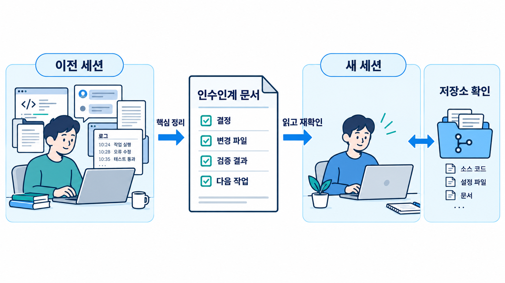
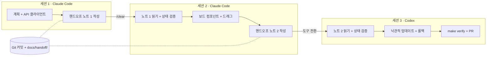

# 03-4. 컨텍스트 관리: 세션 분할, 요약, `/clear`, 핸드오프 문서

## 🎯 학습 목표
- Claude Code의 `/context`와 Codex의 `/status`로 현재 세션의 컨텍스트 사용량을 확인하고, 무엇이 컨텍스트를 차지하는지 설명할 수 있습니다.
- 긴 작업을 세션 여러 개로 나누고, [핸드오프 노트](../../templates/handoff-note.md)로 다음 세션(또는 다른 도구)이 이어받게 할 수 있습니다.
- `/clear`·`/new`(새로 시작), `/compact`(요약 압축), `claude -c`·`codex resume`(이어가기) 중 상황에 맞는 것을 고를 수 있습니다.
- 컨텍스트를 덜 쓰는 작업 습관(출력 줄이기, 곁가지 질문 분리)을 적용할 수 있습니다.

## 📋 사전 준비
- 선행 레슨: [03-1 Explore → Plan → Implement → Verify](./03-1-explore-plan-implement-verify.md), [00-1 코딩 에이전트는 어떻게 동작합니까](../00-foundations/00-1-how-agents-work.md)
- 필요 도구/계정: Claude Code 2.1.292 이상, Codex 0.160.1 이상
- 실습 저장소 상태: Project B(TaskFlow) B3 진행 중. 작업(Task) 도메인 API(TASK-030~032)가 머지되어 있습니다.
  - 실습 Task: `TASK-040 작업 보드 웹 UI` — `apps/web`에 칸반 보드(상태별 컬럼), 카드 드래그로 상태 변경, 낙관적 업데이트와 실패 시 롤백. 한 세션에 끝내기에는 큰 작업입니다.
  - [templates/handoff-note.md](../../templates/handoff-note.md)를 `docs/handoff/` 아래로 복사해 씁니다.

## 💡 개념

### 그림으로 먼저 이해합니다: 새 세션에는 대화 대신 작업 상태를 전달합니다



**그림 읽는 순서**

1. 왼쪽의 긴 대화에서 다음 작업에 필요한 사실을 추립니다. 가운데 인수인계 문서에는 결정·변경 파일·검증 결과·다음 작업을 남깁니다.
2. 오른쪽 새 세션은 문서와 실제 저장소 상태를 대조합니다. 요약에 적힌 테스트 통과를 현재 코드의 검증 결과로 그대로 간주하지 않습니다.

### 컨텍스트는 예산입니다
에이전트가 한 세션에서 "기억"하는 것은 모두 컨텍스트 윈도우 안에 있습니다. 시스템 프롬프트, 메모리 파일(`CLAUDE.md`/`AGENTS.md`), 대화, 그리고 **도구 호출 결과**(읽은 파일, 명령 출력)가 같은 예산을 나눠 씁니다([설계 원칙 2: Context is a Budget](../../docs/design/curriculum-design.md#2-설계-원칙)).

작은 작업에서는 신경 쓸 일이 없습니다. 그러나 대규모 작업에서는 다음이 반복됩니다.

- 탐색 단계에서 파일 수십 개를 읽고, 테스트 로그 수천 줄을 출력합니다. 정작 구현할 때는 예산이 얼마 남지 않습니다.
- 자동 압축(auto compact)이 일어나면서 초반에 합의한 결정이 요약 과정에서 흐려집니다. 에이전트가 이미 거절한 방식을 다시 시도합니다.
- 실패한 시도와 그 로그가 컨텍스트에 남아, 에이전트가 틀린 가설에 계속 끌려갑니다.

결론은 단순합니다. **긴 작업은 한 세션으로 버티지 말고, 의도적으로 끊고 이어 갑니다.** 이어 가는 매체는 대화 기록이 아니라 **파일**입니다. 파일은 압축되지 않고, 다른 도구도 읽을 수 있고, 사람이 검토할 수 있습니다.

### 세션 분할과 핸드오프



세션 경계마다 두 가지를 남깁니다.
1. **커밋**: 코드 상태. 세션이 끝날 때 작업 트리가 커밋되어 있거나, 적어도 무엇이 커밋되지 않았는지 노트에 적혀 있습니다.
2. **핸드오프 노트**: 코드가 말해 주지 않는 것. 진행 중인 것, 마지막 실패, 결정과 이유, 함정.

### 언제 무엇을 씁니까

| 상황 | Claude Code | Codex | 비고 |
|---|---|---|---|
| 하위 작업 하나가 끝났고 다음은 다른 주제입니다 | 핸드오프 노트 → `/clear` | 핸드오프 노트 → `/new` | 가장 깨끗합니다. 기본 선택지 |
| 같은 주제를 계속하는데 컨텍스트가 차 갑니다 | `/compact <남길 내용 지시>` | `/compact` | 요약은 손실이 있습니다. 핵심 결정은 파일에도 남깁니다 |
| 터미널을 닫았다가 같은 대화를 이어 갑니다 | `claude -c`, `claude -r "<이름>"` | `codex resume --last`, `codex resume <SESSION_ID>` | 컨텍스트를 그대로 되살립니다. 오래된 실패 로그도 함께 돌아옵니다 |
| 지금 방향을 유지한 채 다른 시도를 해 봅니다 | `--fork-session`(`-c`/`-r`과 함께) | `/fork`, `codex fork` | 원래 세션을 보존합니다 |
| 방금 몇 턴을 되돌리고 싶습니다 | `/rewind` | (`/fork`로 분기) | |
| 작업과 무관한 짧은 질문 | `/btw` | `/side`, `/btw` | 본 대화의 컨텍스트를 덜 더럽힙니다 |
| 다른 도구로 넘깁니다 | 핸드오프 노트 | 핸드오프 노트 | 대화 기록은 도구 사이에 옮길 수 없습니다 |

> Claude Code의 `/clear`는 대화를 지우지만 이전 대화는 `/resume`에서 다시 열 수 있습니다. Codex의 `/clear`는 터미널 화면까지 초기화하고 새 대화를 시작하며, `/new`는 같은 CLI 세션 안에서 새 대화를 시작합니다.

## 👣 따라하기

### Step 1. 컨텍스트 사용량을 측정합니다
목적: 무엇이 컨텍스트를 차지하는지 눈으로 확인하고, 세션을 끊을 기준을 정합니다.

**Claude Code 레시피**
```bash
cd taskflow
claude -n "TASK-040-s1"
```
```text
> /context
> apps/web 디렉터리 구조를 보여주고, 작업 관련 컴포넌트와 API 클라이언트 파일을 모두 읽어서 요약하십시오.
> /context
```

**Codex 레시피**
```bash
cd taskflow
codex --sandbox workspace-write --ask-for-approval on-request
```
```text
> /status
> apps/web 디렉터리 구조를 보여주고, 작업 관련 컴포넌트와 API 클라이언트 파일을 모두 읽어서 요약하십시오.
> /status
```

**기대 결과**
- Claude Code의 `/context`는 색 격자와 함께 시스템 프롬프트, Memory files, 메시지 등이 차지하는 비율을 보여줍니다. 탐색 한 번에 사용량이 눈에 띄게 늘어난 것을 확인합니다.
- Codex의 `/status`는 세션 설정과 토큰 사용량을 보여줍니다. Codex에는 Claude Code `/context` 같은 격자 시각화 명령이 없습니다(레퍼런스 기준). TODO(verify)
- 두 측정값을 기록해 둡니다. 이 레슨에서는 "사용량이 절반을 넘기 전에 하위 작업 단위로 끊습니다"를 실습 기준으로 씁니다. 기준은 프로젝트마다 조정합니다.

> 💡 탐색 결과를 그대로 대화에 쌓지 않는 습관이 가장 효과가 큽니다. "파일 전체를 보여 주십시오" 대신 "관련 함수 이름과 경로만 목록으로", "테스트 로그 전체" 대신 "실패한 테스트 이름과 첫 오류 메시지만"을 요청합니다.

### Step 2. 세션 1 — 계획과 첫 하위 작업, 그리고 핸드오프 노트
목적: 큰 Task를 하위 작업으로 나누고, 첫 하위 작업을 끝낸 뒤 다음 세션을 위한 노트를 남깁니다.

**Claude Code 레시피** (Step 1 세션 계속)
```text
> docs/tasks/TASK-040.md 를 읽고 하위 작업 3개로 나누십시오. 각 하위 작업은 한 세션에 끝나고 독립적으로 커밋할 수 있어야 합니다.
  (예: 1) API 클라이언트 + 상태별 그룹핑 훅 2) 보드/컬럼/카드 컴포넌트 + 드래그 3) 낙관적 업데이트 + 롤백 + 테스트)
  나눈 결과를 docs/plans/TASK-040.md 에 저장하십시오.
> 하위 작업 1을 구현하고 테스트를 실행하십시오. 통과하면 커밋하십시오.
```

**Codex 레시피** (Step 1 세션 계속)
```text
> (Claude Code와 같은 프롬프트. 커밋은 명령만 출력하게 하고 사람이 실행합니다)
```

하위 작업 1이 끝나면 핸드오프 노트를 쓰게 합니다. 노트는 템플릿의 다섯 섹션을 따릅니다.

**Claude Code 레시피 / Codex 레시피** (두 도구에 같은 프롬프트)
```text
> templates/handoff-note.md 형식으로 docs/handoff/TASK-040-session-1.md 를 작성하십시오. 규칙:
  - "완료한 것"에는 커밋 해시와 통과한 테스트 커맨드를 적습니다.
  - "진행 중인 것"에는 커밋되지 않은 변경과 마지막으로 실패한 커맨드·오류 메시지 첫 줄을 적습니다. 없으면 "없음".
  - "다음 세션이 해야 할 것"은 다음 세션 첫 프롬프트로 그대로 쓸 수 있게 명령형으로 씁니다.
  - "결정한 사항과 이유"에는 이 세션에서 거절한 대안도 적습니다.
  - "주의할 점"에는 다음 세션이 다시 밟을 수 있는 함정을 적습니다.
  - 전체 60줄 이내. 대화에서 읽은 파일 내용을 옮겨 적지 마십시오. 경로만 적으십시오.
```

**기대 결과**: 다음과 같은 노트가 생깁니다.

```markdown
# 핸드오프 노트 — TASK-040 작업 보드 웹 UI (세션 1)

## 완료한 것
- 하위 작업 1: useTasksByStatus 훅, tasksApi.updateStatus 클라이언트 (커밋 9a1b2c3)
- 통과: pnpm --filter @taskflow/web test -- tasks

## 진행 중인 것 (현재 상태, 마지막 실패 내용)
- 없음. 작업 트리 깨끗함.

## 다음 세션이 해야 할 것
1. docs/plans/TASK-040.md 의 하위 작업 2를 구현합니다: apps/web/src/features/board/ 에 Board, Column, TaskCard.
2. 드래그는 기존 의존성(package.json 확인)만 씁니다. 새 라이브러리를 추가하지 않습니다.
3. 끝나면 pnpm --filter @taskflow/web test 와 typecheck 를 실행하고 커밋합니다.

## 결정한 사항과 이유
- 상태 그룹핑은 서버가 아니라 클라이언트에서 합니다: API 계약(GET /tasks)을 바꾸지 않기 위해. (거절: 서버에 groupBy 파라미터 추가 → TASK-032 계약 변경 필요)

## 주의할 점
- apps/web/src/lib/api.ts 의 fetcher 는 401 시 자동 리다이렉트합니다. 테스트에서는 msw 핸들러로 막아야 합니다.
- packages/shared 의 TaskStatus enum 순서가 컬럼 순서입니다. 정렬 로직을 따로 만들지 않습니다.
```

노트도 커밋합니다. 노트는 코드와 같은 저장소에 두어야 다른 사람·다른 도구·클라우드 세션이 읽을 수 있습니다.

### Step 3. 세션 리셋 — `/clear` 또는 `/new` 후 노트로 시작합니다
목적: 깨끗한 컨텍스트에서 노트만으로 작업을 이어 갈 수 있는지 확인합니다.

**Claude Code 레시피**
```text
> /clear
> /context
```
사용량이 시작 수준으로 돌아온 것을 확인하고, 노트로 시작합니다.
```text
> docs/handoff/TASK-040-session-1.md 를 읽으십시오. 작업을 시작하기 전에 노트의 내용이 실제 상태와 맞는지 검증하십시오:
  git log --oneline -5, git status, "완료한 것"의 테스트 커맨드 실행.
  불일치가 있으면 작업하지 말고 보고하십시오. 일치하면 "다음 세션이 해야 할 것"을 수행하십시오.
```

**Codex 레시피**
```text
> /new
> /status
> (Claude Code와 같은 시작 프롬프트)
```

**기대 결과**
- 에이전트가 먼저 상태를 검증하고, 결과(커밋 해시 일치, 테스트 통과)를 보고한 뒤 작업을 시작합니다.
- 에이전트가 세션 1의 결정(클라이언트 측 그룹핑, 새 라이브러리 금지)을 지킵니다. 지키지 않으면 노트의 표현이 약했던 것입니다. 노트를 고치고 다시 시작합니다.
- 세션 2의 하위 작업을 마치면 Step 2와 같은 프롬프트로 `docs/handoff/TASK-040-session-2.md`를 쓰고 커밋합니다.

> ⚠️ 노트를 맹신하지 않습니다. 노트는 이전 세션의 에이전트가 쓴 것이며 틀릴 수 있습니다. "작업 전에 노트와 실제 상태를 대조하십시오"라는 지시가 핵심입니다.

### Step 4. 압축과 이어가기를 비교해 봅니다
목적: `/compact`와 세션 이어가기가 언제 유용하고 언제 위험한지 직접 확인합니다.

세션 2 도중, 드래그 구현에서 테스트가 여러 번 실패해 컨텍스트가 많이 찬 상황을 가정합니다.

**Claude Code 레시피**
```text
> /compact 드래그 구현에서 결정한 사항, 현재 실패하는 테스트 이름과 원인 가설, 시도해서 실패한 방법 목록만 남기십시오. 파일 내용과 로그 원문은 버리십시오.
> /context
> 압축 전에 합의한 결정 3가지를 다시 말해 보십시오.
```
터미널을 닫았다가 같은 대화로 돌아오려면 다음을 씁니다.
```bash
claude -c                       # 가장 최근 대화
claude -r "TASK-040-s1"         # 이름으로 재개 (-n 으로 붙인 이름)
```

**Codex 레시피**
```text
> /compact
> /status
> 압축 전에 합의한 결정 3가지를 다시 말해 보십시오.
```
```bash
codex resume --last             # 가장 최근 세션
codex resume                    # 선택 화면에서 고르기
```

**기대 결과**
- 압축 후 사용량이 줄어듭니다.
- "결정 3가지"를 물었을 때 빠지거나 바뀐 것이 있는지 확인합니다. 빠진 것이 있다면 그 결정은 처음부터 파일(계획서, 노트)에 있어야 했습니다.
- 이어가기(`-c`, `resume`)는 편하지만 실패 로그도 함께 돌아옵니다. 같은 실패에 계속 끌려가는 느낌이 들면 이어가기 대신 노트 + 새 세션을 씁니다.

| 비교 항목 | `/compact` | 노트 + `/clear`·`/new` | `-c`·`resume` |
|---|---|---|---|
| 컨텍스트 정리 | 요약으로 줄어듦 | 완전히 비워짐 | 정리 안 됨 |
| 결정 보존 | 요약 품질에 의존 | 노트에 적은 만큼 | 그대로 |
| 다른 도구로 이전 | 불가 | 가능 | 불가 |
| 적합한 때 | 같은 주제, 짧게 더 진행 | 하위 작업 경계 | 중단 직후 바로 재개 |

### Step 5. 세션 3 — 다른 도구로 핸드오프합니다
목적: 핸드오프 노트가 도구에 독립적인 인터페이스라는 것을 확인합니다. 세션 1·2를 Claude Code로 했다면 세션 3은 Codex로 합니다(반대도 좋습니다).

**Codex 레시피** (Claude Code → Codex)
```bash
codex --sandbox workspace-write --ask-for-approval on-request
```
```text
> docs/handoff/TASK-040-session-2.md 를 읽으십시오. 이 노트는 다른 에이전트가 썼습니다.
  작업 전에 노트와 실제 상태를 대조하십시오(git log, git status, 노트의 테스트 커맨드).
  일치하면 "다음 세션이 해야 할 것"을 수행하십시오: 하위 작업 3(낙관적 업데이트 + 롤백 + 테스트).
  끝나면 make verify 를 실행하고 마지막 20줄을 보여 주십시오.
```

**Claude Code 레시피** (Codex → Claude Code)
```bash
claude -n "TASK-040-s3"
```
```text
> (같은 프롬프트)
```

**기대 결과**
- 받는 쪽 도구가 대화 기록 없이 노트와 저장소만으로 작업을 끝냅니다.
- 받는 쪽이 노트에서 이해하지 못한 부분(모호한 표현, 빠진 경로)을 질문하면 그것을 기록합니다. 템플릿 개선 자료가 됩니다(숙제 HW2).
- 작업이 끝나면 마지막 노트 `docs/handoff/TASK-040-session-3.md`에 "완료"와 PR 링크를 적습니다.

### Step 6. 컨텍스트를 아끼는 습관을 규칙으로 만듭니다
목적: 이번 실습에서 얻은 습관을 `AGENTS.md`에 남겨 매번 지시하지 않게 합니다.

**Claude Code 레시피 / Codex 레시피** (두 도구에 같은 프롬프트)
```text
> AGENTS.md 에 "## 컨텍스트와 세션" 섹션을 추가하십시오. 내용:
  - 테스트·빌드 출력은 실패 항목과 첫 오류 메시지만 보여줍니다. 전체 로그가 필요하면 tmp/logs/ 에 저장하고 경로를 알려줍니다.
  - 탐색 결과는 경로와 한 줄 설명 목록으로 보고합니다. 파일 전체를 대화에 출력하지 않습니다.
  - 하위 작업이 끝나면 docs/handoff/<TASK-ID>-session-<N>.md 를 templates/handoff-note.md 형식으로 작성하고 커밋합니다.
  - 핸드오프 노트로 시작할 때는 작업 전에 노트와 실제 상태(git log, git status, 테스트)를 대조합니다.
```

**기대 결과**: 다음 세션부터 "출력 줄이기"와 "노트 대조"를 따로 지시하지 않아도 지켜집니다. `/context`(Claude Code) 또는 `/status`(Codex)로 같은 작업의 사용량이 Step 1보다 줄었는지 비교합니다.

## ✅ 체크포인트
- [ ] `/context`(Claude Code)와 `/status`(Codex)로 탐색 전후 사용량을 기록했습니다.
- [ ] TASK-040을 세 세션으로 나눠 완료했고, `docs/handoff/`에 노트 3개가 커밋되어 있습니다.
- [ ] 각 세션은 노트와 실제 상태를 대조한 뒤 시작했습니다.
- [ ] `/compact` 후 결정 사항이 보존되는지 확인하고 결과를 기록했습니다.
- [ ] 최소 한 번 Claude Code ↔ Codex 사이에서 노트로 작업을 넘겼습니다.
- [ ] `AGENTS.md`에 컨텍스트·세션 규칙이 추가됐습니다.

## 🏠 숙제
| # | 유형 | 난이도 | 과제 | 완료 조건 |
|---|---|---|---|---|
| HW1 | 🔁 Reproduce | ★ | 따라하기 Step 2~5를 재현해 한 세션에 끝나지 않는 Task 하나를 3세션에 나눠 완료합니다 | 핸드오프 노트 3개, 세션별 시작 시 상태 대조 결과, 세션별 `/context` 또는 `/status` 사용량 기록, 최종 `make verify` 통과 로그 |
| HW2 | 🛠 Apply | ★★ | 본인 팀용 핸드오프 노트 템플릿을 작성합니다. [templates/handoff-note.md](../../templates/handoff-note.md)를 출발점으로, HW1에서 받는 쪽 에이전트가 헷갈린 지점을 반영합니다 | 새 템플릿 파일(섹션별 작성 규칙과 예시 포함), 기존 템플릿 대비 변경 이유 표, 새 템플릿으로 다른 도구에 핸드오프한 1회 기록(받는 쪽 질문 수 비교) |
| HW3 | 🚀 Challenge | ★★★ | 핸드오프를 자동화합니다: 노트 작성을 Skill(`.claude/skills/handoff/`, `.agents/skills/handoff/`)로 만들고, 세션 시작 시 최신 노트를 안내하는 `SessionStart` hook을 한 도구 이상에 구성합니다 | Skill 파일 2개, hook 설정과 스크립트, hook 출력이 세션 컨텍스트에 실제로 반영되는지 확인한 로그(반영되지 않으면 그 사실과 대안), 자동화 전후 세션 시작 프롬프트 길이 비교 |

제출: `hw/03-4` 브랜치, `submissions/03-4.md` (템플릿: [docs/design/homework-template.md](../../docs/design/homework-template.md))

## ⚠️ 흔한 실수
- **새 세션의 에이전트가 이미 거절한 방식을 다시 시도합니다** → 결정과 거절한 대안이 대화에만 있고 파일에 없었습니다 → 핸드오프 노트 "결정한 사항과 이유"에 거절한 대안까지 적고, 중요한 결정은 ADR([02-2](../02-spec-driven-development/02-2-architecture-and-adr.md))이나 계획서에 남깁니다.
- **노트대로 시작했는데 코드 상태가 다릅니다** → 노트를 쓴 뒤 커밋하지 않았거나, 노트가 실제와 다르게 작성됐습니다 → 세션 종료 전 커밋을 습관화하고, 새 세션 첫 프롬프트에 "노트와 실제 상태 대조"를 넣습니다.
- **노트가 너무 길어서 컨텍스트를 다시 잡아먹습니다** → 대화에서 읽은 파일 내용과 로그를 노트에 옮겨 적었습니다 → 60줄 이내, 경로만 적기 규칙을 프롬프트와 템플릿에 넣습니다.
- **`/compact` 후 에이전트가 방향을 잃습니다** → 무엇을 남길지 지시하지 않았습니다 → Claude Code에서는 `/compact <남길 내용>`으로 지시하고, 두 도구 모두 압축 전에 핵심 결정을 파일에 씁니다. 하위 작업 경계라면 압축보다 노트 + 새 세션이 낫습니다.
- **`claude -c`·`codex resume`으로 이어 갔더니 같은 실패를 반복합니다** → 실패한 시도와 로그가 그대로 되살아났습니다 → 막혔을 때는 이어가기 대신 "지금까지 시도한 것과 실패 원인"을 노트로 쓰게 하고 새 세션에서 시작합니다.

## 🔗 참고 자료
- Claude Code: [Commands](https://code.claude.com/docs/en/commands) (`/clear`, `/compact`, `/context`, `/rewind`, `/btw`), [Context window](https://code.claude.com/docs/en/context-window), [Costs](https://code.claude.com/docs/en/costs), [CLI reference](https://code.claude.com/docs/en/cli-reference) (`-c`, `-r`, `-n`, `--fork-session`), [Hooks](https://code.claude.com/docs/en/hooks), [Skills](https://code.claude.com/docs/en/skills)
- Codex: [Slash commands](https://learn.chatgpt.com/docs/developer-commands?surface=cli) (`/new`, `/compact`, `/status`, `/fork`), [Non-interactive mode](https://learn.chatgpt.com/docs/non-interactive-mode) (`resume`), [Config reference](https://learn.chatgpt.com/docs/config-file/config-reference), [Hooks](https://learn.chatgpt.com/docs/hooks), [Skills](https://learn.chatgpt.com/docs/build-skills)
- 이 저장소: [핸드오프 노트 템플릿](../../templates/handoff-note.md), [도구 레퍼런스 §2, §8](../../docs/reference/tool-reference.md)
- 관련 레슨: [00-1 코딩 에이전트는 어떻게 동작합니까](../00-foundations/00-1-how-agents-work.md), [03-1 Explore → Plan → Implement → Verify](./03-1-explore-plan-implement-verify.md), [05-2 오케스트레이션](../05-scaling-up/05-2-orchestration.md) (서브에이전트로 탐색 컨텍스트 분리), [06-1 비용과 성능](../06-team-and-operations/06-1-cost-and-performance.md), [06-4 지식 축적](../06-team-and-operations/06-4-knowledge-loop.md)
- 프로젝트: [Project B — TaskFlow](../../projects/B-development-project/README.md) (B3는 Plan 모드와 핸드오프로 진행합니다)
