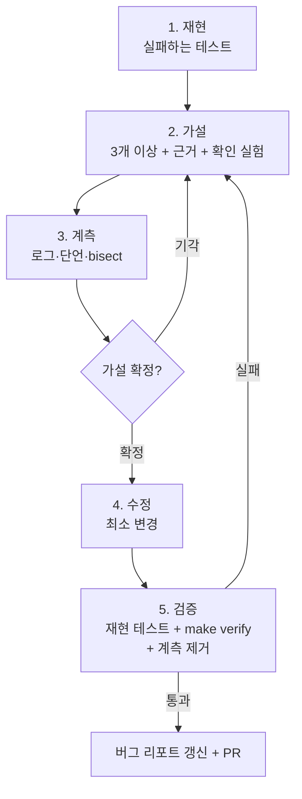

# 03-5. 디버깅 협업: 재현 → 가설 → 계측 → 수정

## 🎯 학습 목표
- 버그 리포트를 **실패하는 테스트**로 먼저 재현하게 하고, 재현 전에는 수정을 시키지 않을 수 있다.
- 에이전트에게 가설을 여러 개 세우게 하고, 가설마다 근거와 확인 실험을 요구할 수 있다.
- 임시 계측(로그, 단언)과 비대화형 로그 분석(`claude -p`, `codex exec`), `git bisect`로 가설을 검증할 수 있다.
- 최소 수정 + 회귀 테스트 + 계측 제거까지 끝내고, 버그 리포트에서 수정 PR까지의 과정을 기록할 수 있다.

## 📋 사전 준비
- 선행 레슨: [03-2 에이전트와 TDD](./03-2-tdd-with-agents.md), [03-3 Git 전략](./03-3-git-strategy.md), [00-4 실패 패턴 카탈로그](../00-foundations/00-4-failure-patterns.md)
- 필요 도구/계정: Claude Code 2.1.292 이상, Codex 0.160.1 이상, `jq`(선택)
- 실습 저장소 상태: Project B(TaskFlow) B3 진행 중. 작업 목록 API에 마감일 필터(`dueBefore`)가 있다.

### 실습용 버그 심기
스터디라면 파트너가 심고, 혼자라면 직접 심은 뒤 에이전트에게는 diff를 보지 말라고 지시한다. 아래는 예시다. 본인 코드에 맞게 비슷한 버그를 만든다.

1. `apps/api/src/modules/tasks/task.repository.ts`의 마감일 조건을 다음처럼 바꾼다.
   - 쿼리 문자열 `dueBefore=2026-10-07`을 `new Date("2026-10-07")`(UTC 자정)로 바꾸고, `due_at < $1`로 비교한다.
   - 결과: 프로젝트 시간대가 `Asia/Seoul`일 때 **10월 7일 당일 마감인 작업이 목록에서 빠진다.**
2. 눈에 띄지 않는 메시지로 커밋한다. `git commit -am "refactor(api): simplify task query builder"`
3. 버그 리포트를 `docs/bugs/BUG-007.md`로 만든다.

```markdown
# BUG-007: 마감일 필터에서 당일 마감 작업이 누락된다

- 보고자: QA / 환경: staging, 프로젝트 시간대 Asia/Seoul
- 증상: "오늘까지" 필터(dueBefore=오늘 날짜)를 켜면 오늘 마감인 작업이 보이지 않는다.
- 재현: 오늘 18:00 마감 작업 생성 → GET /projects/:id/tasks?dueBefore=<오늘 날짜>
- 기대: 목록에 포함 / 실제: 누락
- 빈도: 항상 (단, 오전 9시 이전 마감 작업은 보인다는 제보 있음)
```

## 💡 개념

### 에이전트가 디버깅에서 실패하는 방식
에이전트에게 "이 버그 고쳐줘"라고 하면 대개 곧바로 그럴듯한 코드를 고친다. 대규모 코드베이스에서는 이것이 위험하다.

- **증상을 가린다.** 원인을 모른 채 `if` 하나를 추가해 리포트의 재현 케이스만 통과시킨다. 다른 시간대에서는 여전히 틀린다.
- **첫 가설에 매달린다.** 처음 떠올린 원인이 틀렸는데, 그 가설 안에서 수정 → 실패 → 수정을 반복한다([00-4](../00-foundations/00-4-failure-patterns.md)의 무한 수정 루프).
- **흔적을 남긴다.** 디버깅용 로그와 임시 코드가 수정 커밋에 섞여 들어간다.

해결책은 사람 개발자의 디버깅 규율을 **단계로 강제**하는 것이다. 각 단계의 산출물이 다음 단계의 입력이 된다.



| 단계 | 에이전트 권한 | 사람이 확인할 것 |
|---|---|---|
| 재현 | 테스트 파일만 쓰기 | 테스트가 **리포트의 증상 때문에** 실패하는가 |
| 가설 | 읽기 전용 | 가설이 서로 다른가, 근거가 코드 위치로 제시됐는가 |
| 계측 | 임시 코드 쓰기 (표식 필수) | 실험 결과가 가설을 확정·기각하는가 |
| 수정 | 구현 쓰기 | 수정 범위가 근본 원인에 맞는가 |
| 검증 | 테스트 실행 | 회귀 테스트, 전체 검증, 계측 흔적 0개 |

### 왜 대규모에서 중요한가
작은 프로젝트의 버그는 파일 한두 개 안에 있다. 큰 프로젝트에서는 원인이 증상과 먼 곳(공용 날짜 유틸, DB 드라이버 설정, 다른 팀의 미들웨어)에 있는 경우가 많다. 에이전트는 많은 파일을 빠르게 읽을 수 있다는 강점이 있지만, 방향을 잘못 잡으면 그만큼 빠르게 엉뚱한 곳을 고친다. **가설과 실험을 명시적으로 분리**하면 에이전트의 탐색 속도를 살리면서 방향은 사람이 통제할 수 있다.

## 👣 따라하기

### Step 1. 재현 — 실패하는 테스트부터 만든다
목적: 리포트의 증상을 자동으로 재현하는 테스트를 만든다. 재현되기 전에는 아무것도 고치지 않는다.

**Claude Code 레시피**
```bash
claude -n "BUG-007"
```
```text
> docs/bugs/BUG-007.md 를 읽어라. git log 와 git diff 는 보지 마라(실습 규칙).
  이 버그를 재현하는 테스트를 apps/api/src/modules/tasks/due-date-filter.test.ts 에 작성해라.
  구현 코드는 수정하지 마라.
  - 프로젝트 시간대 Asia/Seoul, 오늘 18:00(KST) 마감 작업과 오늘 08:00(KST) 마감 작업을 만든다.
  - dueBefore=<오늘 날짜> 로 조회했을 때 두 작업이 모두 포함되어야 한다.
  - 시각은 고정 clock 을 주입해서 실행 시점과 무관하게 만든다.
  테스트를 실행하고 어떤 단언이 어떤 값으로 실패하는지 보여줘라.
```

**Codex 레시피**
```bash
codex --sandbox workspace-write --ask-for-approval on-request
```
```text
> (Claude Code와 같은 프롬프트)
```

**기대 결과**
- 테스트가 실패한다. 18:00 마감 작업이 누락되고, 08:00 마감 작업은 포함된다(리포트의 "오전 9시 이전은 보인다"와 일치).
- 실패 이유가 DB 연결이나 import 오류가 아니라 **리포트의 증상**이다. 그렇지 않으면 재현이 아니다.
- 재현 테스트를 커밋한다(Codex는 사람이 실행). `test(api): reproduce BUG-007 due date filter` — 본문에 "intentionally failing"을 적는다([03-3](./03-3-git-strategy.md) 규칙).

> 💡 재현이 어려운 버그(간헐적, 환경 의존)라면 이 단계에서 시간을 가장 많이 쓴다. "재현 조건을 좁히기 위한 실험 3가지를 제안해라"라고 시키고, 재현되기 전에는 Step 2로 넘어가지 않는다.

### Step 2. 가설 — 서로 다른 가설 여러 개를 세운다
목적: 첫 가설에 매달리지 않도록, 근거와 확인 실험이 붙은 가설 목록을 받는다.

**Claude Code 레시피** — 읽기 전용으로 전환한다(`Shift+Tab`으로 plan 모드, 또는 `/plan`).
```text
> 재현 테스트의 실패를 설명할 수 있는 가설을 3개 이상 세워라. 아직 아무것도 수정하지 마라.
  가설마다 다음을 적어라:
  - 가설 (한 문장)
  - 근거: 관련 코드 위치(파일:함수)와 그 코드가 왜 의심스러운지
  - 반대 근거: 이 가설로 설명되지 않는 관찰
  - 확인 실험: 코드를 고치지 않고 가설을 확정·기각할 수 있는 가장 싼 실험
  리포트의 "오전 9시 이전 마감 작업은 보인다"는 관찰을 모든 가설이 설명하는지 확인해라.
```

**Codex 레시피** — Plan 모드로 전환한다.
```text
> /plan
```
```text
> (Claude Code와 같은 프롬프트)
```

**기대 결과**: 예를 들어 다음과 같은 목록이 나온다.

| # | 가설 | 확인 실험 |
|---|---|---|
| H1 | `dueBefore` 날짜 문자열을 UTC 자정으로 해석해 KST 09:00 이전만 포함된다 | 쿼리에 전달되는 파라미터 값을 로그로 찍는다 |
| H2 | 비교 연산자가 `<`라서 경계값이 빠진다 | 마감 시각을 정확히 경계값으로 둔 테스트를 추가한다 |
| H3 | DB 세션 시간대가 UTC라 `due_at`이 다르게 저장된다 | 테스트 DB에서 저장된 `due_at` 원값과 `SHOW TIME ZONE` 결과를 확인한다 |

- 가설이 서로 다르다(같은 가설의 변형 세 개가 아니다).
- "9시"라는 관찰이 KST(UTC+9)와 연결된다는 점을 짚는 가설이 있다. 이 관찰을 설명하지 못하는 가설은 우선순위를 낮춘다.
- 사람이 실험 순서를 정한다. 보통 가장 싸고 가장 많은 가설을 가르는 실험부터 한다.

### Step 3. 계측 — 실험으로 가설을 확정하거나 기각한다
목적: 표식이 붙은 임시 계측으로 데이터를 모으고, 로그는 대화가 아니라 파일로 분석한다.

**Claude Code 레시피** — 쓰기 가능한 모드로 돌아온다.
```text
> H1, H3 을 확인하는 계측을 추가해라. 규칙:
  - 모든 임시 코드 줄에 // DEBUG(BUG-007) 주석을 붙인다.
  - 로그는 재현 테스트를 실행할 때만 출력되게 한다.
  재현 테스트를 실행하고 전체 출력을 tmp/logs/bug-007.log 에 저장해라. 대화에는 마지막 10줄만 보여줘라.
```

**Codex 레시피**
```text
> (Claude Code와 같은 프롬프트)
```

로그가 길면 **새 컨텍스트에서 비대화형으로 분석**한다. 본 세션의 컨텍스트를 아끼고, 앞선 가설에 끌려가지 않은 시각으로 로그를 읽게 하는 효과가 있다([03-4](./03-4-context-management.md)).

**Claude Code 레시피** (별도 터미널)
```bash
cat tmp/logs/bug-007.log | claude -p "이 로그는 BUG-007 재현 테스트 출력이다. 쿼리에 전달된 dueBefore 파라미터 값, DB 시간대, 각 작업의 due_at 값을 표로 정리하고, 18:00 KST 작업이 왜 제외되는지 설명해라. 로그에 없는 내용은 추측하지 말고 '로그에 없음'이라고 써라."
```

**Codex 레시피** (별도 터미널)
```bash
codex exec "이 로그는 BUG-007 재현 테스트 출력이다. 쿼리에 전달된 dueBefore 파라미터 값, DB 시간대, 각 작업의 due_at 값을 표로 정리하고, 18:00 KST 작업이 왜 제외되는지 설명해라. 로그에 없는 내용은 추측하지 말고 '로그에 없음'이라고 써라." < tmp/logs/bug-007.log
```
`codex exec`는 프롬프트와 stdin을 함께 주면 stdin을 `<stdin>` 블록으로 붙인다. 기본 샌드박스가 read-only이므로 분석만 하고 파일은 바꾸지 않는다.

**기대 결과**
- 로그에서 `dueBefore` 파라미터가 `2026-10-07T00:00:00.000Z`(= KST 09:00)로 전달되는 것이 보인다. H1 확정.
- 저장된 `due_at`은 올바른 UTC 값이다. H3 기각.
- 실험 결과를 버그 리포트에 "가설과 검증 결과" 섹션으로 적게 한다.

#### (선택) 회귀 버그라면 `git bisect`
"예전에는 됐다"는 버그라면 원인 커밋을 이분 탐색으로 찾는다. 재현 테스트를 판정 스크립트로 쓴다. 도구와 무관한 Git 기능이다.

```bash
git bisect start
git bisect bad HEAD
git bisect good <정상으로 알려진 커밋>
git bisect run pnpm --filter @taskflow/api test -- due-date-filter
git bisect reset
```
- 재현 테스트 파일이 과거 커밋에 없으면 `bisect run` 전에 저장소 밖(예: `/tmp`)으로 복사해 두고 판정 스크립트에서 매번 복사해 넣는다.
- Claude Code: 허용 규칙에 따라 에이전트가 실행할 수 있다. 실행 후 `git bisect reset`까지 했는지 확인한다.
- Codex: `git bisect`는 `.git`에 쓰므로 `workspace-write` 샌드박스에서 막힌다. 명령은 사람이 실행하고, 결과(원인 커밋 해시)를 Codex에게 알려 준다.

**기대 결과**: `git bisect run`이 "refactor(api): simplify task query builder" 커밋을 첫 번째 bad 커밋으로 지목한다.

### Step 4. 수정 — 근본 원인에 맞는 최소 수정
목적: 확정된 원인만 고치고, 재현 테스트를 회귀 테스트로 남긴다.

**Claude Code 레시피**
```text
> H1 이 확정됐다. 근본 원인을 한 문장으로 설명하고, 최소 수정을 제안해라. 아직 수정하지 마라.
  조건: dueBefore 는 "프로젝트 시간대 기준 그 날짜의 끝까지"를 뜻한다. 공용 날짜 유틸이 있으면 그것을 쓴다.
  재현 테스트는 수정하지 마라.
```
제안을 검토하고 승인한다.
```text
> 제안대로 수정해라. 재현 테스트를 실행해 통과를 보여주고,
  경계 케이스(23:59:59 KST, 다음 날 00:00 KST, 시간대 UTC 프로젝트) 테스트를 추가해라.
```
수정 시도가 엉뚱한 방향으로 가면 `/rewind`로 되돌린 뒤 다시 지시한다.

**Codex 레시피**
```text
> (Claude Code와 같은 두 프롬프트)
```
되돌릴 때는 `git restore <파일>`로 작업 트리를 되돌리거나, `/fork`로 분기해 다른 수정을 시도한다.

**기대 결과**
- 근본 원인 설명이 "날짜 문자열을 UTC 자정으로 해석해 프로젝트 시간대 기준 하루의 끝까지 포함하지 못함"처럼 **증상이 아니라 메커니즘**을 말한다.
- 수정이 쿼리 빌더의 날짜 해석 한 곳에 집중된다. 리포트 케이스만 피하는 특수 분기(`if (hour >= 9)`)가 있으면 증상 가리기다. 거절한다.
- 재현 테스트와 경계 케이스 테스트가 모두 통과한다.

### Step 5. 검증과 정리 — 흔적 없이 끝낸다
목적: 계측을 제거하고, 전체 검증을 통과시키고, 다른 도구로 수정을 리뷰한다.

**Claude Code 레시피 / Codex 레시피** (두 도구에 같은 프롬프트)
```text
> DEBUG(BUG-007) 표식이 붙은 코드를 모두 제거해라. 그다음 아래를 차례로 실행하고 결과를 보여줘라.
  1. grep -rn "DEBUG(BUG-007)" apps packages   (출력이 없어야 한다)
  2. make verify   (마지막 20줄)
```

사람이 직접 확인한다.
```bash
grep -rn "DEBUG(BUG-007)" apps packages || echo "OK: 계측 흔적 없음"
git diff --stat main...HEAD
make verify
```

수정한 도구와 **다른 도구**로 리뷰한다.

**Claude Code로 수정했다면 → Codex로 리뷰**
```bash
codex review --base main
```

**Codex로 수정했다면 → Claude Code로 리뷰**
```text
> /code-review medium
```

**기대 결과**
- 계측 흔적이 0개다.
- `git diff --stat`에 재현·경계 테스트 파일과 수정 파일만 있다. `tmp/logs/`는 `.gitignore`에 있어 커밋되지 않는다.
- 리뷰에서 "같은 패턴의 날짜 해석이 다른 곳에도 있다"는 지적이 나오면 별도 Task로 분리한다(이번 PR 범위 밖).

### Step 6. 버그 리포트를 완성하고 PR을 연다
목적: 버그 리포트 → 수정 PR 전 과정을 기록으로 남겨 팀의 지식으로 만든다.

**Claude Code 레시피 / Codex 레시피** (두 도구에 같은 프롬프트)
```text
> docs/bugs/BUG-007.md 에 다음 섹션을 추가해라:
  ## 가설과 검증 결과 (가설별 실험과 결과, 확정/기각)
  ## 근본 원인 (메커니즘 한 문단 + 원인 커밋 해시)
  ## 수정 (변경 파일과 이유)
  ## 회귀 방지 (추가한 테스트 이름)
  ## 재발 방지 제안 (규칙·린트·유틸 개선 후보)
```
그다음 [03-3](./03-3-git-strategy.md)의 PR Skill로 PR을 연다(Claude Code `/taskflow-pr`, Codex `$taskflow-pr`). PR 본문 "관련 Task"에 `BUG-007`을 적는다.

**기대 결과**
- 버그 리포트 하나에 증상 → 재현 → 가설 → 실험 → 원인 → 수정 → 회귀 방지가 모두 있다.
- "재발 방지 제안" 중 하나(예: "날짜 필터는 `toProjectDayEnd()` 유틸을 쓴다")를 `AGENTS.md` 규칙 후보로 올린다([06-4](../06-team-and-operations/06-4-knowledge-loop.md)).

## ✅ 체크포인트
- [ ] 수정 전에 리포트의 증상 때문에 실패하는 재현 테스트가 커밋되어 있다.
- [ ] 가설 3개 이상을 근거·반대 근거·확인 실험과 함께 받았고, 읽기 전용 상태에서 세웠다.
- [ ] 계측 결과(로그 파일)로 최소 한 가설을 확정하고 한 가설을 기각했다.
- [ ] 수정이 근본 원인에 맞고, 재현 테스트를 수정하지 않았다.
- [ ] `grep -rn "DEBUG(BUG-007)"` 결과가 비어 있고 `make verify`가 통과한다.
- [ ] 수정하지 않은 도구로 리뷰를 실행했다.
- [ ] `docs/bugs/BUG-007.md`에 가설·원인·수정·회귀 방지가 기록됐다.

## 🏠 숙제
| # | 유형 | 난이도 | 과제 | 완료 조건 |
|---|---|---|---|---|
| HW1 | 🔁 Reproduce | ★ | 따라하기 Step 1~5를 재현해 심어 둔 버그를 찾는다 (파트너가 심은 버그면 더 좋다) | 재현 테스트 실패 로그, 가설 표(3개 이상), 계측 로그 분석 결과, 수정 후 `make verify` 통과 로그, 계측 흔적 grep 결과 |
| HW2 | 🛠 Apply | ★★ | 실제 버그 1건(본인 프로젝트 또는 TaskFlow 개발 중 발견한 것)을 버그 리포트 → 수정 PR까지 이 레슨의 절차로 처리한다 | `docs/bugs/BUG-xxx.md`(이 레슨 6개 섹션 모두), 재현 테스트가 먼저 커밋된 이력, 다른 도구의 리뷰 결과, PR 링크와 세션 기록(사람 개입 지점 포함) |
| HW3 | 🚀 Challenge | ★★★ | 같은 버그를 Claude Code와 Codex로 각각 독립적으로 디버깅하고 비교한다. 재현 → 가설 → 계측 → 수정 절차를 디버깅 Skill(`.claude/skills/debug/`, `.agents/skills/debug/`)로 패키징한다 | 도구별 가설 목록과 첫 가설 적중 여부, 원인 확정까지 걸린 턴 수·사람 개입 횟수 비교표, Skill 파일 2개, Skill을 써서 다른 버그 1건을 처리한 기록 |

제출: `hw/03-5` 브랜치, `submissions/03-5.md` (템플릿: [docs/design/homework-template.md](../../docs/design/homework-template.md))

## ⚠️ 흔한 실수
- **재현 없이 고쳤더니 다른 케이스에서 다시 터진다** → "버그 고쳐줘"로 바로 수정을 시켰다 → 재현 테스트를 먼저 커밋하고, 재현되기 전에는 수정 프롬프트를 보내지 않는다.
- **에이전트가 첫 가설만 붙잡고 수정을 반복한다** → 가설을 하나만 요구했거나 가설과 수정을 한 번에 시켰다 → 가설 3개 이상 + 반대 근거 + 확인 실험을 읽기 전용 상태에서 받고, 같은 수정이 두 번 실패하면 Step 2로 돌아간다.
- **수정 PR에 디버그 로그가 섞였다** → 계측 코드에 표식이 없었다 → `DEBUG(<버그ID>)` 표식을 규칙으로 두고, 검증 단계에서 `grep`으로 0개를 확인한다. 반복되면 검증 커맨드에 이 검사를 넣는다.
- **로그 분석에서 에이전트가 없는 값을 지어낸다** → 긴 로그를 본 세션에 붙여 넣고 "원인을 찾아라"라고만 했다 → 로그는 파일로 저장해 `claude -p`·`codex exec`로 새 컨텍스트에서 분석하고, "로그에 없으면 '로그에 없음'이라고 써라"를 명시한다.
- **Codex에서 `git bisect`가 실패한다** → `workspace-write` 샌드박스가 `.git`을 보호한다 → `bisect`는 사람이 실행하고 결과만 Codex에 전달한다.

## 🔗 참고 자료
- Claude Code: [Common workflows](https://code.claude.com/docs/en/common-workflows), [Headless](https://code.claude.com/docs/en/headless) (`claude -p`, stdin), [Permission modes](https://code.claude.com/docs/en/permission-modes), [Commands](https://code.claude.com/docs/en/commands) (`/rewind`, `/code-review`)
- Codex: [Non-interactive mode](https://learn.chatgpt.com/docs/non-interactive-mode) (`codex exec`, stdin), [Approvals & security](https://learn.chatgpt.com/docs/agent-approvals-security) (`.git` 보호), [Code review](https://learn.chatgpt.com/docs/code-review), [Slash commands](https://learn.chatgpt.com/docs/developer-commands?surface=cli)
- 외부: [git bisect 문서](https://git-scm.com/docs/git-bisect)
- 이 저장소: [도구 레퍼런스 §2, §5, §10](../../docs/reference/tool-reference.md)
- 관련 레슨: [00-4 실패 패턴 카탈로그](../00-foundations/00-4-failure-patterns.md), [03-2 에이전트와 TDD](./03-2-tdd-with-agents.md), [03-3 Git 전략](./03-3-git-strategy.md), [03-4 컨텍스트 관리](./03-4-context-management.md), [04-2 교차 리뷰](../04-quality-and-verification/04-2-cross-review.md)
- 프로젝트: [Project B — TaskFlow](../../projects/B-development-project/README.md)
