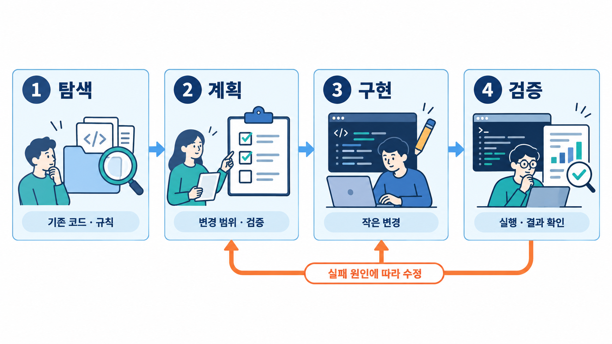

# Module 03 — Agentic Workflow (에이전트 작업 흐름)

Explore → Plan → Implement → Verify 루프를 습관화합니다.

## 그림으로 시작합니다

먼저 그림에서 사람·문서·도구의 역할과 화살표 방향을 확인합니다. 각 레슨의 “그림 읽는 순서”를 읽은 다음 개념과 따라하기를 진행합니다.

- [탐색부터 검증까지 한 작업을 닫습니다](./03-1-explore-plan-implement-verify.md)에서 그림과 설명을 함께 확인합니다.
- [실패하는 테스트를 먼저 확인합니다](./03-2-tdd-with-agents.md)에서 그림과 설명을 함께 확인합니다.
- [새 세션에는 대화 대신 작업 상태를 전달합니다](./03-4-context-management.md)에서 그림과 설명을 함께 확인합니다.

제안서에 사용할 원본 PNG는 [전체 그림 목록](../../docs/design/illustrations.md)에서 찾습니다.

## 레슨
| # | 제목 | 상태 |
|---|---|---|
| 03-1 | [Explore → Plan → Implement → Verify](./03-1-explore-plan-implement-verify.md) | ✅ 초안 |
| 03-2 | [에이전트와 TDD](./03-2-tdd-with-agents.md) | ✅ 초안 |
| 03-3 | [Git 전략: 브랜치, 커밋, PR](./03-3-git-strategy.md) | ✅ 초안 |
| 03-4 | [컨텍스트 관리와 핸드오프](./03-4-context-management.md) | ✅ 초안 |
| 03-5 | [디버깅 협업](./03-5-debugging.md) | ✅ 초안 |

- 레슨별 따라하기·숙제 상세는 [커리큘럼 설계서 §4](../../docs/design/curriculum-design.md#4-모듈-상세-설계)를 참고합니다.
- 레슨 작성 형식: [lesson-template.md](../../docs/design/lesson-template.md)
