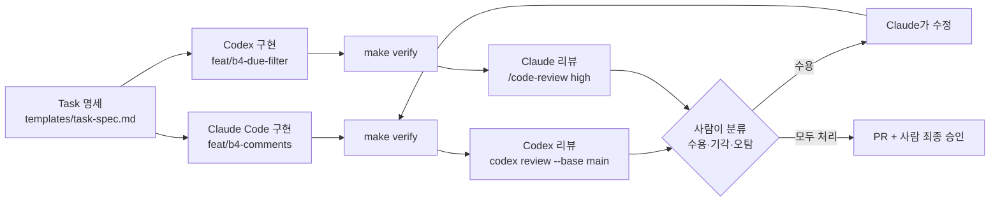

# 04-2. 교차 리뷰: Claude 구현 ↔ Codex 리뷰 (그리고 반대)

## 🎯 학습 목표
- 한 도구가 구현하고 다른 도구가 리뷰하는 교차 리뷰를 두 방향 모두 실행할 수 있습니다.
- Claude Code의 `/code-review`(별칭 `/review`)와 Codex의 `/review`·`codex review`의 차이를 설명하고 상황에 맞게 고를 수 있습니다.
- 두 리뷰 결과를 비교·분류(수용/기각/오탐)하고 구현 에이전트에게 되돌려 수정 루프를 닫을 수 있습니다.
- 팀 공용 리뷰 체크리스트 `REVIEW.md`를 만들어 두 도구의 리뷰 기준을 맞출 수 있습니다.

## 📋 사전 준비
- 선행 레슨: [04-1 검증 계층](./04-1-verification-layers.md), [03-3 Git 전략](../03-agentic-workflow/03-3-git-strategy.md), [00-2 Claude Code vs Codex](../00-foundations/00-2-claude-vs-codex.md)
- 필요 도구/계정: Claude Code 2.1.292, Codex 0.160.1(로그인 완료), GitHub 저장소와 `gh` CLI(PR 단계에서 선택)
- 실습 저장소 상태: Project B(TaskFlow) B3 완료 + 04-1의 `make verify` 구성 완료. `main` 브랜치가 깨끗합니다.
- B4 백로그에서 이 레슨에 쓸 Task 명세 2개를 준비합니다(예: `docs/tasks/B4-03-task-comments.md`, `docs/tasks/B4-04-due-date-filter.md`, 형식은 [task-spec.md](../../templates/task-spec.md)).

## 💡 개념

### 왜 "다른 모델"이 리뷰해야 합니까
같은 에이전트에게 "방금 쓴 코드를 리뷰해 주십시오"라고 하면 대개 칭찬이나 사소한 지적으로 끝납니다. 구현할 때 가졌던 가정과 맹점을 리뷰할 때도 그대로 갖고 있기 때문입니다. 사람 팀에서 작성자가 자기 PR을 승인하지 않는 것과 같은 이유입니다.

설계 원칙 5번 **Two Models, Cross-Check**는 Claude와 Codex를 경쟁 상대가 아니라 서로의 리뷰어로 쓰라는 뜻입니다. 두 도구는 학습 데이터, 기본 프롬프트, 도구 사용 습관이 다르므로 **서로 다른 종류의 실수를 잘 잡습니다**. 대규모 개발에서 이것이 중요한 이유는 다음과 같습니다.

- 에이전트가 PR을 사람보다 빠르게 만들면 사람 리뷰가 병목이 됩니다. 교차 리뷰가 1차 필터가 되어 사람은 설계·제품 판단에 집중합니다.
- 리뷰 결과가 텍스트로 남으므로 "어떤 지적을 왜 기각했습니까"가 PR 이력이 됩니다(06-2 지표의 원천).
- 같은 체크리스트(`REVIEW.md`)를 두 도구에 주면 리뷰 품질의 하한선이 생깁니다.

### 교차 리뷰 흐름



### 리뷰 도구 한눈에 보기
| 용도 | Claude Code | Codex |
|---|---|---|
| 대화형 로컬 리뷰 | `/code-review [low\|medium\|high\|xhigh\|max\|ultra] [--fix] [--comment] [pr#\|branch\|path]`. `/review`는 이 명령의 별칭입니다 | TUI의 `/review` (작업 트리 리뷰) |
| 비대화형 리뷰 | `claude -p`에서 `/code-review`를 쓰는 방식은 TODO(verify). 일반 프롬프트로 리뷰를 요청합니다 | `codex review --uncommitted` / `--base <BRANCH>` / `--commit <SHA>`, `codex exec review` |
| PR에 코멘트 | `/code-review --comment <pr#>` | GitHub에서 `@codex review` |
| 리뷰 기준 주입 | `CLAUDE.md`(→ `@AGENTS.md`), 관리형 Code Review는 `REVIEW.md` | `AGENTS.md`의 `## Code Review Rules` 섹션 |

### 좋은 리뷰 요청의 조건
리뷰어 에이전트에게 주는 입력이 리뷰 품질을 결정합니다.

| 주는 것 | 주지 않는 것 |
|---|---|
| diff(기준 브랜치 대비), Task 명세, `REVIEW.md` | 구현 세션의 대화 기록, "잘 됐는지 확인만 해 주십시오" 같은 유도 |
| 심각도 정의와 출력 형식 | 수정 권한(리뷰 단계에서는 읽기 전용) |
| 변경 규모가 작은 PR(대략 400줄 이하) | 수천 줄짜리 PR 한 번에 |

리뷰어는 **읽기 전용**으로 돌리는 것이 원칙입니다. Codex의 `codex review`는 리뷰 전용 명령이고, Claude Code에서는 `/code-review`에 `--fix`를 붙이지 않으면 지적만 합니다.

> **이름 함정**: 두 도구 모두 `/review`가 있지만 의미가 다릅니다. Claude Code의 `/review`는 `/code-review`의 별칭이라 effort 인수와 `--fix`, `--comment`를 받습니다. Codex의 `/review`는 TUI에서 작업 트리를 리뷰하는 명령입니다.

> **확인한 제약(Codex 0.160.1)**: `codex review`와 `codex exec review`는 `--uncommitted`, `--base`, `--commit`과 사용자 지정 프롬프트(`[PROMPT]`)를 **함께 받지 않습니다**(`cannot be used with '[PROMPT]'` 오류). 리뷰 기준은 `AGENTS.md`로 주입하는 것이 기본 방법입니다.

## 👣 따라하기

### Step 1. 공용 리뷰 체크리스트 `REVIEW.md`를 만듭니다
목적: 두 도구가 같은 기준으로 리뷰하도록 체크리스트를 먼저 정합니다.

체크리스트 초안 작성은 도구 독립적인 작업입니다. 한 도구로 초안을 만들고 다른 도구로 검토합니다.

**Claude Code 레시피**
```text
> TaskFlow 저장소의 AGENTS.md, docs/adr/, apps/api 코드 구조를 읽고
  루트에 REVIEW.md 초안을 만들어 주십시오. 항목은 다음 범주로 나눠.
  1) 정확성(명세 일치, 경계값, 에러 처리)  2) 계약(packages/shared 타입, OpenAPI)
  3) 데이터(마이그레이션, 트랜잭션, N+1)  4) 보안(인가 누락, 입력 검증)
  5) 테스트(약화·skip 금지, 새 분기 테스트 존재)  6) 범위(Task 명세 밖 변경)
  각 항목은 "예/아니오로 판정 가능한 문장"으로 쓰고, 심각도 기준(blocker/major/minor/nit)을 맨 위에 정의하십시오.
```

**Codex 레시피**
```text
> Review REVIEW.md as a checklist for code reviewers. Flag items that are vague,
  not checkable yes/no, duplicated, or missing for a Fastify + PostgreSQL + Next.js monorepo.
  Propose concrete edits as a diff. Do not apply them.
```

그다음 `AGENTS.md`에 두 도구가 공통으로 읽을 리뷰 규칙 섹션을 추가합니다. Codex 문서는 `AGENTS.md`의 `## Code Review Rules` 섹션으로 리뷰를 조정하도록 안내합니다. Claude Code는 `CLAUDE.md`의 `@AGENTS.md` import로 같은 내용을 읽습니다.

```markdown
## Code Review Rules
- 리뷰할 때는 루트의 `REVIEW.md` 체크리스트를 기준으로 판정합니다.
- 각 지적에 심각도(blocker/major/minor/nit), 파일:줄, 근거, 수정 제안을 붙입니다.
- 스타일 취향은 nit로만 표시하고 blocker로 올리지 않습니다.
- 확신이 없는 지적은 "확인 필요"로 표시합니다.
```

**기대 결과**: 루트에 `REVIEW.md`가 생기고, `AGENTS.md`에 `## Code Review Rules` 섹션이 생깁니다. 체크 항목은 20~30개 정도가 적당합니다. 너무 많으면 리뷰가 체크리스트 낭독이 됩니다.

### Step 2. Claude Code로 구현합니다
목적: 교차 리뷰의 대상이 될 PR 크기의 변경을 Claude Code로 만듭니다.

B4 백로그에서 Task 하나를 고릅니다. 예: **작업 댓글 API** (`POST /projects/:projectId/tasks/:taskId/comments`, `GET ...comments`).

**Claude Code 레시피**
```bash
git switch -c feat/b4-task-comments
claude
```
```text
> docs/tasks/B4-03-task-comments.md 명세대로 작업 댓글 API를 구현해 주십시오.
  Plan 모드로 계획을 먼저 보여주고, 승인하면 TDD로 진행하십시오.
  완료 전에 make verify 를 실행하고, 커밋은 Conventional Commits 형식으로 나눠서 하십시오.
```

**Codex 레시피** (이 단계에서는 쓰지 않습니다)
Codex는 이 변경의 **리뷰어**입니다. 구현 과정을 보지 않아야 선입견 없이 리뷰합니다. 구현 세션의 대화 내용을 Codex에 붙여 넣지 않습니다.

**기대 결과**: `feat/b4-task-comments` 브랜치에 커밋 2~5개가 있고 `make verify`가 통과합니다. `git diff --stat main...HEAD`로 변경 규모가 대략 400줄 이하인지 확인합니다. 이보다 크면 리뷰 품질이 급격히 떨어지므로 PR을 나눕니다([03-3](../03-agentic-workflow/03-3-git-strategy.md)).

### Step 3. Codex로 Claude의 변경을 리뷰합니다
목적: 구현에 참여하지 않은 Codex가 `REVIEW.md` 기준으로 리뷰하게 합니다.

**Claude Code 레시피** (이 단계에서는 쓰지 않습니다)
Claude는 리뷰 결과를 받을 **구현자**입니다. Step 5에서 씁니다.

**Codex 레시피** — 대화형과 비대화형 두 가지 방법이 있습니다.
```bash
# 1) 대화형: TUI에서 /review 를 실행하고 리뷰 대상을 고릅니다
codex
> /review

# 2) 비대화형: 기준 브랜치와 비교해 리뷰하고 결과를 터미널에 출력
codex review --base main

# 3) 결과를 파일로 남기기 (codex exec review는 exec 옵션을 쓸 수 있습니다)
mkdir -p reviews
codex exec review --base main -o reviews/b4-comments.codex.md
```

**기대 결과**:
- `reviews/b4-comments.codex.md`에 지적 목록이 남습니다. `AGENTS.md`의 리뷰 규칙이 적용됐다면 각 지적에 심각도와 `파일:줄`이 붙습니다.
- 이런 지적이 흔히 나옵니다: 다른 프로젝트의 task에 댓글을 다는 인가 누락, 댓글 목록 조회의 페이지네이션 누락, 빈 문자열 본문 허용, 테스트가 정상 경로만 다룸.
- 리뷰 규칙이 적용되지 않은 것처럼 보이면 Codex가 `AGENTS.md`를 읽었는지 확인합니다(`codex "List the instruction sources you loaded."`).

### Step 4. 반대 방향: Codex가 구현하고 Claude가 리뷰합니다
목적: 역할을 바꿔 같은 과정을 수행하고, 리뷰어로서 두 도구의 성향을 비교합니다.

다른 Task를 고릅니다. 예: **작업 목록 마감일 필터** (`GET /projects/:projectId/tasks?dueBefore=&dueAfter=`).

**Codex 레시피** — 구현
```bash
git switch main && git switch -c feat/b4-due-filter
codex exec --sandbox workspace-write \
  "Implement docs/tasks/B4-04-due-date-filter.md using TDD. Run make verify before finishing. \
Commit in Conventional Commits style. Report changed files and the make verify summary." \
  -o reports/b4-due-filter.codex.md
```

> `codex exec`의 기본 샌드박스는 read-only라서 `--sandbox workspace-write`가 없으면 아무것도 바꾸지 못합니다. 또 `workspace-write`에서도 `.git`은 읽기 전용으로 보호되므로 커밋이 막힐 수 있습니다. 그 경우 커밋은 사람이 직접 하거나 승인 요청을 처리합니다.

**Claude Code 레시피** — 리뷰
```bash
claude
```
```text
> /code-review high feat/b4-due-filter
```
같은 내용을 별칭으로 실행해도 됩니다: `/review high feat/b4-due-filter`. 결과를 파일로 남기려면 리뷰가 끝난 뒤 이어서 요청합니다.
```text
> 방금 리뷰 결과를 REVIEW.md 심각도 형식으로 reviews/b4-due-filter.claude.md 에 저장해 주십시오.
```
effort 인수는 리뷰의 깊이를 정합니다. `low`는 확신도가 높은 소수의 지적만, 높은 단계로 갈수록 불확실한 지적까지 포함해 더 많이 냅니다. 이 실습은 비교를 위해 `high`로 고정합니다. 단계를 바꾸면 Codex와의 비교가 공정하지 않다는 점에 유의합니다.

GitHub PR이 이미 열려 있다면 `/code-review high --comment <PR번호>`로 지적을 PR 인라인 코멘트로 남길 수 있습니다.

**기대 결과**:
- Claude의 리뷰에서 흔히 나오는 지적: 날짜 파라미터의 시간대 처리(UTC 경계), `dueBefore < dueAfter` 같은 잘못된 범위 검증, 인덱스 없는 `due_date` 조건, OpenAPI 계약 미갱신.
- `reviews/` 아래에 두 방향의 리뷰 파일이 모두 생겼습니다.
- `/code-review --fix`는 지적을 바로 작업 트리에 적용합니다. 이 실습에서는 **쓰지 않습니다**. 리뷰어가 직접 고치면 구현자와 리뷰어의 분리가 깨지고, 무엇을 왜 고쳤는지 분류할 기회가 사라집니다.

### Step 5. 지적을 분류하고 구현자에게 되돌립니다
목적: 리뷰 결과를 그대로 반영하지 않고 사람이 분류한 뒤, 수용한 지적만 구현 에이전트가 고치게 합니다.

먼저 리뷰 지적을 표로 분류합니다. 이 표가 이 레슨의 핵심 산출물입니다.

```markdown
| # | 리뷰어 | 심각도 | 지적 | 판정 | 근거 |
|---|---|---|---|---|---|
| 1 | Codex | blocker | 다른 프로젝트 task에 댓글 작성 가능 | 수용 | 재현 테스트로 확인 |
| 2 | Codex | minor | 댓글 본문 최대 길이 없음 | 수용 | 명세에 10,000자 |
| 3 | Codex | major | 트랜잭션 누락 | 기각 | 단일 INSERT라 불필요 |
| 4 | Claude | major | dueBefore 시간대 처리 | 수용 | |
| 5 | Claude | nit | 변수명 | 오탐 | 팀 컨벤션과 일치 |
```

**Claude Code 레시피** — Codex의 리뷰를 Claude 구현에 반영
```bash
git switch feat/b4-task-comments
claude -c
```
```text
> reviews/b4-comments.codex.md 의 지적 중 #1, #2만 반영해 주십시오. #3은 기각했으니 손대지 마십시오.
  각 지적마다 먼저 실패하는 테스트를 추가해서 문제를 재현하고, 그다음 고치십시오.
  끝나면 make verify 를 실행하고 지적 번호별로 어떤 커밋에서 해결했는지 알려 주십시오.
```

**Codex 레시피** — Claude의 리뷰를 Codex 구현에 반영
```bash
git switch feat/b4-due-filter
codex exec --sandbox workspace-write resume --last \
  "Apply only finding #4 from reviews/b4-due-filter.claude.md. Add a failing test first, then fix. \
Run make verify and map each finding to the commit that resolved it."
```

> `codex exec resume --last`는 가장 최근 세션을 이어갑니다. Step 4 이후 다른 Codex 세션을 실행했다면 `codex exec resume <SESSION_ID>`로 구현 세션을 지정합니다. 0.160.1의 `codex exec resume`은 `--sandbox`를 직접 받지 않습니다(`unexpected argument` 오류). 위처럼 `exec` 수준 옵션을 `resume` **앞에** 둡니다. 이 형태가 파싱되는 것은 로컬에서 확인했지만, 재개한 세션이 원래 세션의 샌드박스 설정을 물려받는지는 TODO(verify).

마지막으로 수정이 끝난 브랜치를 **같은 리뷰어로 한 번 더** 리뷰합니다(`codex review --base main`, `/code-review high`). 새 blocker가 없으면 PR을 열고, 분류표를 PR 본문에 붙입니다.

**기대 결과**:
- 수용한 지적마다 재현 테스트와 수정 커밋이 짝을 이룹니다.
- 2차 리뷰에서 수용한 지적이 다시 나오지 않습니다. 기각한 지적이 다시 나오면 `REVIEW.md`나 `AGENTS.md`에 근거를 적어 다음 리뷰에서 반복되지 않게 합니다.
- PR 본문에 "구현: Claude / 리뷰: Codex" 같은 역할 표시와 분류표가 있습니다.

### Step 6. (선택) PR에서 교차 리뷰를 남깁니다
목적: 로컬 리뷰 결과를 GitHub PR에 남겨 팀원과 이력을 공유합니다. 05-4에서 자동화하기 전의 수동 버전입니다.

**Claude Code 레시피**
```bash
gh pr create --fill --base main --head feat/b4-due-filter
claude
```
```text
> /code-review high --comment <PR번호>
```
`--comment`를 붙이면 지적이 PR 인라인 코멘트로 게시됩니다.

**Codex 레시피**
GitHub 저장소가 ChatGPT의 Codex 설정에 연결되어 있다면 PR 코멘트에 다음을 남깁니다.
```text
@codex review
```
`@codex review` 외의 `@codex ...` 멘션은 리뷰가 아니라 PR을 컨텍스트로 한 클라우드 작업을 시작하므로 구분해서 씁니다. GitHub 연결이 없다면 로컬에서 `codex review --base main` 결과를 PR 코멘트로 붙입니다.

```bash
codex exec review --base main -o /tmp/codex-review.md
gh pr comment <PR번호> --body-file /tmp/codex-review.md
```

**기대 결과**: PR 하나에 구현 도구와 다른 도구의 리뷰가 코멘트로 남아 있고, 사람 리뷰어는 그 지적에 대한 분류(수용/기각)를 답글로 남깁니다. 사람의 최종 승인 없이 머지하지 않습니다([06-3 거버넌스](../06-team-and-operations/06-3-governance.md)).

## ✅ 체크포인트
- [ ] 루트에 `REVIEW.md`가 있고, `AGENTS.md`에 `## Code Review Rules` 섹션이 있습니다.
- [ ] Claude 구현 → Codex 리뷰, Codex 구현 → Claude 리뷰를 각각 1회 이상 수행했습니다.
- [ ] `reviews/` 아래에 두 리뷰 결과 파일이 있습니다.
- [ ] 지적 분류표(수용/기각/오탐 + 근거)를 만들었습니다.
- [ ] 수용한 지적마다 재현 테스트와 수정 커밋이 있고, 2차 리뷰를 수행했습니다.
- [ ] (선택) PR에 구현 도구와 다른 도구의 리뷰 코멘트를 남기고, 사람이 분류 답글을 달았습니다.

## 🏠 숙제
| # | 유형 | 난이도 | 과제 | 완료 조건 |
|---|---|---|---|---|
| HW1 | 🔁 Reproduce | ★ | 같은 PR 하나를 Claude(`/code-review high`)와 Codex(`codex review --base main`)로 각각 리뷰하고 지적을 비교합니다 | 두 리뷰 원문 파일과 비교표(공통 지적 / Claude만 / Codex만 / 각 지적의 판정)를 제출합니다 |
| HW2 | 🛠 Apply | ★★ | 팀 리뷰 체크리스트 `REVIEW.md`를 작성하고 `AGENTS.md`의 `## Code Review Rules`와 연결합니다. 적용 전/후 리뷰 결과를 비교합니다 | `REVIEW.md`(심각도 정의 + 판정 가능한 항목 20개 이상)가 커밋되어 있습니다. 같은 PR에 대한 적용 전/후 리뷰에서 지적 형식(심각도, 파일:줄)과 오탐 수가 어떻게 달라졌는지 기록합니다 |
| HW3 | 🚀 Challenge | ★★★ | 교차 리뷰를 스크립트 하나로 자동화합니다. 브랜치를 받아 구현 도구와 다른 도구로 리뷰하고 결과를 `reviews/`에 저장합니다 | `scripts/cross-review.sh <branch> <implementer>`가 동작합니다(예: implementer가 claude면 `codex exec review --base main -o ...`). PR 3개 이상에 적용한 결과와 "지적 수용률"을 표로 제출합니다. 05-4의 CI 자동 리뷰로 확장할 계획을 1단락으로 씁니다 |

제출: `hw/04-2` 브랜치, `submissions/04-2.md` (템플릿: [homework-template.md](../../docs/design/homework-template.md))

## ⚠️ 흔한 실수
- **리뷰가 칭찬과 사소한 지적뿐입니다** → 구현한 세션이나 같은 도구에게 리뷰를 시켰습니다. 또는 구현 대화를 리뷰어에게 붙여 넣어 선입견을 줬습니다 → 구현과 다른 도구로, 새 세션에서, diff와 명세만 주고 리뷰합니다.
- **`codex review --base main "보안 위주로 봐 주십시오"`가 오류를 냅니다** → 0.160.1에서 리뷰 대상 옵션(`--base`, `--uncommitted`, `--commit`)과 사용자 지정 프롬프트를 함께 줄 수 없습니다 → 리뷰 기준은 `AGENTS.md`의 `## Code Review Rules`에 적습니다. 일회성으로 특정 관점을 보고 싶다면 `codex exec --sandbox read-only "git diff main...HEAD 를 보안 관점에서 리뷰해 주십시오"`처럼 일반 실행으로 요청합니다.
- **리뷰 지적을 전부 반영했더니 코드가 나빠졌습니다** → 리뷰어의 오탐이나 명세와 다른 취향까지 반영했습니다 → 반드시 사람이 수용/기각/오탐을 분류하고, 수용한 것만 구현자에게 되돌립니다. 리뷰어에게 `--fix`로 바로 고치게 하지 않습니다.
- **같은 기각 사유를 매번 설명합니다** → 기각 근거가 대화에만 남고 저장소에 남지 않았습니다 → 반복되는 기각 사유는 `REVIEW.md`의 "의도된 설계" 항목이나 ADR로 기록합니다([06-4 지식 축적](../06-team-and-operations/06-4-knowledge-loop.md)).
- **리뷰가 너무 오래 걸리고 핵심을 놓칩니다** → PR이 너무 큽니다(수천 줄) → 400줄 안팎으로 PR을 나누고, 큰 변경은 커밋 단위(`codex review --commit <SHA>`)로 나눠 리뷰합니다.

## 🔗 참고 자료
- [Claude Code commands (`/code-review`, `/review`)](https://code.claude.com/docs/en/commands)
- [Claude Code code review](https://code.claude.com/docs/en/code-review)
- [Codex code review](https://learn.chatgpt.com/docs/code-review)
- [Codex slash commands](https://learn.chatgpt.com/docs/developer-commands?surface=cli)
- [Codex non-interactive mode](https://learn.chatgpt.com/docs/non-interactive-mode)
- [Codex GitHub 연동](https://learn.chatgpt.com/docs/third-party/github)
- [Claude Code GitHub Actions](https://code.claude.com/docs/en/github-actions)
- [Codex GitHub Action](https://learn.chatgpt.com/docs/github-action)
- 이 저장소: [도구 레퍼런스 §10 코드 리뷰](../../docs/reference/tool-reference.md), [04-1 검증 계층](./04-1-verification-layers.md), [04-3 보안](./04-3-security.md), [03-3 Git 전략](../03-agentic-workflow/03-3-git-strategy.md), [05-2 오케스트레이션](../05-scaling-up/05-2-orchestration.md), [05-4 CI/CD 통합](../05-scaling-up/05-4-ci-cd-integration.md), [06-2 지표](../06-team-and-operations/06-2-metrics.md)
- 템플릿: [task-spec.md](../../templates/task-spec.md), [AGENTS.md.template](../../templates/AGENTS.md.template)
