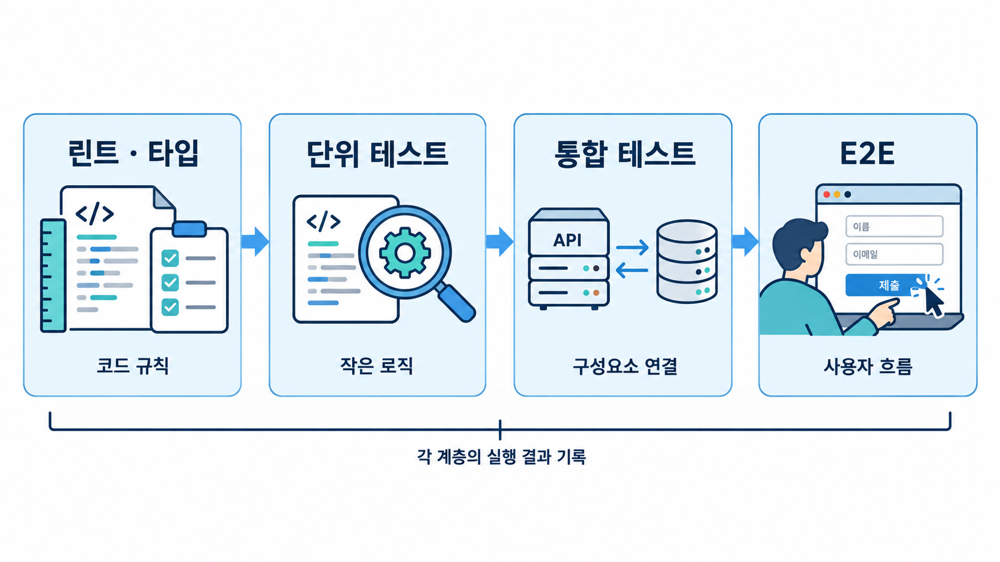

# Module 04 — Quality & Verification (품질과 검증)

에이전트 산출물을 자동·교차 검증하는 체계를 만듭니다.

## 그림으로 시작합니다

먼저 그림에서 사람·문서·도구의 역할과 화살표 방향을 확인합니다. 각 레슨의 “그림 읽는 순서”를 읽은 다음 개념과 따라하기를 진행합니다.

- [파일 한 줄부터 사용자 흐름까지 확인합니다](./04-1-verification-layers.md)에서 그림과 설명을 함께 확인합니다.
- [구현과 리뷰의 관점을 나누고 사람이 판단합니다](./04-2-cross-review.md)에서 그림과 설명을 함께 확인합니다.
- [외부 자료와 작업 지시의 경계를 구분합니다](./04-3-security.md)에서 그림과 설명을 함께 확인합니다.

제안서에 사용할 원본 PNG는 [전체 그림 목록](../../docs/design/illustrations.md)에서 찾습니다.

## 레슨
| # | 제목 | 상태 |
|---|---|---|
| 04-1 | [검증 계층: 린트·타입·단위·통합·E2E](./04-1-verification-layers.md) | ✅ 초안 |
| 04-2 | [교차 리뷰: Claude ↔ Codex](./04-2-cross-review.md) | ✅ 초안 |
| 04-3 | [보안](./04-3-security.md) | ✅ 초안 |
| 04-4 | [브라우저/E2E 검증](./04-4-browser-e2e.md) | ✅ 초안 |

- 레슨별 따라하기·숙제 상세는 [커리큘럼 설계서 §4](../../docs/design/curriculum-design.md#4-모듈-상세-설계)를 참고합니다.
- 레슨 작성 형식: [lesson-template.md](../../docs/design/lesson-template.md)
