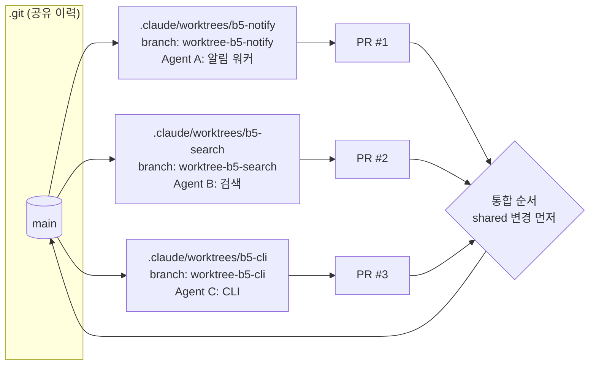

# 05-1. 병렬 에이전트: git worktree, 여러 세션, 클라우드 작업

## 🎯 학습 목표
- 서로 독립적인 Task 3개를 골라 **파일 소유 범위가 겹치지 않는지** 판정할 수 있습니다.
- Claude Code(`claude --worktree`)와 Codex(`codex --worktree`)로 worktree 3개에서 에이전트를 동시에 돌릴 수 있습니다.
- 백그라운드 세션과 클라우드 작업(`claude --bg`, `claude --cloud`, `codex cloud exec`)으로 터미널을 점유하지 않는 병렬 작업을 시작하고 결과를 로컬로 가져올 수 있습니다.
- 병렬로 만든 브랜치 3개를 정해진 순서로 통합하고, 충돌과 재작업을 회고서로 정리할 수 있습니다.

## 📋 사전 준비
- 선행 레슨: [03-3 Git 전략](../03-agentic-workflow/03-3-git-strategy.md), [03-4 컨텍스트 관리](../03-agentic-workflow/03-4-context-management.md), [04-1 검증 계층](../04-quality-and-verification/04-1-verification-layers.md)
- 필요 도구/계정: Claude Code 2.1.292 이상, Codex 0.160.1 이상, Git 2.40 이상(worktree), 터미널 3개(또는 tmux), 클라우드 실습을 하려면 claude.ai 구독과 Codex Cloud 환경(ENV_ID)
- 실습 저장소 상태: Project B(TaskFlow)의 **B4 완료 상태**. `make verify` 한 줄로 린트·타입·테스트가 돌고, 백로그에 B5용 Task 명세가 있습니다.

```text
taskflow/
├── apps/
│   ├── api/          # Fastify API
│   └── web/          # Next.js
├── packages/
│   ├── db/           # PostgreSQL 스키마·마이그레이션
│   ├── shared/       # 공용 타입·zod 스키마
│   └── (B5에서 추가) worker/, search/, cli/
├── backlog/TASK-*.md
├── AGENTS.md
└── CLAUDE.md         # @AGENTS.md
```

## 💡 개념

### 왜 병렬입니까
한 세션은 한 번에 한 가지 일만 합니다. 에이전트가 테스트를 돌리고 고치는 동안 사람은 기다리고, 그 사이 컨텍스트는 계속 쌓입니다. 설계 원칙 4번 **Small Batches, Many Agents**는 이렇게 풉니다. 작업을 한 세션에 끝날 크기로 자르고([02-3](../02-spec-driven-development/02-3-task-breakdown.md)), 서로 다른 작업 디렉터리에서 동시에 돌린 뒤 PR로 합칩니다.

병렬화가 공짜는 아닙니다. 같은 파일을 두 에이전트가 고치면 머지 충돌이 나고, 같은 포트·같은 DB를 쓰면 테스트끼리 간섭합니다. 그래서 병렬 작업은 세 가지를 **격리**하는 일입니다.

| 격리 대상 | 도구 | 격리하지 않으면 |
|---|---|---|
| 파일(작업 트리) | `git worktree` (`claude --worktree`, `codex --worktree`) | 한 세션의 편집이 다른 세션의 빌드를 깨뜨립니다 |
| 컨텍스트 | 세션마다 별도 대화 | 작업 A의 탐색 기록이 작업 B 판단을 오염시킵니다 |
| 런타임 자원 | 포트·DB 스키마·캐시 디렉터리를 worktree별로 분리 | 테스트가 무작위로 실패합니다 (flaky) |

### worktree란
`git worktree`는 같은 저장소 이력(`.git`)을 공유하면서 **작업 디렉터리와 브랜치만 따로** 갖는 체크아웃입니다. 클론을 세 번 하는 것보다 가볍고, 커밋은 즉시 서로 보입니다.



### 세 가지 병렬 실행 방식

| 방식 | Claude Code | Codex | 언제 쓰나 |
|---|---|---|---|
| 로컬 worktree + 대화형 | `claude --worktree <name>` (`-w`), `--tmux` | `codex --worktree` | 사람이 각 세션을 지켜보며 중간에 개입할 때 |
| 로컬 백그라운드 | `claude --bg "..."`, `claude agents`, `claude attach <id>` | `codex agents` (공유 로컬 app-server 데몬의 세션 탐색) | 터미널을 비워 두고 여러 작업을 걸어 둘 때 |
| 클라우드 | `claude --cloud "..."`, `/teleport` | `codex cloud exec --env <ENV_ID> "..."`, `codex cloud apply` | 노트북을 덮어도 계속 돌아야 하거나, 로컬 자원이 부족할 때 |

- Claude `--worktree`는 저장소 루트의 `.claude/worktrees/<name>/`에 `worktree-<name>` 브랜치로 worktree를 만듭니다. 기본 기준점은 원격 기본 브랜치(`worktree.baseRef` 기본값 `"fresh"`)입니다.
- Codex `--worktree`는 "새 관리형 Git worktree에서 실행"합니다(`codex --help`). CLI에서 만드는 worktree의 정확한 위치와 브랜치 이름 규칙은 문서에서 확인하지 못했습니다. TODO(verify) (Codex 앱 문서는 `$CODEX_HOME/worktrees`라고 적습니다.)
- `codex cloud`는 `--help`에 `[EXPERIMENTAL]`로 표시됩니다. 화면 경로보다 명령과 개념 위주로 익힙니다.

### 병렬화 판정 기준
병렬로 돌려도 되는 Task는 다음을 만족합니다.
1. **파일 소유 범위가 겹치지 않습니다.** 공용 파일(`packages/shared`, 루트 `package.json`, `pnpm-lock.yaml`, DB 마이그레이션)을 건드리는 Task는 하나만 고르거나 먼저 끝냅니다.
2. **선후 의존이 없습니다.** Task 명세의 `의존 작업`이 비어 있거나 이미 머지됐습니다.
3. **각자 검증할 수 있습니다.** `pnpm turbo run test --filter=<패키지>`처럼 자기 범위만 검증하는 명령이 있습니다.

## 👣 따라하기

### Step 1. 병렬 후보 Task 3개를 고르고 소유 범위를 고정합니다
목적: 병렬화 전에 충돌 가능성을 문서로 제거합니다. 이 단계는 도구와 무관하며, 두 도구 모두 **읽기 전용**으로 실행합니다.

**Claude Code 레시피**
```bash
cd ~/work/taskflow
claude --permission-mode plan
> backlog/ 의 B5 Task 명세(알림 워커, 검색, CLI)를 읽고 다음 표를 만들어 주십시오.
> | Task | 새로 만들 디렉터리 | 수정할 기존 파일 | 공용 파일 접촉 여부 | 의존 Task |
> 공용 파일은 packages/shared, packages/db/migrations, 루트 package.json, pnpm-lock.yaml,
> turbo.json, .github/ 로 정의합니다. 공용 파일을 두 개 이상의 Task가 건드리면
> "선행 작업"으로 분리하는 안을 제시하십시오. 파일은 수정하지 마십시오.
```

**Codex 레시피**
```bash
cd ~/work/taskflow
codex --sandbox read-only --ask-for-approval on-request
> backlog/ 의 B5 Task 명세(알림 워커, 검색, CLI)를 읽고 다음 표를 만들어 주십시오.
> | Task | 새로 만들 디렉터리 | 수정할 기존 파일 | 공용 파일 접촉 여부 | 의존 Task |
> 공용 파일은 packages/shared, packages/db/migrations, 루트 package.json, pnpm-lock.yaml,
> turbo.json, .github/ 로 정의합니다. 공용 파일을 두 개 이상의 Task가 건드리면
> "선행 작업"으로 분리하는 안을 제시하십시오. 파일은 수정하지 마십시오.
```

결과 표를 보고 사람이 결정합니다. 흔한 결론은 이렇습니다.

| Task | 소유 디렉터리 | 공용 파일 | 처리 |
|---|---|---|---|
| TASK-051 알림 워커 | `packages/worker/` | `packages/shared/events.ts` 추가 | **선행 작업 TASK-050**으로 분리해 먼저 머지 |
| TASK-052 검색 | `packages/search/`, `apps/api/src/routes/search.ts` | 없음 | 병렬 |
| TASK-053 CLI | `packages/cli/` | 없음 | 병렬 |

결정을 각 Task 명세의 `예상 변경 범위`에 적고, 공용 파일 변경(TASK-050)은 지금 단일 세션으로 끝내 main에 머지합니다. 새 패키지 3개가 `pnpm-lock.yaml`을 각각 바꾸는 문제는 **선행 작업에서 빈 패키지 3개를 미리 스캐폴딩**하면 사라집니다.

워크트리 준비 파일도 함께 커밋합니다.

```bash
# .gitignore
echo ".claude/worktrees/" >> .gitignore

# .worktreeinclude — Claude가 만드는 worktree에 gitignore된 파일을 복사합니다 (.gitignore 문법)
cat > .worktreeinclude <<'EOF'
.env
.env.local
EOF
git add .gitignore .worktreeinclude && git commit -m "chore: prepare repo for parallel worktrees"
```

**기대 결과**: B5 Task 3개의 소유 디렉터리가 명세에 적혀 있고, 공용 파일 변경은 main에 이미 머지돼 있습니다. `git status`가 깨끗합니다.

> 참고: `.worktreeinclude`는 Claude Code 문서에 있는 기능입니다. Codex 앱 문서도 같은 파일명을 언급하지만, Codex CLI의 `--worktree`가 이 파일을 처리하는지는 확인하지 못했습니다. TODO(verify)

### Step 2. worktree 3개에서 에이전트를 동시에 실행합니다
목적: 파일 격리 상태에서 세 Task를 동시에 진행합니다.

**Claude Code 레시피**
```bash
# 터미널 1
claude --worktree b5-notify
> backlog/TASK-051-notification-worker.md 를 구현하십시오. packages/worker/ 밖의 파일은 수정하지 말고,
> 다른 파일이 필요하면 멈추고 저에게 질문하십시오. 완료 조건의 검증 명령을 모두 통과시킨 뒤 커밋하십시오.

# 터미널 2
claude --worktree b5-search
> backlog/TASK-052-search.md 를 구현하십시오. (같은 규칙)

# 터미널 3
claude --worktree b5-cli
> backlog/TASK-053-cli.md 를 구현하십시오. (같은 규칙)
```

tmux를 쓰면 `claude --worktree b5-notify --tmux`처럼 worktree마다 tmux 세션을 만듭니다(`--tmux`는 `--worktree`가 필요합니다).

**Codex 레시피**
```bash
# 터미널 1~3에서 각각
codex --worktree "backlog/TASK-051-notification-worker.md 를 구현하십시오. packages/worker/ 밖의 파일은 수정하지 말고, 필요하면 멈추고 질문하십시오. 완료 조건의 검증 명령을 모두 통과시키십시오."
codex --worktree "backlog/TASK-052-search.md 를 구현하십시오. (같은 규칙)"
codex --worktree "backlog/TASK-053-cli.md 를 구현하십시오. (같은 규칙)"
```

worktree 위치와 브랜치 이름을 직접 정하고 싶으면 git으로 만든 뒤 그 안에서 실행합니다. 두 도구 모두 이 방식으로 동작합니다.

```bash
git worktree add ../taskflow-b5-cli -b feat/b5-cli
cd ../taskflow-b5-cli && pnpm install
codex     # 또는 claude
```

worktree는 새 체크아웃이므로 **의존성 설치가 따로 필요합니다.** 프롬프트 첫 줄에 "먼저 `pnpm install`을 실행하십시오"를 넣거나, [01-5](../01-environment-setup/01-5-reproducible-environment.md)의 SessionStart 훅을 씁니다.

런타임 자원도 분리합니다. TaskFlow의 테스트가 `DATABASE_URL`과 `PORT`를 읽는다면 worktree마다 다른 값을 씁니다.

```bash
# 각 worktree의 .env.local (gitignore 대상)
DATABASE_URL=postgres://localhost:5432/taskflow_b5_search   # worktree마다 다른 DB
PORT=4102                                                    # worktree마다 다른 포트
```

**기대 결과**: `git worktree list`에 main 외 worktree 3개가 보이고, 각 세션이 자기 디렉터리 안에서만 파일을 만듭니다. 세 세션이 동시에 테스트를 돌려도 포트 충돌이나 DB 충돌이 없습니다.

```bash
git worktree list
# /home/me/work/taskflow                              abc1234 [main]
# /home/me/work/taskflow/.claude/worktrees/b5-notify  def5678 [worktree-b5-notify]
# ...
```

### Step 3. 백그라운드·클라우드로 터미널을 비웁니다
목적: 사람이 지켜볼 필요가 적은 작업을 백그라운드나 클라우드로 보내 동시성을 더 높입니다.

**Claude Code 레시피**
```bash
# 로컬 백그라운드: 바로 반환하고 id를 출력합니다
claude --bg "backlog/TASK-054-cli-docs.md 를 구현하십시오. packages/cli/README.md 만 수정하십시오."
claude agents              # 실행 중인 백그라운드 세션 목록
claude logs <id>           # 최근 출력 확인
claude attach <id>         # 이 터미널에서 이어서 대화
claude stop <id>           # 중단 (대화는 남습니다)

# 클라우드: 저장소에 커밋된 설정만 씁니다 (~/.claude/skills, 사용자 플러그인은 로드하지 않습니다)
claude --cloud "Add unit tests for packages/search/src/tokenizer.ts until branch coverage is 90%"
# 끝나면 로컬로 가져옵니다
claude --teleport          # 또는 세션 안에서 /teleport
```

**Codex 레시피**
```bash
# 클라우드 작업 제출 (EXPERIMENTAL)
codex cloud exec --env <ENV_ID> --branch main \
  "Add unit tests for packages/search/src/tokenizer.ts until branch coverage is 90%"
# best-of-N: 같은 작업을 2번 시도해 더 나은 결과를 고릅니다
codex cloud exec --env <ENV_ID> --attempts 2 "Fix the flaky test in packages/worker/test/retry.spec.ts"

codex cloud list                 # 작업 목록
codex cloud status <TASK_ID>     # 상태
codex cloud diff <TASK_ID>       # diff 확인
codex cloud apply <TASK_ID>      # 로컬 작업 트리에 적용

# 로컬 데몬 세션 탐색
codex agents
```

> `codex cloud status|diff|apply`의 인수 형태는 `codex cloud <sub> --help`로 한 번 더 확인합니다. `<TASK_ID>`는 `codex cloud list` 출력에서 가져옵니다.

클라우드에 보낼 작업은 다음 조건을 만족해야 실패가 적습니다.
- 필요한 지시가 **저장소 안**(`AGENTS.md`, `CLAUDE.md`, `.claude/skills/`, `.agents/skills/`, Task 명세)에 있습니다.
- 비밀값 없이 테스트가 돕니다(또는 클라우드 환경에 비밀값이 등록돼 있습니다).
- 결과를 diff 하나로 검토할 수 있는 크기입니다.

**기대 결과**: 로컬 대화형 세션 3개 + 백그라운드 1개 + 클라우드 1~2개가 동시에 진행됩니다. `claude agents` / `codex cloud list`에서 상태를 한눈에 확인할 수 있습니다.

### Step 4. 정해진 순서로 통합합니다
목적: 병렬로 만든 브랜치를 충돌 없이, 검증을 통과한 상태로 main에 합칩니다.

통합 순서 원칙:
1. 공용 파일을 건드린 브랜치를 먼저 머지합니다(Step 1에서 분리했다면 이미 끝났습니다).
2. 나머지는 **작은 것부터** 머지하고, 머지할 때마다 남은 브랜치를 main 위로 rebase한 뒤 다시 검증합니다.
3. 충돌 해결도 에이전트에게 맡길 수 있지만, **양쪽 Task 명세를 함께 보여 줍니다.**

**Claude Code 레시피**
```bash
cd .claude/worktrees/b5-search
git fetch origin && git rebase origin/main
claude -c     # 이 디렉터리의 가장 최근 세션을 이어갑니다
> main에 TASK-053(CLI)이 먼저 머지됐습니다. rebase 중 충돌이 난 파일을 TASK-052와 TASK-053 명세에
> 비추어 해결하십시오. 두 Task의 의도를 모두 보존해야 합니다. 해결 후 pnpm turbo run test --filter=...[origin/main]
> 을 돌리고 결과를 보여 주십시오. 판단이 애매한 충돌은 해결하지 말고 목록으로 남기십시오.
```

**Codex 레시피**
```bash
cd ../taskflow-b5-search
git fetch origin && git rebase origin/main
codex resume --last
> main에 TASK-053(CLI)이 먼저 머지됐습니다. rebase 중 충돌이 난 파일을 TASK-052와 TASK-053 명세에
> 비추어 해결하십시오. 두 Task의 의도를 모두 보존해야 합니다. 해결 후 pnpm turbo run test --filter=...[origin/main]
> 을 돌리고 결과를 보여 주십시오. 판단이 애매한 충돌은 해결하지 말고 목록으로 남기십시오.
```

> `codex resume --last`가 어느 디렉터리 기준으로 "가장 최근"을 고르는지 헷갈리면 `codex resume`(선택기)으로 세션을 직접 고릅니다.

PR마다 [04-2](../04-quality-and-verification/04-2-cross-review.md)의 교차 리뷰를 붙입니다. 병렬로 만든 PR은 서로를 모르고 만들어졌으므로, 리뷰 프롬프트에 "main의 최신 상태와 중복된 유틸리티가 생기지 않았는지"를 반드시 넣습니다.

```bash
# Claude 구현 → Codex 리뷰
codex review --base main
# Codex 구현 → Claude 리뷰
claude
> /code-review high main
```

**기대 결과**: 브랜치 3개가 모두 main에 머지되고, 머지마다 `make verify`가 통과합니다. 충돌 해결 기록(어느 파일, 누가, 어떻게)이 PR 코멘트나 메모에 남아 있습니다.

### Step 5. 정리하고 회고합니다
목적: 남은 worktree와 브랜치를 정리하고, 다음 병렬 작업을 위한 규칙을 메모리 파일에 반영합니다.

**Claude Code 레시피**
```bash
# 대화형 worktree 세션은 종료할 때 정리 여부를 묻습니다(변경이 없으면 이름 없는 세션은 자동 삭제)
# -p 로 만든 worktree나 남은 worktree는 직접 지웁니다
git worktree list
git worktree remove .claude/worktrees/b5-notify
git branch -d worktree-b5-notify
```

**Codex 레시피**
```bash
git worktree list
git worktree remove ../taskflow-b5-cli
git branch -d feat/b5-cli
# Codex 관리형 worktree의 자동 정리 정책은 CLI 기준으로 확인하지 못했습니다. TODO(verify)
```

회고에서 나온 규칙은 `AGENTS.md`(두 도구 공통)에 적습니다.

```markdown
## 병렬 작업 규칙
- 병렬 Task는 명세의 `예상 변경 범위` 밖 파일을 수정하지 않습니다. 필요하면 멈추고 묻습니다.
- packages/shared, packages/db/migrations, pnpm-lock.yaml 변경은 단독 Task로 먼저 머지합니다.
- worktree마다 .env.local에 별도 DATABASE_URL과 PORT를 씁니다.
```

**기대 결과**: `git worktree list`에 main만 남고, 병렬 작업 규칙이 `AGENTS.md`에 커밋돼 있습니다.

## ✅ 체크포인트
- [ ] B5 Task 3개의 소유 디렉터리와 공용 파일 접촉 여부를 표로 정리했습니다.
- [ ] 공용 파일 변경을 선행 작업으로 분리해 먼저 머지했습니다.
- [ ] `.claude/worktrees/`를 `.gitignore`에 추가했습니다.
- [ ] worktree 3개에서 에이전트 3개가 동시에 실행되는 것을 `git worktree list`로 확인했습니다.
- [ ] worktree마다 포트·DB를 분리해 테스트가 서로 간섭하지 않았습니다.
- [ ] 백그라운드(`claude --bg`) 또는 클라우드(`claude --cloud` / `codex cloud exec`) 작업을 1개 이상 실행하고 결과를 로컬로 가져왔습니다.
- [ ] 브랜치 3개를 정한 순서대로 머지했고, 머지마다 검증이 통과했습니다.

## 🏠 숙제
| # | 유형 | 난이도 | 과제 | 완료 조건 |
|---|---|---|---|---|
| HW1 | 🔁 Reproduce | ★ | Step 1~2를 본인 저장소(또는 TaskFlow)에서 재현해 Task 3개를 worktree 3개에서 동시에 진행합니다 | `git worktree list` 출력과 세 세션이 동시에 실행 중인 스크린샷, Task별 소유 범위 표가 `submissions/05-1.md`에 있습니다 |
| HW2 | 🔬 Compare | ★★ | 같은 Task 3개 묶음을 (a) 순차 단일 세션 (b) worktree 병렬로 각각 수행하고 비교합니다 | 총 소요 시간, 사람 개입 횟수, 머지 충돌 수, 재작업 커밋 수를 표로 비교하고, 병렬화가 손해였던 지점을 1개 이상 분석했습니다. Claude/Codex 중 최소 하나는 각 방식에 사용했습니다 |
| HW3 | 🚀 Challenge | ★★★ | **병렬 작업 충돌 회고서**: B5(알림 워커·검색·CLI)를 병렬로 끝내고 발생한 충돌·간섭을 분석합니다 | 충돌·간섭 사례 3개 이상을 "증상 → 원인(파일/런타임/컨텍스트) → 해결 → 재발 방지 규칙"으로 정리하고, 재발 방지 규칙을 `AGENTS.md`에 반영한 커밋 링크가 있습니다. 로컬 worktree와 클라우드/백그라운드 실행을 모두 1회 이상 포함합니다 |

제출: `hw/05-1` 브랜치, `submissions/05-1.md` (템플릿: docs/design/homework-template.md)

## ⚠️ 흔한 실수
- **lockfile 충돌이 매번 납니다** → 원인: 병렬 Task가 각자 의존성을 추가해 `pnpm-lock.yaml`이 세 갈래로 바뀌었습니다 → 대응: 새 패키지 스캐폴딩과 의존성 추가를 선행 작업으로 묶어 먼저 머지합니다. 이미 났다면 lockfile은 손으로 고치지 말고 rebase 후 `pnpm install`로 다시 생성합니다.
- **테스트가 무작위로 실패합니다** → 원인: worktree 3개가 같은 Postgres DB나 같은 포트를 씁니다 → 대응: worktree별 `.env.local`에 DB 이름·포트를 분리하고, `.worktreeinclude`로 템플릿을 복사한 뒤 값을 바꿉니다.
- **`claude --worktree`가 실패합니다** → 원인: 커밋이 하나도 없는 저장소이거나, 그 디렉터리에서 workspace trust를 수락한 적이 없습니다 → 대응: 첫 커밋을 만들고, 메인 체크아웃에서 `claude`를 한 번 실행해 trust를 수락합니다.
- **에이전트가 자기 범위 밖 파일을 "친절하게" 고칩니다** → 원인: 범위 제한을 프롬프트에만 쓰고 명세에 적지 않았습니다 → 대응: Task 명세의 `예상 변경 범위`와 `AGENTS.md`의 병렬 작업 규칙에 적고, 리뷰 때 `git diff --stat origin/main...`으로 범위 이탈을 먼저 확인합니다.
- **클라우드 작업이 로컬과 다르게 동작합니다** → 원인: 개인 설정(`~/.claude/skills`, 사용자 플러그인, `~/.codex/config.toml`)에 의존했습니다 → 대응: 팀이 쓰는 규칙과 skill은 저장소에 커밋합니다(`.claude/skills/`, `.agents/skills/`).

## 🔗 참고 자료
- Claude Code: [Worktrees](https://code.claude.com/docs/en/worktrees), [Common workflows](https://code.claude.com/docs/en/common-workflows), [Claude Code on the web](https://code.claude.com/docs/en/claude-code-on-the-web), [CLI reference](https://code.claude.com/docs/en/cli-reference)
- Codex: [Git worktrees](https://learn.chatgpt.com/docs/environments/git-worktrees), [Codex Cloud](https://learn.chatgpt.com/docs/cloud)
- Git: [git-worktree](https://git-scm.com/docs/git-worktree)
- 이 저장소: [도구 레퍼런스 §9 병렬 실행 · 클라우드](../../docs/reference/tool-reference.md), [02-3 작업 분해](../02-spec-driven-development/02-3-task-breakdown.md), [03-3 Git 전략](../03-agentic-workflow/03-3-git-strategy.md), [04-2 교차 리뷰](../04-quality-and-verification/04-2-cross-review.md), [05-2 오케스트레이션](./05-2-orchestration.md), [05-5 대규모 변경](./05-5-large-scale-changes.md)
- 템플릿: [templates/task-spec.md](../../templates/task-spec.md), [templates/handoff-note.md](../../templates/handoff-note.md)
