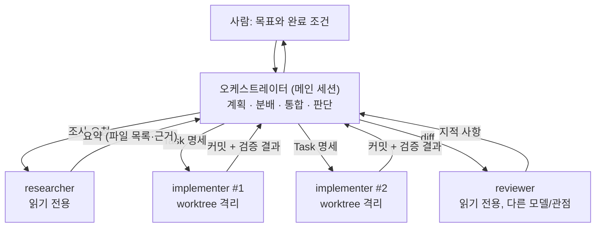

# 05-2. 오케스트레이션: 서브에이전트, 오케스트레이터-워커 패턴

## 🎯 학습 목표
- 서브에이전트가 **컨텍스트를 아끼는 장치**라는 점을 설명하고, 위임할 일과 메인 세션에 남길 일을 구분할 수 있다.
- Claude Code(`.claude/agents/*.md`)와 Codex(`.codex/agents/*.toml`)에 조사·구현·리뷰 서브에이전트를 정의하고 호출할 수 있다.
- 메인 세션을 오케스트레이터로 두고 워커 서브에이전트에게 Task를 나눠 주는 흐름을 한 번 끝까지 돌릴 수 있다.
- 헤드리스 명령(`claude -p`, `codex exec`)을 이어 붙여 스크립트 기반 오케스트레이션 파이프라인을 만들 수 있다.

## 📋 사전 준비
- 선행 레슨: [01-4 확장 기능](../01-environment-setup/01-4-extensions.md), [03-4 컨텍스트 관리](../03-agentic-workflow/03-4-context-management.md), [05-1 병렬 에이전트](./05-1-parallel-agents.md)
- 필요 도구/계정: Claude Code 2.1.292 이상, Codex 0.160.1 이상, `jq`
- 실습 저장소 상태: Project B(TaskFlow)의 B4 완료 상태 또는 B5 진행 중. `backlog/`에 Task 명세가 있고 `make verify`가 동작한다.

## 💡 개념

### 왜 오케스트레이션인가
05-1의 병렬 세션은 **사람이 오케스트레이터**였다. 사람이 Task를 고르고, 터미널을 나누고, 결과를 합쳤다. 세션 수가 늘면 사람이 병목이 된다. 오케스트레이션은 이 역할의 일부를 에이전트에게 넘긴다.

더 중요한 이유는 **컨텍스트 예산**(설계 원칙 2)이다. 대규모 저장소에서 "알림 기능과 관련된 코드를 모두 찾아줘" 같은 조사는 파일 수십 개를 읽는다. 이것을 메인 세션에서 하면 컨텍스트 대부분이 조사 흔적으로 채워지고, 정작 구현할 때 판단이 흐려진다. 서브에이전트는 **자기 컨텍스트 창에서 일하고 요약만 돌려준다.** 메인 세션에는 결론만 남는다.



### 오케스트레이터-워커 패턴의 규칙
1. **오케스트레이터는 직접 구현하지 않는다.** 계획, 분배, 결과 검증, 통합 판단만 한다. 구현까지 하면 컨텍스트가 다시 불어난다.
2. **워커에게는 대화 기록이 넘어가지 않는다.** 서브에이전트는 메인 대화 이력 없이 시작한다(Claude의 fork 방식 예외). 그래서 위임 메시지는 Task 명세처럼 **그 자체로 완결**돼야 한다.
3. **워커의 권한은 역할에 맞게 좁힌다.** 조사·리뷰 워커는 읽기 전용, 구현 워커만 쓰기 권한을 준다.
4. **워커의 보고는 검증 대상이다.** "테스트 통과"라는 보고를 믿지 말고 오케스트레이터가 검증 명령을 직접 돌린다(설계 원칙 3).

### 두 도구의 서브에이전트 비교

| 항목 | Claude Code | Codex |
|---|---|---|
| 정의 위치 | `.claude/agents/<name>.md` (프로젝트), `~/.claude/agents/` (개인), `--agents '<json>'` (세션 한정) | `.codex/agents/<name>.toml` (프로젝트), `~/.codex/agents/` (개인) |
| 형식 | Markdown + YAML front matter. 본문이 시스템 프롬프트 | TOML. `developer_instructions`가 지시문 |
| 필수 필드 | `name`, `description` | `name`, `description`, `developer_instructions` |
| 주요 선택 필드 | `tools`, `disallowedTools`, `model`, `permissionMode`, `maxTurns`, `skills`, `isolation: worktree`, `memory`, `background`, `effort` | `model`, `model_reasoning_effort`, `sandbox_mode`, `mcp_servers`, `skills.config` |
| 내장 에이전트 | `Explore`(읽기 전용 탐색), `Plan`(계획용 조사), general-purpose 등 | `default`, `worker`(구현), `explorer`(읽기 위주 탐색) |
| 호출 | 자연어("Use the X subagent..."), `@agent-<name>` 멘션, 세션 전체를 `claude --agent <name>` | 자연어("Spawn ... agent"), `/agent`로 실행 중 스레드 전환·확인 |
| 중첩 | 기본 3단계까지 서브에이전트가 서브에이전트를 만든다(`CLAUDE_CODE_MAX_SUBAGENT_SPAWN_DEPTH`) | 문서에서 확인하지 못했다. TODO(verify) |
| 전역 설정 | `env`의 `CLAUDE_CODE_MAX_CONCURRENT_SUBAGENTS`(기본 20), `CLAUDE_CODE_SUBAGENT_MODEL` | `config.toml`의 `[agents]` (`enabled`, `max_concurrent_threads_per_session`, `default_subagent_model` 등) |

- Claude의 `/agents`는 v2.1.198부터 마법사를 열지 않고 안내 문구만 출력한다. 파일을 직접 쓰거나 Claude에게 만들어 달라고 한다.
- Claude에는 서브에이전트보다 무거운 **agent teams**(실험적, `CLAUDE_CODE_EXPERIMENTAL_AGENT_TEAMS=1`)도 있다. 팀원끼리 직접 메시지를 주고받고 공유 작업 목록을 쓴다. 토큰을 훨씬 많이 쓰므로 이 레슨에서는 서브에이전트로 충분한지 먼저 확인하고, 숙제 HW3에서만 선택적으로 비교한다.

## 👣 따라하기

### Step 1. 내장 서브에이전트로 "조사 위임"의 효과를 확인한다
목적: 같은 조사를 메인 세션에서 할 때와 서브에이전트에 맡길 때의 컨텍스트 사용량 차이를 눈으로 본다.

**Claude Code 레시피**
```bash
cd ~/work/taskflow
claude
> /context
# (기준값 기록)
> Explore 서브에이전트 3개를 병렬로 써서 다음을 조사해.
> 1) apps/api 에서 작업(Task) 상태가 바뀌는 모든 지점
> 2) packages/db 에서 알림과 관련될 수 있는 테이블·컬럼
> 3) apps/web 에서 실시간 갱신(폴링/웹소켓)을 쓰는 곳
> 각 서브에이전트는 "파일 경로:라인 — 한 줄 설명" 목록과 근거만 돌려줘. 코드는 수정하지 마.
> /context
```

**Codex 레시피**
```bash
cd ~/work/taskflow
codex --sandbox read-only --ask-for-approval on-request
> /status
# (기준값 기록)
> explorer 에이전트를 3개 띄워 다음을 병렬로 조사하고, 모두 끝날 때까지 기다린 뒤 결과를 요약해.
> 1) apps/api 에서 작업(Task) 상태가 바뀌는 모든 지점
> 2) packages/db 에서 알림과 관련될 수 있는 테이블·컬럼
> 3) apps/web 에서 실시간 갱신(폴링/웹소켓)을 쓰는 곳
> 각 에이전트는 "파일 경로:라인 — 한 줄 설명" 목록과 근거만 돌려줘. 코드는 수정하지 마.
> /agent
# 실행 중인 에이전트 스레드를 전환하며 진행 상황을 확인한다
> /status
```

> Codex에는 Claude `/context` 같은 컨텍스트 시각화 명령이 없다. `/status`의 토큰 사용량으로 비교한다(정확한 표시 항목은 TODO(verify)).

같은 질문을 서브에이전트 없이 메인 세션에서 한 번 더 시켜 보고(`/clear` 또는 `/new` 후) 사용량을 비교한다.

**기대 결과**: 서브에이전트를 쓴 쪽은 메인 컨텍스트 증가량이 요약문 크기 정도에 그치고, 직접 조사한 쪽은 읽은 파일 내용만큼 크게 늘어난다. 두 값을 기록해 둔다(HW1 증거).

### Step 2. 팀 전용 서브에이전트 3종을 정의한다
목적: 조사(researcher)·구현(implementer)·리뷰(reviewer) 역할을 저장소에 커밋해 팀 전체가 같은 워커를 쓰게 한다.

**Claude Code 레시피** — `.claude/agents/`에 파일 3개를 만든다.

```markdown
<!-- .claude/agents/taskflow-researcher.md -->
---
name: taskflow-researcher
description: Read-only codebase investigation for TaskFlow. Use before planning any change that touches more than one package.
tools: Read, Grep, Glob
model: haiku
---
너는 TaskFlow 모노레포 조사 담당이다.
- 코드를 수정하지 않는다.
- 결과는 "파일 경로:라인 — 설명" 목록, 관련 테스트 파일, 영향받는 패키지 목록, 열린 질문 순으로 보고한다.
- 추측과 확인한 사실을 구분해서 표시한다.
```

```markdown
<!-- .claude/agents/taskflow-implementer.md -->
---
name: taskflow-implementer
description: Implements exactly one TaskFlow task spec (backlog/TASK-*.md) in an isolated worktree, with tests.
tools: Read, Grep, Glob, Edit, Write, Bash
isolation: worktree
maxTurns: 60
---
너는 Task 명세 하나만 구현한다.
1. 명세의 "예상 변경 범위" 밖 파일은 수정하지 않는다. 필요하면 멈추고 이유를 보고한다.
2. 테스트를 먼저 쓰고 실패를 확인한 뒤 구현한다.
3. 명세의 완료 조건 명령을 모두 실행하고, 실행한 명령과 출력 요약을 보고한다.
4. 커밋 메시지는 AGENTS.md의 커밋 규칙을 따른다.
```

```markdown
<!-- .claude/agents/taskflow-reviewer.md -->
---
name: taskflow-reviewer
description: Reviews a TaskFlow diff against its task spec and REVIEW.md. Use after any implementer finishes.
tools: Read, Grep, Glob, Bash
permissionMode: plan
model: opus
---
너는 리뷰어다. 코드를 고치지 않는다.
- 입력: 브랜치 이름과 Task 명세 경로.
- `git diff origin/main...<branch>`를 읽고 REVIEW.md 체크리스트, 명세의 완료 조건, 범위 이탈 여부를 점검한다.
- 결과는 [차단] / [권장] / [질문] 세 등급으로 분류하고, 각 항목에 파일:라인과 근거를 단다.
```

**Codex 레시피** — `.codex/agents/`에 파일 3개를 만든다.

```toml
# .codex/agents/taskflow-researcher.toml
name = "taskflow-researcher"
description = "Read-only codebase investigation for TaskFlow. Use before planning any change that touches more than one package."
sandbox_mode = "read-only"
model_reasoning_effort = "low"
developer_instructions = """
너는 TaskFlow 모노레포 조사 담당이다.
- 코드를 수정하지 않는다.
- 결과는 "파일 경로:라인 — 설명" 목록, 관련 테스트 파일, 영향받는 패키지 목록, 열린 질문 순으로 보고한다.
- 추측과 확인한 사실을 구분해서 표시한다.
"""
```

```toml
# .codex/agents/taskflow-implementer.toml
name = "taskflow-implementer"
description = "Implements exactly one TaskFlow task spec (backlog/TASK-*.md), with tests."
sandbox_mode = "workspace-write"
developer_instructions = """
너는 Task 명세 하나만 구현한다.
1. 명세의 "예상 변경 범위" 밖 파일은 수정하지 않는다. 필요하면 멈추고 이유를 보고한다.
2. 테스트를 먼저 쓰고 실패를 확인한 뒤 구현한다.
3. 명세의 완료 조건 명령을 모두 실행하고, 실행한 명령과 출력 요약을 보고한다.
"""
```

```toml
# .codex/agents/taskflow-reviewer.toml
name = "taskflow-reviewer"
description = "Reviews a TaskFlow diff against its task spec and REVIEW.md. Use after any implementer finishes."
sandbox_mode = "read-only"
model_reasoning_effort = "high"
developer_instructions = """
너는 리뷰어다. 코드를 고치지 않는다.
- 입력: 브랜치 이름과 Task 명세 경로.
- git diff origin/main...<branch> 를 읽고 REVIEW.md 체크리스트, 명세의 완료 조건, 범위 이탈 여부를 점검한다.
- 결과는 [차단] / [권장] / [질문] 세 등급으로 분류하고, 각 항목에 파일:라인과 근거를 단다.
"""
```

- Codex 서브에이전트에는 Claude의 `isolation: worktree`에 해당하는 필드를 문서에서 확인하지 못했다. TODO(verify) 구현 워커 여러 개를 동시에 돌릴 때는 05-1처럼 `codex --worktree` 세션을 따로 띄우는 편이 안전하다.
- `model`은 두 도구 모두 생략하면 메인 세션 설정을 따른다. Codex는 `model = "<사용 가능한 모델 ID>"`처럼 계정에서 쓸 수 있는 ID를 넣는다.
- `.codex/config.toml`과 `.codex/agents/`는 **신뢰한 프로젝트**에서만 로드된다.

**기대 결과**: 두 도구에서 각각 "등록된 에이전트를 나열해 줘"라고 물으면 `taskflow-researcher`, `taskflow-implementer`, `taskflow-reviewer`가 설명과 함께 나온다. 파일 6개를 커밋한다.

### Step 3. 오케스트레이터-워커 흐름을 한 번 끝까지 돌린다
목적: 메인 세션은 계획·분배·검증만 하고, 조사→구현→리뷰를 워커가 수행하게 한다. 대상은 B5의 TASK-052(검색)다.

**Claude Code 레시피**
```bash
claude
> 너는 이번 세션의 오케스트레이터다. 직접 코드를 수정하지 마.
> 목표: backlog/TASK-052-search.md 완료.
> 1. @agent-taskflow-researcher 로 영향 범위를 조사해.
> 2. 조사 결과를 바탕으로 TASK-052를 하위 작업 2개 이하로 나눌지 판단하고, 나눈다면 각 하위 작업의
>    목표·변경 범위·완료 조건을 Task 명세 형식으로 써서 나에게 먼저 보여줘. 내가 승인하면 진행해.
> 3. 각 하위 작업을 taskflow-implementer 서브에이전트에게 맡겨. 위임 메시지에는 명세 전문을 넣어.
> 4. 구현이 끝나면 너는 각 worktree에서 완료 조건 명령을 직접 실행해 결과를 확인해.
> 5. taskflow-reviewer 로 리뷰하고, [차단] 항목이 있으면 implementer에게 수정을 다시 맡겨.
> 6. 마지막에 하위 작업별 상태, 검증 결과, 남은 질문을 표로 보고해.
```

진행 중에는 `/tasks`로 백그라운드 서브에이전트를 확인한다. 서브에이전트가 끝나면 Claude가 돌려받은 에이전트 ID로 이어서 지시할 수 있다("Continue the review and check the pagination logic").

**Codex 레시피**
```bash
codex
> 너는 이번 세션의 오케스트레이터다. 직접 코드를 수정하지 마.
> 목표: backlog/TASK-052-search.md 완료.
> 1. taskflow-researcher 에이전트를 띄워 영향 범위를 조사하고 결과를 기다려.
> 2. 조사 결과를 바탕으로 TASK-052를 하위 작업 2개 이하로 나눌지 판단하고, 나눈다면 각 하위 작업의
>    목표·변경 범위·완료 조건을 Task 명세 형식으로 써서 나에게 먼저 보여줘. 내가 승인하면 진행해.
> 3. 하위 작업마다 taskflow-implementer 에이전트를 띄워. 위임 메시지에는 명세 전문을 넣어.
>    두 하위 작업이 같은 파일을 건드리면 동시에 띄우지 말고 순서대로 진행해.
> 4. 구현이 끝나면 너는 완료 조건 명령을 직접 실행해 결과를 확인해.
> 5. taskflow-reviewer 에이전트로 리뷰하고, [차단] 항목이 있으면 implementer에게 수정을 다시 맡겨.
> 6. 마지막에 하위 작업별 상태, 검증 결과, 남은 질문을 표로 보고해.
> /agent
```

**기대 결과**
- 오케스트레이터 세션의 대화에는 계획, 위임 메시지, 요약, 검증 명령 출력만 남고 코드 편집 기록은 없다.
- 리뷰어가 낸 [차단] 항목이 수정 루프를 거쳐 사라진다.
- 최종 보고 표의 "검증 결과"가 오케스트레이터가 **직접 실행한** 명령 출력과 일치한다.

### Step 4. 헤드리스 파이프라인으로 오케스트레이션을 스크립트화한다
목적: 사람이 대화하지 않아도 조사→구현→리뷰가 순서대로 돌도록 만든다. 05-4의 CI 자동화와 05-5의 배치 실행의 기반이 된다.

**Claude Code 레시피** — `scripts/orchestrate-claude.sh`

```bash
#!/usr/bin/env bash
set -euo pipefail
TASK="$1"                                  # 예: backlog/TASK-053-cli.md
NAME="$(basename "$TASK" .md)"
mkdir -p tmp

# 1) 조사: 읽기 전용, 구조화 출력
claude -p --agent taskflow-researcher \
  --output-format json \
  --json-schema '{"type":"object","properties":{"files":{"type":"array","items":{"type":"string"}},"risks":{"type":"array","items":{"type":"string"}}},"required":["files","risks"]}' \
  "Investigate the impact of $TASK. Return affected files and risks." \
  | jq '.structured_output' > "tmp/$NAME.research.json"

# 2) 구현: 전용 worktree에서, 편집 자동 승인 + 필요한 명령만 허용
claude -p --worktree "$NAME" --permission-mode acceptEdits \
  --allowedTools "Bash(pnpm *)" "Bash(git add *)" "Bash(git commit *)" \
  --max-budget-usd 5 \
  "Implement $TASK. Research notes: $(cat "tmp/$NAME.research.json"). Run the spec's completion commands and commit."

# 3) 리뷰: 다른 관점의 리뷰어로
claude -p --agent taskflow-reviewer \
  "Review branch worktree-$NAME against $TASK. Output [차단]/[권장]/[질문] list." \
  > "tmp/$NAME.review.md"
```

**Codex 레시피** — `scripts/orchestrate-codex.sh`

```bash
#!/usr/bin/env bash
set -euo pipefail
TASK="$1"
NAME="$(basename "$TASK" .md)"
mkdir -p tmp

# 1) 조사: exec 기본 샌드박스는 read-only, 구조화 출력은 스키마 파일로
#    schemas/research.schema.json 에는 Claude 버전의 --json-schema 와 같은 JSON Schema를 저장해 둔다
codex exec --output-schema schemas/research.schema.json \
  -o "tmp/$NAME.research.json" \
  "Investigate the impact of $TASK. Return affected files and risks."

# 2) 구현: 관리형 worktree + 쓰기 허용 (--full-auto는 0.160.1에서 거부되므로 쓰지 않는다)
codex exec --worktree --sandbox workspace-write \
  "Implement $TASK. Research notes: $(cat "tmp/$NAME.research.json"). Run the spec's completion commands."

# 3) 리뷰: 비대화형 리뷰 명령
codex review --base main "Review against $TASK and REVIEW.md. Classify findings as [차단]/[권장]/[질문]." \
  > "tmp/$NAME.review.md"
```

- `codex exec`의 `workspace-write`에서도 `.git`은 읽기 전용으로 보호된다. **커밋은 스크립트가 에이전트 밖에서** 한다(`git -C <worktree> add -A && git commit ...`). `--worktree`로 만든 경로를 스크립트가 알아내는 방법은 확인하지 못했다. TODO(verify) 경로가 필요하면 `git worktree add`로 직접 만들고 `codex exec -C <경로>`로 실행한다.
- `claude -p --agent <name>`처럼 `-p`와 `--agent`를 함께 쓰는 조합은 `--help`에 따로 예시가 없다. 동작을 한 번 확인하고 쓴다. TODO(verify) 대안은 `--agents '<json>'`으로 세션 한정 에이전트를 넘기는 방식이다.
- `claude -p`는 workspace trust 확인을 건너뛰고 프로젝트 hooks와 `.mcp.json`을 그대로 실행한다. 신뢰하는 저장소에서만 돌린다.

**기대 결과**: `./scripts/orchestrate-claude.sh backlog/TASK-053-cli.md`(또는 Codex 버전) 한 줄로 `tmp/` 아래 조사 JSON, 구현 브랜치, 리뷰 Markdown이 생긴다. 리뷰에 [차단]이 있으면 스크립트를 확장해 구현 단계를 재실행한다(`claude -c -p` / `codex exec resume --last`).

## ✅ 체크포인트
- [ ] 같은 조사를 서브에이전트 유무로 실행해 메인 컨텍스트 사용량 차이를 기록했다.
- [ ] researcher·implementer·reviewer 정의 파일을 두 도구 형식으로 각각 커밋했다.
- [ ] 조사·리뷰 워커는 읽기 전용(Claude `tools`/`permissionMode`, Codex `sandbox_mode = "read-only"`)이다.
- [ ] 오케스트레이터 세션이 직접 코드를 수정하지 않고 Task 하나를 완료했다.
- [ ] 워커의 "통과" 보고를 오케스트레이터가 직접 검증 명령으로 확인했다.
- [ ] 헤드리스 스크립트로 조사→구현→리뷰를 한 번 실행했다.

## 🏠 숙제
| # | 유형 | 난이도 | 과제 | 완료 조건 |
|---|---|---|---|---|
| HW1 | 🔁 Reproduce | ★ | Step 1~3을 재현해 조사/구현/리뷰 서브에이전트로 Task 1개를 완료한다 | 서브에이전트 사용 전후 컨텍스트(또는 토큰) 수치, 오케스트레이터의 최종 보고 표, 리뷰 지적과 처리 결과가 `submissions/05-2.md`에 있다 |
| HW2 | 🛠 Apply | ★★ | **팀 전용 서브에이전트 3종 정의**: 본인 팀(또는 TaskFlow)에 필요한 역할 3개를 설계해 두 도구 형식으로 작성한다 (예: db-migration-checker, api-contract-guard, e2e-runner) | 역할마다 "위임 조건(description) · 허용 도구/샌드박스 · 보고 형식"이 정의돼 있고, `.claude/agents/` 3개와 `.codex/agents/` 3개가 커밋돼 있다. 각 에이전트를 실제로 1회 이상 호출한 로그가 있다 |
| HW3 | 🚀 Challenge | ★★★ | 같은 Task 묶음(3개 이상)을 (a) 사람이 오케스트레이터 (05-1 방식) (b) 메인 세션 오케스트레이터 + 서브에이전트 (c) Step 4 헤드리스 스크립트로 수행해 비교한다. 선택: Claude agent teams(실험적)를 (d)로 추가한다 | 방식별 소요 시간, 사람 개입 횟수, 재작업 횟수, 토큰 사용량(`/usage`, `--output-format json`의 `total_cost_usd`, `codex exec --json`의 `turn.completed.usage`)을 비교한 표와 "어떤 작업에 어떤 방식을 쓸지" 결정 규칙 3개 이상 |

제출: `hw/05-2` 브랜치, `submissions/05-2.md` (템플릿: docs/design/homework-template.md)

## ⚠️ 흔한 실수
- **워커가 엉뚱한 것을 만든다** → 원인: 위임 메시지가 "아까 얘기한 대로 해줘"처럼 메인 대화를 전제한다. 서브에이전트는 메인 대화 이력을 받지 않는다 → 대응: 위임 메시지에 Task 명세 전문과 완료 조건을 넣는다. 오케스트레이터에게 "위임 메시지를 먼저 보여 달라"고 해 점검한다.
- **오케스트레이터가 결국 직접 구현한다** → 원인: 워커가 한 번 실패하자 메인 세션이 대신 고쳤다. 컨텍스트가 다시 불어나 이후 판단이 나빠진다 → 대응: 메모리 파일이나 첫 프롬프트에 "오케스트레이터는 코드를 수정하지 않는다"를 명시하고, 실패는 워커에게 재위임한다.
- **리뷰어가 아무것도 못 찾는다** → 원인: 구현자와 같은 모델·같은 지시로 리뷰해 같은 맹점을 공유한다 → 대응: 리뷰어는 다른 모델(Claude `model: opus` vs 구현 `sonnet`, 또는 Codex로 교차)과 별도 체크리스트(REVIEW.md)를 쓴다. [04-2](../04-quality-and-verification/04-2-cross-review.md) 참고.
- **구현 워커 둘이 같은 파일을 덮어쓴다** → 원인: 격리 없이 동시에 실행했다 → 대응: Claude는 `isolation: worktree`를 쓰고, Codex는 같은 파일을 건드리는 작업을 순차로 돌리거나 `codex --worktree` 세션을 분리한다.
- **Codex 에이전트 파일이 무시된다** → 원인: 프로젝트를 신뢰하지 않아 `.codex/` 설정이 로드되지 않았거나, 필수 필드(`developer_instructions`)가 빠졌다 → 대응: 프로젝트 신뢰 여부를 확인하고 세 필수 필드를 채운다. `codex --strict-config`로 알 수 없는 필드를 오류로 확인한다.

## 🔗 참고 자료
- Claude Code: [Subagents](https://code.claude.com/docs/en/sub-agents), [Agent teams](https://code.claude.com/docs/en/agent-teams), [Headless](https://code.claude.com/docs/en/headless), [CLI reference](https://code.claude.com/docs/en/cli-reference), [Commands](https://code.claude.com/docs/en/commands)
- Codex: [Subagents](https://learn.chatgpt.com/docs/agent-configuration/subagents), [Non-interactive mode](https://learn.chatgpt.com/docs/non-interactive-mode), [Code review](https://learn.chatgpt.com/docs/code-review)
- 이 저장소: [도구 레퍼런스 §2, §7, §9](../../docs/reference/tool-reference.md), [01-4 확장 기능](../01-environment-setup/01-4-extensions.md), [03-4 컨텍스트 관리](../03-agentic-workflow/03-4-context-management.md), [04-2 교차 리뷰](../04-quality-and-verification/04-2-cross-review.md), [05-1 병렬 에이전트](./05-1-parallel-agents.md), [05-4 CI/CD 통합](./05-4-ci-cd-integration.md), [06-1 비용과 성능](../06-team-and-operations/06-1-cost-and-performance.md)
- 템플릿: [templates/task-spec.md](../../templates/task-spec.md)
