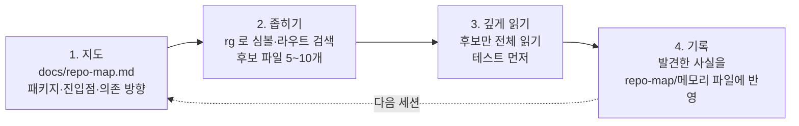

# 05-3. 대규모 코드베이스: 모노레포, 디렉터리별 메모리 파일, 코드 탐색 전략

## 🎯 학습 목표
- 두 도구가 메모리 파일(`CLAUDE.md`, `AGENTS.md`)을 **언제, 어떤 순서로** 로드하는지 설명하고, 그 차이에 맞춰 계층을 설계할 수 있습니다.
- TaskFlow 모노레포에 루트 + 패키지별 메모리 파일 계층을 구성하고, 실제로 로드된 파일을 도구별로 확인할 수 있습니다.
- "전부 읽기" 대신 **지도 → 좁히기 → 깊게 읽기** 순서로 에이전트의 코드 탐색을 이끌 수 있습니다.
- 처음 보는 10만 라인급 저장소의 온보딩 문서를 에이전트로 작성하고 검증할 수 있습니다.

## 📋 사전 준비
- 선행 레슨: [01-1 프로젝트 메모리](../01-environment-setup/01-1-project-memory.md), [03-4 컨텍스트 관리](../03-agentic-workflow/03-4-context-management.md), [05-2 오케스트레이션](./05-2-orchestration.md)
- 필요 도구/계정: Claude Code 2.1.292 이상, Codex 0.160.1 이상, `rg`(ripgrep), 선택: `tokei` 또는 `cloc`
- 실습 저장소 상태: Project B(TaskFlow)의 B5 진행 중 상태. `apps/api`, `apps/web`, `packages/db`, `packages/shared`, `packages/worker`, `packages/search`, `packages/cli`가 있습니다.

## 💡 개념

### 왜 대규모 코드베이스는 다르게 다뤄야 하나
1만 라인짜리 저장소는 에이전트가 필요한 파일을 대충 다 읽어도 컨텍스트에 들어갑니다. 10만 라인을 넘으면 그렇지 않습니다. 이때 생기는 실패는 대부분 세 가지입니다.

1. **잘못된 지역 규칙 적용**: `apps/web`의 React 규칙을 `apps/api`에 적용하거나, 패키지마다 다른 테스트 명령을 혼동합니다.
2. **탐색 비용 폭발**: 관련 코드를 찾으려고 수십 개 파일을 통째로 읽어 컨텍스트를 소진합니다.
3. **중복 구현**: 이미 있는 유틸리티를 찾지 못해 새로 만듭니다.

해결책은 "에이전트에게 더 많이 읽히기"가 아니라 **필요한 곳에서 필요한 규칙만 로드되게 하고, 탐색 순서를 정해 주는 것**입니다.

### 메모리 파일 로드 방식의 차이
같은 디렉터리 구조라도 두 도구가 파일을 읽는 시점이 다릅니다.

```text
taskflow/
├── CLAUDE.md               ← @AGENTS.md + Claude 전용 (시작 시 로드)
├── AGENTS.md               ← 공통 규칙 (Codex: 시작 시 / Claude: CLAUDE.md의 import로)
├── .claude/rules/
│   └── migrations.md       ← paths: packages/db/migrations/** (Claude 전용 경로별 규칙)
├── apps/
│   ├── api/
│   │   ├── AGENTS.md       ← Fastify·API 규칙
│   │   └── CLAUDE.md       ← @AGENTS.md
│   └── web/
│       ├── AGENTS.md       ← Next.js·UI 규칙
│       └── CLAUDE.md       ← @AGENTS.md
└── packages/
    └── db/
        ├── AGENTS.md       ← 스키마·마이그레이션 규칙
        └── CLAUDE.md       ← @AGENTS.md
```

| 항목 | Claude Code | Codex |
|---|---|---|
| 시작할 때 로드 | cwd와 **그 상위** 디렉터리의 `CLAUDE.md` | 프로젝트 루트(보통 Git 루트)부터 **cwd까지** 각 디렉터리의 `AGENTS.override.md` → `AGENTS.md` → fallback 파일명 중 1개 |
| 하위 디렉터리 파일 | 그 안의 파일을 Read/Write/Edit할 때 **지연 로드** | 시작할 때 한 번 체인을 구성합니다. cwd **아래** 디렉터리 파일은 로드하지 않습니다 |
| 결합 방식 | 덮어쓰지 않고 연결(concatenate) | 루트부터 연결, cwd에 가까운 파일이 뒤에 옵니다 |
| 크기 상한 | 개별 파일을 짧게 유지하도록 권장 | 합계가 `project_doc_max_bytes`(기본 32 KiB)에 이르면 거기서 멈춥니다 |
| 경로별 규칙 | `.claude/rules/*.md` + front matter `paths:` glob | 하위 디렉터리에 `AGENTS.md`를 둡니다 |
| AGENTS.md 직접 읽기 | `CLAUDE.md` 계열이 하나도 없을 때만 읽습니다 → 각 디렉터리에 `CLAUDE.md`(`@AGENTS.md`)를 둡니다 | 기본 |

실무 결론:
- **공통 규칙은 `AGENTS.md`에 쓰고, 같은 디렉터리의 `CLAUDE.md`는 `@AGENTS.md` 한 줄 + Claude 전용 지시만 둡니다.** 이 저장소와 같은 방식이며, 어떤 설정에서도 두 번 읽히지 않습니다.
- **Codex로 패키지 작업을 할 때는 그 패키지 디렉터리에서 시작합니다.** 루트에서 시작하면 `apps/api/AGENTS.md`가 로드되지 않습니다.
- **루트 파일은 짧게.** 루트 내용은 모든 세션에 들어갑니다. 패키지 고유 규칙은 패키지 파일로 내립니다.

### 탐색 전략: 지도 → 좁히기 → 깊게 읽기



- **지도**는 한 번 만들어 커밋하고 계속 고칩니다. 에이전트는 매 세션 지도부터 읽습니다.
- **좁히기**는 서브에이전트(Claude `Explore`, Codex `explorer`)에 맡기면 메인 컨텍스트를 아낍니다(05-2).
- **깊게 읽기**는 테스트 파일부터 읽게 합니다. 테스트는 의도를 압축한 문서입니다.

## 👣 따라하기

### Step 1. 저장소 지도(repo map)를 만듭니다
목적: 모든 세션이 처음에 읽을 1~2쪽짜리 지도를 만듭니다. 지도 자체가 루트 메모리 파일을 짧게 유지하는 수단입니다.

먼저 규모를 잽니다(도구 무관).

```bash
cd ~/work/taskflow
git ls-files | wc -l
tokei --compact apps packages 2>/dev/null || cloc apps packages
cat pnpm-workspace.yaml turbo.json
```

**Claude Code 레시피**
```bash
claude --permission-mode plan
> Explore 서브에이전트를 패키지별로 병렬로 써서 docs/repo-map.md 초안을 만들어 주십시오. 형식:
> ## 패키지 표: 이름 | 경로 | 역할(한 줄) | 진입점 파일 | 테스트 명령 | 의존하는 내부 패키지
> ## 의존 방향 다이어그램 (mermaid)
> ## 요청 흐름: "작업 상태 변경 → 알림 발송"이 거치는 파일 순서
> ## 자주 찾는 위치: 라우트 정의, DB 스키마, 공용 타입, 환경 변수 로딩, 에러 처리
> 각 항목은 실제 파일 경로를 근거로 달고, 확인하지 못한 것은 "(미확인)"으로 표시하십시오.
> 계획이 승인되면 docs/repo-map.md 하나만 작성하십시오.
```

**Codex 레시피**
```bash
codex
> explorer 에이전트를 패키지별로 띄워 병렬로 조사하고, docs/repo-map.md 초안을 만들어 주십시오. 형식:
> ## 패키지 표: 이름 | 경로 | 역할(한 줄) | 진입점 파일 | 테스트 명령 | 의존하는 내부 패키지
> ## 의존 방향 다이어그램 (mermaid)
> ## 요청 흐름: "작업 상태 변경 → 알림 발송"이 거치는 파일 순서
> ## 자주 찾는 위치: 라우트 정의, DB 스키마, 공용 타입, 환경 변수 로딩, 에러 처리
> 각 항목은 실제 파일 경로를 근거로 달고, 확인하지 못한 것은 "(미확인)"으로 표시하십시오.
> docs/repo-map.md 하나만 작성하십시오.
```

지도를 검증합니다. 에이전트가 쓴 경로가 실제로 있는지 기계적으로 확인합니다.

```bash
# repo-map.md 안의 백틱 경로가 실제로 존재하는지 확인
rg -o '`((apps|packages)/[^`]+)`' -r '$1' docs/repo-map.md | sort -u | while read -r p; do
  [ -e "$p" ] || echo "MISSING: $p"
done
```

**기대 결과**: `docs/repo-map.md`가 생기고, 위 스크립트가 `MISSING`을 출력하지 않습니다(출력되면 에이전트에게 고치게 합니다). 패키지 표의 테스트 명령을 하나씩 실제로 실행해 봅니다.

### Step 2. 패키지별 메모리 파일 계층을 구성합니다
목적: 루트에는 전역 규칙만, 패키지에는 지역 규칙만 두어 필요한 곳에서만 로드되게 합니다.

**루트 파일(공통)** — 기존 루트 `AGENTS.md`를 다이어트합니다.

```markdown
<!-- AGENTS.md (루트, 목표: 60줄 이하) -->
# TaskFlow
- 구조와 위치는 docs/repo-map.md 를 먼저 읽습니다.
- 패키지 매니저는 pnpm, 태스크 러에이전트는 turbo. 루트에서 전체 빌드를 돌리지 말고 `pnpm turbo run <task> --filter=<pkg>` 로 범위를 좁힙니다.
- 전체 검증: `make verify`. 변경한 패키지만: `pnpm turbo run lint typecheck test --filter=...[origin/main]`
- 패키지 간 import는 각 패키지의 공개 진입점(`@taskflow/<pkg>`)으로만 합니다. 상대 경로로 다른 패키지에 들어가지 않습니다.
- 새 유틸리티를 만들기 전에 packages/shared 에 같은 기능이 있는지 rg 로 검색합니다.
```

**패키지 파일(지역)** — 예: `apps/api/AGENTS.md`

```markdown
# apps/api (Fastify)
- 라우트는 src/routes/<도메인>/ 에 둡니다. 스키마는 @taskflow/shared 의 zod 스키마를 재사용합니다.
- 테스트: `pnpm --filter @taskflow/api test`. DB가 필요한 테스트는 test/integration/ 에 둡니다.
- 에러는 src/errors.ts 의 AppError 하위 클래스로 던집니다. reply.code() 를 직접 쓰지 않습니다.
- 이 패키지에서 packages/db 의 마이그레이션을 수정하지 않습니다.
```

같은 디렉터리의 `CLAUDE.md`:

```markdown
<!-- apps/api/CLAUDE.md -->
@AGENTS.md
```

**Claude Code 레시피** — 경로별 규칙을 `.claude/rules/`로 추가하고, 에이전트에게 나머지 패키지 파일을 만들게 합니다.

```markdown
<!-- .claude/rules/migrations.md -->
---
paths:
  - "packages/db/migrations/**"
---
- 마이그레이션 파일은 수정하지 않고 항상 새 파일을 추가합니다.
- 컬럼 삭제는 expand-contract 2단계로 나눕니다 (05-5 참고).
```

```bash
claude
> docs/repo-map.md 를 근거로 apps/web, packages/db, packages/worker, packages/search, packages/cli 에
> 각각 AGENTS.md(30줄 이하, 그 패키지에만 해당하는 규칙)와 CLAUDE.md(@AGENTS.md 한 줄)를 만드십시오.
> 루트 AGENTS.md 와 중복되는 내용은 넣지 마십시오. 각 규칙은 실제 코드에서 근거를 찾은 것만 쓰고,
> 근거 파일 경로를 PR 설명용으로 따로 정리해 주십시오.
```

**Codex 레시피**
```bash
codex
> docs/repo-map.md 를 근거로 apps/web, packages/db, packages/worker, packages/search, packages/cli 에
> 각각 AGENTS.md(30줄 이하, 그 패키지에만 해당하는 규칙)와 CLAUDE.md(@AGENTS.md 한 줄)를 만드십시오.
> 루트 AGENTS.md 와 중복되는 내용은 넣지 마십시오. 각 규칙은 실제 코드에서 근거를 찾은 것만 쓰고,
> 근거 파일 경로를 PR 설명용으로 따로 정리해 주십시오.
```

크기를 점검합니다(Codex 32 KiB 상한 대비).

```bash
# 루트 + 가장 깊은 체인의 합계
cat AGENTS.md apps/api/AGENTS.md | wc -c
```

**기대 결과**: 패키지마다 `AGENTS.md` + `CLAUDE.md` 쌍이 있고, 루트 `AGENTS.md`는 60줄 이하로 줄었습니다. 체인 합계가 32 KiB보다 충분히 작습니다.

### Step 3. 실제로 무엇이 로드됐는지 확인합니다
목적: "썼습니다"가 아니라 "로드됐습니다"를 검증합니다. 두 도구의 로드 시점 차이를 직접 관찰합니다.

**Claude Code 레시피**
```bash
cd ~/work/taskflow          # 루트에서 시작
claude
> /memory
# 루트 CLAUDE.md(+ @AGENTS.md)만 보입니다
> apps/api/src/routes/tasks/index.ts 를 읽고 이 파일에 적용되는 규칙을 요약해 주십시오.
> /context
# Memory files 에 apps/api/CLAUDE.md 가 추가된 것을 확인합니다 (하위 디렉터리 지연 로드)
> packages/db/migrations/ 의 최신 파일을 열어 적용되는 규칙을 말해 주십시오.
# .claude/rules/migrations.md 내용이 반영되는지 확인합니다
```

**Codex 레시피**
```bash
cd ~/work/taskflow           # 루트에서 시작
codex "List the instruction sources you loaded."
# 루트 AGENTS.md 만 나옵니다

cd apps/api                  # 패키지에서 시작
codex "List the instruction sources you loaded."
# 루트 AGENTS.md → apps/api/AGENTS.md 순서로 나옵니다
```

> `codex -C apps/api`로 작업 루트를 지정해도 같은 결과가 나오는지 확인해 봅니다. `-C`가 AGENTS.md 체인 계산의 cwd로 쓰이는지는 문서에서 명시적으로 확인하지 못했습니다. TODO(verify)

**기대 결과**: Claude는 하위 파일을 건드릴 때 그 디렉터리의 `CLAUDE.md`가 추가로 로드되고, Codex는 시작 디렉터리에 따라 체인이 달라지는 것을 확인했습니다. 결과를 표로 기록합니다.

| 시작 위치 | Claude Code 로드 파일 | Codex 로드 파일 |
|---|---|---|
| 루트 | 루트 `CLAUDE.md`(+`AGENTS.md`) → 하위 파일은 접근 시 추가 | 루트 `AGENTS.md` |
| `apps/api` | 루트 + `apps/api/CLAUDE.md` | 루트 + `apps/api/AGENTS.md` |

### Step 4. 탐색 전략을 프롬프트와 skill로 고정합니다
목적: "알림이 두 번 발송되는 원인을 찾아 주십시오" 같은 질문에서 에이전트가 무작정 파일을 읽지 않고 지도 → 좁히기 → 깊게 읽기 순서를 따르게 합니다.

두 도구가 함께 쓰는 탐색 skill을 만듭니다. 같은 `SKILL.md`를 두 위치에 둡니다.

```markdown
<!-- .claude/skills/locate/SKILL.md 와 .agents/skills/locate/SKILL.md (같은 내용) -->
---
name: locate
description: Find where a behavior is implemented in the TaskFlow monorepo. Use when asked "where is X" or before modifying unfamiliar code.
---
다음 순서를 반드시 지킵니다.
1. docs/repo-map.md 를 읽고 후보 패키지를 최대 2개로 좁힙니다. 이유를 한 줄로 씁니다.
2. 후보 패키지 안에서만 rg 로 심볼·문자열·라우트를 검색합니다. 파일 전체를 읽기 전에 검색 결과 줄만 봅니다.
3. 후보 파일을 5개 이하로 고르고, 각 파일의 테스트 파일을 먼저 읽습니다.
4. 그다음 구현 파일을 읽습니다.
5. 결과: "파일:라인 — 역할" 목록, 호출 흐름, 확인하지 못한 가정.
6. repo-map.md 에 없던 중요한 위치를 발견했으면 추가할 문장을 제안합니다.
인수: $ARGUMENTS
```

**Claude Code 레시피**
```bash
claude
> /locate 작업 상태가 done 으로 바뀔 때 알림이 두 번 발송되는 경로
```

**Codex 레시피**
```bash
codex
> $locate 작업 상태가 done 으로 바뀔 때 알림이 두 번 발송되는 경로
```

탐색 비용을 비교합니다. 같은 질문을 skill 없이 "알림이 두 번 가는 원인 찾아 주십시오"로만 물어보고, 읽은 파일 수와 컨텍스트 사용량(Claude `/context`, Codex `/status`)을 비교합니다.

**기대 결과**: skill을 쓴 쪽이 읽은 파일 수가 적고, 결과에 파일:라인 근거와 미확인 가정이 분리돼 있습니다. 발견한 위치가 `docs/repo-map.md`에 반영됩니다.

## ✅ 체크포인트
- [ ] `docs/repo-map.md`가 있고, 그 안의 경로가 모두 실제로 존재합니다.
- [ ] 루트 `AGENTS.md`는 짧고, 패키지 고유 규칙은 패키지별 `AGENTS.md`로 내렸습니다.
- [ ] 각 패키지 디렉터리에 `CLAUDE.md`(`@AGENTS.md`)가 있습니다.
- [ ] Claude `/memory`·`/context`로 하위 디렉터리 파일이 지연 로드되는 것을 확인했습니다.
- [ ] Codex를 루트와 패키지에서 각각 시작해 로드된 지시 파일이 다른 것을 확인했습니다.
- [ ] 탐색 skill(`locate`)을 두 도구에서 호출해 결과를 비교했습니다.

## 🏠 숙제
| # | 유형 | 난이도 | 과제 | 완료 조건 |
|---|---|---|---|---|
| HW1 | 🔁 Reproduce | ★ | Step 2~3을 재현해 TaskFlow(또는 본인 모노레포)에 하위 패키지별 `CLAUDE.md`/`AGENTS.md` 계층을 구성합니다 | 패키지 3개 이상에 메모리 파일 쌍이 커밋돼 있고, Step 3의 "시작 위치별 로드 파일" 표를 두 도구로 채운 결과가 `submissions/05-3.md`에 있습니다 |
| HW2 | 🔬 Compare | ★★ | 같은 탐색 질문 3개를 (a) 메모리 파일·지도 없이 (b) 계층 + repo-map + `locate` skill로 각각 실행해 비교합니다 | 질문별로 읽은 파일 수, 컨텍스트/토큰 사용량, 정답 여부(사람이 확인), 잘못된 지역 규칙 적용 사례를 표로 비교했습니다. 두 도구 모두 사용했습니다 |
| HW3 | 🚀 Challenge | ★★★ | **10만 라인급 오픈소스 저장소 온보딩 문서**를 에이전트로 작성합니다 (예: 본인이 처음 보는 활발한 모노레포) | `ONBOARDING.md`에 repo-map(패키지 표, 의존 다이어그램, 대표 요청 흐름 1개), 빌드·테스트 방법, 기여 시 주의점이 있습니다. 문서의 경로·명령을 기계적으로 검증한 스크립트와 결과가 있고, 문서만 보고 "good first issue" 성격의 변경 1개를 찾아 위치를 특정한 기록이 있습니다. 작성 과정에서 쓴 서브에이전트 분할 방식을 회고에 적었습니다 |

제출: `hw/05-3` 브랜치, `submissions/05-3.md` (템플릿: docs/design/homework-template.md)

## ⚠️ 흔한 실수
- **Codex가 패키지 규칙을 무시합니다** → 원인: 루트에서 Codex를 시작해 `apps/api/AGENTS.md`가 체인에 들어가지 않았습니다 → 대응: 패키지 작업은 그 패키지 디렉터리에서 시작합니다. 루트 `AGENTS.md`에 "패키지 작업 전 해당 디렉터리의 AGENTS.md를 읽습니다"라는 규칙을 한 줄 넣어 보완합니다.
- **Claude가 패키지 `AGENTS.md`를 읽지 않습니다** → 원인: 루트에 `CLAUDE.md`가 있으면 Claude는 기본 설정에서 `AGENTS.md`를 직접 읽지 않습니다 → 대응: 패키지마다 `CLAUDE.md`에 `@AGENTS.md`를 둡니다.
- **루트 메모리 파일이 300줄이 넘습니다** → 원인: 회고 때마다 규칙을 루트에만 추가했습니다. 모든 세션의 컨텍스트를 잠식하고, Codex는 32 KiB에서 뒤쪽 파일을 잘라냅니다 → 대응: 패키지 고유 규칙은 패키지 파일로, 긴 설명은 `docs/`로 옮기고 루트에는 링크만 둡니다.
- **지도가 금방 낡습니다** → 원인: 지도를 한 번 만들고 갱신 규칙이 없습니다 → 대응: Step 1의 경로 검증 스크립트를 `make verify`나 CI에 넣고, 새 패키지를 추가하는 Task의 완료 조건에 "repo-map 갱신"을 넣습니다.
- **에이전트가 이미 있는 유틸리티를 또 만듭니다** → 원인: 탐색 없이 바로 구현했습니다 → 대응: 루트 규칙에 "새 유틸리티 전 rg 검색"을 넣고, 리뷰 체크리스트에 "중복 구현 여부"를 넣습니다.

## 🔗 참고 자료
- Claude Code: [Memory (CLAUDE.md, rules, AGENTS.md)](https://code.claude.com/docs/en/memory), [Subagents](https://code.claude.com/docs/en/sub-agents), [Skills](https://code.claude.com/docs/en/skills), [Commands](https://code.claude.com/docs/en/commands)
- Codex: [AGENTS.md](https://learn.chatgpt.com/docs/agent-configuration/agents-md), [Config advanced](https://learn.chatgpt.com/docs/config-file/config-advanced), [Skills](https://learn.chatgpt.com/docs/build-skills), [Subagents](https://learn.chatgpt.com/docs/agent-configuration/subagents)
- 이 저장소: [도구 레퍼런스 §3 프로젝트 메모리](../../docs/reference/tool-reference.md), [01-1 프로젝트 메모리](../01-environment-setup/01-1-project-memory.md), [01-4 확장 기능](../01-environment-setup/01-4-extensions.md), [03-4 컨텍스트 관리](../03-agentic-workflow/03-4-context-management.md), [05-2 오케스트레이션](./05-2-orchestration.md), [05-5 대규모 변경](./05-5-large-scale-changes.md)
- 템플릿: [templates/AGENTS.md.template](../../templates/AGENTS.md.template), [templates/CLAUDE.md.template](../../templates/CLAUDE.md.template)
