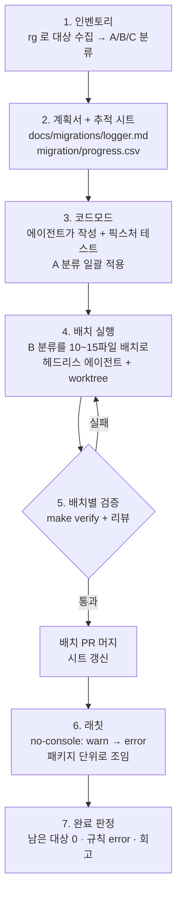

# 05-5. 대규모 변경: 코드모드, 일괄 마이그레이션, 점진적 롤아웃

## 🎯 학습 목표
- 수십~수백 개 파일에 걸친 변경을 **기계적 변경(코드모드)** 과 **판단이 필요한 변경(에이전트)** 으로 나누는 기준을 세울 수 있다.
- 에이전트에게 코드모드를 작성·테스트하게 하고, 남은 예외만 에이전트가 직접 고치게 하는 하이브리드 방식을 수행할 수 있다.
- 100개 파일 변경을 배치로 나눠 헤드리스 에이전트(`claude -p`, `codex exec`)로 실행하고, 진행 추적 시트로 상태를 관리할 수 있다.
- 래칫(ratchet) 린트 규칙, expand-contract, 기능 플래그로 대규모 변경을 점진적으로 롤아웃하고 되돌릴 수 있다.

## 📋 사전 준비
- 선행 레슨: [05-1 병렬 에이전트](./05-1-parallel-agents.md), [05-2 오케스트레이션](./05-2-orchestration.md), [05-3 대규모 코드베이스](./05-3-large-codebases.md), [04-1 검증 계층](../04-quality-and-verification/04-1-verification-layers.md)
- 필요 도구/계정: Claude Code 2.1.292 이상, Codex 0.160.1 이상, `rg`, `jq`, Node.js(코드모드 실행용: `jscodeshift` 또는 `ts-morph`)
- 실습 저장소 상태: Project B(TaskFlow)의 B5 완료 상태. `packages/logger`(구조화 로거 `@taskflow/logger`)가 있고, 나머지 패키지에는 아직 `console.*` 호출이 흩어져 있다. Project C를 진행 중이라면 대상 레거시 저장소에 같은 절차를 적용해도 된다(C3 마일스톤).

## 💡 개념

### 왜 대규모 변경은 따로 배워야 하나
"`console.log`를 전부 `logger`로 바꿔줘"를 한 세션에 시키면 거의 반드시 실패한다.
- **컨텍스트가 버티지 못한다.** 100개 파일을 읽고 고치면 세션 후반에는 초반 결정(필드 이름 규칙 등)을 잊고 다른 방식으로 고친다.
- **검증이 불가능해진다.** 3,000줄짜리 diff는 사람이 리뷰할 수 없다. 리뷰할 수 없는 변경은 머지하면 안 된다(설계 원칙 3).
- **되돌리기 어렵다.** 한 번에 머지한 변경은 문제가 생겨도 일부만 되돌릴 수 없다.

그래서 대규모 변경은 **분류 → 자동화 → 배치 실행 → 추적 → 점진적 롤아웃**의 프로젝트로 다룬다. 에이전트의 가장 큰 가치는 파일을 직접 고치는 것보다 **코드모드를 빨리 만들고, 코드모드가 못 하는 예외를 처리하는 것**이다.

### 변경 분류: 누가 고칠 것인가

| 분류 | 예 (logger 마이그레이션) | 처리 주체 | 이유 |
|---|---|---|---|
| A. 기계적 | `console.log("task updated")` → `logger.info("task updated")` | **코드모드** (에이전트가 작성) | 결정적이고 반복 가능하며, 같은 입력에 항상 같은 출력 |
| B. 판단 필요 | `console.log("task " + id + " by " + user.name)` → `logger.info({ taskId: id, userId: user.id }, "task updated")` | **에이전트** (배치 단위) | 어떤 값을 구조화 필드로 뽑을지, 개인정보를 남길지 판단해야 한다 |
| C. 제외/사람 | CLI의 사용자 출력용 `console.log`, 테스트 픽스처 | **사람이 결정** 후 목록에서 제외 | 마이그레이션 대상이 아니다 |

### 전체 흐름



### 점진적 롤아웃의 세 가지 도구
- **래칫(ratchet) 규칙**: 린트 규칙을 처음엔 경고로, 마이그레이션이 끝난 패키지부터 오류로 올린다. 이미 끝난 곳에 옛 패턴이 다시 들어오는 것을 막는다.
- **expand-contract**: 새 방식을 먼저 추가(expand)하고, 모든 호출부를 옮긴 뒤, 옛 방식을 제거(contract)한다. API·DB 스키마 변경에 필수다.
- **기능 플래그**: 동작이 바뀌는 변경은 플래그 뒤에 숨겨 배포와 활성화를 분리한다. 문제가 생기면 코드를 되돌리지 않고 플래그를 끈다.

## 👣 따라하기

### Step 1. 인벤토리를 만들고 계획서·추적 시트를 쓴다
목적: 변경 대상을 정확히 세고 분류해, 배치 계획과 완료 기준을 숫자로 정한다.

대상 수집은 도구 없이 결정적으로 한다. 에이전트가 "대충 찾은" 목록은 기준이 될 수 없다.

```bash
cd ~/work/taskflow
rg -l --type ts 'console\.(log|info|warn|error|debug)\(' apps packages \
  --glob '!**/*.test.ts' --glob '!packages/logger/**' | sort > migration/targets.txt
wc -l migration/targets.txt          # 예: 104
rg -c --type ts 'console\.(log|info|warn|error|debug)\(' $(cat migration/targets.txt) | sort -t: -k2 -nr | head
```

**Claude Code 레시피**
```bash
claude --permission-mode plan
> migration/targets.txt 의 파일들을 분류해줘. 각 호출을
> A(문자열 리터럴 하나뿐인 기계적 변환) / B(문자열 연결·템플릿·객체 출력 등 판단 필요) /
> C(CLI 사용자 출력 등 마이그레이션 제외) 로 나누고, Explore 서브에이전트를 패키지별로 병렬로 써.
> 그다음 docs/migrations/logger.md 계획서를 써줘: 목표, 범위/제외, 필드 이름 규칙(taskId, userId ...),
> 개인정보 규칙(이메일·이름은 로그에 남기지 않음), A는 코드모드로 일괄, B는 패키지 경계를 지키는
> 10~15파일 배치로 나눈 배치 표, 배치별 검증 명령, 롤백 방법, 완료 기준.
> 그리고 migration/progress.csv 를 만들어줘.
```

**Codex 레시피**
```bash
codex
> migration/targets.txt 의 파일들을 분류해줘. 각 호출을
> A(문자열 리터럴 하나뿐인 기계적 변환) / B(문자열 연결·템플릿·객체 출력 등 판단 필요) /
> C(CLI 사용자 출력 등 마이그레이션 제외) 로 나누고, explorer 에이전트를 패키지별로 병렬로 띄워.
> 그다음 docs/migrations/logger.md 계획서를 써줘: 목표, 범위/제외, 필드 이름 규칙(taskId, userId ...),
> 개인정보 규칙(이메일·이름은 로그에 남기지 않음), A는 코드모드로 일괄, B는 패키지 경계를 지키는
> 10~15파일 배치로 나눈 배치 표, 배치별 검증 명령, 롤백 방법, 완료 기준.
> 그리고 migration/progress.csv 를 만들어줘.
```

추적 시트의 형식은 사람이 정한다. 스크립트가 읽고 쓸 수 있도록 CSV로 둔다.

```csv
batch,kind,package,files,status,branch,pr,verify,notes
A-all,codemod,*,61,todo,,,,
B01,agent,apps/api,12,todo,,,,
B02,agent,apps/api,11,todo,,,,
B03,agent,packages/worker,14,todo,,,,
B04,agent,packages/search,9,todo,,,,
C,excluded,packages/cli,7,excluded,,,,CLI 사용자 출력
```

**기대 결과**: `migration/targets.txt`(대상 104개), 계획서, 추적 시트가 커밋돼 있다. 배치 하나가 두 패키지에 걸치지 않고, A·B·C 합계가 대상 수와 일치한다. 계획서의 필드 이름 규칙과 개인정보 규칙은 사람이 검토해 확정한다.

### Step 2. 에이전트에게 코드모드를 만들게 하고 A 분류를 일괄 변환한다
목적: 기계적 변경을 결정적인 스크립트로 처리한다. 에이전트는 코드모드와 그 테스트를 만들고, 변환 자체는 스크립트가 한다.

**Claude Code 레시피**
```bash
claude
> docs/migrations/logger.md 의 A 분류 규칙을 jscodeshift 코드모드로 구현해줘.
> - 위치: codemods/console-to-logger.ts, 테스트: codemods/__testfixtures__/ 에 입력/출력 픽스처 8쌍 이상
> - console.log/info → logger.info, warn → logger.warn, error → logger.error, debug → logger.debug
> - 인수가 문자열 리터럴 하나가 아니면 변환하지 말고 그대로 둔다 (B 분류는 건드리지 않는다)
> - 파일에 logger import 가 없으면 `import { logger } from "@taskflow/logger";` 를 추가한다
> - 픽스처 테스트를 먼저 쓰고 실패를 확인한 뒤 구현해. 마지막에 테스트 결과를 보여줘.
```

**Codex 레시피**
```bash
codex --sandbox workspace-write
> docs/migrations/logger.md 의 A 분류 규칙을 jscodeshift 코드모드로 구현해줘.
> - 위치: codemods/console-to-logger.ts, 테스트: codemods/__testfixtures__/ 에 입력/출력 픽스처 8쌍 이상
> - console.log/info → logger.info, warn → logger.warn, error → logger.error, debug → logger.debug
> - 인수가 문자열 리터럴 하나가 아니면 변환하지 말고 그대로 둔다 (B 분류는 건드리지 않는다)
> - 파일에 logger import 가 없으면 `import { logger } from "@taskflow/logger";` 를 추가한다
> - 픽스처 테스트를 먼저 쓰고 실패를 확인한 뒤 구현해. 마지막에 테스트 결과를 보여줘.
```

> 두 도구에게 같은 코드모드를 따로 만들게 하고, 서로의 픽스처를 상대 구현에 돌려 보면 빠진 경우를 빨리 찾는다(교차 검증).

코드모드는 사람이 실행한다(도구 무관). 먼저 dry run으로 한 패키지만 확인한다.

```bash
npx jscodeshift -t codemods/console-to-logger.ts --parser=tsx --dry --print packages/worker/src | head -80
# 확인 후 전체 적용. migration/excluded.txt 는 Step 1에서 C로 분류한 파일 목록이다
grep -v -f migration/excluded.txt migration/targets.txt | xargs npx jscodeshift -t codemods/console-to-logger.ts --parser=tsx
make verify
git switch -c mig/logger-A && git add -A && git commit -m "refactor(logging): codemod console.* string literals to logger"
```

**기대 결과**: 코드모드 픽스처 테스트가 통과하고, A 분류 호출만 바뀐 diff가 생긴다. `rg 'console\.' $(cat migration/targets.txt) | wc -l`이 B·C 분류 수만큼 남는다. 이 PR은 패턴이 균일하므로 diff가 커도 "코드모드 + 픽스처"를 리뷰하는 것으로 갈음할 수 있다. 추적 시트의 `A-all` 행을 `done`으로 바꾼다.

### Step 3. B 분류를 배치로 나눠 헤드리스 에이전트로 실행한다
목적: 판단이 필요한 변경을 작은 배치로 나눠, 배치마다 새 컨텍스트·별도 worktree에서 처리한다.

배치 파일을 만든다(`migration/batches/B01.txt`에 파일 경로 목록). 배치마다 같은 지시문을 쓰도록 프롬프트를 파일로 고정한다.

```markdown
<!-- migration/prompt.md -->
docs/migrations/logger.md 계획서를 먼저 읽어라. 이번 배치의 파일 목록은 아래에 있다.
목록에 있는 파일의 남은 console.* 호출만 @taskflow/logger 로 바꾼다. 목록 밖 파일은 수정하지 않는다.
- 문자열 연결·템플릿의 변수는 계획서의 필드 이름 규칙에 따라 첫 번째 인수 객체로 옮긴다.
- 개인정보 규칙을 지킨다. 판단이 애매한 호출은 고치지 말고 `// TODO(migration): 이유` 주석을 단다.
- 마지막에 `pnpm turbo run lint typecheck test --filter=<이 배치의 패키지>` 를 실행하고 결과를 요약한다.
- 결과 요약 첫 줄은 `CHANGED=<수정한 호출 수> SKIPPED=<TODO 단 호출 수>` 형식으로 쓴다.
```

**Claude Code 레시피** — 대화형으로 한 번에 맡기려면 내장 `/batch` skill을 쓴다. 코드베이스를 조사해 작업을 5~30개 독립 단위로 나누고, 계획을 승인하면 단위마다 별도 worktree의 백그라운드 서브에이전트가 구현·테스트·게시까지 한다.

```bash
claude
> /batch migrate the remaining console.* calls listed in migration/batches/*.txt to @taskflow/logger, following docs/migrations/logger.md. One unit per batch file.
```

배치 수와 순서를 직접 통제하려면 스크립트로 돌린다. `scripts/migrate-claude.sh`:

```bash
#!/usr/bin/env bash
set -euo pipefail
B="$1"                                   # 예: B03
FILES="$(cat migration/batches/$B.txt)"
claude -p --worktree "mig-$B" --permission-mode acceptEdits \
  --allowedTools "Bash(pnpm *)" "Bash(rg *)" \
  --max-budget-usd 3 --output-format json \
  "$(cat migration/prompt.md)

배치 $B 파일 목록:
$FILES" | tee "migration/logs/$B.json" | jq -r '.result' | head -1

WT=".claude/worktrees/mig-$B"
git -C "$WT" add -A
git -C "$WT" commit -m "refactor(logging): migrate batch $B to @taskflow/logger"
```

**Codex 레시피** — worktree 경로를 스크립트가 알아야 하므로 직접 만들고 `-C`로 실행한다. `scripts/migrate-codex.sh`:

```bash
#!/usr/bin/env bash
set -euo pipefail
B="$1"
WT="../taskflow-mig-$B"
git worktree add "$WT" -b "mig/$B" origin/main
(cd "$WT" && pnpm install --frozen-lockfile)
FILES="$(cat migration/batches/$B.txt)"
codex exec -C "$WT" --sandbox workspace-write \
  -o "migration/logs/$B.md" \
  "$(cat migration/prompt.md)

배치 $B 파일 목록:
$FILES"
head -1 "migration/logs/$B.md"

# workspace-write 에서도 .git 은 읽기 전용이므로 커밋은 스크립트가 한다
git -C "$WT" add -A
git -C "$WT" commit -m "refactor(logging): migrate batch $B to @taskflow/logger"
```

실행은 처음 두 배치를 순차로 돌려 프롬프트를 다듬은 뒤, 나머지를 2~3개씩 병렬로 돌린다.

```bash
mkdir -p migration/logs
./scripts/migrate-claude.sh B01          # 결과를 사람이 확인하고 prompt.md 를 고친다
./scripts/migrate-codex.sh  B02
printf '%s\n' B03 B04 B05 | xargs -P 3 -I{} ./scripts/migrate-codex.sh {}
```

**기대 결과**: 배치마다 별도 브랜치(`worktree-mig-B01`, `mig/B02` ...)에 커밋이 1개씩 생기고, `migration/logs/`에 `CHANGED=.. SKIPPED=..` 요약이 남는다. 각 배치 diff는 10~15개 파일로 사람이 리뷰할 수 있는 크기다.

### Step 4. 배치별로 검증·리뷰·머지하고 시트를 갱신한다
목적: 배치 하나하나를 독립된 PR로 검증해, 문제가 생기면 그 배치만 되돌릴 수 있게 한다.

배치마다 다음을 확인한다.
1. **범위**: `git diff --stat origin/main...<branch>`의 파일이 배치 목록과 일치한다.
2. **검증**: 그 패키지의 lint·typecheck·test가 통과한다.
3. **규칙 준수**: 개인정보 필드(email, name)가 로그에 들어가지 않았다.
4. **리뷰**: 구현과 다른 도구로 리뷰한다. 모든 배치를 꼼꼼히 보기 어렵다면 첫 두 배치는 전수, 이후는 샘플링하고 자동 검사(아래 rg)를 늘린다.

**Claude Code 레시피** (Codex가 만든 배치를 리뷰)
```bash
claude
> /code-review high mig/B02
> 추가로 docs/migrations/logger.md 의 필드 이름 규칙과 개인정보 규칙 위반만 따로 목록으로 뽑아줘.
```

**Codex 레시피** (Claude가 만든 배치를 리뷰)
```bash
git switch worktree-mig-B01
codex review --base main "docs/migrations/logger.md 의 필드 이름 규칙과 개인정보 규칙 위반을 우선 점검하라."
```

자동 검사와 시트 갱신은 스크립트로 한다(도구 무관).

```bash
# 개인정보 필드가 로그 인수에 들어갔는지 기계적으로 검사
git diff origin/main...mig/B02 | rg '^\+.*logger\.\w+\(.*\b(email|name)\b' && echo "PII 의심" || echo "OK"

# 머지 후 추적 시트 갱신 (예: B02 → done, PR 번호 기록)
python3 - <<'EOF'
import csv
rows = list(csv.DictReader(open("migration/progress.csv")))
for r in rows:
    if r["batch"] == "B02":
        r.update(status="done", branch="mig/B02", pr="#231", verify="pass")
w = csv.DictWriter(open("migration/progress.csv", "w", newline=""), fieldnames=rows[0].keys())
w.writeheader(); w.writerows(rows)
EOF
```

`SKIPPED`로 남은 `TODO(migration)` 주석은 모아서 사람이 결정한다.

```bash
rg -n 'TODO\(migration\)' apps packages
```

**기대 결과**: 모든 B 배치가 개별 PR로 머지되고, 추적 시트의 상태가 실제 머지 이력과 일치한다. 남은 `TODO(migration)`은 사람 결정 목록으로 정리돼 있다.

### Step 5. 래칫 규칙으로 잠그고 점진적으로 롤아웃한다
목적: 끝난 영역에 옛 패턴이 다시 들어오지 않게 하고, 동작이 바뀌는 부분은 되돌릴 수 있게 배포한다.

**Claude Code 레시피**
```bash
claude
> ESLint 설정에 no-console 규칙을 래칫 방식으로 추가해줘.
> - 기본은 "warn", migration/progress.csv 에서 해당 패키지의 배치가 모두 done 인 패키지는 "error"
> - packages/cli 는 제외 (C 분류)
> - make verify 에 "error 패키지에서 console.* 가 0개인지" 확인하는 단계를 추가해
> 그리고 docs/migrations/logger.md 에 "패키지별 잠금 상태" 표를 추가해.
```

**Codex 레시피**
```bash
codex --sandbox workspace-write
> ESLint 설정에 no-console 규칙을 래칫 방식으로 추가해줘.
> - 기본은 "warn", migration/progress.csv 에서 해당 패키지의 배치가 모두 done 인 패키지는 "error"
> - packages/cli 는 제외 (C 분류)
> - make verify 에 "error 패키지에서 console.* 가 0개인지" 확인하는 단계를 추가해
> 그리고 docs/migrations/logger.md 에 "패키지별 잠금 상태" 표를 추가해.
```

logger 마이그레이션은 로그 출력 형식(평문 → JSON)이 바뀌므로 운영 로그 수집기에 영향을 준다. 이런 동작 변화는 기능 플래그로 분리한다.

```ts
// packages/logger/src/index.ts (예시) — 배포와 활성화를 분리한다
export const logger = createLogger({
  format: process.env.TASKFLOW_LOG_FORMAT === "json" ? "json" : "pretty",
});
```

롤아웃 순서 예: 스테이징에서 `TASKFLOW_LOG_FORMAT=json` → 로그 수집기 파싱 확인 → 워커만 프로덕션 활성화 → 전체 활성화 → 마지막으로 `pretty` 분기 제거(contract). 문제가 생기면 플래그를 끄고, 특정 배치가 원인이면 그 배치 PR만 `git revert`한다.

**기대 결과**: 완료된 패키지는 `no-console`이 `error`로 잠겨 있고, `make verify`가 잠금 위반을 잡는다. 계획서에 롤아웃 단계와 롤백 절차가 적혀 있다. 대상 0개 + 전 패키지 `error`(제외 패키지 빼고)가 되면 마이그레이션 완료다.

## ✅ 체크포인트
- [ ] 대상 목록을 `rg`로 결정적으로 만들었고, A·B·C 합계가 대상 수와 일치한다.
- [ ] 계획서에 필드 이름·개인정보 규칙, 배치 표, 검증 명령, 롤백 방법, 완료 기준이 있다.
- [ ] A 분류는 픽스처 테스트가 있는 코드모드로 일괄 변환했다.
- [ ] B 분류를 10~15파일 배치로 나눠 배치마다 별도 worktree·별도 컨텍스트에서 실행했다.
- [ ] 배치마다 범위·검증·규칙·교차 리뷰를 거쳐 개별 PR로 머지했다.
- [ ] 추적 시트가 실제 머지 이력과 일치한다.
- [ ] 래칫 린트 규칙으로 완료된 패키지를 잠갔고, 동작 변화는 기능 플래그 뒤에 있다.

## 🏠 숙제
| # | 유형 | 난이도 | 과제 | 완료 조건 |
|---|---|---|---|---|
| HW1 | 🔁 Reproduce | ★ | Step 1~3을 재현해 100개 안팎 파일의 일괄 변경을 코드모드 + 배치 2개 이상으로 수행한다 (TaskFlow logger 또는 본인 저장소의 동등한 변경) | 대상 목록, 코드모드와 픽스처 테스트 결과, 배치별 브랜치와 `CHANGED/SKIPPED` 로그가 `submissions/05-5.md`에 있다 |
| HW2 | 🔬 Compare | ★★ | 같은 B 분류 배치를 (a) Claude 배치 스크립트 (b) Codex 배치 스크립트 (c) 한 세션에 전체 배치를 몰아서 시키는 방식으로 수행해 비교한다 | 방식별 정확도(리뷰에서 나온 규칙 위반 수), `SKIPPED` 비율, 범위 이탈 파일 수, 소요 시간·토큰 사용량을 표로 비교하고, 배치 크기를 바꿔(예: 5 / 15 / 30파일) 품질이 꺾이는 지점을 기록했다 |
| HW3 | 🚀 Challenge | ★★★ | **마이그레이션 계획서 + 진행 추적 시트**: Project C 대상(또는 실제 오픈소스) 저장소에서 JS → TS 전환이나 프레임워크 메이저 업그레이드를 계획하고 일부 배치를 실행한다 (Project C의 C3) | 계획서에 인벤토리 수치, A/B/C 분류 기준, 배치 표(의존 순서 포함), 배치별 검증 명령, 래칫 전략, 롤백 절차, 완료 기준이 있다. 추적 시트로 배치 5개 이상을 실행·머지한 이력이 있고, 특성화 테스트(C2)가 배치 전후로 모두 통과한 증거가 있다 |

제출: `hw/05-5` 브랜치, `submissions/05-5.md` (템플릿: docs/design/homework-template.md)

## ⚠️ 흔한 실수
- **배치가 뒤로 갈수록 스타일이 달라진다** → 원인: 한 세션에서 여러 배치를 이어서 처리해 초반 결정이 압축·망각됐다 → 대응: 배치마다 새 세션(`claude -p`, `codex exec`)으로 시작하고, 결정 사항은 프롬프트가 아니라 계획서(`docs/migrations/*.md`)에 적어 매번 읽게 한다.
- **에이전트가 목록 밖 파일까지 고친다** → 원인: "관련 코드도 같이 정리"하려는 경향과 범위 지시 누락 → 대응: 프롬프트에 목록 밖 수정 금지를 명시하고, 머지 전 `git diff --stat`을 배치 목록과 기계적으로 대조한다.
- **코드모드가 B 분류까지 망가뜨린다** → 원인: 변환 조건이 느슨하다(문자열 연결도 변환) → 대응: "확실하지 않으면 건드리지 않는다"를 코드모드 원칙으로 삼고, 변환하지 않아야 할 입력의 픽스처(입력 = 출력)를 반드시 넣는다.
- **진행 상황을 아무도 모른다** → 원인: 상태를 에이전트 대화나 머릿속에만 뒀다 → 대응: 추적 시트를 단일 진실로 두고, 시트 갱신을 배치 머지 절차에 넣는다. 남은 대상 수(`rg -c`)를 주기적으로 시트와 대조한다.
- **마이그레이션 막바지에 옛 패턴이 다시 늘어난다** → 원인: 다른 기능 개발이 계속 옛 방식으로 코드를 추가한다 → 대응: 래칫 규칙을 패키지 단위로 바로바로 `error`로 올리고, `AGENTS.md`에 "새 코드는 `@taskflow/logger`만 쓴다"를 마이그레이션 시작 시점에 추가한다.

## 🔗 참고 자료
- Claude Code: [Commands (`/batch`)](https://code.claude.com/docs/en/commands), [Worktrees](https://code.claude.com/docs/en/worktrees), [Headless](https://code.claude.com/docs/en/headless), [Subagents](https://code.claude.com/docs/en/sub-agents)
- Codex: [Non-interactive mode](https://learn.chatgpt.com/docs/non-interactive-mode), [Subagents](https://learn.chatgpt.com/docs/agent-configuration/subagents), [Code review](https://learn.chatgpt.com/docs/code-review)
- 코드모드: [jscodeshift](https://github.com/facebook/jscodeshift), [ts-morph](https://ts-morph.com/)
- 이 저장소: [도구 레퍼런스 §2, §9](../../docs/reference/tool-reference.md), [04-1 검증 계층](../04-quality-and-verification/04-1-verification-layers.md), [04-2 교차 리뷰](../04-quality-and-verification/04-2-cross-review.md), [05-1 병렬 에이전트](./05-1-parallel-agents.md), [05-2 오케스트레이션](./05-2-orchestration.md), [05-3 대규모 코드베이스](./05-3-large-codebases.md), [06-4 지식 축적](../06-team-and-operations/06-4-knowledge-loop.md)
- 템플릿: [templates/task-spec.md](../../templates/task-spec.md), [templates/adr.md](../../templates/adr.md)
