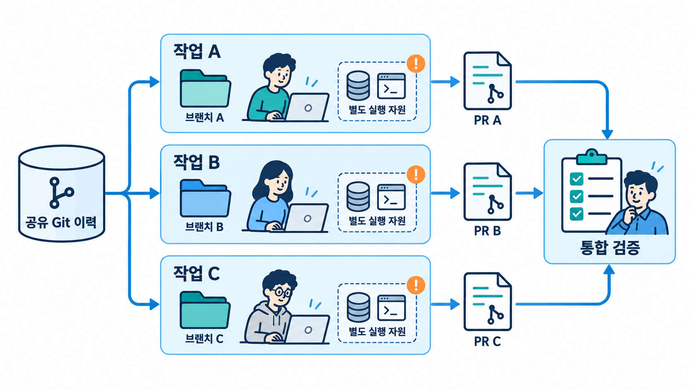

# Module 05 — Scaling Up (규모 확장)

병렬 에이전트, 오케스트레이션, CI 자동화로 규모를 키웁니다.

## 그림으로 시작합니다

먼저 그림에서 사람·문서·도구의 역할과 화살표 방향을 확인합니다. 각 레슨의 “그림 읽는 순서”를 읽은 다음 개념과 따라하기를 진행합니다.

- [같은 저장소에서 작업 공간을 나눠 개발합니다](./05-1-parallel-agents.md)에서 그림과 설명을 함께 확인합니다.
- [역할을 나누고 필요한 결과만 돌려받습니다](./05-2-orchestration.md)에서 그림과 설명을 함께 확인합니다.
- [자동화 결과를 PR과 검증을 거쳐 반영합니다](./05-4-ci-cd-integration.md)에서 그림과 설명을 함께 확인합니다.

제안서에 사용할 원본 PNG는 [전체 그림 목록](../../docs/design/illustrations.md)에서 찾습니다.

## 레슨
| # | 제목 | 상태 |
|---|---|---|
| 05-1 | [병렬 에이전트: worktree, 다중 세션, 클라우드](./05-1-parallel-agents.md) | ✅ 초안 |
| 05-2 | [오케스트레이션: 서브에이전트](./05-2-orchestration.md) | ✅ 초안 |
| 05-3 | [대규모 코드베이스와 모노레포](./05-3-large-codebases.md) | ✅ 초안 |
| 05-4 | [CI/CD 통합](./05-4-ci-cd-integration.md) | ✅ 초안 |
| 05-5 | [대규모 변경과 마이그레이션](./05-5-large-scale-changes.md) | ✅ 초안 |

- 레슨별 따라하기·숙제 상세는 [커리큘럼 설계서 §4](../../docs/design/curriculum-design.md#4-모듈-상세-설계)를 참고합니다.
- 레슨 작성 형식: [lesson-template.md](../../docs/design/lesson-template.md)
