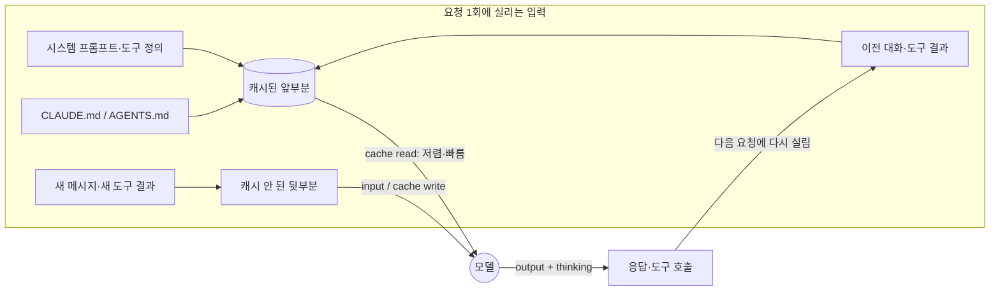

# 06-1. 비용과 성능 — 모델 선택, 토큰 사용량, 캐싱

## 🎯 학습 목표
- Claude Code와 Codex의 세션·헤드리스 실행에서 **토큰 사용량(입력·출력·캐시)** 을 수집해 작업 단위로 기록할 수 있다.
- 같은 작업을 모델·추론 강도(effort)만 바꿔 실행하고, 토큰·소요 시간·검증 통과 여부로 비교할 수 있다.
- 프롬프트 캐시 적중률을 읽고, 캐시를 깨는 습관(긴 휴식 뒤 재개, 잦은 도구 구성 변경)을 줄일 수 있다.
- 작업 유형별 토큰 기준값으로 **월간 사용량 예측표**를 만들 수 있다.

## 📋 사전 준비
- 선행 레슨: [00-3 실행 모드](../00-foundations/00-3-execution-modes.md), [03-4 컨텍스트 관리](../03-agentic-workflow/03-4-context-management.md), [05-2 오케스트레이션](../05-scaling-up/05-2-orchestration.md)
- 필요 도구/계정: Claude Code 2.1.292, Codex 0.160.1, `jq`, `git`
- 실습 저장소 상태: Project B(TaskFlow)의 B6 완료 상태. B7 마일스톤의 "비용 분석"을 이 레슨에서 시작한다.

> 이 가이드는 **가격을 다루지 않는다.** 요금제·계약 단가는 조직마다 다르고 자주 바뀐다. 이 레슨은 비용을 **토큰 사용량, 사용량 화면(`/usage`, `/status`), 모델 선택**으로 다룬다. 금액이 필요하면 마지막에 본인 조직의 단가를 곱한다.

## 💡 개념

### 왜 대규모 개발에서 비용과 성능을 측정해야 하는가
개인이 에이전트를 가끔 쓸 때는 사용량이 눈에 띄지 않는다. 그러나 팀 10명이 worktree 3개씩 병렬 세션을 돌리고, CI에서 PR마다 자동 리뷰를 실행하면 사용량은 **사람 수 × 세션 수 × 컨텍스트 크기**로 곱해진다. 이때 문제는 두 가지다.

1. **한도(limit)와 예산** — 구독 요금제는 사용 창(window) 한도에 걸리고, API·클라우드 공급자는 토큰당 과금된다. 어느 쪽이든 "언제 막힐지", "얼마나 쓸지"를 미리 알아야 한다.
2. **성능** — 같은 작업도 모델과 effort에 따라 소요 시간과 성공률이 달라진다. 가장 비싼 설정이 항상 가장 빠르게 끝나는 것은 아니며, 싼 설정이 재작업을 늘리면 오히려 총 사용량이 커진다.

그래서 이 레슨은 "작업 1건당 토큰"이라는 **단위 경제(unit economics)** 를 만든다. 설계 원칙 2번 **Context is a Budget**을 숫자로 바꾸는 작업이다.

### 토큰은 어디서 생기는가
에이전트는 매 요청마다 **대화 전체(시스템 프롬프트 + 메모리 파일 + 도구 정의 + 지금까지의 대화와 도구 결과)** 를 다시 보낸다. 따라서 사용량은 "내가 입력한 글자 수"가 아니라 **컨텍스트 크기 × 요청 횟수**에 비례한다.



- **캐시 읽기(cache read)**: 이전 요청과 앞부분이 같으면 다시 처리하지 않고 캐시에서 읽는다. Claude Code는 이를 자동으로 사용한다([costs](https://code.claude.com/docs/en/costs)).
- **캐시 미스**: 캐시 수명(TTL)이 지난 뒤 첫 메시지, 도구 정의 변경, 압축(compaction) 등으로 앞부분이 바뀌면 전체를 다시 처리한다.
- **출력·thinking 토큰**: 추론 강도를 높이면 늘어난다. Claude Code 문서는 thinking 토큰이 출력 토큰으로 계산된다고 적는다.

### 사용량을 좌우하는 다섯 가지 손잡이
| 손잡이 | Claude Code | Codex | 효과 |
|---|---|---|---|
| 모델 | `--model <alias>`, `/model`, 설정 `model` | `-m <모델 ID>`, `/model`, `config.toml`의 `model` | 가장 큰 영향. 작업 난이도에 맞춘다 |
| 추론 강도 | `--effort low\|medium\|high\|xhigh\|max`, `/effort` | `model_reasoning_effort`, `/model`에서 함께 선택 | thinking(출력) 토큰과 소요 시간 |
| 컨텍스트 위생 | `/clear`, `/compact`, `/context` | `/new`, `/compact`, `/status` | 매 요청의 입력 크기 |
| 위임 | subagent(`model: haiku` 등), 배치 | subagent(`.codex/agents/*.toml`의 `model`) | 시끄러운 출력을 메인 컨텍스트 밖에 둔다 |
| 메모리 크기 | `CLAUDE.md`를 줄이고 상세 절차는 skill로 | `AGENTS.md` 합계 `project_doc_max_bytes`(기본 32 KiB) | 모든 요청에 고정으로 실리는 양 |

## 👣 따라하기

TaskFlow 저장소에서 **대표 작업 3종**을 정해 측정한다. 작업은 B7 시점의 실제 백로그에서 고른다.

| 작업 ID | 유형 | 예시 |
|---|---|---|
| T-S | 소형 수정 | `apps/api`의 입력 검증 메시지 오타·누락 수정 |
| T-M | 중형 기능 | `apps/api`에 `GET /projects/:id/tasks?status=` 필터 추가 + 테스트 |
| T-R | 리뷰 | 최근 머지된 PR 1건의 diff 리뷰 |

### Step 1. 대화형 세션의 사용량 화면 읽기
목적: 도구가 보여주는 사용량 화면에서 무엇을 읽어야 하는지 익힌다.

**Claude Code 레시피**
```bash
cd taskflow
claude
> apps/api/src/routes/tasks.ts의 입력 검증 에러 메시지를 확인하고, 누락된 필드 이름을 메시지에 넣어줘. 테스트도 고쳐.
# 작업이 끝나면
> /usage
> /context
```

- `/usage`(별칭 `/cost`, `/stats`)의 Session 블록에서 **모델별 input / output / cache read / cache write** 토큰과 API 소요 시간을 기록한다.
- v2.1.251 이상에서는 `Prompt cache (main)` 줄이 나온다. **입력 토큰 중 캐시에서 읽은 비율**, 미스 횟수, 캐시가 warm인지 확인한다.
- Pro·Max·Team·Enterprise 요금제에서는 같은 화면에 skill·subagent·MCP 서버별 **사용량 귀속(Attribution)** 비율이 나온다. `d`/`w`로 24시간/7일을 전환한다.
- `/context`로 컨텍스트를 무엇이 차지하는지(메모리 파일, MCP 도구, 대화) 확인한다.

> `/usage`의 금액 표시는 로컬에서 토큰 수에 정가를 곱한 **추정치**다. 이 레슨에서는 금액 줄을 기록하지 않고 토큰 줄만 기록한다. 구독 요금제 사용자에게는 금액이 청구와 무관하다고 문서가 밝힌다([costs](https://code.claude.com/docs/en/costs)).

**Codex 레시피**
```bash
cd taskflow
codex
> apps/api/src/routes/tasks.ts의 입력 검증 에러 메시지를 확인하고, 누락된 필드 이름을 메시지에 넣어줘. 테스트도 고쳐.
# 작업이 끝나면
> /status
> /usage
```

- `/status`는 현재 세션의 토큰 사용량과 모델·샌드박스·승인 정책을 보여준다.
- `/usage`는 계정 단위 토큰 사용량과 한도를 보여준다.
- Codex에는 Claude `/context` 같은 전용 시각화 명령이 확인되지 않았다(tool-reference §8의 TODO(verify)).

**기대 결과**: 같은 작업에 대해 두 도구의 세션 토큰 수(입력·출력·캐시)를 메모에 적었다. 금액이 아니라 토큰으로 적었는지 확인한다.

### Step 2. 헤드리스 실행으로 작업당 토큰을 기계적으로 수집하기
목적: 사람이 화면을 옮겨 적지 않고, 작업 1건당 사용량을 JSON으로 남긴다.

**Claude Code 레시피**

`--output-format json` 결과에는 `usage`(요청 합계), `modelUsage`(모델별), `num_turns`, `duration_ms`가 들어 있다(2.1.292에서 직접 확인).

```bash
mkdir -p metrics/cost
TASK=T-S
claude -p "apps/api/src/routes/tasks.ts의 입력 검증 에러 메시지에 누락 필드 이름을 넣고, 관련 테스트를 고친 뒤 pnpm --filter api test를 실행해." \
  --permission-mode acceptEdits \
  --allowedTools "Bash(pnpm *)" \
  --output-format json > "metrics/cost/claude-$TASK.json"

jq '{task: env.TASK, turns: .num_turns, duration_ms,
     input: .usage.input_tokens,
     cache_read: .usage.cache_read_input_tokens,
     cache_write: .usage.cache_creation_input_tokens,
     output: .usage.output_tokens,
     models: (.modelUsage | keys)}' "metrics/cost/claude-$TASK.json"
```

**Codex 레시피**

`codex exec --json`은 JSONL 이벤트를 출력하고, `turn.completed` 이벤트의 `usage`에 `input_tokens`, `cached_input_tokens`, `output_tokens`, `reasoning_output_tokens`가 들어 있다([non-interactive](https://learn.chatgpt.com/docs/non-interactive-mode)). `exec`의 기본 샌드박스는 read-only이므로 수정 작업에는 `--sandbox workspace-write`를 명시한다.

```bash
TASK=T-S
codex exec --json --sandbox workspace-write \
  "apps/api/src/routes/tasks.ts의 입력 검증 에러 메시지에 누락 필드 이름을 넣고, 관련 테스트를 고친 뒤 pnpm --filter api test를 실행해." \
  > "metrics/cost/codex-$TASK.jsonl"

jq -s '[.[] | select(.type=="turn.completed") | .usage]
  | {task: env.TASK, turns: length,
     input: (map(.input_tokens) | add),
     cached: (map(.cached_input_tokens) | add),
     output: (map(.output_tokens) | add),
     reasoning: (map(.reasoning_output_tokens) | add)}' "metrics/cost/codex-$TASK.jsonl"
```

> 두 도구의 필드는 1:1로 대응하지 않는다. Claude는 캐시 쓰기(`cache_creation_input_tokens`)를 따로 보고하고, Codex는 `cached_input_tokens`가 `input_tokens`에 포함된 값인지 별도인지 문서에 명시돼 있지 않다. 비교표에는 **원래 필드 이름을 그대로** 적는다. TODO(verify): Codex `cached_input_tokens`와 `input_tokens`의 포함 관계

**기대 결과**: `metrics/cost/` 아래에 도구별 결과 파일이 생기고, jq 요약이 한 줄 JSON으로 출력된다. 실행 후 `make verify`(B0에서 만든 검증 커맨드)가 통과했는지 함께 기록한다. 검증에 실패한 실행의 토큰은 "성공 1건당 토큰"을 계산할 때 실패 비용으로 더한다.

### Step 3. 모델·effort 매트릭스 실험
목적: "어떤 작업에 어떤 설정이 충분한가"를 데이터로 정한다.

T-M(중형 기능)을 기준으로 아래 조합을 각각 **새 worktree**에서 실행한다. 같은 출발점에서 시작해야 비교가 공정하다.

**Claude Code 레시피**
```bash
for cfg in "sonnet medium" "sonnet high" "opus high"; do
  set -- $cfg; MODEL=$1; EFFORT=$2
  git worktree add "../tf-$MODEL-$EFFORT" origin/main
  ( cd "../tf-$MODEL-$EFFORT" && pnpm install --frozen-lockfile >/dev/null &&
    claude -p "$(cat ../taskflow/specs/T-M.md)" \
      --model "$MODEL" --effort "$EFFORT" \
      --permission-mode acceptEdits --allowedTools "Bash(pnpm *)" \
      --output-format json > "../taskflow/metrics/cost/claude-T-M-$MODEL-$EFFORT.json"
    make verify > "../taskflow/metrics/cost/claude-T-M-$MODEL-$EFFORT.verify.log" 2>&1; echo "verify=$?" )
done
```

**Codex 레시피**

Codex는 별칭 체계가 없으므로 계정에서 쓸 수 있는 모델 ID를 `/model`에서 확인해 넣는다. 추론 강도는 `-c`로 덮어쓴다.

```bash
for cfg in "<빠른 모델 ID> medium" "<기본 모델 ID> medium" "<기본 모델 ID> high"; do
  set -- $cfg; MODEL=$1; EFFORT=$2; N=$((N+1))
  git worktree add "../tfx-$N" origin/main
  ( cd "../tfx-$N" && pnpm install --frozen-lockfile >/dev/null &&
    codex exec --json --sandbox workspace-write -m "$MODEL" \
      -c model_reasoning_effort="\"$EFFORT\"" \
      "$(cat ../taskflow/specs/T-M.md)" > "../taskflow/metrics/cost/codex-T-M-$N-$EFFORT.jsonl"
    make verify > "../taskflow/metrics/cost/codex-T-M-$N-$EFFORT.verify.log" 2>&1; echo "verify=$?" )
done
```

> `-c`의 값은 TOML로 해석된다. 문자열은 따옴표가 필요하므로 위처럼 `"\"medium\""` 형태로 넘긴다. 따옴표 없이 넘겨도 TOML 해석에 실패하면 문자열로 쓰인다고 `--help`에 적혀 있지만, 명시하는 편이 안전하다.

결과를 표로 정리한다.

| 도구 | 모델 | effort | 입력(캐시 포함) | 출력 | 턴 수 | 소요 시간 | `make verify` | 사람 개입 |
|---|---|---|---|---|---|---|---|---|
| Claude | sonnet | medium | | | | | ✅/❌ | |
| Claude | sonnet | high | | | | | | |
| Claude | opus | high | | | | | | |
| Codex | … | medium | | | | | | |

**기대 결과**: 표 한 장으로 "T-M 유형에는 이 설정이면 충분하다"는 결론을 낸다. 결론은 `docs/ops/model-policy.md` 같은 팀 문서에 적고, 06-3의 거버넌스 정책에서 기본값으로 쓴다.

### Step 4. 캐시와 컨텍스트 위생 실험
목적: 습관 하나가 사용량을 얼마나 바꾸는지 직접 본다.

같은 대화형 세션에서 다음 세 상황을 만들고 `/usage`(Claude) 또는 `/status`(Codex)를 비교한다.

1. **연속 작업**: T-S를 끝내고 곧바로 관련 없는 T-R(리뷰)을 같은 세션에서 요청한다.
2. **정리 후 작업**: T-S 후 `/clear`(Codex는 `/new`)를 하고 T-R을 요청한다.
3. **휴식 후 재개**: T-S 후 캐시 수명보다 오래 쉬었다가 같은 세션에서 이어서 요청한다.

**Claude Code 레시피**
```text
> (T-S 수행)
> /usage            # 기준값 기록
> 최근 머지된 PR #142의 diff를 리뷰해줘      # 상황 1
> /usage            # Prompt cache (main) 줄의 비율·미스 확인
> /rename t-s-session
> /clear
> 최근 머지된 PR #142의 diff를 리뷰해줘      # 상황 2
> /usage
```

- 문서에 따르면 `/clear`는 Session 블록 합계를 초기화한다(v2.1.211부터). 상황 1과 2는 **새로 증가한 양**끼리 비교한다.
- 캐시 수명은 구독 요금제에서 1시간, API 키·클라우드 공급자에서 기본 5분이다([costs](https://code.claude.com/docs/en/costs)). 상황 3에서 `Prompt cache (main)` 줄의 미스와 `likely cause`를 확인한다.

**Codex 레시피**
```text
> (T-S 수행)
> /status           # 기준값
> 최근 머지된 PR #142의 diff를 리뷰해줘      # 상황 1
> /status
> /new
> 최근 머지된 PR #142의 diff를 리뷰해줘      # 상황 2
> /status
```

헤드리스 결과로는 `cached_input_tokens / input_tokens` 비율을 계산해 비교한다.

**기대 결과**: 상황 1이 상황 2보다 입력 토큰이 크게 늘어나는 것을 확인한다(이전 작업의 대화가 매 요청에 실린다). 팀 규칙 후보 "관련 없는 작업 사이에는 `/clear`(`/new`)한다"를 근거와 함께 기록한다.

### Step 5. 월간 사용량 예측표 만들기
목적: 측정한 기준값을 팀 단위 예측으로 확장한다.

이 단계는 도구 독립적이다. 계산은 스프레드시트나 스크립트로 하고, 에이전트에게는 표 작성과 가정 점검을 맡긴다.

**Claude Code 레시피**
```bash
claude
> metrics/cost/ 아래 JSON 결과를 읽어서 작업 유형(T-S, T-M, T-R)별로 "검증 통과 1건당 평균 토큰(입력·캐시 읽기·캐시 쓰기·출력)"을 계산해줘.
> 실패한 실행의 토큰은 같은 유형의 성공 건에 나눠 더해.
> 그다음 docs/ops/usage-forecast.md에 월간 예측표를 만들어. 가정: 개발자 6명, 1인당 주당 T-S 15건 / T-M 5건, PR당 자동 리뷰 1회(T-R), 월 4.3주.
> 금액은 쓰지 말고 토큰과 "피크 동시 세션 수"만 적어. 가정은 표 위에 목록으로 따로 적어.
```

**Codex 레시피**
```bash
codex exec --sandbox workspace-write \
  "metrics/cost/ 아래 결과를 읽어 작업 유형별 '검증 통과 1건당 평균 토큰'을 계산하고, docs/ops/usage-forecast.md에 월간 예측표를 만들어. 가정: 개발자 6명, 1인당 주당 T-S 15건 / T-M 5건, PR당 자동 리뷰 1회, 월 4.3주. 금액은 쓰지 말고 토큰과 피크 동시 세션 수만 적어. 가정은 표 위에 따로 적어."
```

예측표 형식 예시:

```markdown
## 가정
- 개발자 6명, 월 4.3주, 실패 재시도 포함 기준값 사용
- CI 자동 리뷰는 05-4의 워크플로 기준 PR당 1회

| 작업 유형 | 건/월 | 토큰/건(입력+캐시) | 토큰/건(출력) | 월 합계(입력) | 월 합계(출력) | 기본 모델·effort |
|---|---|---|---|---|---|---|
| T-S 소형 수정 | 387 | | | | | sonnet / medium |
| T-M 중형 기능 | 129 | | | | | sonnet / high |
| T-R 자동 리뷰 | 129 | | | | | (CI 설정) |
| **합계** | | | | | | |

## 리스크
- 대형 마이그레이션(05-5) 주간에는 T-M 건수가 2~3배가 된다.
- 병렬 세션이 늘면 구독 요금제의 사용 창 한도에 먼저 걸린다.
```

**기대 결과**: `docs/ops/usage-forecast.md`가 생기고, 모든 숫자가 Step 2~3의 측정 파일에서 추적 가능하다. 금액이 필요하면 조직의 단가를 곱하는 칸을 별도로 두고, 이 문서에는 단가를 커밋하지 않는다.

### Step 6. 사용량 가드레일 걸기
목적: 측정 결과를 기본값과 상한으로 고정해 사용량이 튀지 않게 한다.

**Claude Code 레시피**

`.claude/settings.json`(팀 공유)에 기본 모델과 effort를 둔다. 조직 차원의 강제는 06-3의 관리형 설정(`availableModels`)에서 다룬다.

```json
{
  "model": "sonnet",
  "effortLevel": "medium"
}
```

- 시끄러운 작업(테스트 로그 분석, 문서 조사)은 subagent로 위임하고 front matter에 `model: haiku`처럼 작은 모델을 지정한다(05-2 참고).
- 상세 절차가 많은 `CLAUDE.md`는 skill로 옮긴다. 문서는 `CLAUDE.md`를 200줄 이하로 유지하라고 권장한다.
- 헤드리스 자동화에는 `--max-budget-usd <상한>`(`-p` 전용)으로 실행당 상한을 건다. 값은 조직이 정한다.

**Codex 레시피**

`.codex/config.toml`(신뢰한 프로젝트에서만 로드)에 기본값을 둔다.

```toml
model = "<팀 기본 모델 ID>"
model_reasoning_effort = "medium"
```

- 무거운 작업용 설정은 프로필 파일 `~/.codex/deep.config.toml`로 분리하고 `codex --profile deep`으로만 쓴다. (`[profiles.deep]` 테이블은 0.134.0 이후 동작하지 않는다.)
- Codex 비대화형 실행의 예산 상한 옵션은 확인되지 않았다. TODO(verify). 대신 CI에서는 작업 크기를 Task 명세(02-3) 단위로 제한한다.

**기대 결과**: 새 세션을 열고 Claude `/status`·`/model`, Codex `/status`에서 팀 기본 모델과 effort가 적용됐는지 확인한다.

## ✅ 체크포인트
- [ ] `/usage`(Claude)와 `/status`·`/usage`(Codex)에서 세션 토큰을 읽어 기록했다.
- [ ] 헤드리스 실행 결과에서 입력·캐시·출력 토큰을 jq로 추출했다.
- [ ] 같은 작업을 최소 3가지 모델·effort 조합으로 실행하고 `make verify` 통과 여부와 함께 비교했다.
- [ ] `/clear`(`/new`) 유무에 따른 입력 토큰 차이를 확인했다.
- [ ] 금액 없이 토큰 기준의 월간 예측표 `docs/ops/usage-forecast.md`를 만들었다.
- [ ] 팀 기본 모델·effort를 프로젝트 설정에 반영했다.

## 🏠 숙제
| # | 유형 | 난이도 | 과제 | 완료 조건 |
|---|---|---|---|---|
| HW1 | 🔁 Reproduce | ★ | 작업별 사용량 측정: 본인 저장소에서 소형·중형·리뷰 작업 3건을 Claude Code와 Codex로 각각 헤드리스 실행해 토큰을 수집한다 | 6개 결과 파일(JSON/JSONL) 커밋, 작업×도구 토큰 비교표, 각 실행의 검증 커맨드 결과 첨부 |
| HW2 | 🛠 Apply | ★★ | 월간 사용량 예측표: 팀(또는 가상의 6인 팀) 기준 예측표를 작성한다 | 가정 목록, 작업 유형별 "검증 통과 1건당 토큰", 월 합계, 피크 동시 세션 수, 리스크 2개 이상. 모든 수치가 측정 파일로 추적 가능 |
| HW3 | 🚀 Challenge | ★★★ | 사용량 리포트 자동화: 주 1회 Claude 헤드리스 결과와 Codex JSONL을 모아 작업 유형별 토큰 추이를 Markdown으로 만드는 스크립트를 만들고, 모델 정책 변경 전후를 비교한다 | 스크립트 + 2주 이상의 리포트 2개, 모델·effort 변경 1회와 그 전후 "성공 1건당 토큰" 비교, 결론을 `docs/ops/model-policy.md`에 반영 |

제출: `hw/06-1` 브랜치, `submissions/06-1.md` (템플릿: docs/design/homework-template.md)

## ⚠️ 흔한 실수
- **금액만 비교한다** → `/usage`의 금액은 정가 기준 추정치이고 요금제마다 의미가 다르다 → 토큰(입력·캐시·출력)과 턴 수를 1차 지표로 기록하고, 금액은 조직 단가로 따로 환산한다.
- **실패한 실행을 빼고 평균을 낸다** → 싼 설정이 재시도를 많이 일으켜도 드러나지 않는다 → "검증 통과 1건당 토큰"으로 계산하고 실패 비용을 포함한다.
- **비교 실험을 같은 작업 트리에서 이어서 한다** → 두 번째 실행은 첫 실행의 결과물을 보고 시작한다 → 조합마다 `origin/main`에서 새 worktree를 만든다.
- **하루 종일 한 세션을 쓴다** → 한 줄짜리 질문도 하루치 대화를 다시 실어 보내고, 휴식 뒤에는 캐시 미스가 난다 → 관련 없는 작업 사이에 `/clear`(`/new`), 긴 작업은 핸드오프 노트(03-4)로 세션을 나눈다.
- **Codex exec로 수정 실험을 했는데 아무것도 바뀌지 않는다** → `codex exec` 기본 샌드박스가 read-only다 → `--sandbox workspace-write`를 명시한다(`--full-auto`는 0.160.1에서 거부된다).

## 🔗 참고 자료
- Claude Code: [Manage costs](https://code.claude.com/docs/en/costs), [Model configuration](https://code.claude.com/docs/en/model-config), [Headless](https://code.claude.com/docs/en/headless), [CLI reference](https://code.claude.com/docs/en/cli-reference), [Sub-agents](https://code.claude.com/docs/en/sub-agents)
- Codex: [Non-interactive mode](https://learn.chatgpt.com/docs/non-interactive-mode), [Models](https://learn.chatgpt.com/docs/models), [Config basics](https://learn.chatgpt.com/docs/config-file/config-basic), [Advanced config(프로필)](https://learn.chatgpt.com/docs/config-file/config-advanced), [Slash commands](https://learn.chatgpt.com/docs/developer-commands?surface=cli)
- 이 저장소: [도구 레퍼런스 §8, §11](../../docs/reference/tool-reference.md), [03-4 컨텍스트 관리](../03-agentic-workflow/03-4-context-management.md), [05-1 병렬 에이전트](../05-scaling-up/05-1-parallel-agents.md), [05-2 오케스트레이션](../05-scaling-up/05-2-orchestration.md), [06-2 지표](./06-2-metrics.md), [06-3 거버넌스](./06-3-governance.md)
