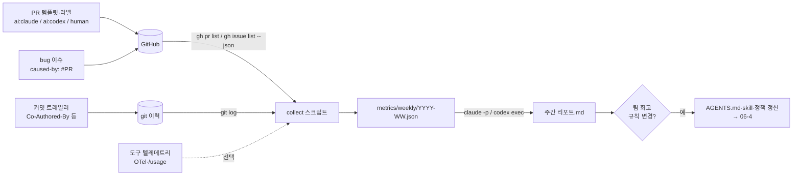

# 06-2. 지표 — 리드타임, PR 수용률, 재작업률, 결함률

## 🎯 학습 목표
- AI 보조 개발의 성과를 재는 4가지 지표(리드타임, PR 수용률, 재작업률, 결함률)를 **계산식과 데이터 원천까지** 정의할 수 있습니다.
- PR·커밋·이슈에 "누가(어떤 에이전트가) 만들었습니까"를 남기는 규칙을 세우고 강제할 수 있습니다.
- `git`과 GitHub CLI(`gh`) 데이터로 지표를 수집하는 스크립트를 에이전트와 함께 만들고 검증할 수 있습니다.
- 주간 리포트를 자동 생성하고, 지표를 근거로 팀 규칙을 바꾸는 결정을 내릴 수 있습니다.

## 📋 사전 준비
- 선행 레슨: [03-3 Git 전략](../03-agentic-workflow/03-3-git-strategy.md), [05-4 CI/CD 통합](../05-scaling-up/05-4-ci-cd-integration.md), [06-1 비용과 성능](./06-1-cost-and-performance.md)
- 필요 도구/계정: Claude Code 2.1.292, Codex 0.160.1, `gh`(GitHub CLI, 로그인 상태), `jq`, `git`
- 실습 저장소 상태: Project B(TaskFlow)의 B6 완료 상태. 머지된 PR이 30건 이상 있으면 좋습니다. 적으면 Project A 저장소나 이 가이드 저장소의 PR 이력으로 연습합니다.

## 💡 개념

### 그림으로 먼저 이해합니다: 속도·품질·사용량을 함께 봅니다


**그림 읽는 순서**

1. 왼쪽 PR·이슈·실행 기록이 지표의 근거가 됩니다. 가운데에서 리드타임과 품질 지표, 토큰 사용량을 함께 확인합니다.
2. 오른쪽에서는 같은 작업 유형과 측정 기간으로 비교합니다. 그림은 측정 항목을 설명하며, 실제 성능 향상이나 비용 절감 수치를 제시하지 않습니다.

### 왜 지표가 필요한가
"에이전트를 쓰니 빨라진 것 같습니다"라는 느낌은 대규모 도입의 근거가 되지 못합니다. 에이전트는 **코드를 빨리 만드는 대신 리뷰와 재작업을 늘릴 수 있습니다.** PR이 두 배로 열려도 절반이 닫히거나, 머지 후 일주일 안에 다시 고쳐진다면 팀은 오히려 느려집니다. 그래서 속도 지표 하나만 보지 않고 **속도(리드타임) – 품질(수용률·재작업률·결함률)** 을 한 묶음으로 봅니다. 설계 원칙 3번 **Verify, Don't Trust**를 팀 단위로 적용하는 것입니다.

### 4가지 지표 정의
| 지표 | 질문 | 계산식(이 레슨의 기본 정의) | 데이터 원천 |
|---|---|---|---|
| 리드타임 | 작업이 얼마나 빨리 main에 들어갑니까 | PR `createdAt` → `mergedAt` 시간의 **중앙값**(보조: 이슈 생성 → 머지) | `gh pr list --json` |
| PR 수용률 | 에이전트가 만든 PR이 받아들여집니까 | 기간 내 닫힌 PR 중 `merged / (merged + closed-unmerged)` | `gh pr list --json state,mergedAt` |
| 재작업률 | 받아들여진 뒤 다시 손대야 했습니까 | ① 리뷰 재작업: `CHANGES_REQUESTED` 리뷰를 1회 이상 받은 PR 비율 ② 머지 후 재작업: 머지 후 14일 안에 같은 파일을 고친 `fix`/`revert` PR이 생긴 PR 비율 | `reviews`, `files`, 이후 PR |
| 결함률 | 결함이 운영까지 새어 나갔습니까 | 기간 내 머지된 PR 100건당, 그 PR을 원인으로 지목한 `bug` 이슈 수 | `bug` 이슈의 `caused-by` 표기 |

모든 지표는 **출처별(ai:claude / ai:codex / human)** 로 나눠서 봅니다. 비교 기준이 없으면 숫자는 해석할 수 없습니다.

### 데이터 흐름


### 지표의 함정
- **Goodhart의 법칙** — 수용률을 목표로 삼으면 PR을 작게 쪼개거나 위험한 PR을 열지 않는 쪽으로 행동이 바뀝니다. 지표는 개인 평가가 아니라 **프로세스 개선**에만 쓴다고 정책(06-3)에 적습니다.
- **표본 크기** — 주당 PR이 10건이면 비율은 크게 흔들립니다. 4주 이동 구간으로 보고, 건수를 항상 함께 적습니다.
- **출처 표시 누락** — 라벨이 빠진 PR은 "unknown"으로 따로 집계합니다. human으로 간주하면 비교가 오염됩니다.

## 👣 따라하기

### Step 1. 지표 정의서 쓰기 (에이전트 인터뷰 방식)
목적: 계산식·분모·예외를 문서로 고정합니다. 정의가 없으면 스크립트마다 숫자가 달라집니다.

**Claude Code 레시피**
```bash
cd taskflow
claude --permission-mode plan
> 우리 팀의 AI 개발 지표 정의서를 docs/ops/metrics-definition.md로 쓰려고 합니다.
> 리드타임, PR 수용률, 재작업률, 결함률 4개를 다룹니다. 이 레슨의 기본 정의는 다음과 같습니다: (위 표 붙여넣기)
> 바로 쓰지 말고, 정의를 확정하는 데 필요한 질문을 5개 이내로 먼저 해 주십시오.
> (예: draft PR은 분모에 넣습니까? 봇 PR은? 리드타임 단위는?)
```
질문에 답한 뒤 계획을 승인하면 문서를 쓰게 합니다.

**Codex 레시피**
```bash
cd taskflow
codex --sandbox read-only --ask-for-approval on-request
> 우리 팀의 AI 개발 지표 정의서를 docs/ops/metrics-definition.md로 쓰려고 합니다. (위 표 붙여넣기)
> 정의를 확정하는 데 필요한 질문을 5개 이내로 먼저 해 주십시오. 답을 들은 뒤 문서 초안을 보여주고, 제가 승인하면 그때 파일을 쓰십시오.
```
초안을 승인한 뒤 `/permissions`로 쓰기 권한을 주거나, 세션을 나와 `codex --sandbox workspace-write`로 다시 시작해 파일을 쓰게 합니다.

정의서에 반드시 들어갈 항목:

```markdown
## PR 수용률
- 분자: 기간 내 merged된 PR 수
- 분모: 기간 내 닫힌(closed) PR 수 = merged + closed-unmerged
- 제외: draft 상태로 닫힌 PR, dependabot 등 봇 PR, `experiment` 라벨 PR
- 출처 구분: 라벨 ai:claude / ai:codex / human, 라벨 없음은 unknown
- 해석: 4주 이동 구간, 건수 10건 미만이면 "판단 보류"
```

**기대 결과**: 4개 지표 각각에 분자·분모·제외 조건·데이터 원천·해석 규칙이 있는 정의서가 생깁니다.

### Step 2. 출처(provenance) 표시 규칙 세우기
목적: 지표를 출처별로 나누려면 PR마다 "어떤 도구가 주로 만들었습니까"가 기록돼 있어야 합니다.

이 단계의 규칙은 도구 독립적입니다. 라벨과 PR 템플릿으로 표시하고 CI로 강제합니다.

```bash
# 라벨 만들기 (한 번만)
gh label create "ai:claude" --color 5319e7 --description "Claude Code가 주로 작성"
gh label create "ai:codex"  --color 0e8a16 --description "Codex가 주로 작성"
gh label create "human"     --color c5def5 --description "사람이 주로 작성"
gh label create "bug"       --color d73a4a --description "결함" 2>/dev/null || true
```

`.github/pull_request_template.md`(03-3에서 만든 템플릿)에 항목을 추가합니다.

```markdown
## AI 사용
- [ ] 주 작성 도구 라벨(ai:claude / ai:codex / human)을 달았습니다
- 사용한 Task 명세: specs/T-___.md
- 사람이 직접 고친 부분:
```

버그 이슈 템플릿에는 원인 PR을 적는 줄을 둡니다.

```markdown
caused-by: #<PR 번호 또는 unknown>
```

**Claude Code 레시피**

Claude Code는 기본적으로 커밋과 PR 설명에 attribution(공동 작성자 트레일러 등)을 붙입니다. 이 표시는 `attribution` 설정(`attribution.commit`, `attribution.pr`)으로 바꾸거나 숨길 수 있으므로, 팀은 **지울지 남길지를 정책으로 정합니다**. 지표에는 남기는 쪽을 권장합니다.

```bash
claude
> .github/workflows/pr-label-check.yml을 만드십시오. PR이 열리거나 라벨이 바뀔 때 ai:claude, ai:codex, human 중 정확히 하나가 붙어 있는지 검사하고, 없으면 실패하게 하십시오. gh CLI와 GITHUB_TOKEN만 쓰십시오.
```

**Codex 레시피**
```bash
codex exec --sandbox workspace-write \
  ".github/workflows/pr-label-check.yml을 만드십시오. PR이 열리거나 라벨이 바뀔 때 ai:claude, ai:codex, human 중 정확히 하나가 붙어 있는지 검사하고, 없으면 실패하게 하십시오. gh CLI와 GITHUB_TOKEN만 쓰십시오."
```

> Codex가 커밋에 자동으로 붙이는 표시가 있는지는 확인하지 못했습니다. TODO(verify). 따라서 출처 판정은 **라벨을 1차 기준**, 커밋 트레일러를 보조 기준으로 둡니다.

**기대 결과**: 라벨 없는 테스트 PR을 열면 `pr-label-check`가 실패하고, 라벨을 달면 통과합니다. 과거 PR은 `gh pr edit <번호> --add-label ai:claude`로 소급 표시하거나 unknown으로 둡니다.

### Step 3. 수집 스크립트: 리드타임과 수용률
목적: 정의서의 식을 그대로 코드로 옮깁니다. 먼저 사람이 기준 스크립트를 만들고, 다음 단계에서 에이전트가 확장합니다.

이 단계는 도구 독립적인 셸 스크립트입니다. `scripts/metrics/collect-prs.sh`:

```bash
#!/usr/bin/env bash
# 사용법: scripts/metrics/collect-prs.sh 2026-09-07 2026-10-04
set -euo pipefail
SINCE=$1; UNTIL=$2
OUT=metrics/raw/prs-$SINCE-$UNTIL.json
mkdir -p metrics/raw

gh pr list --state all --limit 1000 \
  --search "closed:$SINCE..$UNTIL -author:app/dependabot" \
  --json number,title,author,labels,isDraft,createdAt,mergedAt,closedAt,state,additions,deletions,reviews,files \
  > "$OUT"

jq '
  def src: ([.labels[].name | select(test("^(ai:claude|ai:codex|human)$"))] | first) // "unknown";
  def hours(a; b): ((b | fromdateiso8601) - (a | fromdateiso8601)) / 3600;
  def median: sort | if length == 0 then null else .[(length / 2 | floor)] end;
  map(select(.isDraft | not)) | group_by(src) | map({
    source: (.[0] | src),
    closed: length,
    merged: map(select(.mergedAt != null)) | length,
    acceptance_rate: ((map(select(.mergedAt != null)) | length) / length * 100 | round),
    lead_time_median_h: (map(select(.mergedAt != null) | hours(.createdAt; .mergedAt)) | median | if . then (. * 10 | round / 10) else null end),
    review_rework_rate: ((map(select([.reviews[].state] | index("CHANGES_REQUESTED"))) | length) / length * 100 | round)
  })' "$OUT"
```

```bash
chmod +x scripts/metrics/collect-prs.sh
scripts/metrics/collect-prs.sh 2026-09-07 2026-10-04
```

**Claude Code 레시피** — 스크립트를 리뷰시킵니다.
```bash
claude
> scripts/metrics/collect-prs.sh를 docs/ops/metrics-definition.md와 대조해서 리뷰해 주십시오. 정의와 다르게 계산하는 부분(분모, 제외 조건, 중앙값 계산)을 표로 정리하십시오. 고치지는 마십시오.
```

**Codex 레시피**
```bash
codex exec "scripts/metrics/collect-prs.sh를 docs/ops/metrics-definition.md와 대조해서 리뷰해 주십시오. 정의와 다르게 계산하는 부분(분모, 제외 조건, 중앙값 계산)을 표로 정리하십시오. 파일은 고치지 마십시오."
```
(`codex exec`의 기본 샌드박스가 read-only이므로 리뷰 전용 실행에 그대로 씁니다.)

**기대 결과**: 출처별로 `closed`, `merged`, `acceptance_rate`, `lead_time_median_h`, `review_rework_rate`가 나옵니다. 두 도구의 리뷰가 지적한 정의 불일치(예: 짝수 개일 때 중앙값, draft에서 ready로 바뀐 PR의 시작 시각)를 정의서나 스크립트 중 한쪽에 반영합니다.

### Step 4. 에이전트로 머지 후 재작업률과 결함률 추가하기
목적: 계산이 까다로운 지표를 TDD로 확장합니다(03-2의 방식). 실제 데이터 대신 **고정 픽스처**로 먼저 검증합니다.

**Claude Code 레시피**
```bash
claude
> scripts/metrics/에 post-merge-rework 계산을 추가하고 싶습니다. 정의는 docs/ops/metrics-definition.md의 "재작업률 ②"를 따릅니다.
> 1) 먼저 metrics/fixtures/에 PR 6건짜리 가짜 prs.json과 기대 결과 expected-rework.json을 만드십시오. 재작업 있음 2건, 없음 3건, 14일 경계 1건을 포함하십시오.
> 2) 픽스처로 결과를 비교하는 테스트 스크립트를 쓰고 실패하는 것을 확인하십시오.
> 3) 그다음 구현하십시오. 이후 PR 판정은 제목이 fix 또는 Revert로 시작하고, 원 PR이 바꾼 파일과 겹치는 경우로 합니다.
> 4) 같은 방식으로 결함률도 추가하십시오. bug 라벨 이슈 본문의 "caused-by: #번호"를 파싱합니다. 이슈는 gh issue list --label bug --state all --json number,body,createdAt로 가져오십시오.
```

**Codex 레시피**
```bash
codex --sandbox workspace-write
> scripts/metrics/에 post-merge-rework와 defect-rate 계산을 추가하고 싶습니다. 정의는 docs/ops/metrics-definition.md를 따릅니다.
> 먼저 metrics/fixtures/에 픽스처와 기대 결과를 만들고, 테스트가 실패하는 것을 확인한 뒤 구현하십시오.
> 결함 원인 PR은 bug 라벨 이슈 본문의 "caused-by: #번호"로 판정하고, 이슈는 gh issue list --label bug --state all --json number,body,createdAt로 가져오십시오.
```

> 네트워크가 필요한 `gh` 호출은 픽스처 테스트에서 빼고, 실제 수집은 사람이 별도로 실행합니다. Codex `workspace-write` 샌드박스는 기본적으로 네트워크가 막혀 있을 수 있으므로(설정 `[sandbox_workspace_write] network_access`), 수집 스크립트 실행은 승인 요청이 뜨면 검토 후 허용합니다.

**기대 결과**: 픽스처 테스트가 통과하고, 실제 데이터로 실행하면 출처별 `post_merge_rework_rate`와 `defects_per_100_prs`가 추가로 나옵니다. 경계 사례(정확히 14일째 fix)가 정의서대로 처리되는지 확인합니다.

### Step 5. 도구 텔레메트리 연결하기 (선택)
목적: 결과 지표(PR·결함)와 투입 지표(토큰·세션)를 같은 기간으로 맞춰 봅니다. 06-1의 "성공 1건당 토큰"을 팀 단위로 확장하는 단계입니다.

**Claude Code 레시피**

OpenTelemetry로 메트릭을 내보내면 `claude_code.token.usage`, `claude_code.session.count`, `claude_code.commit.count`, `claude_code.pull_request.count`, `claude_code.lines_of_code.count`, `claude_code.active_time.total` 같은 시계열을 받습니다([monitoring-usage](https://code.claude.com/docs/en/monitoring-usage)). 개인 실습에서는 콘솔 출력으로 형태만 확인합니다.

```bash
CLAUDE_CODE_ENABLE_TELEMETRY=1 OTEL_METRICS_EXPORTER=console claude
```

팀 운영에서는 수집기 주소를 관리형 설정의 `env`로 배포합니다(06-3). Team·Enterprise 요금제는 claude.ai의 analytics 대시보드에서 활성 사용자·세션·기여 지표를 CSV로 내보낼 수 있습니다([analytics](https://code.claude.com/docs/en/analytics)).

**Codex 레시피**

Codex는 `[otel]` 설정으로 `codex.conversation_starts`, `codex.api_request`, `codex.tool_decision`, `codex.tool_result` 같은 이벤트 로그를 내보냅니다. 이 키는 프로젝트 `.codex/config.toml`에서는 무시되므로 사용자 설정이나 관리형 설정에 둡니다.

```toml
# ~/.codex/config.toml
[otel]
environment = "dev"
exporter = "none"          # 수집기가 있으면 otlp-http 또는 otlp-grpc
log_user_prompt = false
```

토큰 수는 06-1처럼 `codex exec --json`의 `turn.completed.usage`를 모아 씁니다.

**기대 결과**: 주간 JSON에 `tokens_by_source`(가능한 범위에서) 칸이 추가되고, "수용된 PR 1건당 토큰"을 계산할 수 있습니다. 텔레메트리를 켜지 못하는 환경이면 이 단계는 건너뛰고 리포트에 "투입 지표 없음"이라고 적습니다.

### Step 6. 주간 리포트 자동 생성
목적: 숫자를 사람이 읽을 수 있는 리포트와 **행동 제안**으로 바꾸고, 매주 같은 형식으로 남깁니다.

**Claude Code 레시피** (로컬 실행)
```bash
scripts/metrics/collect-prs.sh 2026-09-28 2026-10-04 > metrics/weekly/2026-W40.json
claude -p "metrics/weekly/2026-W40.json과 직전 3주 파일을 읽고 docs/ops/reports/2026-W40.md 주간 리포트를 쓰십시오. 형식: 1) 출처별 지표 표(건수 포함) 2) 4주 추세 3) 눈에 띄는 PR 3건(링크) 4) 다음 주 실험 제안 1~2개. 건수 10건 미만인 비율은 '판단 보류'로 표시하십시오. 정의는 docs/ops/metrics-definition.md를 따릅니다." \
  --permission-mode acceptEdits --output-format json | jq -r '.result'
```

GitHub Actions로 옮길 때는 `anthropics/claude-code-action@v1`에 `prompt` 입력을 주면 cron에서도 바로 실행되는 automation mode로 동작합니다(05-4 참고).

```yaml
on:
  schedule: [{ cron: "7 0 * * 1" }]   # 매주 월요일
jobs:
  weekly-metrics:
    runs-on: ubuntu-latest
    permissions: { contents: write, pull-requests: write }
    steps:
      - uses: actions/checkout@v6
      - run: scripts/metrics/collect-prs.sh "$(date -d '7 days ago' +%F)" "$(date +%F)" > metrics/weekly/latest.json
        env: { GH_TOKEN: "${{ github.token }}" }
      - uses: anthropics/claude-code-action@v1
        with:
          anthropic_api_key: ${{ secrets.ANTHROPIC_API_KEY }}
          prompt: "metrics/weekly/latest.json으로 주간 리포트를 docs/ops/reports/에 쓰고 PR을 여십시오. 정의는 docs/ops/metrics-definition.md."
```

**Codex 레시피**
```bash
codex exec --sandbox workspace-write -o metrics/weekly/2026-W40.summary.txt \
  "metrics/weekly/2026-W40.json과 직전 3주 파일을 읽고 docs/ops/reports/2026-W40.md 주간 리포트를 쓰십시오. 형식: 출처별 지표 표(건수 포함), 4주 추세, 눈에 띄는 PR 3건, 다음 주 실험 제안 1~2개. 건수 10건 미만은 '판단 보류'. 정의는 docs/ops/metrics-definition.md."
```

CI에서는 `openai/codex-action@v1`에 `prompt-file`과 `output-file`을 주고, API 키는 job 환경 변수가 아니라 action 입력으로만 넘깁니다.

**기대 결과**: `docs/ops/reports/2026-W40.md`가 생기고, 표의 모든 숫자가 주간 JSON과 일치합니다. 리포트의 "실험 제안"이 다음 주 회고 안건이 되고, 채택된 규칙은 06-4의 지식 축적 루프로 넘어갑니다.

> 리포트를 쓴 에이전트가 숫자를 바꾸거나 지어내지 않았는지 **사람이 JSON과 대조**합니다. 숫자 계산은 스크립트가, 서술은 에이전트가 맡는 분업을 지킵니다.

## ✅ 체크포인트
- [ ] 4개 지표의 분자·분모·제외 조건·데이터 원천이 `docs/ops/metrics-definition.md`에 있습니다.
- [ ] PR 출처 라벨 규칙이 있고, 라벨 없는 PR을 CI가 막습니다.
- [ ] `collect-prs.sh`가 출처별 리드타임 중앙값·수용률·리뷰 재작업률을 출력합니다.
- [ ] 머지 후 재작업률과 결함률이 픽스처 테스트를 통과합니다.
- [ ] 주간 리포트 1건을 생성했고, 숫자를 원본 JSON과 대조했습니다.

## 🏠 숙제
| # | 유형 | 난이도 | 과제 | 완료 조건 |
|---|---|---|---|---|
| HW1 | 🔁 Reproduce | ★ | 본인 프로젝트 지표 수집: 최근 4주의 PR로 리드타임·수용률·리뷰 재작업률을 출처별로 계산합니다 | 수집 스크립트와 원본 JSON 커밋, 출처별 결과표(건수 포함), unknown PR 수 명시 |
| HW2 | 🛠 Apply | ★★ | 주간 리포트: 정의서 + 4개 지표 전부를 포함한 주간 리포트를 2주 연속 작성합니다 | 정의서, 픽스처 테스트 통과 로그, 리포트 2건, 각 리포트에 실험 제안과 그 결과(2주차) 기록. Claude·Codex 중 하나로 리포트를 쓰고 다른 하나로 숫자 대조 리뷰 |
| HW3 | 🚀 Challenge | ★★★ | 대시보드: GitHub Actions 주간 cron으로 수집·리포트 PR을 자동화하고, 4주 추세를 차트(예: Mermaid `xychart-beta` 또는 정적 HTML)로 보여줍니다 | 워크플로 실행 성공 링크 2회 이상, 추세 차트, 텔레메트리(토큰) 또는 06-1 측정값과 연결한 "수용된 PR 1건당 토큰" 1개 이상 |

제출: `hw/06-2` 브랜치, `submissions/06-2.md` (템플릿: docs/design/homework-template.md)

## ⚠️ 흔한 실수
- **라벨 없는 PR을 human으로 셉니다** → 출처 비교가 오염됩니다 → unknown으로 따로 집계하고, CI로 라벨을 강제한 날짜 이후 데이터만 비교합니다.
- **수용률만 보고 성공이라고 판단합니다** → 작은 PR만 열거나 리뷰가 느슨해져도 수용률은 오릅니다 → 재작업률·결함률을 반드시 함께 보고, PR 크기(`additions + deletions`)를 같이 적습니다.
- **에이전트에게 숫자 계산까지 맡깁니다** → 리포트의 비율이 원본과 다르거나 반올림이 들쭉날쭉합니다 → 계산은 스크립트, 서술은 에이전트로 나누고, 리포트의 숫자를 JSON과 대조합니다.
- **`gh pr list` 기본 개수만 가져옵니다** → 기본 limit 때문에 PR 일부만 집계됩니다 → `--limit`을 충분히 크게 주고 결과 건수를 GitHub 화면과 비교합니다.
- **지표를 개인 평가에 씁니다** → 출처 라벨을 숨기거나 위험한 작업을 피하는 행동이 생깁니다 → 정책(06-3)에 "프로세스 개선 목적에만 사용"을 명시합니다.

## 🔗 참고 자료
- Claude Code: [Monitoring usage (OpenTelemetry)](https://code.claude.com/docs/en/monitoring-usage), [Analytics](https://code.claude.com/docs/en/analytics), [Headless](https://code.claude.com/docs/en/headless), [GitHub Actions](https://code.claude.com/docs/en/github-actions), [Settings](https://code.claude.com/docs/en/settings)
- Codex: [Non-interactive mode](https://learn.chatgpt.com/docs/non-interactive-mode), [Advanced config(OTel)](https://learn.chatgpt.com/docs/config-file/config-advanced), [GitHub Action](https://learn.chatgpt.com/docs/github-action)
- GitHub CLI: [`gh pr list`](https://cli.github.com/manual/gh_pr_list), [`gh issue list`](https://cli.github.com/manual/gh_issue_list)
- 이 저장소: [도구 레퍼런스 §2, §10](../../docs/reference/tool-reference.md), [03-2 TDD](../03-agentic-workflow/03-2-tdd-with-agents.md), [03-3 Git 전략](../03-agentic-workflow/03-3-git-strategy.md), [05-4 CI/CD 통합](../05-scaling-up/05-4-ci-cd-integration.md), [06-1 비용과 성능](./06-1-cost-and-performance.md), [06-3 거버넌스](./06-3-governance.md), [06-4 지식 축적](./06-4-knowledge-loop.md)
