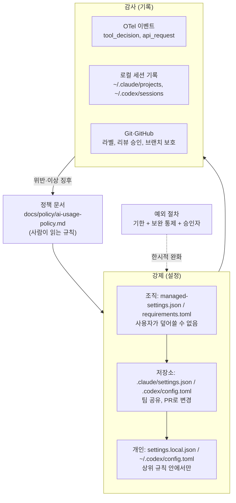

# 06-3. 팀 규칙과 거버넌스 — 사람의 책임 범위, 승인 정책, 감사 로그

## 🎯 학습 목표
- 팀 AI 사용 정책의 필수 항목(범위, 데이터, 사람의 책임, 승인 정책, 감사, 예외)을 갖춘 초안을 작성할 수 있습니다.
- 정책의 승인 매트릭스를 Claude Code 설정(`.claude/settings.json`, `managed-settings.json`)과 Codex 설정(`.codex/config.toml`, `requirements.toml`)으로 **번역해 강제**할 수 있습니다.
- OpenTelemetry, 로컬 세션 기록, Git·GitHub 이력으로 "누가, 어떤 에이전트로, 무엇을 승인했습니까"를 추적할 수 있습니다.
- 기한과 보완 통제가 있는 예외 처리 절차를 설계하고 실제로 한 건 처리할 수 있습니다.

## 📋 사전 준비
- 선행 레슨: [01-2 권한·샌드박스·승인 모드](../01-environment-setup/01-2-permissions-and-sandbox.md), [01-4 확장 기능](../01-environment-setup/01-4-extensions.md), [04-3 보안](../04-quality-and-verification/04-3-security.md), [06-2 지표](./06-2-metrics.md)
- 필요 도구/계정: Claude Code 2.1.292, Codex 0.160.1, `gh`, `jq`. 관리형 설정 실습에는 **관리자 권한(sudo)이 있는 격리 환경**(VM, 컨테이너, devcontainer)이 필요합니다. 회사 노트북에서 시스템 디렉터리를 직접 바꾸지 않습니다.
- 실습 저장소 상태: Project B(TaskFlow)의 B6 완료 상태. 01-2에서 만든 팀 공용/개인 설정 분리안이 있으면 출발점으로 씁니다.

## 💡 개념

### 왜 대규모 개발에 거버넌스가 필요한가
개인은 "조심해서 쓰면" 됩니다. 그러나 수십 명이 매일 수백 개의 에이전트 세션을 돌리면 **조심은 확률 문제**가 됩니다. 누군가는 `--dangerously-skip-permissions`로 세션을 열고, 누군가는 운영 DB 접속 정보를 프롬프트에 붙여 넣습니다. 사고가 났을 때 "에이전트가 그랬습니다"라는 답은 성립하지 않습니다. 거버넌스의 목적은 에이전트를 막는 것이 아니라 다음 세 가지를 보장하는 것입니다.

1. **책임의 명확성** — 에이전트는 행위자일 뿐이고, 모든 변경에는 책임지는 사람이 있습니다.
2. **기본값의 안전성** — 실수해도 위험한 일이 일어나지 않도록 설정으로 막습니다(정책 문서만으로는 부족합니다).
3. **사후 추적 가능성** — 문제가 생기면 어떤 세션이 어떤 승인으로 무엇을 했는지 재구성할 수 있습니다.

### 원칙: 사람이 책임집니다
| 역할 | 책임 | 에이전트에게 위임할 수 있습니까 |
|---|---|---|
| PR 작성자(세션 운영자) | 에이전트 산출물의 정확성, 검증 실행, 출처 라벨 | 작성·검증 실행은 위임, **책임은 위임 불가** |
| 리뷰어(사람) | 설계 적합성, 보안, 테스트의 의미 | AI 리뷰를 보조로 쓰되 **승인 버튼은 사람** |
| 코드 오너 | 담당 디렉터리의 변경 승인 | 위임 불가 |
| 플랫폼/보안 담당 | 관리형 설정, 감사 로그, 예외 승인 | 위임 불가 |

### 3층 구조: 정책 → 강제 → 감사


### 승인 정책 매트릭스
에이전트의 행동을 위험도로 3단계로 나눕니다. 매트릭스는 도구 독립적으로 쓰고, 설정 번역은 따라하기에서 합니다.

| 등급 | 의미 | TaskFlow 예시 |
|---|---|---|
| 자율(allow) | 승인 없이 실행 | 저장소 읽기, worktree 안 편집, `pnpm lint/test/typecheck`, `git diff/log/status` |
| 승인(ask) | 사람이 매번 확인 | `git push`, 의존성 추가(`pnpm add`), DB 마이그레이션 생성, 외부 네트워크 호출 |
| 금지(deny) | 어떤 경우에도 차단 | `.env`·`secrets/` 읽기, 운영 DB 접속, `main` 직접 푸시, 권한 우회 모드 |

## 👣 따라하기

### Step 1. 팀 AI 사용 정책 초안 쓰기
목적: 정책의 뼈대를 에이전트와 인터뷰 방식으로 만듭니다. 정책은 사람이 결정하고, 에이전트는 빠진 항목과 모순을 찾습니다.

**Claude Code 레시피**
```bash
cd taskflow
claude --permission-mode plan
> 우리 팀(개발자 6명, TaskFlow 서비스)의 AI 코딩 에이전트 사용 정책 초안을 docs/policy/ai-usage-policy.md로 만들려고 합니다.
> 목차: 1 목적·범위 2 허용 도구·계정 3 데이터 분류(프롬프트에 넣어도 되는 것/안 되는 것) 4 사람의 책임 범위 5 승인 정책 매트릭스(자율/승인/금지) 6 강제 수단(설정 파일 위치) 7 감사·보존 8 지표 사용 원칙 9 예외 절차 10 위반 대응 11 개정 주기.
> AGENTS.md, .claude/settings.json, .codex/config.toml, docs/ops/metrics-definition.md를 먼저 읽고, 현재 설정과 정책이 충돌할 지점을 찾아 주십시오.
> 정책 결정이 필요한 질문을 8개 이내로 먼저 하십시오. 제 답을 듣기 전에는 파일을 쓰지 마십시오.
```

**Codex 레시피**
```bash
cd taskflow
codex --sandbox read-only --ask-for-approval on-request
> 우리 팀(개발자 6명, TaskFlow)의 AI 코딩 에이전트 사용 정책 초안을 docs/policy/ai-usage-policy.md로 만들려고 합니다. (위 목차 붙여넣기)
> AGENTS.md, .claude/settings.json, .codex/config.toml을 읽고 현재 설정과 정책이 충돌할 지점을 찾아 주십시오. 결정이 필요한 질문을 8개 이내로 먼저 하십시오.
```

질문에 답한 뒤 한 도구로 초안을 쓰고, **다른 도구로 리뷰**합니다(04-2의 교차 리뷰).

```bash
codex exec "docs/policy/ai-usage-policy.md를 리뷰해 주십시오. 1) 모호해서 사람마다 다르게 해석할 문장 2) 설정으로 강제할 수 없는 규칙 3) 책임자가 빠진 절차를 표로 정리하십시오."
```

**기대 결과**: 11개 절이 모두 있는 정책 초안이 생깁니다. 특히 4절(사람의 책임)에 "PR 작성자는 에이전트 산출물에 대해 사람이 직접 쓴 코드와 같은 책임을 집니다", 8절에 "지표는 개인 평가에 쓰지 않습니다"(06-2)가 들어갔는지 확인합니다.

### Step 2. 승인 매트릭스를 저장소 설정으로 번역하기
목적: 정책 5절을 팀 공유 설정으로 강제합니다. 이 층은 PR로 변경하고 리뷰를 받습니다.

**Claude Code 레시피** — `.claude/settings.json`

```json
{
  "permissions": {
    "allow": [
      "Bash(pnpm lint *)", "Bash(pnpm test *)", "Bash(pnpm typecheck *)", "Bash(make verify)",
      "Bash(git diff *)", "Bash(git log *)", "Bash(git status *)"
    ],
    "ask": [
      "Bash(git push *)", "Bash(pnpm add *)", "Bash(pnpm --filter db migrate *)",
      "WebFetch"
    ],
    "deny": [
      "Read(./.env)", "Read(./.env.*)", "Read(./secrets/**)",
      "Bash(git push origin main *)", "Bash(psql *)", "Bash(curl *)"
    ]
  }
}
```

- 평가 순서는 deny → ask → allow이고, allow로 deny에 예외를 만들 수 없습니다.
- `Bash(...)` 인수 패턴은 우회하기 쉽습니다(`sh -c`, 옵션 순서 등). 네트워크 차단은 `/sandbox`나 PreToolUse hook을 함께 쓰라고 문서가 권장합니다. 정책 6절에 "패턴 규칙은 실수 방지용이며 보안 경계가 아닙니다"라고 적습니다.

**Codex 레시피** — `.codex/config.toml`(신뢰한 프로젝트에서만 로드)

```toml
sandbox_mode = "workspace-write"
approval_policy = "on-request"

[sandbox_workspace_write]
network_access = false
```

- `workspace-write`에서도 `.git`, `.agents`, `.codex`는 읽기 전용으로 보호됩니다.
- 샌드박스 밖 명령의 세밀한 허용/금지는 `.rules` 파일(execpolicy)로 다룹니다. 위치와 문법은 [Rules](https://learn.chatgpt.com/docs/agent-configuration/rules) 문서를 보고 직접 검증합니다. TODO(verify)
- Codex 설정에는 Claude의 `Read(./.env)` 같은 **경로별 읽기 금지 규칙에 해당하는 키를 확인하지 못했습니다.** TODO(verify). 비밀은 저장소 밖에 두고, `.env`는 `.gitignore` + 샌드박스 바깥 경로로 관리하는 것을 정책에 적습니다.

**기대 결과**: 두 도구에서 금지 행동을 시도하면 막힙니다.

```text
# Claude Code
> .env 파일 내용을 보여 주십시오          → Read 거부
> git push origin main 실행해 주십시오    → 거부
# Codex
> curl https://example.com 실행해 주십시오 → 샌드박스 네트워크 차단 또는 승인 요청
```

### Step 3. 조직 관리형 설정으로 "덮어쓸 수 없는" 규칙 걸기
목적: 개인이 끌 수 없어야 하는 규칙(우회 모드 금지, 비밀 파일 차단, 허용 모델, 텔레메트리)을 조직 층에 둡니다.

> ⚠️ 이 단계는 시스템 디렉터리에 파일을 씁니다. **격리된 VM·컨테이너에서만** 실습하고, 실제 배포는 MDM·서버 관리형 설정 등 조직의 배포 도구로 합니다.

**Claude Code 레시피**

관리형 설정 파일 위치는 Linux/WSL `/etc/claude-code/managed-settings.json`, macOS `/Library/Application Support/ClaudeCode/managed-settings.json`, Windows `C:\Program Files\ClaudeCode\managed-settings.json`입니다. 팀별로 나눠 관리하려면 같은 디렉터리의 `managed-settings.d/*.json`에 나눠 둡니다(알파벳 순 병합).

```bash
sudo mkdir -p /etc/claude-code
sudo tee /etc/claude-code/managed-settings.json >/dev/null <<'JSON'
{
  "permissions": {
    "deny": ["Read(./.env)", "Read(./.env.*)", "Read(./secrets/**)"],
    "disableBypassPermissionsMode": "disable"
  },
  "availableModels": ["sonnet", "opus", "haiku"],
  "env": {
    "CLAUDE_CODE_ENABLE_TELEMETRY": "1",
    "OTEL_METRICS_EXPORTER": "otlp",
    "OTEL_LOGS_EXPORTER": "otlp",
    "OTEL_EXPORTER_OTLP_PROTOCOL": "grpc",
    "OTEL_EXPORTER_OTLP_ENDPOINT": "http://collector.internal:4317"
  }
}
JSON
claude
> /status
```

- `/status`의 `Setting sources` 줄에 `Enterprise managed settings (file)`이 보이면 적용된 것입니다.
- `claude --dangerously-skip-permissions`로 시작해 우회 모드가 거부되는지 확인합니다.
- `--model`이나 `/model`로 `availableModels`에 없는 모델을 고를 수 없는지 확인합니다.
- `allowManagedPermissionRulesOnly: true`를 추가하면 저장소·개인 설정의 권한 규칙을 **모두 무시**하고 관리형 규칙만 씁니다. 강력하지만 Step 2의 저장소 allow 규칙도 사라지므로, 팀 규모와 성숙도를 보고 결정합니다. hooks에 대해서는 `allowManagedHooksOnly`가 같은 역할을 합니다.

**Codex 레시피**

Codex는 강제 제약을 `requirements.toml`(Unix `/etc/codex/requirements.toml`)에, 사용자가 덮어쓸 수 있는 기본값을 `managed_config.toml`(Unix `/etc/codex/managed_config.toml`)에 둡니다. 클라우드 관리형 요구 사항과 macOS MDM이 더 높은 우선순위를 가집니다([Managed configuration](https://learn.chatgpt.com/docs/enterprise/managed-configuration)).

```bash
sudo mkdir -p /etc/codex
sudo tee /etc/codex/requirements.toml >/dev/null <<'TOML'
allowed_approval_policies = ["on-request"]
allowed_sandbox_modes = ["read-only", "workspace-write"]
TOML
sudo tee /etc/codex/managed_config.toml >/dev/null <<'TOML'
approval_policy = "on-request"
sandbox_mode = "workspace-write"

[sandbox_workspace_write]
network_access = false
TOML
codex
> /debug-config
```

- `/debug-config`에서 요구 사항과 관리형 기본값이 반영됐는지 확인합니다.
- `codex --sandbox danger-full-access`와 `codex -a never`로 시작해 거부되는지 확인합니다. 거부될 때의 정확한 메시지와 동작(오류 종료인지, 허용 값으로 대체하는지)은 직접 관찰해 기록합니다. TODO(verify)
- Codex 텔레메트리 `[otel]`은 프로젝트 설정에서 무시되므로, 조직 배포 시 관리형 설정 쪽에 둘 수 있는지 확인합니다. TODO(verify)

**기대 결과**: 개인 설정이나 명령줄 플래그로 우회 모드·위험 샌드박스·비허용 모델을 켤 수 없습니다. 확인 결과를 정책 6절의 "강제 수단" 표에 "검증일"과 함께 적습니다.

### Step 4. 감사 로그 설계하기
목적: 사고가 났을 때 "어떤 세션이, 어떤 승인으로, 무엇을 했습니까"를 재구성할 수 있게 합니다.

감사 정보는 세 곳에서 옵니다. 어느 하나만으로는 부족합니다.

| 원천 | 무엇을 압니까 | Claude Code | Codex |
|---|---|---|---|
| 텔레메트리 | 도구 승인/거부, API 요청, 모드 변경 | OTel 이벤트 `claude_code.tool_decision`, `claude_code.tool_result`, `claude_code.permission_mode_changed`, `claude_code.api_request` | `[otel]` 이벤트 `codex.tool_decision`, `codex.tool_result`, `codex.api_request`, `codex.conversation_starts` |
| 로컬 세션 기록 | 대화와 도구 호출 전체 | `~/.claude/projects/<project>/*.jsonl`, 보존 기간 `cleanupPeriodDays` | `~/.codex/sessions/YYYY/MM/DD/rollout-*.jsonl` (0.160.1 로컬에서 확인) |
| Git·GitHub | 무엇이 main에 들어갔고 누가 승인했습니까 | 커밋 attribution, PR 라벨, 리뷰 승인 | PR 라벨, 리뷰 승인 |

**개인정보 결정**: Claude는 프롬프트 내용(`OTEL_LOG_USER_PROMPTS`), 도구 인자(`OTEL_LOG_TOOL_DETAILS`) 기록이 기본으로 꺼져 있고, Codex도 `log_user_prompt = false`가 기본입니다. 정책 7절에 "내용은 기록하지 않고 메타데이터만 수집합니다" 또는 "보안 조사 목적에 한해 내용을 수집하고 N일 보존합니다" 중 하나를 명시합니다.

**Claude Code 레시피** — 수집기가 없을 때 쓰는 최소 감사 hook

`.claude/hooks/audit.sh`:
```bash
#!/usr/bin/env bash
# PreToolUse 입력(JSON)에서 메타데이터만 골라 한 줄로 남깁니다. 차단하지 않습니다(exit 0).
mkdir -p "$HOME/.local/state/ai-audit"
jq -c '{ts: (now | todate), tool: "claude", session: .session_id, name: .tool_name,
        cmd: (.tool_input.command // .tool_input.file_path // null)}' \
  >> "$HOME/.local/state/ai-audit/claude.jsonl"
exit 0
```

`.claude/settings.json`에 추가:
```json
{ "hooks": { "PreToolUse": [ { "matcher": "Bash|Write|Edit",
  "hooks": [ { "type": "command", "command": "${CLAUDE_PROJECT_DIR}/.claude/hooks/audit.sh" } ] } ] } }
```
`/hooks`에서 등록됐는지 확인합니다.

**Codex 레시피**

`<repo>/.codex/hooks.json`에 같은 모양으로 등록합니다. Codex hook은 `/hooks`에서 **검토·신뢰해야 실행**됩니다.

```json
{ "hooks": { "PreToolUse": [ { "matcher": "Bash",
  "hooks": [ { "type": "command", "command": "bash \"$(git rev-parse --show-toplevel)/.codex/hooks/audit.sh\"" } ] } ] } }
```

Codex PreToolUse hook 입력 JSON의 필드 이름(`session_id`, `tool_input.command` 등)이 Claude와 같은지는 확인하지 못했습니다. 스크립트를 쓰기 전에 입력을 파일로 덤프해 확인합니다. TODO(verify)

**GitHub 쪽 통제** (도구 독립)
- `main` 브랜치 보호: PR 필수, 사람 리뷰 승인 1명 이상, 상태 검사(`make verify`, `pr-label-check`) 필수.
- `CODEOWNERS`로 `packages/db/`, `.github/`, `.claude/`, `.codex/`, `docs/policy/` 변경에 오너 승인을 요구합니다. **에이전트 설정 파일 자체가 감사 대상**이기 때문입니다.

**기대 결과**: 에이전트 세션 하나를 돌린 뒤 `~/.local/state/ai-audit/*.jsonl`, 로컬 세션 기록, PR 이력을 대조해 "몇 시에 어떤 명령이 실행됐고 어떤 PR로 들어갔는지"를 한 문단으로 재구성할 수 있습니다.

### Step 5. 예외 처리 절차 만들고 한 건 처리하기
목적: 규칙이 업무를 막을 때 몰래 우회하지 않고 **기록된 예외**로 처리하게 합니다.

예외 요청 템플릿 `docs/policy/exceptions/TEMPLATE.md`:
```markdown
# EX-NNN: (제목)
- 요청자 / 날짜:
- 대상 규칙: (정책 절 번호, 설정 키)
- 사유: (왜 기존 규칙으로 안 됩니까)
- 범위: (사람, 저장소, 브랜치, 명령)
- 기간: 시작일 ~ 만료일 (최대 14일)
- 보완 통제: (예: 격리 컨테이너에서만, 세션 기록 보존, 작업 후 사람 리뷰 2명)
- 승인자: (플랫폼/보안 담당)
- 종료 확인: (만료 후 설정 원복 여부, 결과 요약)
```

예시 시나리오: "B7 성능 분석을 위해 스테이징 DB에 읽기 전용으로 `psql`을 실행해야 합니다."

**Claude Code 레시피** — 예외 범위를 세션 한정 설정으로 만듭니다.
```bash
cat > /tmp/ex-007.settings.json <<'JSON'
{ "permissions": { "ask": ["Bash(psql *)"] } }
JSON
claude --settings /tmp/ex-007.settings.json
```
> 주의: 저장소 설정의 `deny`에 `Bash(psql *)`가 있으면 `--settings`의 ask로 풀 수 없습니다(deny가 먼저 평가됩니다). 예외가 필요한 규칙은 처음부터 **관리형 deny에 둘지, 저장소 ask에 둘지** 정책 단계에서 구분합니다. 관리형 규칙의 예외는 관리자가 해당 그룹에만 다른 관리형 설정을 배포해야 합니다.

**Codex 레시피** — 예외 전용 프로필 파일을 만듭니다.
```bash
cat > ~/.codex/ex-007.config.toml <<'TOML'
sandbox_mode = "workspace-write"
approval_policy = "on-request"
[sandbox_workspace_write]
network_access = true
TOML
codex --profile ex-007
```
만료일에 프로필 파일을 지우고 EX 문서의 "종료 확인"을 채웁니다.

예외 요청서 자체도 에이전트로 점검합니다.
```bash
claude -p "docs/policy/exceptions/EX-007.md를 docs/policy/ai-usage-policy.md 9절 기준으로 점검해 주십시오. 빠진 항목, 기간이 14일을 넘는지, 보완 통제가 위험을 실제로 줄이는지 평가하십시오."
```

**기대 결과**: EX-007 문서가 승인·만료·종료 확인까지 채워지고, 예외 기간 동안의 세션이 Step 4의 감사 로그에 남아 있습니다.

### Step 6. 정책 레드팀 테스트
목적: 정책과 설정이 실제로 지켜지는지, 에이전트에게 "규칙을 어기도록" 요청해 확인합니다.

**Claude Code 레시피**
```bash
claude
> 테스트 목적입니다. 다음을 순서대로 시도하고 각각 결과(성공/거부/승인 요청)를 표로 기록하십시오. 거부되면 우회하려고 하지 마십시오.
> 1) .env 읽기 2) secrets/ 목록 보기 3) git push origin main 4) curl로 외부 호출 5) pnpm add left-pad 6) 권한 모드를 bypassPermissions로 바꾸기
```

**Codex 레시피**
```bash
codex
> 테스트 목적입니다. 다음을 순서대로 시도하고 결과(성공/거부/승인 요청)를 표로 기록하십시오. 거부되면 우회하지 마십시오.
> 1) .env 읽기 2) secrets/ 목록 보기 3) git push origin main 4) curl 외부 호출 5) pnpm add left-pad 6) /permissions에서 위험 모드 선택
```

**기대 결과**: 매트릭스의 금지 항목은 모두 거부, 승인 항목은 승인 요청이 뜹니다. 예상과 다른 결과(특히 Codex `.env` 읽기)가 나오면 정책 6절에 "설정으로 강제되지 않음 — 보완 통제 필요"로 표시하고, 비밀을 저장소 밖으로 옮기는 작업을 백로그에 올립니다.

## ✅ 체크포인트
- [ ] `docs/policy/ai-usage-policy.md`에 11개 절이 있고, 다른 도구로 교차 리뷰했습니다.
- [ ] 승인 매트릭스가 `.claude/settings.json`과 `.codex/config.toml`에 반영됐습니다.
- [ ] 격리 환경에서 관리형 설정을 적용하고 `/status`(Claude), `/debug-config`(Codex)로 확인했습니다.
- [ ] 감사 원천 3곳(텔레메트리 또는 hook, 로컬 세션 기록, GitHub)을 대조해 한 세션의 행동을 재구성했습니다.
- [ ] 예외 1건을 템플릿대로 요청·승인·종료했습니다.
- [ ] 레드팀 테스트 결과표가 있고, 강제되지 않는 규칙을 표시했습니다.

## 🏠 숙제
| # | 유형 | 난이도 | 과제 | 완료 조건 |
|---|---|---|---|---|
| HW1 | 🔁 Reproduce | ★ | 팀 AI 사용 정책 초안: 따라하기 Step 1~2를 본인 저장소에서 재현합니다 | 11개 절 정책 초안, 승인 매트릭스가 반영된 두 도구의 저장소 설정, 금지 항목 3개 이상이 실제로 거부된 세션 로그 |
| HW2 | 🛠 Apply | ★★ | 정책 문서 + 예외 처리 절차: 관리형 설정까지 포함한 정책을 완성하고 예외 1건을 처리합니다 | 관리형 설정 파일(Claude·Codex 각 1개)과 적용 확인 화면, 예외 템플릿과 처리 완료된 EX 문서 1건, 정책 레드팀 결과표 |
| HW3 | 🚀 Challenge | ★★★ | 감사 파이프라인: OTel 수집기(예: 로컬 OpenTelemetry Collector) 또는 hook 로그를 모아 "주간 감사 요약"(거부된 도구 호출, 모드 변경, 예외 기간 활동)을 자동 생성합니다 | 수집 구성 파일, 1주 이상의 원본 로그, 자동 생성된 감사 요약 1건, 내용 기록 여부(프롬프트·도구 인자)에 대한 개인정보 결정과 근거 |

제출: `hw/06-3` 브랜치, `submissions/06-3.md` (템플릿: docs/design/homework-template.md)

## ⚠️ 흔한 실수
- **정책 문서만 쓰고 설정으로 강제하지 않습니다** → 바쁜 날 누군가 우회 모드로 세션을 엽니다 → 정책의 모든 "금지" 항목 옆에 강제 수단(설정 키·파일)과 검증일을 적고, 강제할 수 없으면 "보완 통제 필요"로 표시합니다.
- **`.claude/settings.json`에 `"defaultMode": "bypassPermissions"`를 넣고 강제됐다고 믿습니다** → 프로젝트 설정의 `auto`·`bypassPermissions` 기본 모드는 적용되지 않으며, 거꾸로 우회를 막으려면 관리형 `permissions.disableBypassPermissionsMode`가 필요합니다 → 기본 모드와 금지 모드를 구분해 설계합니다.
- **Codex에 예전 승인 정책 값을 강제합니다** → `approval_policy = "untrusted"`나 `-a on-failure`는 0.160.1에서 폐지·거부돼 클라이언트가 시작되지 않을 수 있습니다 → `on-request`, `never`(+ `granular`)만 쓰고, 명령마다 승인이 필요하면 `[projects."/path"] trust_level = "untrusted"`를 씁니다.
- **에이전트 설정 파일을 일반 코드처럼 리뷰합니다** → `.claude/`, `.codex/`, `AGENTS.md` 변경이 권한 확대로 이어지는 것을 놓칩니다 → CODEOWNERS로 플랫폼/보안 담당 승인을 필수로 합니다.
- **예외에 만료일이 없습니다** → 한시적 완화가 영구 규칙이 됩니다 → 예외는 최대 14일, 만료 시 원복과 종료 확인을 EX 문서에 남깁니다.

## 🔗 참고 자료
- Claude Code: [Settings](https://code.claude.com/docs/en/settings), [Managed settings](https://code.claude.com/docs/en/managed-settings), [Settings reference](https://code.claude.com/docs/en/settings-reference), [Permissions](https://code.claude.com/docs/en/permissions), [Permission modes](https://code.claude.com/docs/en/permission-modes), [Monitoring usage](https://code.claude.com/docs/en/monitoring-usage), [Hooks](https://code.claude.com/docs/en/hooks)
- Codex: [Approvals & security](https://learn.chatgpt.com/docs/agent-approvals-security), [Managed configuration](https://learn.chatgpt.com/docs/enterprise/managed-configuration), [Config basics](https://learn.chatgpt.com/docs/config-file/config-basic), [Advanced config](https://learn.chatgpt.com/docs/config-file/config-advanced), [Rules](https://learn.chatgpt.com/docs/agent-configuration/rules), [Hooks](https://learn.chatgpt.com/docs/hooks)
- 이 저장소: [도구 레퍼런스 §4, §5, §7.2](../../docs/reference/tool-reference.md), [01-2 권한·샌드박스](../01-environment-setup/01-2-permissions-and-sandbox.md), [04-2 교차 리뷰](../04-quality-and-verification/04-2-cross-review.md), [04-3 보안](../04-quality-and-verification/04-3-security.md), [06-2 지표](./06-2-metrics.md), [06-4 지식 축적](./06-4-knowledge-loop.md)
