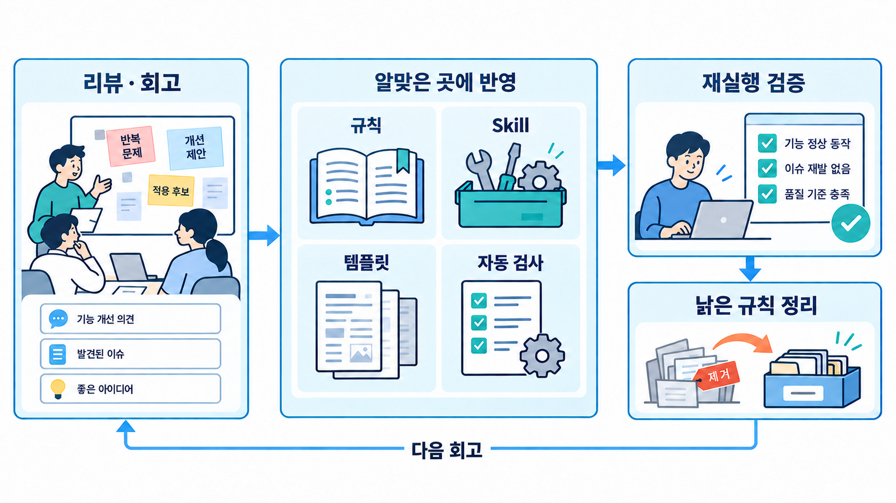
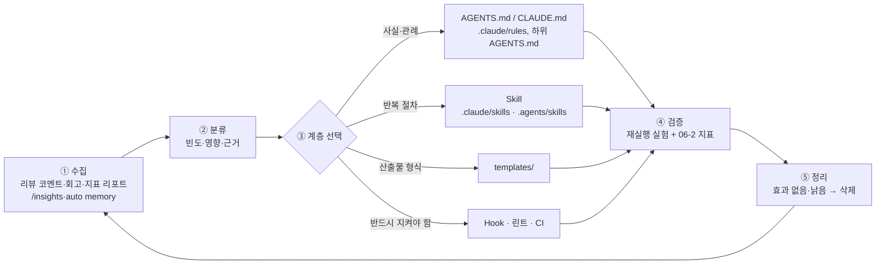

# 06-4. 지식 축적 — 메모리 파일·Skill·템플릿의 지속 개선 루프

## 🎯 학습 목표
- PR 리뷰 코멘트, 회고, 지표 리포트, 세션 기록에서 **반복되는 실수**를 찾아 규칙 후보로 정리할 수 있습니다.
- 규칙 후보마다 알맞은 계층(메모리 파일, 경로별 규칙, Skill, 템플릿, Hook·CI)을 골라 반영할 수 있습니다.
- 반영한 규칙이 실제로 효과가 있는지 재실행 실험으로 검증하고, 효과 없는 규칙을 정리할 수 있습니다.
- 분기 회고 리포트로 지표·비용·정책·지식 자산의 변화를 한 문서에 정리할 수 있습니다.

## 📋 사전 준비
- 선행 레슨: [01-1 프로젝트 메모리](../01-environment-setup/01-1-project-memory.md), [01-4 확장 기능](../01-environment-setup/01-4-extensions.md), [05-3 대규모 코드베이스](../05-scaling-up/05-3-large-codebases.md), [06-1](./06-1-cost-and-performance.md)~[06-3](./06-3-governance.md)
- 필요 도구/계정: Claude Code 2.1.292, Codex 0.160.1, `gh`, `jq`
- 실습 저장소 상태: Project B(TaskFlow)의 B7 진행 중. 06-2의 주간 리포트 2건 이상, 머지된 PR 30건 이상이 있으면 좋습니다.

## 💡 개념

### 그림으로 먼저 이해합니다: 반복되는 문제를 재사용할 규칙으로 바꿉니다



**그림 읽는 순서**

1. 왼쪽에서 반복되는 문제와 근거를 모읍니다. 가운데 분류함에서 상시 규칙, 반복 절차, 산출물 형식, 자동 검사 중 알맞은 저장 위치를 고릅니다.
2. 오른쪽에서 같은 작업을 다시 실행해 효과를 확인합니다. 효과가 없거나 낡은 규칙은 줄이고, 결과를 다음 회고에 반영합니다.

### 왜 지식 축적 루프가 필요한가
에이전트는 세션이 끝나면 배운 것을 잊습니다. 리뷰어가 "이 프로젝트는 날짜를 `Date`가 아니라 `Temporal`로 다룹니다"라고 지적해도, 다음 세션의 에이전트는 같은 실수를 합니다. 사람이 10명이고 세션이 하루 수백 개면 **같은 지적이 수백 번 반복**됩니다. 대규모 개발에서 에이전트의 품질은 모델보다 **저장소에 축적된 지식 자산(메모리 파일·Skill·템플릿·검사)** 의 품질로 결정됩니다.

반대로 무엇이든 메모리 파일에 쌓으면 문제가 생깁니다. 메모리 파일은 **모든 요청에 실리는 고정 비용**이고(06-1), 오래된 규칙은 에이전트를 잘못된 방향으로 이끕니다. 그래서 "추가"만큼 "검증과 정리"가 중요합니다.

### 개선 루프


### 계층 선택 기준
| 계층 | 담는 것 | 강도 | 비용 | 예시 |
|---|---|---|---|---|
| 메모리 파일(공통) `AGENTS.md` | 모든 작업에 필요한 사실·관례 | 권고 | 매 요청 고정 | "API 에러는 `packages/shared/errors.ts`의 `AppError`를 씁니다" |
| 메모리 파일(도구 전용) `CLAUDE.md` | 한 도구에만 필요한 지시 | 권고 | 매 요청 고정 | "Plan 모드로 계획을 먼저 승인받습니다" |
| 경로별 규칙 `.claude/rules/*.md`(`paths:`), 하위 `AGENTS.md` | 특정 디렉터리에만 필요한 규칙 | 권고 | 해당 경로 작업 시 | `apps/web/**`에만 적용되는 접근성 규칙 |
| Skill | 여러 단계로 된 반복 절차 | 절차 | 호출할 때만 | "API 엔드포인트 추가" 체크리스트 |
| 템플릿 `templates/` | 사람과 에이전트가 같이 쓰는 문서 형식 | 형식 | 사용할 때만 | `task-spec.md`, `handoff-note.md` |
| Hook·린트·CI | 어기면 안 되는 규칙 | **강제** | 실행 시간 | "`console.log` 커밋 금지" → 린트 규칙 |

원칙: **같은 지적이 세 번 나오면 규칙으로, 규칙을 어긴 사례가 계속 나오면 강제로 승격합니다.**

## 👣 따라하기

### Step 1. 신호 수집
목적: 반복되는 실수의 증거를 한곳에 모읍니다.

이 단계의 GitHub 데이터 수집은 도구 독립적입니다.

```bash
cd taskflow
mkdir -p knowledge/signals
# 최근 8주 머지된 PR의 리뷰와 코멘트
gh pr list --state merged --limit 300 --search "merged:>=2026-08-10" \
  --json number,title,labels,reviews,comments \
  | jq '[.[] | {number, title, source: ([.labels[].name | select(startswith("ai:") or . == "human")] | first),
               notes: ([.reviews[].body, .comments[].body] | map(select(. != null and . != "")))}
         | select(.notes | length > 0)]' > knowledge/signals/pr-feedback.json
# 06-2 주간 리포트, 숙제 회고
ls docs/ops/reports/ submissions/ 2>/dev/null
```

> 인라인(코드 줄) 리뷰 코멘트는 `gh pr list --json`의 `reviews`·`comments`에 모두 포함되지 않을 수 있습니다. 필요하면 `gh api repos/{owner}/{repo}/pulls/<번호>/comments`로 따로 가져옵니다.

**Claude Code 레시피**

- `/insights`는 이 컴퓨터의 최근 세션을 분석해 **오해된 요청, 버그 코드 같은 마찰 지점**과 개선 제안을 HTML 리포트(`~/.claude/usage-data/report.html`)로 만듭니다. 분석 자체도 사용량을 씁니다.
- auto memory(`~/.claude/projects/<project>/memory/`)는 **개인 머신에만** 있습니다. 팀이 알아야 할 내용이 있으면 저장소 파일로 옮겨야 합니다.

```bash
claude
> /insights
> /memory
# auto memory 중 팀과 공유할 가치가 있는 항목을 골라 knowledge/signals/from-auto-memory.md로 정리해 주십시오. 개인 취향(에디터, 말투)은 제외하십시오.
```

**Codex 레시피**

- Codex의 `memories` 기능은 실험적이며 기본값이 꺼져 있습니다(`/memories`). 팀 지식 저장소로 쓰지 않고, 켜서 쓴다면 Claude auto memory와 같은 방식으로 저장소 파일로 옮깁니다.
- 세션 기록(`~/.codex/sessions/`)에서 최근 실패 세션을 찾아 요약하게 합니다.

```bash
codex exec "~/.codex/sessions/ 아래 최근 2주 rollout 파일 중 사용자가 '아니', '다시', '틀렸' 같은 말로 정정한 대화를 찾아, 무엇을 정정했는지 knowledge/signals/from-codex-sessions.md에 목록으로 정리하십시오. 비밀 정보나 토큰처럼 보이는 문자열은 옮기지 마십시오." \
  --sandbox workspace-write
```

> 0.160.1 `--help`에서 `--add-dir`은 작업 공간 밖의 **쓰기 가능** 경로를 추가하는 옵션입니다. 여기서는 세션 기록을 읽기만 하므로 쓰지 않습니다. 샌드박스 때문에 읽기가 막히면 필요한 rollout 파일만 작업 디렉터리로 복사해 넘깁니다.

**기대 결과**: `knowledge/signals/`에 PR 피드백 JSON, auto memory 발췌, Codex 세션 정정 목록, 06-2 리포트 링크가 모입니다.

### Step 2. 분류: 규칙 후보 표 만들기
목적: 신호를 "규칙 후보"로 묶고, 빈도와 근거로 우선순위를 정합니다.

**Claude Code 레시피**
```bash
claude
> knowledge/signals/의 모든 파일을 읽고 반복되는 지적을 묶어서 knowledge/rule-candidates.md를 만드십시오.
> 열: ID | 후보 규칙(한 문장, 명령형) | 근거(PR 번호·리포트 링크 3개까지) | 빈도 | 출처(ai:claude/ai:codex/human) | 제안 계층 | 검증 방법.
> 제안 계층은 AGENTS.md / CLAUDE.md / .claude/rules·하위 AGENTS.md / skill / template / hook·lint·CI 중 하나로, 위 계층 선택 기준을 따릅니다.
> 빈도 2 이하는 '관찰' 섹션으로 따로 빼십시오. 이미 AGENTS.md에 있는데 계속 어기는 규칙은 '강제 승격 후보'로 표시하십시오.
```

**Codex 레시피**
```bash
codex exec --sandbox workspace-write \
  "knowledge/signals/의 파일을 읽고 반복되는 지적을 묶어 knowledge/rule-candidates.md를 만드십시오. 열: ID, 후보 규칙(명령형 한 문장), 근거(PR 번호 3개까지), 빈도, 출처, 제안 계층(AGENTS.md/CLAUDE.md/경로별 규칙/skill/template/hook·lint·CI), 검증 방법. 빈도 2 이하는 '관찰' 섹션으로 분리하고, 이미 AGENTS.md에 있는데 계속 어기는 규칙은 '강제 승격 후보'로 표시하십시오."
```

두 도구의 결과를 비교해, 한쪽에만 있는 후보는 근거 PR을 직접 열어 확인합니다(04-2의 교차 검증).

예시 결과:

| ID | 후보 규칙 | 근거 | 빈도 | 제안 계층 | 검증 방법 |
|---|---|---|---|---|---|
| R-01 | API 에러는 `AppError`로 던지고 `reply.code()`를 직접 쓰지 않습니다 | #131, #138, #152 | 6 | AGENTS.md(`apps/api/AGENTS.md`) | T-M 재실행 후 grep |
| R-02 | 새 엔드포인트는 계약(OpenAPI) → 계약 테스트 → 구현 순서로 만듭니다 | #127, #140 | 4 | skill `add-endpoint` | 커밋 순서 확인 |
| R-03 | 마이그레이션 파일에 `DROP` 금지 | #149 | 1(사고) | hook·CI | CI 실패 확인 |

**기대 결과**: 우선순위가 매겨진 후보 표가 생깁니다. 사람(팀 리드)이 채택·보류·기각을 표시합니다.

### Step 3. 메모리 파일에 반영하기
목적: 채택된 "사실·관례" 규칙을 알맞은 메모리 파일에 짧게 반영합니다.

이 저장소의 패턴을 따릅니다: 공통 규칙은 `AGENTS.md`, Claude 전용은 `CLAUDE.md`(첫 줄 `@AGENTS.md`), 디렉터리 전용은 하위 `AGENTS.md`(05-3).

**Claude Code 레시피**
```bash
claude
> knowledge/rule-candidates.md에서 '채택' 표시된 규칙 중 계층이 AGENTS.md인 것을 반영해 주십시오.
> 규칙: 1) 디렉터리 전용 규칙은 해당 디렉터리의 AGENTS.md에 넣습니다 2) 한 줄에 하나, 명령형, 이유는 괄호로 짧게 3) 이미 비슷한 문장이 있으면 합칩니다 4) 각 규칙 끝에 <!-- R-01 --> 처럼 후보 ID를 주석으로 답니다.
> 반영 후 루트 CLAUDE.md와 AGENTS.md의 줄 수를 알려 주십시오.
> /memory
```

- `/memory`와 `/context`의 **Memory files** 목록에서 변경한 파일이 로드되는지 확인합니다. 하위 디렉터리의 파일은 Claude가 그 안의 파일을 읽거나 고칠 때 로드됩니다.
- 문서는 `CLAUDE.md`를 200줄 이하로 유지하라고 권장합니다. 넘으면 절차성 내용을 Step 4의 skill로 옮깁니다.

**Codex 레시피**
```bash
codex --sandbox workspace-write
> knowledge/rule-candidates.md에서 '채택' 표시된 규칙 중 계층이 AGENTS.md인 것을 반영해 주십시오. (위 규칙 1~4 붙여넣기)
# 새 세션에서 확인
codex "List the instruction sources you loaded."
```

- Codex는 루트부터 현재 디렉터리까지의 `AGENTS.md`를 이어 붙이고, 합계가 `project_doc_max_bytes`(기본 32 KiB)에 이르면 멈춥니다. `wc -c`로 합계를 확인합니다.

```bash
wc -c AGENTS.md apps/api/AGENTS.md
```

**기대 결과**: 채택 규칙이 후보 ID 주석과 함께 반영되고, 두 도구 모두 새 세션에서 해당 파일을 로드합니다. 변경은 PR로 올리고, 06-3의 CODEOWNERS 규칙에 따라 오너 승인을 받습니다.

### Step 4. Skill·템플릿·강제 수단으로 반영하기
목적: 절차는 skill로, 형식은 템플릿으로, 꼭 지켜야 할 것은 hook·CI로 옮깁니다.

**Claude Code 레시피** — 절차를 skill로
```bash
claude
> R-02를 skill로 만들어 주십시오. 위치는 .claude/skills/add-endpoint/SKILL.md.
> front matter: name, description(언제 쓰는지 포함). 본문: 1) packages/shared/openapi.yaml에 계약 추가 2) 계약 테스트 작성·실패 확인 3) apps/api 구현 4) make verify 5) PR 설명에 계약 diff 요약. 인수는 $ARGUMENTS(엔드포인트 이름).
> 같은 내용으로 .agents/skills/add-endpoint/SKILL.md도 만드십시오. Claude 전용 front matter(disable-model-invocation, allowed-tools)는 Codex 쪽에서 빼십시오.
```
`/add-endpoint GET /projects/:id/members`로 호출해 동작을 확인합니다.

**Codex 레시피**
```bash
codex
> $add-endpoint GET /projects/:id/members
# 또는 /skills에서 add-endpoint 선택
```

두 skill 파일이 갈라지지 않도록 **원본 하나와 동기화 스크립트**를 둡니다.

```bash
# scripts/sync-skills.sh — .claude/skills를 원본으로 .agents/skills에 복사하고 Claude 전용 키를 제거
for d in .claude/skills/*/; do
  name=$(basename "$d"); mkdir -p ".agents/skills/$name"
  sed -E '/^(disable-model-invocation|allowed-tools):/d' "$d/SKILL.md" > ".agents/skills/$name/SKILL.md"
done
```

> 심볼릭 링크로 한 디렉터리를 공유하는 방법이 두 도구에서 모두 동작하는지는 확인하지 못했습니다. TODO(verify). 위 복사 방식이 안전합니다. CI에서 `scripts/sync-skills.sh && git diff --exit-code .agents/skills`로 불일치를 잡습니다.

**강제로 승격** — R-03은 권고가 아니라 검사로 만듭니다(도구 독립).
```bash
# .github/workflows/verify.yml의 한 단계
- name: Forbid DROP in migrations
  run: "! grep -rniE '\\bDROP\\s+(TABLE|COLUMN)' packages/db/migrations/"
```
에이전트가 작업 중에 바로 알 수 있도록 같은 검사를 Claude `PostToolUse` hook(matcher `Write|Edit`)과 Codex hook에도 연결할 수 있습니다(01-4). Codex hook은 `/hooks`에서 신뢰해야 실행됩니다.

**템플릿 갱신** — 회고에서 "핸드오프 노트에 '건드리지 말 파일' 칸이 없어 충돌이 났습니다" 같은 신호가 나오면 `templates/handoff-note.md`를 고칩니다. 템플릿을 고치면 이를 참조하는 skill과 메모리 파일의 설명도 함께 고칩니다.

**기대 결과**: skill이 두 도구에서 호출되고, 동기화 검사와 DROP 금지 검사가 CI에서 동작합니다.

### Step 5. 효과 검증과 정리
목적: 규칙이 실제로 행동을 바꿨는지 확인하고, 효과 없는 규칙을 지웁니다.

**재실행 실험**: 규칙 반영 **전 커밋**과 **후 커밋**에서 같은 Task 명세를 헤드리스로 실행하고, 위반 여부를 기계적으로 검사합니다. 06-1의 방식대로 worktree를 나눕니다.

**Claude Code 레시피**
```bash
for ref in before-R01 after-R01; do
  git worktree add "../tf-$ref" "$ref"
  ( cd "../tf-$ref" && pnpm install --frozen-lockfile >/dev/null &&
    claude -p "$(cat ../taskflow/specs/T-M.md)" --permission-mode acceptEdits \
      --allowedTools "Bash(pnpm *)" --output-format json > "../taskflow/knowledge/eval/claude-$ref.json"
    echo "$ref violations: $(git diff | grep -c 'reply.code(')" )
done
```

**Codex 레시피**
```bash
for ref in before-R01 after-R01; do
  git worktree add "../tfx-$ref" "$ref"
  ( cd "../tfx-$ref" && pnpm install --frozen-lockfile >/dev/null &&
    codex exec --json --sandbox workspace-write "$(cat ../taskflow/specs/T-M.md)" > "../taskflow/knowledge/eval/codex-$ref.jsonl"
    echo "$ref violations: $(git diff | grep -c 'reply.code(')" )
done
```

한 번의 실행은 우연일 수 있으므로 각 3회 이상 반복하고, 06-2의 리뷰 재작업률 추세와 함께 봅니다.

**정리(prune)**: 분기마다 메모리 파일을 감사합니다.
```bash
claude -p "AGENTS.md와 하위 AGENTS.md, CLAUDE.md의 규칙을 모두 나열하고 각각 1) 후보 ID 주석이 있는지 2) 최근 8주 knowledge/signals에 관련 위반이 있는지 3) 코드베이스에 더 이상 존재하지 않는 경로·함수를 가리키는지 표로 정리하십시오. 삭제·통합 후보를 제안만 하고 고치지는 마십시오."
```
```bash
codex exec "AGENTS.md 계층의 규칙 중 코드베이스에 더 이상 없는 경로·함수·명령을 가리키는 문장을 찾아 목록으로 보여 주십시오. 파일은 고치지 마십시오."
```

**기대 결과**: 규칙별로 "효과 있음 / 효과 불명 / 효과 없음"이 판정되고, 낡은 규칙의 삭제 PR이 올라갑니다. 위반이 계속되는 규칙은 Step 4의 강제 승격 후보로 돌려보냅니다.

### Step 6. 분기 회고 리포트 쓰기
목적: 06-1~06-4의 산출물을 한 문서로 묶어 다음 분기의 방향을 정합니다. Project B의 B7 최종 회고에 그대로 씁니다.

**Claude Code 레시피**
```bash
claude
> docs/ops/retro-2026-Q3.md 분기 회고 리포트를 써 주십시오. 입력: docs/ops/reports/(06-2 주간 리포트), docs/ops/usage-forecast.md와 metrics/cost/(06-1), docs/policy/exceptions/(06-3), knowledge/rule-candidates.md와 knowledge/eval/(06-4), git log --since=2026-07-01 -- AGENTS.md CLAUDE.md .claude .agents templates.
> 목차: 1 요약(3줄) 2 지표 추세(출처별, 건수 포함) 3 사용량: 예측 대비 실제 토큰 4 정책: 예외·위반·레드팀 결과 5 지식 자산 변경(추가/승격/삭제 규칙 표) 6 도구 변경 점검(claude --version, codex --version, 바뀐 기본값, last-verified 갱신 필요 레슨) 7 다음 분기 실험 3개(가설·지표·기간).
> 숫자는 원본 파일에서 그대로 인용하고 출처 경로를 각주로 다십시오.
```

**Codex 레시피**
```bash
codex exec --sandbox workspace-write -o knowledge/retro-summary.txt \
  "docs/ops/retro-2026-Q3.md 분기 회고 리포트를 쓰십시오. 입력은 docs/ops/reports/, docs/ops/usage-forecast.md, metrics/cost/, docs/policy/exceptions/, knowledge/rule-candidates.md, knowledge/eval/, 그리고 AGENTS.md·CLAUDE.md·.claude·.agents·templates의 이번 분기 git log. 목차: 요약, 지표 추세, 사용량(예측 대비 실제 토큰), 정책, 지식 자산 변경, 도구 변경 점검, 다음 분기 실험 3개. 숫자는 원본에서 인용하고 출처 경로를 다십시오."
```

한 도구로 쓰고 다른 도구로 **숫자 대조 리뷰**를 합니다. 6절 "도구 변경 점검"은 설계서 §9의 분기 점검 작업과 같습니다. 바뀐 CLI 옵션·기본값을 찾으면 도구 레퍼런스 갱신 PR을 먼저 올립니다.

**기대 결과**: 7개 절이 모두 채워진 분기 회고 리포트가 생기고, 5절의 규칙 변경이 실제 커밋과 일치합니다. 7절의 실험은 다음 분기 06-2 지표로 결과를 확인할 수 있게 쓰여 있습니다.

## ✅ 체크포인트
- [ ] `knowledge/signals/`에 PR 피드백, 세션 정정 기록, 지표 리포트가 모였습니다.
- [ ] 두 도구로 만든 규칙 후보 표를 비교하고 채택 여부를 사람이 결정했습니다.
- [ ] 채택 규칙이 알맞은 계층(메모리 파일·skill·템플릿·hook/CI)에 후보 ID와 함께 반영됐습니다.
- [ ] 메모리 파일 크기(CLAUDE.md 줄 수, AGENTS.md 바이트 합계)를 확인했습니다.
- [ ] 규칙 1개 이상에 대해 전/후 재실행 실험을 했습니다.
- [ ] 분기 회고 리포트를 쓰고 다른 도구로 숫자를 대조했습니다.

## 🏠 숙제
| # | 유형 | 난이도 | 과제 | 완료 조건 |
|---|---|---|---|---|
| HW1 | 🔁 Reproduce | ★ | 회고에서 나온 규칙을 메모리 파일에 반영: 본인 저장소의 최근 PR·회고에서 규칙 3개를 뽑아 반영합니다 | 신호 출처(PR 링크 등)가 있는 후보 표, 반영 PR(후보 ID 주석 포함), 두 도구에서 새 세션이 해당 파일을 로드한 증거 |
| HW2 | 🛠 Apply | ★★ | 계층 선택과 효과 검증: 후보 5개 이상을 서로 다른 계층(최소 메모리 파일·skill·CI 각 1개)에 반영하고 그중 하나를 전/후 실험합니다 | 계층 선택 근거, 두 도구용 skill과 동기화 검사, 강제 승격 1건의 CI 실패/통과 로그, 전/후 각 3회 실행 결과표 |
| HW3 | 🚀 Challenge | ★★★ | 분기 회고 리포트: 06-1~06-4 산출물을 묶은 분기 회고 리포트를 쓰고, 신호 수집·후보 표 생성을 월 1회 자동화합니다 | 7개 절의 회고 리포트(숫자 출처 각주), 자동화 워크플로 또는 스크립트와 실행 기록 1회 이상, 정리(prune)로 삭제한 규칙 1개 이상과 그 근거 |

제출: `hw/06-4` 브랜치, `submissions/06-4.md` (템플릿: docs/design/homework-template.md)

## ⚠️ 흔한 실수
- **지적이 나올 때마다 메모리 파일에 한 줄씩 추가합니다** → 파일이 수백 줄이 되어 매 요청 비용이 늘고, 규칙끼리 모순됩니다 → 빈도 3 이상만 규칙으로, 절차는 skill로, 디렉터리 전용은 하위 파일로 보냅니다. 분기마다 정리합니다.
- **이미 있는 규칙을 계속 어기는데 문장만 강하게 고칩니다** ("반드시", "절대") → 권고 계층의 한계입니다 → 린트·CI·hook으로 강제 승격합니다.
- **auto memory에만 쌓인 지식을 팀 지식으로 착각합니다** → `~/.claude/projects/.../memory/`는 개인 머신에만 있고 클라우드 세션도 읽지 않습니다 → 팀이 알아야 할 내용은 저장소 파일로 옮겨 PR로 올립니다.
- **Claude용 skill만 만들고 Codex용은 잊습니다** (또는 그 반대) → 도구에 따라 절차가 달라집니다 → 원본 하나와 동기화 스크립트, CI의 불일치 검사를 둡니다.
- **규칙 효과를 확인하지 않습니다** → 효과 없는 규칙이 쌓이고, 효과 있는 규칙도 근거 없이 지워집니다 → 후보 ID로 규칙과 근거를 연결하고, 전/후 재실행과 06-2 지표로 판정합니다.

## 🔗 참고 자료
- Claude Code: [Memory](https://code.claude.com/docs/en/memory), [Skills](https://code.claude.com/docs/en/skills), [Hooks](https://code.claude.com/docs/en/hooks), [Manage costs(`/insights`, CLAUDE.md 크기)](https://code.claude.com/docs/en/costs), [Commands](https://code.claude.com/docs/en/commands)
- Codex: [AGENTS.md](https://learn.chatgpt.com/docs/agent-configuration/agents-md), [Skills](https://learn.chatgpt.com/docs/build-skills), [Hooks](https://learn.chatgpt.com/docs/hooks), [Advanced config](https://learn.chatgpt.com/docs/config-file/config-advanced), [Slash commands](https://learn.chatgpt.com/docs/developer-commands?surface=cli)
- 이 저장소: [도구 레퍼런스 §3, §7](../../docs/reference/tool-reference.md), [01-1 프로젝트 메모리](../01-environment-setup/01-1-project-memory.md), [01-4 확장 기능](../01-environment-setup/01-4-extensions.md), [03-4 컨텍스트 관리](../03-agentic-workflow/03-4-context-management.md), [05-3 대규모 코드베이스](../05-scaling-up/05-3-large-codebases.md), [06-1](./06-1-cost-and-performance.md), [06-2](./06-2-metrics.md), [06-3](./06-3-governance.md)
- 템플릿: [AGENTS.md.template](../../templates/AGENTS.md.template), [CLAUDE.md.template](../../templates/CLAUDE.md.template), [handoff-note.md](../../templates/handoff-note.md), [task-spec.md](../../templates/task-spec.md)
