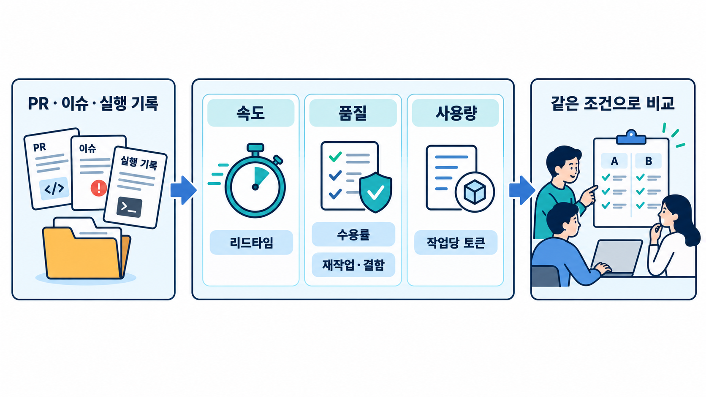

# Module 06 — Team & Operations (팀과 운영)

비용·지표·거버넌스로 팀 단위 운영을 정착시킵니다.

## 그림으로 시작합니다

먼저 그림에서 사람·문서·도구의 역할과 화살표 방향을 확인합니다. 각 레슨의 “그림 읽는 순서”를 읽은 다음 개념과 따라하기를 진행합니다.

- [속도·품질·사용량을 함께 봅니다](./06-2-metrics.md)에서 그림과 설명을 함께 확인합니다.
- [정책을 설정과 기록으로 연결합니다](./06-3-governance.md)에서 그림과 설명을 함께 확인합니다.
- [반복되는 문제를 재사용할 규칙으로 바꿉니다](./06-4-knowledge-loop.md)에서 그림과 설명을 함께 확인합니다.

제안서에 사용할 원본 PNG는 [전체 그림 목록](../../docs/design/illustrations.md)에서 찾습니다.

## 레슨
| # | 제목 | 상태 |
|---|---|---|
| 06-1 | [비용과 성능](./06-1-cost-and-performance.md) | ✅ 초안 |
| 06-2 | [지표](./06-2-metrics.md) | ✅ 초안 |
| 06-3 | [팀 규칙과 거버넌스](./06-3-governance.md) | ✅ 초안 |
| 06-4 | [지식 축적 루프](./06-4-knowledge-loop.md) | ✅ 초안 |

- 레슨별 따라하기·숙제 상세는 [커리큘럼 설계서 §4](../../docs/design/curriculum-design.md#4-모듈-상세-설계)를 참고합니다.
- 레슨 작성 형식: [lesson-template.md](../../docs/design/lesson-template.md)
